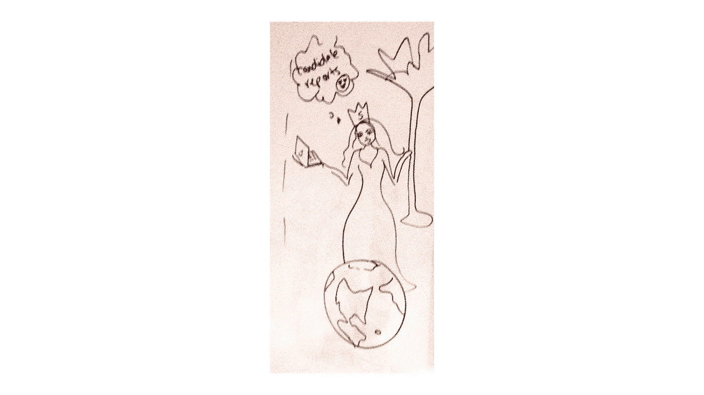
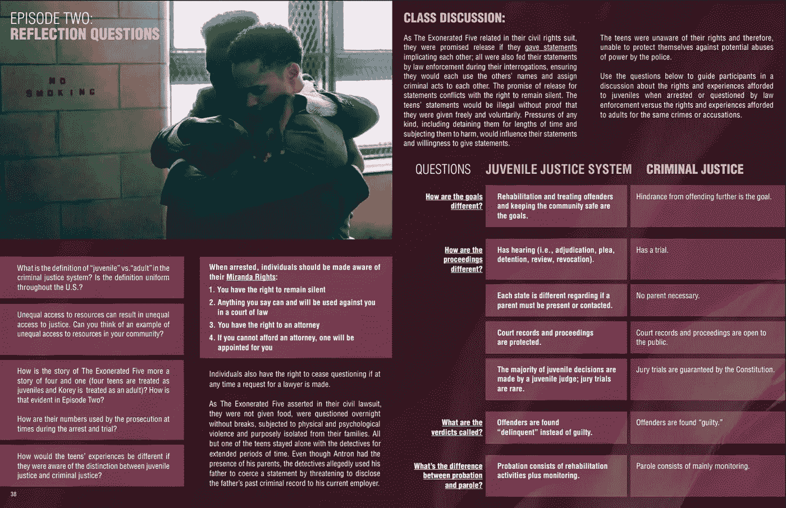

# 为什么我要花一年时间来讲故事

> 原文：<https://towardsdatascience.com/why-im-devoting-a-year-of-my-life-to-storytelling-ed5cd2349cff?source=collection_archive---------61----------------------->

当我让人们知道我一周有一半的工作时间都沉浸在数据科学课程中时，我不确定他们首先想到的是讲故事。但这是我应得的。

Gif via [Giphy](https://giphy.com/gifs/foxhomeent-black-history-month-hidden-figures-xThtapzvqTGViWhwuA)

让我们倒回去一点。当我 19 岁搬到华盛顿特区，开始在一个被《纽约时报》称为[“数字精英大学之外的另一种选择”](https://www.nytimes.com/2013/05/05/business/enstitute-an-alternative-to-college-for-a-digital-elite.html)的项目中当学徒时，我的技术技能非常有限。我不知道命令行是什么，除了最基本的 HTML 之外，我看不懂任何代码。

当我看到我的第一个命令行时的确切感觉

Gif 通过 [Giphy](https://giphy.com/gifs/abcnetwork-worried-scandal-xUNd9Ub1CDS0LYVyGQ) ，音频通过作者

然而，我得到的是一份运用战略帮助营销活动发展的简短背景，以及成为一家公司不可或缺的一部分的强烈渴望。

我的学徒生涯让我进入了一家名为 Brazen 的初创公司。可能值得一提的是，在那里驻扎了一年后，该公司增长了 5 倍以上，筹集了另一轮资金，更改了名称，并在 DC 的初创企业中获得了一个又一个认可。在这个角色中，我获得了一个家庭。就像任何一个家庭一样，尤其是在我最易受影响的几年里，一个植根于快速发展的科技初创企业的家庭，他们留下了相当深的印记。

这个印记的一个方面是一项新技能，它完全改变了我的思维方式和我未来的轨迹——编程语言 MySQL。现在，MySQL(发音为 My-Ess-Que-Ell)允许人们查询数据库，本质上是询问和回答不同复杂程度的问题。

我不确定我们的 CTO Jason 是否知道他通过 Brazen 的软件即服务(SaaS)在在线课程和现实应用之间架起了一座桥梁，但我对公司的价值提升了。我成了我的非技术同事的资源，给我们的开发人员更多的工作时间，这对我们公司的健康发展是不可或缺的。我很快就扮演了一个真正独一无二的角色，为各部门的同事提供支持，帮助我们的客户定义成功是什么样的，并通过发现我们平台用户的新信息来支持我们的资金筹集。当我利用数据的力量时，这种感觉一直伴随着我。这改变了我对世界的看法，也改变了我如何处理出现的问题。

一个同事画的实际白板，宣称我是候选人报告中的女王

快进到今天。我过去两年的工作让我接触到了我们国家一些最伟大的故事讲述者——他们中的许多人都专注于为我们世界上一些最昏暗的地方带来光明。

其中一位特立独行的人，艾娃·杜瓦内和她的公司 [Array](http://www.arraynow.com/) ，与参与者媒体合作，通过学习伙伴带你越过屡获殊荣的网飞系列，深入探讨围绕刑事定罪和不平等问题的核心，从而更深入地了解像*这样的故事。*

片段来自[当他们看到我们学习同伴](https://www.wtsu101.org/)，感谢 Array

另一个有影响力的故事讲述者**，**斯科特·布尼克和他的公司 [One Community](http://1communityllc.com/) ，之前推出了电影 *Just Mercy* 并曝光了被错误监禁的已故沃尔特·“约翰尼·d·”麦克米兰。尽管有几十个人可以证明他的不在场证明，包括一名警察，陪审团还是建议判他无期徒刑。沃尔特的故事以及后来由于布莱恩·斯蒂文森的努力而上映，主要是通过演员迈克尔·B·乔丹、杰米·福克斯和布丽·拉尔森来传达的。Just Mercy 在全球筹集了超过 5000 万美元，并为史蒂文森的平等正义倡议赢得了新的支持。

一个社区说它的使命是“利用讲故事的力量来激励和鼓励世界发生积极的变化”。现在，跟我做一个快速练习，用 ***数据*** 代替讲故事。这些格式真的可以以创新的方式携手并进，开始弯曲数据结束的地方和故事开始的地方。跟着我。

我们的世界正变得越来越多样化，我们要求故事更好地反映我们的现实。正如传媒公司 MACRO 的第一卷《新世界》<https://uprising.staymacro.com/thenewworld>*所言，“与现状不合，与文化同在。与过去的方式不同，与未来的方式相同。”*

*同样，我相信我们会看到创新的使用案例，真实世界的数据为引人注目的叙事和独特的真相讲述和传播结构提供信息。随着技术继续呈指数级发展，我们的技术人员越来越多样化，谁说数据科学家不应该在 Array 或 One Community 这样的组织中拥有一席之地。我们将有机会根据数据来讲述故事，并对叙事方向提出建议。能够决定一个角色如何穿越，这是基于一个意图，即揭露以前在阴影中的、被认为没有市场的故事。产生共鸣的能力给了我们一个案例和财务手段来收集越来越清晰的数据，并创造出为我们服务的算法。我们将扮演一个不可或缺的角色，使系统向我们展示社会需求的真实所在，并引导我们不仅想象一个不同的未来，还可能证明我们将如何到达那里。*

*我看到了数据和真相之间的正相关关系，即如何增加揭露我们权力体系现实的叙事，可以直接带来意识和积极的变化，从而更好地满足我们的需求，成为一个值得我们拥有的体系。我相信数据科学和讲故事之间的距离还没有完全确定，我们还有很多工作要做。我还看到人们将这些点连接起来，并在今天建设基础设施。想象一下，我们世界上最伟大的故事讲述者在一位授权和多才多艺的数据科学家面前可以做些什么。*

*所以，是的，我会花一年时间(至少)讲故事，因为我们作为数据科学家有能力进一步揭露目前影响我们世界的格局和权力体系。还有许许多多的故事有待发掘和探索。*

*“摆脱现状，融入文化。与过去的方式不同，与未来的方式相同。”*

*想加入我吗？点击此处获取电子邮件更新[或直接发消息给我。](http://eepurl.com/hoC3FX)*