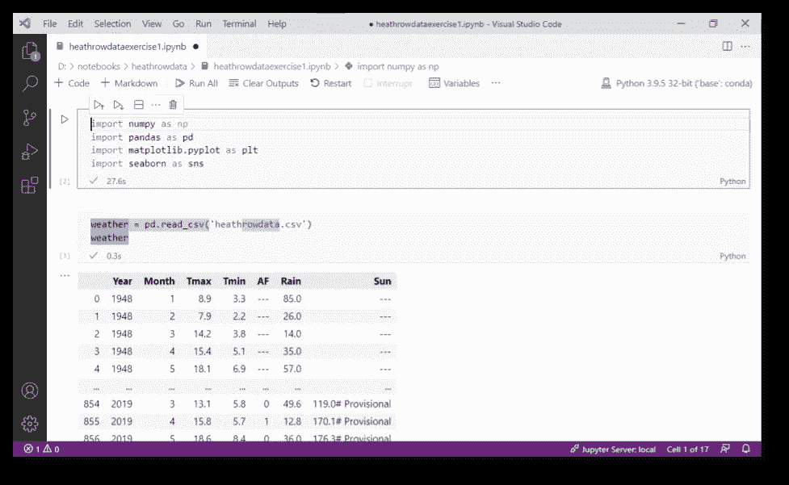
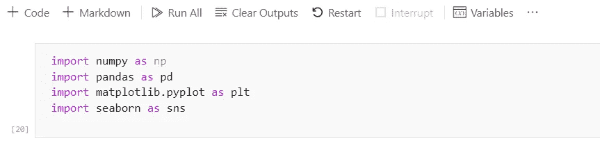
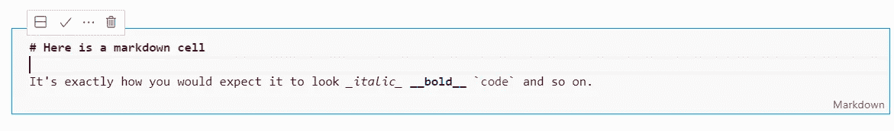
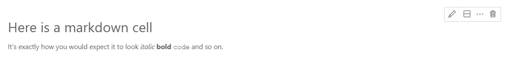
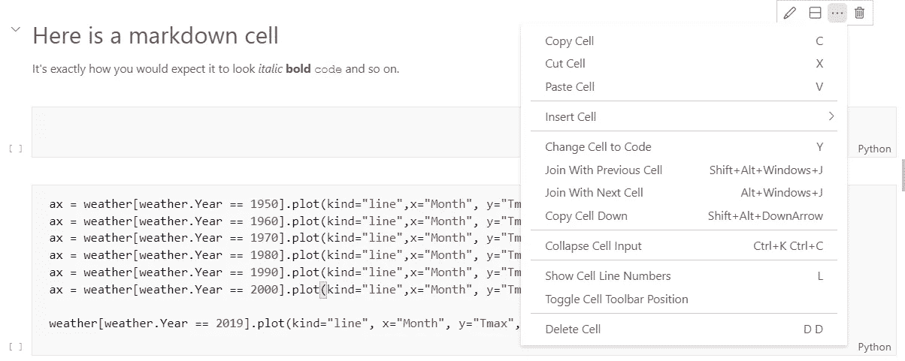
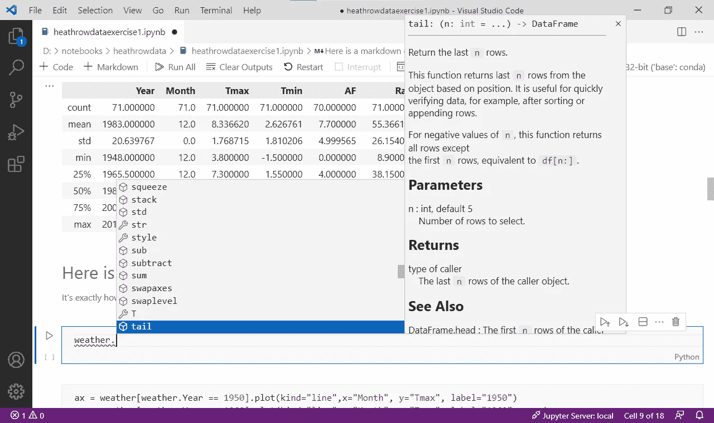
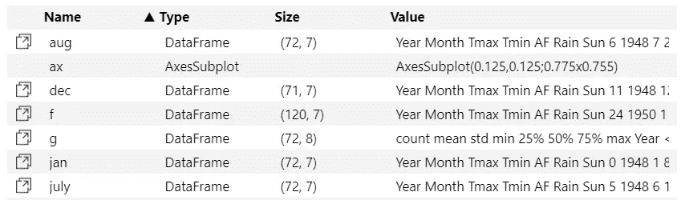

# 为什么我在 Jupyter 笔记本上使用 VSCode

> 原文：<https://towardsdatascience.com/why-im-using-vscode-for-jupyter-notebooks-abd2a6a157b9?source=collection_archive---------4----------------------->

## VSCode 是一个很棒的 Python 编辑器，而且正如我意外发现的那样，对于 Jupyter 笔记本也很有用

朱庇特笔记本——作者图片

我第一次使用 VSCode 打开 Jupyter 笔记本完全是一个意外。

我使用 VSCode 编写独立的 Python 脚本和 Flask 应用程序，但我一直使用标准的浏览器界面来运行 Jupyter 笔记本。坦白地说，我从来没有想过要做别的事情。

但是有一天，我在浏览我的文件管理器，寻找一个特别的笔记本，不知何故，我在组成我的 D: drive 的项目文件夹的迷宫中丢失了它。我最终找到了它，出于某种原因——我想是默认行为——我双击了它。现在，正如我所说的，VSCode 是我的默认 Python 编辑器，所以双击 Python 文件会在编辑器中显示该文件。我是不是也把它设为了 *ipynb* 文件的默认设置？我不记得了，但我想我一定有，因为 VSCode 立即行动起来，打开了笔记本。

哦不！那不是我想要做的。

我打算打开一个命令行窗口，导航到我的笔记本文件夹，输入`jupyter notebook`，等待 Jupyter 服务器启动，浏览器运行，打开我想要的笔记本，最后开始编辑它。

我基本上通过简单的双击做了完全相同的事情。也许我发现了什么。至少，使用 VSCode 打开笔记本的简单性让我觉得它应该值得一看。

事实证明确实如此。

实际上，在 VSCode 中编写和运行笔记本与在浏览器中做同样的事情没有什么不同。您仍然需要安装 Python 和 Jupyter，可用的功能基本相同。但是对 VSCode 的熟悉，打开笔记本的方便，以及我经常打开它的事实意味着它已经迅速成为我默认的 Jupyter 编辑器。

还有智能感知和变量窗口——稍后会详细介绍。

## VSCode 接口

您可以在文章顶部的主图像中看到 VSCode 窗口。这是常见的 VSCode 界面，但在编辑器窗口上方是 Jupyter 笔记本功能的菜单栏，除了打开新文件或保存当前文件等文件功能外，您不需要太多其他功能。

这是一个典型的代码单元格和主 Jupyter 菜单选项的特写。

像往常一样，通过选择一个单元格并键入 ctrl-Enter 来运行它(在单元格的左侧应该还有一个运行符号，您可以单击它)。

降价单元也是相似的。

按 ctrl-Enter 键，您将得到这个:

请注意，在最后一个图像中，工具栏已经移动到右侧。这没有什么神奇的；我通过选择`…`选项并从下拉菜单中选择一个选项来切换它的位置，如下图所示。

单元格工具栏选项—按作者排序的图像

这也允许你插入新的单元格，合并它们，分割它们…你可以在截图中看到这些选项。

## 智能感知

我很喜欢这个。有时我会忘记如何使用一些不常使用的函数:那个函数叫什么名字，我使用什么参数？智能感知来拯救我们。

正如你在下面看到的，如果你开始输入一个对象的名称(这里是一个熊猫数据框)，当你点击`.`时，智能感知会提示你有哪些可用的选项以及如何使用它们。

## 变量

变量窗口是另一个好处。`Variables`是 Jupyter 主工具栏中的一个选项，可打开如下窗口:

我们可以看到，它给出了到目前为止已经定义的每个变量的名称、类型、大小和值。

## 出口

导出功能与标准 Jupyter 界面中的相同(导出到 Python、HTML 或 PDF ),但您也可以直接从图像右侧的图标保存图像，这在您创建文档时会很有用。

## 结论

老实说，我并不总是使用 VSCode，我也喜欢基于浏览器的 Jupyter 编辑器(它似乎在我的小平板电脑上的触摸屏上工作得更好一些——但这可能只是这种特定硬件的一个缺点)。

但是我从中得到的是，VSCode 很方便，可以做你想用 Jupyter 笔记本做的任何事情。为什么不试一试呢！

一如既往，感谢阅读。如果你想知道我什么时候发表新文章，请考虑在这里注册一个电子邮件提醒[。](https://alan-jones.medium.com/subscribe)

如果你不是一个媒体订阅者，那就注册吧，这样你就可以每月花 5 美元阅读尽可能多的文章。在这里注册，我将赚取一小笔佣金。

此外，如果你碰巧对熊猫的数据可视化感兴趣，可以看看我的可下载书籍[这里](https://github.com/alanjones2/ajbooks)。