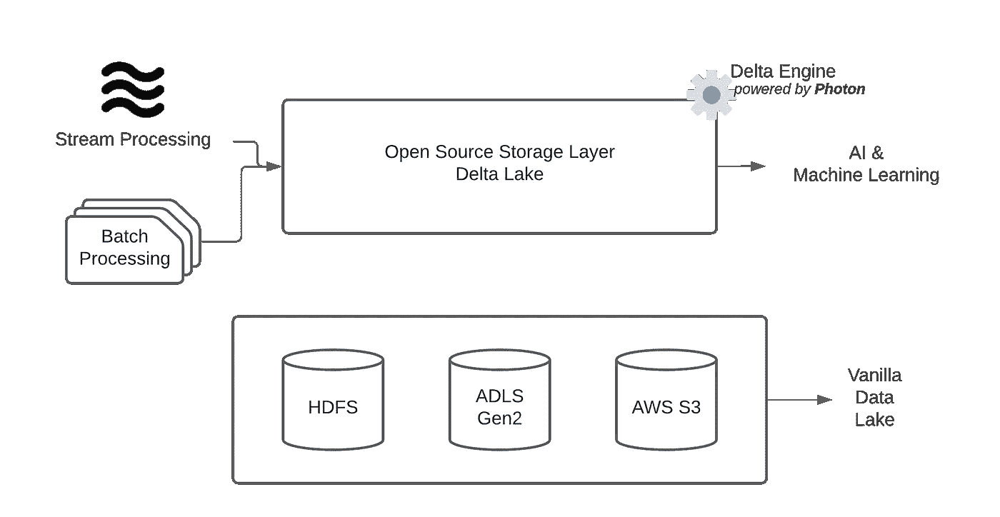
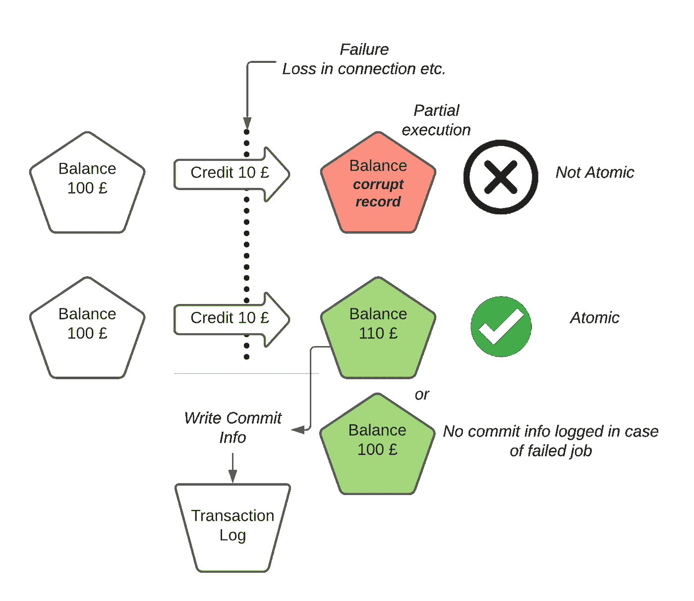
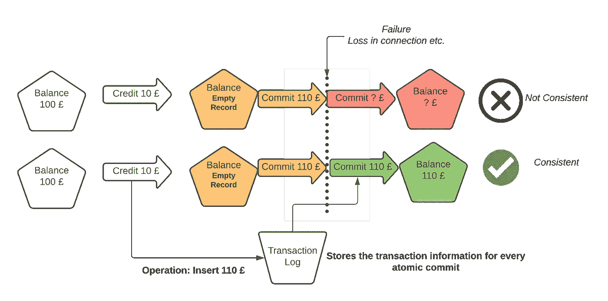
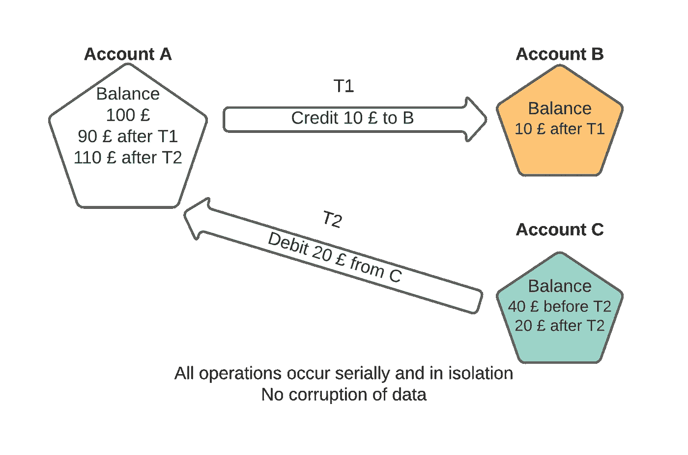
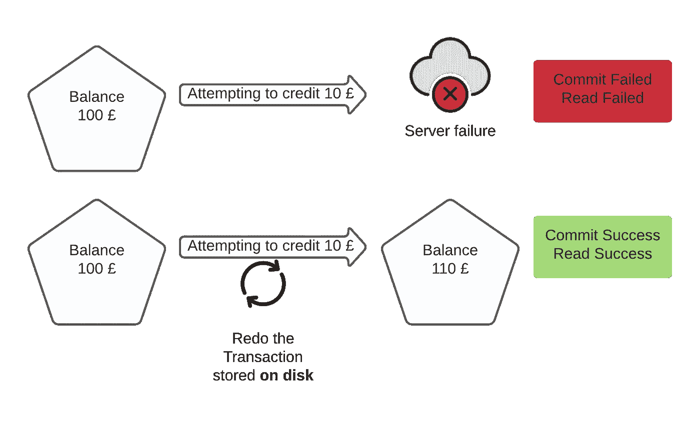
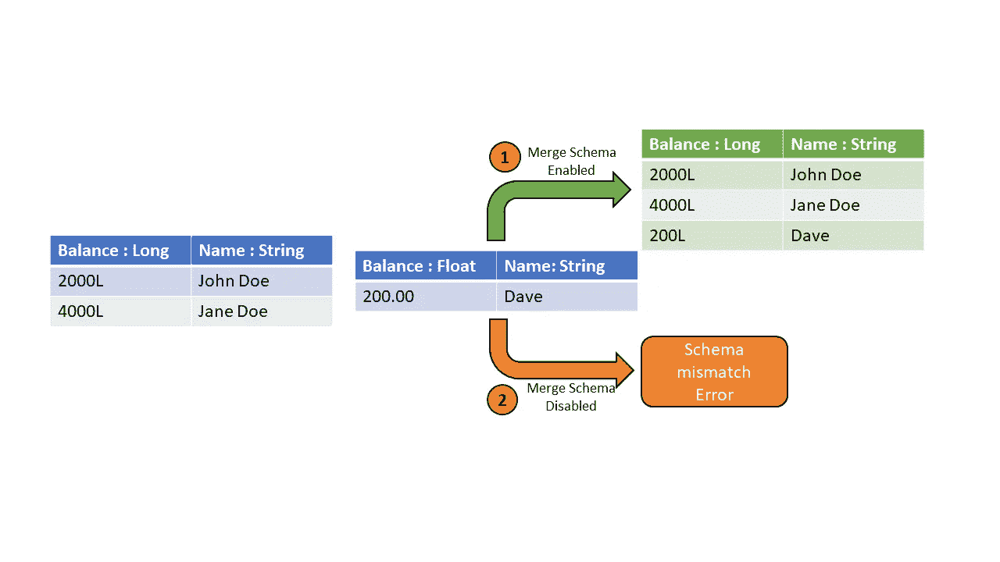
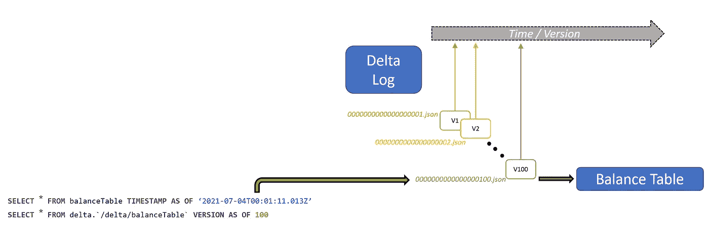

# 为什么三角洲湖越来越受欢迎？

> 原文：<https://towardsdatascience.com/why-is-delta-lake-becoming-increasingly-popular-1e45c29cc7d2?source=collection_archive---------14----------------------->

## [行业笔记](https://towardsdatascience.com/tagged/notes-from-industry)

## 讨论数据湖- *带来的益处超过传统挑战，ACID 合规性、版本化拼花文件等。*


📷由[加斯顿](https://unsplash.com/@ikapics?utm_source=medium&utm_medium=referral)在 [Unsplash](https://unsplash.com?utm_source=medium&utm_medium=referral)

对于初学者来说，理解三角洲湖和数据湖之间的区别可能会令人困惑。与以前的存储层一起工作了一年多，现在我分享了 delta lake 的特殊优势，以及它如何通过一些示例克服传统数据湖体系结构的挑战。

这些例子是为了使它更加直观和非技术性。我相信这将作为一个很好的策展，从不同的来源，三角洲湖可以带来什么。

根据定义，delta lake 不是一个独立的存储容器，而是一个运行在现有数据湖和对象存储之上的开源存储层。让我们把它看作是现有数据湖之上的附加功能，如下所示。

它由一个 delta 引擎驱动，而 delta 引擎又由一个名为 **Photon** 的本地执行引擎驱动。这是一个用 C++从头开始编写的矢量化查询引擎。在撰写本文时，它正在公开预览中。



三角洲湖建筑(图片由作者根据[ [原文](https://databricks.com/wp-content/uploads/2019/08/Delta-Lake-Multi-Hop-Architecture-Overview.png) ]创作)

# 数据湖——是什么让它充满挑战？

它是一个存储原始数据的容器。把它看作是一个尚待处理的纯原始数据的垃圾场。

数据湖的一些重要特性包括——它的扁平架构，只有当你做读操作时，模式才被执行(读模式)。因此，它可以以低延迟轻松存储非结构化数据。

然而，原始数据给🧱带来了严峻挑战

# 挑战 1:可靠性和质量——原子性

数据湖不能很好地处理损坏的数据。当我们在数据加载过程中发现故障时，将需要完全重新处理。

delta lake 在这个场景中提供的解决方案是通过引入**原子性。**这意味着要么有一个完整的写/提交(或)没有写(又名**原子可见性**)。

在执行提交操作时，它是二进制的。因此，在作业完成之前，我们会知道数据中何时出现问题。

有一个单一的真理来源被用来服务于这个目的。它被称为**事务日志(增量日志文件)，**，它跟踪所有被写入增量表的原子事务。Spark 然后在每次交易后更新用户端的表格。

增量日志文件是 JSON 文件(`00000000000000000000.json, 00000000000000000001.json`等)。)与临时的*检查点文件*一起放在`_delta_log`子目录中。

在增量日志文件中，还有 **commitInfo、partitionValues 和 stats** 信息，它们是不同的元数据属性，用于跟踪数据更改，有助于提高查询效率。



三角洲湖中的原子性(图片由作者提供)

考虑以下简单的信用交易，一旦数据被写入，在服务启动并运行后，它应该用正确的值 110 更新(或者)保持为 100，而交易日志不捕获提交信息。这就是原子提交的样子。

> ***只有一个客户端可以通过一次原子提交来实现对象的创建。***

部分执行可能导致非原子提交，这在服务器故障(或)其他问题期间发生在数据湖中。

# 挑战#2:缺少数据一致性

当涉及到丢失数据时，有两种情况会产生问题:

*   批处理和流处理数据需要使用 lambda 架构风格，将数据写入两个不同的容器。在数据湖中，这两种工作负载类型的统一是不可能的。
*   在**覆盖**操作期间(*基本上是删除和写入*)，有一个时间点表中没有数据，如果在此瞬间发生任何故障，我们在查询时将看不到任何数据。

在 Delta lake 中，这种数据不一致性是使用称为**乐观并发控制**的概念来处理的，通过这个概念，由多个用户同时(或)由不同类型(*批处理/流*)写入的数据是以**序列化**的方式完成的。我们可以将源用作批处理表，将流表用作接收器。

在一些特殊的场景中，并发操作无法乐观地执行，在此期间，增量引擎会抛出一个错误。



三角洲湖的一致性(图片由作者提供)

当出现连接丢失(或)某种形式的失败(或)多次写入时，要提交的数据不应丢失，而是在事务日志中捕获，并以序列化方式执行提交。

# 挑战#3:并发操作-隔离

如一致性一节所述，并行发生的操作需要串行隔离，以避免冲突。这允许数据模型(*批处理和流*)的统一，这在数据湖的情况下是不可能的。

这就是**隔离**机制应对挑战的方式:尚未完成的提交被**互斥**规则隔离。只有当提交成功时，它才允许对 delta lake 进行写/合并/删除操作。

这还带来了对 delta lake 数据使用标准(删除、更新、合并)命令的功能，这有助于使您的数据符合 CCPA/GDPR 法案。

有一些特殊的场景，其中两个操作会导致增量表中的冲突，这里的[](https://docs.delta.io/latest/concurrency-control.html#avoid-conflicts-using-partitioning-and-disjoint-command-conditions)*捕获这些冲突以供进一步参考。简而言之，通过对 filter 命令中使用的列进行分区，可以避免这些冲突。*

**

*三角洲湖中的隔离(图片由作者提供)*

*这里，事务 **T1** 和 **T2** 被隔离，并使用事务日志信息顺序执行。因此，在任何给定的时刻，它们都不会与数据相矛盾。*

# *挑战#4:消失的数据-持久性*

*考虑在操作过程中出现故障和服务器端的情况。这又会导致数据丢失(或)大量损坏的记录。这在典型的数据湖中是无法避免的。*

*然而，由于**事务日志**和**磁盘存储持久性**，即使在系统(或)服务器端出现故障时，数据也将持续存在。因此，非易失性存储器在三角洲湖中起着至关重要的作用。*

**

*三角洲湖的耐久性(图片由作者提供)*

*这里，当服务器停机时，更新操作可能失败和/或读取可能失败。因为事务存储在磁盘上，所以可以从增量表中读取最新值，直到最后一次提交。*

# *挑战#5:真实性-模式检查*

*就真实性而言，当我们试图改变写入数据湖的数据类型时，会导致损坏和丢失记录。因此，需要对模式的有效性进行检查。*

*在 delta lake 中，在任何提交之前都会执行**模式验证**。默认情况下，不同的模式无法执行覆盖。这样，写入数据的模式格式应该总是与最初定义的模式相匹配(也称为*写模式*)。*

*如果需要重写，**模式进化**可以拯救。这可以通过在执行写操作时设置配置选项来实现。*

**

*三角洲湖的模式实施(图片由作者提供)*

*这里，对于简单的插入操作:当`mergeSchema`被设置为`true`时，有一个从 Float 类型到 Long 类型的类型转换。还有一个名为`overwriteSchema`的选项，将其设置为`true`将完全忽略旧数据，并在其位置创建一个新表。*

# *挑战#6:数据时间旅行的版本化*

*现代大数据系统在进行频繁的大容量数据更改方面是一致的。需要有一个审计系统(或)回滚机制来监控正在发生的变化。数据湖中没有这种支持。*

*但是，在增量表中，数据的当前状态是表内事务日志(`_delta_log/`)子目录中记录的所有提交的总和。*

*它充当了从零开始构建数据到其当前形式的方法。这种通过遍历事务日志来创建数据的能力称为**时间旅行**(或)**数据版本控制。***

*增量表中数据的先前版本可以通过时间戳(或)版本号来访问。增量表中的数据最终存储为**版本化拼花文件**。*

*这允许用户执行更简单的回滚操作，返回到数据正确的时刻，并撤销错误的提交。*

**

*增量表中的时间旅行(图片由作者提供)*

*每个表都有一个版本号(或)时间戳，可以从一个`DESCRIBE HISTORY <table_name>`命令中获取。无论是使用子句`VERSION AS OF` (or) `TIMESTAMP AS OF`，我们都可以获得该时刻的表的快照。*

# *挑战#7:数据的数据-元数据管理*

*元数据是数据的数据。它由表的模式、列名、类型和事务信息组成。*

*随着原子提交被记录在增量日志中，元数据被连续生成。这可用于跟踪由于所有来源而发生的所有变化。*

*这种元数据管理在 Spark 中是可伸缩的，它的处理就像数据一样分布在各个节点上。这将捕获模式、原子提交的创建时间、GUID ( *全局唯一标识符*)、文件格式和其他配置选项。*

*在本机对象存储中，读取/列表操作的开销很大，而在增量湖的情况下，元数据读取是从集群上的日志并行进行的。*

*这可以使用`DESCRIBE HISTORY`、`DESCRIBE DETAIL` SQL 命令来完成。它运行在并行处理引擎上，并提供底层元数据信息。进一步参考，你可以在这里看到文档[。](https://docs.delta.io/latest/delta-utility.html#-delta-detail)*

```
*-- get the full history
**DESCRIBE** HISTORY '/data/balanceTable/'        
**DESCRIBE** HISTORY delta.'/data/balanceTable/'-- get the metadata of delta table
**DESCRIBE** DETAIL '/data/balanceTable/'
**DESCRIBE** DETAIL delta.'/data/balanceTable/'*
```

# *结束语*

*总之，数据湖带来的所有这些挑战都通过使用 delta 湖得到了解决。它通过保持数据流的一致性和持久性，大大降低了原始数据处理的复杂性。*

*关键要点是，当有大量原始数据时，使用 Delta lake，重点是提高查询性能、数据一致性和持久性。*

**请提供您的建设性想法、意见(或)建议。**

*另外，请随时在 [LinkedIn](https://www.linkedin.com/in/lingeshwaran-kanniappan-157455117/) 上与我联系。下次见！*