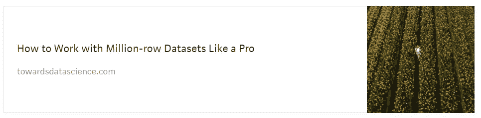

# 为什么 Kaggle 的所有人都痴迷于 Optuna 进行超参数调优？

> 原文：<https://towardsdatascience.com/why-is-everyone-at-kaggle-obsessed-with-optuna-for-hyperparameter-tuning-7608fdca337c?source=collection_archive---------1----------------------->

## 让我们通过试用来了解一下…


**照片由** [**博美**](https://pixabay.com/users/bomei615-2623913/?utm_source=link-attribution&utm_medium=referral&utm_campaign=image&utm_content=1751855) **上** [**Pixabay。**](https://pixabay.com/?utm_source=link-attribution&utm_medium=referral&utm_campaign=image&utm_content=1751855) **除特别注明外，所有图片均为作者所有。**

# 介绍

原来我一直生活在岩石下。

虽然每一个 MOOC 都教我使用 GridSearch 进行超参数调整，但 Kagglers 几乎已经专门使用 Optuna 两年了。这甚至早于我开始学习数据科学的时间。

Kaggle 社区以其残酷的竞争而闻名，对于一个达到这种统治水平的包来说，它需要**该死的好**。在平台上活跃了一个月之后(并且[获得了两级专家资格](https://www.kaggle.com/bextuychiev)，我看到 Optuna 几乎在任何地方都被每个人使用。

那么，是什么让 Optuna 被最大的机器学习社区如此广泛地接受呢？在本帖中，我们将通过动手操作这个框架来回答这个问题。我们将了解它是如何工作的，以及它如何从任何模型中挤出每一点性能，包括神经网络。

[](https://ibexorigin.medium.com/membership) [## 通过我的推荐链接加入 Medium-BEXGBoost

### 获得独家访问我的所有⚡premium⚡内容和所有媒体没有限制。支持我的工作，给我买一个…

ibexorigin.medium.com](https://ibexorigin.medium.com/membership) 

获得由强大的 AI-Alpha 信号选择和总结的最佳和最新的 ML 和 AI 论文:

[](https://alphasignal.ai/?referrer=Bex) [## 阿尔法信号|机器学习的极品。艾总结的。

### 留在循环中，不用花无数时间浏览下一个突破；我们的算法识别…

alphasignal.ai](https://alphasignal.ai/?referrer=Bex) 

# 什么是 Optuna？


**Optuna 标志**

Optuna 是完全用 Python 编写的下一代自动超参数调优框架。

它最突出的特点是:

*   使用循环和条件来定义 Pythonic 搜索空间的能力。
*   与平台无关的 API——您可以调优几乎任何 ML、DL 包/框架的估算器，包括 Sklearn、PyTorch、TensorFlow、Keras、XGBoost、LightGBM、CatBoost 等。
*   内置了大量具有提前停止和修剪功能的优化算法。
*   简单的并行化，只需很少或不需要修改代码。
*   内置对搜索结果可视化探索的支持。

在接下来的章节中，我们将尝试验证 Optuna 文档[中的这些过于乐观的说法。](https://optuna.readthedocs.io/en/stable/index.html)

# Optuna 基础

让我们通过调优一个类似 **(x-1) + (y+3)** 的简单函数来熟悉 Optuna API。我们知道该函数在 **x=1** 和 **y=-3** 时达到最小值。

> 你可以在这里找到这篇文章的笔记本。

让我们看看 Optuna 是否能找到这些:

导入`optuna`后，我们定义一个目标，返回我们想要最小化的函数。

在目标的主体中，我们定义了要优化的参数，在本例中，是简单的`x`和`y`。参数`trial`是 optuna 的一个特殊的试验对象，它为每个超参数做优化。

其中，它有一个`suggest_float`方法，采用超参数的名称和范围来寻找其最佳值。换句话说，

```
x = trial.suggest_float("x", -7, 7)
```

和做 GridSearch 时的`{"x": np.arange(-7, 7)}`差不多。

为了开始优化，我们从 Optuna 创建一个`study`对象，并将`objective`函数传递给它的`optimize`方法:

相当接近，但没有你想要的那么接近。这里，我们只做了 100 次试验，可以看到:

```
>>> len(study.trials)100
```

现在，我将介绍 Optuna 附带的第一个魔法。如果我们对结果不满意，我们可以在优化完成后继续优化！

与其他类似工具相比，这是一个明显的优势，因为搜索完成后，他们会完全忘记之前的试验历史。Optuna 没有！

要继续搜索，用所需参数再次调用`optimize`。在这里，我们将再运行 100 次试验:

这一次，结果更接近最佳参数。

## 关于 Optuna 术语和约定的说明

在 Optuna 中，整个优化过程被称为*研究*。例如，以日志损失为度量来调优 XGBoost 参数是一项研究:

研究需要一个可以优化的函数。通常，该函数由用户定义，应命名为`objective`，并应具有以下签名:

它应该接受一个`optuna.Trial`对象作为参数，并返回我们想要优化的指标。

正如我们在第一个例子中看到的，研究是一组*试验*的集合，其中每个试验，我们使用来自给定搜索空间的一组超参数来评估目标函数。

研究中的每个试验都被表示为`optuna.Trial`类。这个类是 Optuna 如何找到参数的最佳值的关键。

为了开始一项研究，我们用`direction`创建一个研究对象:

如果我们想要优化的指标是像 ROC AUC 或准确性这样的绩效分数，我们将方向设置为`maximize`。否则，我们最小化损失函数，如 RMSE、RMSLE、对数损失等。通过将方向设置为`minimize`。

然后，我们将调用研究的`optimize`方法，传递目标函数名称和我们想要的试验次数:

接下来，我们将进一步研究如何创建这些目标函数。

# 定义搜索空间

通常，您在目标函数中做的第一件事是使用内置的 Optuna 方法创建搜索空间:

在上面的目标函数中，我们创建了一个随机森林超参数的小搜索空间。

搜索空间是一本普通的字典。要创建可能的值进行搜索，您必须使用试验对象的`suggest_*`函数。

这些函数至少需要超参数名称、最小和最大范围，以搜索分类超参数的可能类别。

为了使空间更小，`suggest_float`和`suggest_int`有额外的`step`或`log`参数:

上图中，我们将`n_estimators`的分布宁滨了 200 个区间，使其更加稀疏。另外，`learning_rate`是以对数标度定义的。

# 如何对可能的参数进行采样？

在底层，Optuna 有几个负责参数采样的类。这些是:

*   `GridSampler`:同 Sklearn 的`GridSearch`。不要用于大搜索空间！
*   `RandomSampler`:同 Sklearn 的`RandomizedGridSearch`。
*   `TPESampler`:树形结构 Parzen 估计器采样器——使用核拟合的贝叶斯优化
*   `CmaEsSampler`:基于 CMA ES 算法的采样器(不允许分类超参数)。

> 我不知道最后两个采样器是如何工作的，我不希望这会影响我与 Optuna 的任何交互。

默认情况下使用 TPE 采样器——它试图通过提高上一次试验的分数来对超参数候选者进行采样。换句话说，您可以期待使用这个采样器从一次试验到另一次试验的增量(也许是边际)改进。

如果你想切换采样器，你可以这样做:

# 使用梯度推进回归器的端到端示例

让我们把学到的一切都变成有形的东西。我们将使用一些数字和分类特征来预测企鹅的体重。

我们将使用 Sklearn `GradientBoostingRegressor`建立一个基本分数，并通过使用 Optuna 进行调整来提高它:

现在，我们将创建`objective`函数并定义搜索空间:

我们构建了一个包含 5 个不同范围的超参数和一些静态超参数的网格，用于随机种子和早期停止。

上面的目标函数略有不同——它接受数据集、得分和`cv`的附加参数。这就是为什么我们必须将它包装在另一个函数中。一般来说，您可以使用如下的`lambda`函数来实现:

> 如果您想传递接受多个参数的`objective`函数，这是推荐的语法。

在不到一分钟的时间里，我们实现了显著的分数提升(就日志错误而言，0.004 是相当不错的)。我们只做了 100 次试验。让我们大胆地再跑 200 圈，看看会发生什么:

分数*确实*提高了，但幅度不大。看起来我们在第一次运行中达到了最大值！

最重要的是，我们使用常规网格搜索可能需要几个小时的搜索空间，仅用了 2 分多钟就获得了这个分数。

我不知道你怎么想，但是我被说服了！

# 使用视觉效果获得更多见解和更智能的调整

Optuna 在其`visualization`子包下提供了广泛的地块。这里我们只讨论 2 个，我认为是最有用的。

首先，让我们绘制最后一个`study`的优化历史:


这个剧情告诉我们，Optuna 只经过几次尝试就让分数收敛到了最小值。

接下来，让我们绘制超参数重要性:


这个情节非常有用！它告诉我们几件事，包括:

*   `max_depth`和`learning_rate`最重要
*   `subsample`和`max_features`对最小化损失没有用

当调整具有许多超参数的模型时，这样的图很方便。例如，您可以进行 40–50 次试验，并绘制参数重要性。

根据情节，您可能会决定丢弃一些不太重要的参数，并为其他参数提供更大的搜索空间，这可能会减少搜索时间和空间。

有关 Optuna 支持的绘图类型的更多信息，您可以查看文档的本页。

# 摘要

我想我们都同意 Optuna 没有辜负我在介绍中对 T2 的大肆宣传。太棒了。

本文只给出了使用 Optuna 可以做的基本工作。事实上，Optuna 有更大的能力。我们今天没有谈到的一些关键话题:

*   [Optuna 与其他 ML/DL 框架的用例](https://github.com/optuna/optuna-examples/)
*   [选择剪枝算法，立即剔除没有希望的试验](https://optuna.readthedocs.io/en/stable/tutorial/10_key_features/003_efficient_optimization_algorithms.html#activating-pruners)
*   [并行化](https://optuna.readthedocs.io/en/stable/tutorial/10_key_features/004_distributed.html)

最酷的是:

*   [使用 SQLite 或其他数据库(本地或远程)运行具有恢复/暂停功能的大规模优化](https://optuna.readthedocs.io/en/stable/tutorial/20_recipes/001_rdb.html#sphx-glr-tutorial-20-recipes-001-rdb-py)

请务必查看相关文档页面的链接。


# 您可能也会感兴趣…

[](https://towardsdatascience.com/how-to-work-with-million-row-datasets-like-a-pro-76fb5c381cdd)[](https://towardsdatascience.com/how-to-beat-the-heck-out-of-xgboost-with-lightgbm-comprehensive-tutorial-5eba52195997)[](https://towardsdatascience.com/love-3blue1brown-animations-learn-how-to-create-your-own-in-python-in-10-minutes-8e0430cf3a6d)

*   [使用 Sklearn GridSearchCV 和 RandomizedSearchCV 进行自动超参数调整](/automatic-hyperparameter-tuning-with-sklearn-gridsearchcv-and-randomizedsearchcv-e94f53a518ee?source=your_stories_page-------------------------------------)
*   【HalvingGridSearch 使超参数调谐速度提高了 11 倍
*   [20 烧 XGBoost 常见问题解答像专业人士一样使用库](/20-burning-xgboost-faqs-answered-to-use-the-library-like-a-pro-f8013b8df3e4?source=your_stories_page-------------------------------------)