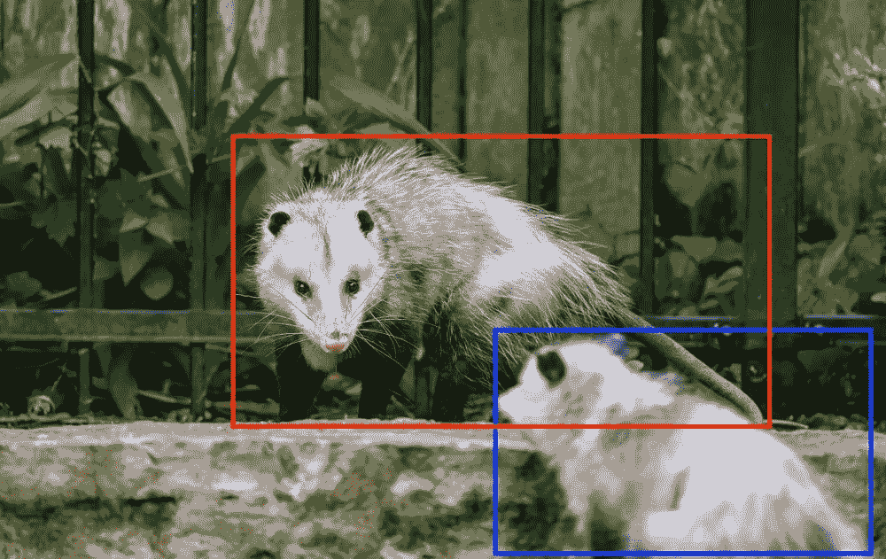
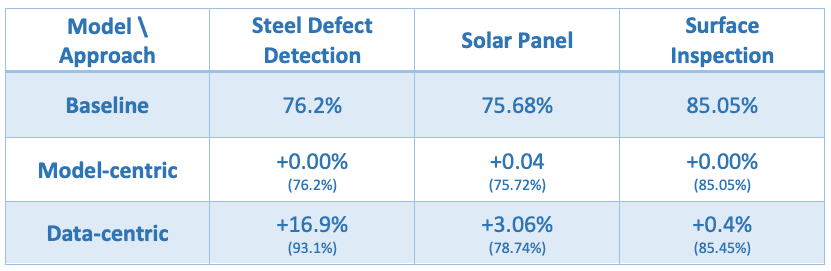
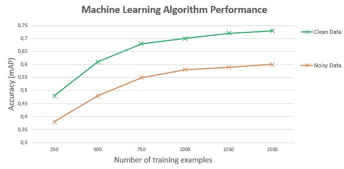
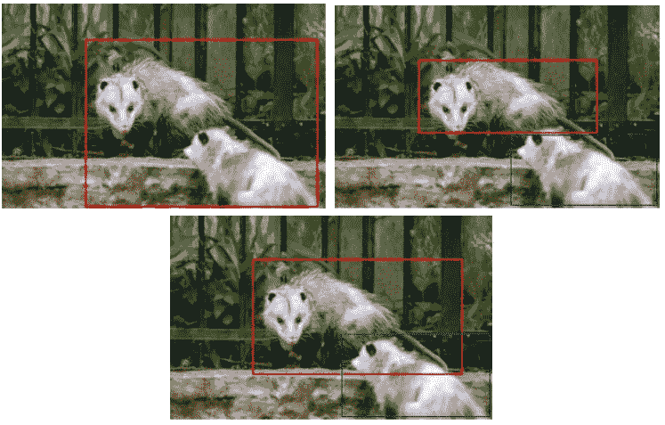

# 为什么标注非结构化数据仍然很难？

> 原文：<https://towardsdatascience.com/why-is-labeling-unstructured-data-still-hard-56b5eb4152a3?source=collection_archive---------29----------------------->

两只被标记的负鼠，图像来自[像素](https://www.pexels.com/photo/curios-hairy-possums-in-zoological-park-5749010/)

## D 数据标记是机器学习项目生命周期中最关键的任务之一，也是目前最难管理、扩展和监控的任务之一——而且原因也不对

人工智能先驱吴恩达的使命是改变人工智能生态系统，使其更加以数据为中心。Ng 将他的研究建立在多年来收集的数据(嗯，你应该已经看到了)的基础上，这些数据是关于 ML 从业者如何提高他们的模型性能的。正如 Ng 所说，数据是改善率的最重要因素，而良好的标签是首要原因。

基于心智模型的改善率表——来源: [deeplearning.ai](https://www.deeplearning.ai/wp-content/uploads/2021/06/MLOps-From-Model-centric-to-Data-centric-AI.pdf) ，图片作者

此外，将模型的成功建立在数据点的数量上，而不是数据点的质量上，会降低潜在的改进率。准确和一致的标记数据增加了我们的模型学习模式的可能性，这将有助于它成功地预测事件。

基于给定数据的改善率图表，来源: [deeplearning.ai](https://www.deeplearning.ai/wp-content/uploads/2021/06/MLOps-From-Model-centric-to-Data-centric-AI.pdf) ，图片作者

# 标记非结构化数据的挑战是什么

知道标签是项目生命周期中的一个重要因素，为什么管理、扩展和监控仍然是一项如此艰巨的任务？在 DagsHub，我们采访了来自数百家公司的 ML 专业人士，试图弄清他们工作流程中的问题。在检查贴标阶段时，我们遇到了 5 个主要挑战:

*   管理数据标签。
*   批注版本控制。
*   在整个贴标过程中进行沟通。
*   劳动力管理。
*   需要领域知识。

## 管理数据标签

绝大多数标注工具都需要将数据移动到其工作空间。如果我们有一个 DevOps 团队，他们可能会帮助我们传输或提取数据的一个版本，而在大多数情况下，我们将不得不复制它。当我们逐渐添加新的原始数据或对其进行修改时，我们还需要更新标注工具工作空间中的数据。为此，我们需要整理丢失的内容，创建一个副本并将其移动到标签工作区，这本身就是一项繁琐的任务。但是，当我们有多个互不相同的数据版本时，会发生什么呢？这将需要更多的工作来编写自动化程序，以同步存储和标记工具。

最重要的是，当将数据移动到工作区时，我们会丢失它在项目环境中的结构。它将只保留文件的名称，而不保留其在原始项目中的路径。有些工具甚至需要修改数据结构，以至于我们不得不放弃目录结构，使用平面目录。丢失或修改数据结构使得管理标注任务和控制数据版本变得更加复杂。

## 批注版本控制

标记是一项很难掌握的任务。它取决于各种难以预定义的参数，并且在大多数情况下，将需要多次迭代。与我们在数据科学项目中的任何实验一样，我们希望有一种方法可以轻松地修改注释、测试、分析，在某些情况下，还可以检索和重现以前的结果。然而，大多数标注工具不支持数据血统，使得迭代过程不明确，这将可能导致石器时代版本化(data_annotation1，data _ annotation-11–02–2020，data_annotation_backup 等。).

## 在整个贴标过程中进行沟通

贴标签是一项抽象的任务，没有一个可以轻松测试的黄金标准。例如，“使用边界框来指示负鼠的位置。”

外面有两只负鼠，图像来自[像素](https://www.pexels.com/photo/curios-hairy-possums-in-zoological-park-5749010/)

会导致以下任何一种结果:

两只被标记的负鼠，图片来自[像素](https://www.pexels.com/photo/curios-hairy-possums-in-zoological-park-5749010/)

正如吴恩达指出的，影响模型性能的最重要因素之一是数据的噪音，或者换句话说，标签的一致性。将任务的模糊性与其准确结果的重要性结合起来，可以得出这样的结论:评审过程应该是细致的。然而，大多数工具不支持评论者和贴标签者之间关于标签上下文的交流渠道。因此，许多组织在第三方平台上完成审查过程，或者更糟糕的是，在电话中完成审查过程，这使得很难随着时间的推移跟踪和管理变化。

## 劳动力管理

因为贴标签可能是一项繁琐而耗时的任务，许多公司试图通过使用[外包解决方案](https://www.mturk.com/)或雇佣指定的内部专家团队来扩大规模。这两种选择都是有效的，可以帮助我们更快地移动，但它们确实有一些盲点。

**外包贴标任务的挑战**

*   利益冲突-通常，数据标注者根据他们提供的标注数据的数量获得报酬。因此，在尽可能短的时间内标记尽可能多的数据符合他们的最大利益，不管这些数据有多嘈杂。然而，作为数据消费者，我们希望收到最好质量的数据标签，知道它如何影响模型的性能。由于很难监控贴标机的工作质量，当考虑外包任务时，这种冲突会成为一个真正的问题。
*   高前期投资-培训数据贴标机可能是一个艰巨的旅程，特别是如果需要独特的领域知识。它需要大量的前期投资，其结果是未知的，可能实际上不值得。

**雇用指定内部贴标团队的挑战**

*   缩小规模—在许多情况下，贴标签不是一项持续的任务。我们将在项目开始时投入大量精力来标记所需的数据，然后缩小规模，仅致力于改善有噪声的样本。当雇佣一个内部团队时，伸缩幅度会急剧缩小，我们必须为他们提供一致的工作。
*   资源——雇佣和培训内部贴标团队需要大量的资源，包括财务、时间和人员。此外，它将需要我们更多的日常注意力来管理团队和控制产品的质量。

## 需要领域知识

许多项目需要先验知识来标记它们的数据。例如，标记 x 光胸部图像并对其进行肺炎分类将需要很少标记者具有的医学背景。因此，由于贴标机数量少、成本高或需要长时间的培训，许多项目被叫停或需要大量资金。

# 摘要

近年来，由于大量的数据在人工智能从业者的能力范围之内，人工智能领域迅速发展和演变。然而，以数据为中心的范式已经证明，拥有大量数据是不够的；我们需要高质量的标记数据来实现 SOTA 结果。掌握标记任务仍然是一项正在进行的工作，一旦我们能够轻松地扩展和管理它，实现这些结果将不再是一个 MI。

如果你正面临我在这里没有提到的挑战，或者你能想到什么可以帮助我们克服这些挑战，我很乐意听听！