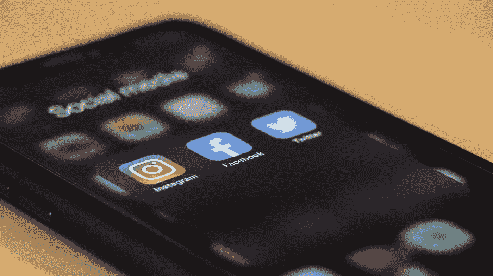

# 为什么自学这么难？

> 原文：<https://towardsdatascience.com/why-is-self-learning-so-difficult-1f2d594c3d7?source=collection_archive---------7----------------------->

## 以及你能做些什么来使它变得更容易

由 [Unsplash](https://unsplash.com/s/photos/learn?utm_source=unsplash&utm_medium=referral&utm_content=creditCopyText) 上的[窗口](https://unsplash.com/@windows?utm_source=unsplash&utm_medium=referral&utm_content=creditCopyText)拍摄

几天前，我的朋友找到我，让我帮她编辑一个她正在制作的视频。那是为了一项大学作业。

她告诉我，她的免费视频编辑服务将在两天后到期，她需要尽快完成。

我问她为什么不购买订阅，因为它只有几美元。

她的回答让我吃惊。

她说两天的期限是她尽快完成视频的动力。

**否则，她会花数周时间来完成它。**

我们都需要一个好的理由来完成一件事。在学校，我们必须完成作业，这样我们就不会受到惩罚。

在大学里，如果我们想通过这门课，就必须按时交作业。

在工作中，每项任务都需要在截止日期前完成。

我们做这些事情是因为我们必须这样做。因为如果不这样，我们知道后果会很可怕。

我曾经在考试的前一天在学校开夜车，在一个晚上把所有的材料都塞进去。

我那样做的唯一原因是为了取得好成绩。

如果我们没有考试或作业评分，我根本不会花那么多精力去学习这些材料。我可能整个学年都不会翻开我的课本。

我们几乎一生都在做事，因为我们不得不这样做。我们完成事情是因为我们有截止日期，我们想要好成绩。

## 这就是自学之路如此艰难的原因。

当你自学时，没有竞争，也没有截止日期。

保持主动完成事情的动力是很难的，因为如果你没有完成事情就不会有任何后果。

然而，如果做得好，自学可以说是最有效的学习方式之一。

可能没有老师或指导，但你只是出于兴趣在学习一些东西。你在学习你真正想理解的材料，而不是被迫在最后期限前死记硬背。

## 我之前的文章里也提到过，我走的是自学路线，自学编程和数据科学。

我的学习还远未完成，但我想分享一些我用来保持动力的技巧。

在这篇文章中，我会给你一些让自学更有效的建议。只要你保持专注，随着时间的推移，学习新技能并提高它们是可能的。

# 长期目标

安特·汉默斯米特在 [Unsplash](https://unsplash.com/s/photos/goal?utm_source=unsplash&utm_medium=referral&utm_content=creditCopyText) 上的照片

长期目标是你想在几年内实现的事情。可能是这样的:

*   成为数据科学家
*   掌握编程语言
*   成为机器学习专家

我上面列出的一切都是长期目标。它们是你踏上自学之旅的原因，也是你继续前进的主要动力来源。

然而，长期目标还有几年的时间。它们太大了。如果你不正确地分解它们，你可能永远也到不了那里。

# 短期目标

由[este 扬森斯](https://unsplash.com/@esteejanssens?utm_source=unsplash&utm_medium=referral&utm_content=creditCopyText)在 [Unsplash](https://unsplash.com/s/photos/goal?utm_source=unsplash&utm_medium=referral&utm_content=creditCopyText) 上拍摄

我喜欢把长期目标分成短期目标(大约 2-5 个月)。例如，如果我的长期目标是真正精通一门编程语言，那么我的短期目标就是用这门语言完成一个项目。

以下是短期目标的样子:

*   在 Python 中创建疾病分类的端到端机器学习模型，并在仪表板上可视化该模型。
*   读完一本关于情感分析的教科书
*   完成统计学课程，为数据科学打下良好的基础

所有这些都是短期目标。它们是将你的短期目标分解成更小的任务。

当做一个像上面这样的项目时，你会对数据科学的不同领域有更好的理解。学完本课程后，您将会对 Python 有更好的了解，并理解数据可视化工具。

短期目标和长期目标是相辅相成的，你可以把短期目标看作是朝着长期目标努力的一种方式。

# 衡量进展

照片由 [Isaac Smith](https://unsplash.com/@isaacmsmith?utm_source=unsplash&utm_medium=referral&utm_content=creditCopyText) 在 [Unsplash](https://unsplash.com/s/photos/goals?utm_source=unsplash&utm_medium=referral&utm_content=creditCopyText) 上拍摄

你需要一种方法来记录你的长期和短期目标。我建议把你的短期目标分成每周任务，这样你的工作就可以平均分配了。

为了衡量进展，我建议使用以下一项(或全部):

*   待办事项应用
*   保留一份清单
*   愿景板
*   时间表

你可以使用待办事项列表或清单来确保在截止日期前完成每一项任务。愿景板通常用于长期目标。你可以在你的墙上贴一个愿景板，这样你每天早上醒来都可以看着它。

时间表对你从起床开始计划一天中的每一件事很有用。

## 埃隆·马斯克通常会提前计划好自己的一天。

从早上醒来到晚上睡觉，所有他想完成的任务都是前一天计划好的。

这是我强烈建议你尝试的事情。你不需要浪费任何时间来决定下一步做什么。相反，你可以专注于手头的任务。

# 激情和纪律

伊恩·施耐德在 [Unsplash](https://unsplash.com/s/photos/passion?utm_source=unsplash&utm_medium=referral&utm_content=creditCopyText) 上拍摄的照片

麻省理工学院人工智能研究员莱克斯·弗里德曼(Lex Fridman)表示，激情和纪律是相辅相成的。

我们通常出于激情开始做事，比如学习如何编码，或者构建新的东西。

虽然激情帮助你开始，但它有时会消失。

有时，你可能会在早上醒来时感到没有动力，对继续下去完全没有兴趣。可能有时候你会觉得你几乎什么都没学到，而且你不想继续下去。

正是在这些时候——激情让我们失望的时候，纪律成了我们的救命恩人。

你需要有纪律来制定一个每日时间表(例如:每天学习五个小时)。

即使你不喜欢，你也需要遵守时间表。

纪律会带你走过困难的部分，确保你坚持你开始做的事情，即使激情让你失望。

持续对学习某样东西充满热情是不可能的。当处理一个特别困难的问题时，很容易放弃，不想再看它。很容易变得消极。

如果你正在做大学作业，或者准备考试，你会坚持通过困难的部分，因为你不得不这样做。你必须这样做，否则你可能会失败。

自学的时候，放弃是没有后果的。然而，度过这些困难的部分也同样重要。做到这一点的唯一方法是自律，并对自己负责。

# 培养一种习惯

上学时，我总是在考试前一周开始学习。那时，这些材料一直萦绕在我的脑海中，我不会忘记。

然而，我花了一些时间才意识到，学习一个新概念和为考试而学习是完全不同的两回事。

如果你的目标是学习如何编码，或者学习数据科学，你需要养成学习的习惯。

你应该每天都这样做，至少要坚持几年，直到你达到一个能力水平，让它成为你的第二天性。

## 每天花一分钟做一件事比每年花一整天做一件事要好。

如果你想学习如何编程，但有一份全职工作，那么你可能会在周末花时间学习。

我的建议是，下班后多花一个小时编程。

如果你不能花整整一个小时，试着做 20 分钟。

这可能看起来不多，但它会帮助你培养每天编程的习惯。

一旦你发现自己养成了这个习惯，20 分钟可能会变得更长，编程会慢慢开始成为你的第二天性。

# 最小化所有干扰

照片由 [Unsplash](https://unsplash.com/s/photos/social-media?utm_source=unsplash&utm_medium=referral&utm_content=creditCopyText) 上的 [dole777](https://unsplash.com/@dole777?utm_source=unsplash&utm_medium=referral&utm_content=creditCopyText) 拍摄

学习桌上不能有手机。

每次我的手机带在身边，我都会有每十分钟连续查看我所有社交媒体账户的冲动。

你的手机是你最大的干扰，不同的人采取不同的方法来处理这个问题。

有些人根本不使用社交媒体，因为它容易上瘾，而且耗费时间。其他人对他们每天的屏幕时间设置了限制，不要超过这个限制。

就我而言，我更喜欢在学习时不带手机。

学习或工作时需要相当长的时间来获得动力，但当出现干扰时，很容易分心。

如果你计划学习五个小时，那么在整个五个小时里最好不要把手机放在房间里。您也可以将手机保持在“请勿打扰”状态，或将您的帐户状态设置为“忙碌”，这样您就不会在这段时间收到电话或信息。

# 做你感兴趣的事情

照片由[珍·西奥多](https://unsplash.com/@jentheodore?utm_source=unsplash&utm_medium=referral&utm_content=creditCopyText)在 [Unsplash](https://unsplash.com/s/photos/excited?utm_source=unsplash&utm_medium=referral&utm_content=creditCopyText) 拍摄

不断地从教科书中学习材料并试图理解新概念可能是困难的。

连续几个月做相同的 Coursera 专业可能会变得枯燥乏味，你可能会开始变得不感兴趣。

在我的学习中，我总是加入一些我感兴趣的东西，这给了我继续学习的理由。

如果我开始研究神经网络背后的基本概念，我会给自己一个令人兴奋的目标，比如

*   创建一个 GAN(生成对抗网络)来生成真实的名人面孔，并让人们猜猜他们认为是谁

当学习变得无聊时，这些小的、令人兴奋的目标会让我坚持下去。我知道一旦我完成了，我将能够从我学到的概念中获得乐趣，并用它来建造一些很酷的东西。

我喜欢把这看作是基于奖励的学习。每次我学到新的东西，我都会从中获得一个有趣的项目。

独自开始一件新的事情并坚持下去会很困难，尤其是当事情变得困难的时候。

然而，如果你每天朝着你的目标努力，并有纪律来带领你度过困难时期，你将能够轻松掌握新技能。

真正擅长数据科学和编程等领域需要时间和努力。如果你愿意自己投入时间和努力，没有最后期限或外部动机，你将能够走得很远。

> 我是一个努力学习的普通人。没有奇迹般的人。碰巧他们对这个东西感兴趣，他们学习所有这些东西，但他们只是人。—理查德·费曼