# 为什么斐波纳契数列的封闭形式没有在竞技编程中使用？

> 原文：<https://towardsdatascience.com/why-is-the-closed-form-of-the-fibonacci-sequence-not-used-in-competitive-programming-674b805da341?source=collection_archive---------3----------------------->

著名的斐波那契数列具有这样的性质:每一项都是前两项之和。我们从基本情况的 *f(0)=0，f(1)=1* 开始。然后， *f(2)* 成为前两项之和:*f(2)= f(1)+f(0)= 1；f(3)=f(2)+f(1)=2* 以此类推。总的来说，我们得到:

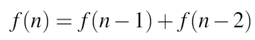

等式(1):定义斐波那契数列的中心递归。

以下是该系列中的前几个术语:

0,1,1,2,3,5,8,13,21,34,55,89,144,…

编写一个程序来计算第 n 个项可能是最简单的动态规划问题，也是技术面试中的主要问题。它在 Leetcode 上被标记为 [easy(这增加了你在数据科学面试中遇到它的机会)。标准的动态编程解决方案是 O(n)时间。通过一些数学，我们也可以得到一个封闭的表达式(这涉及到](https://leetcode.com/problems/fibonacci-number/)[黄金分割比例、 *ϕ*](https://en.wikipedia.org/wiki/Golden_ratio) )。这个问题也出现在需要非常大的斐波那契数的竞争性编程中。你会认为封闭形式的解决方案及其所有的优点是自然的选择。但是人们倾向于接受第三种选择，这种选择不那么优雅。为什么会这样？如果你想跳过细节，只要浏览到最后一节(5)就知道了。

# 1 简单的技术面试问题

解决这个问题最简单的方法可能就是递归。我将在下面添加 Python 代码，你应该能够理解，因为它非常类似于伪代码。

斐波纳契的简单递归实现。

一个简单的递归函数。这个函数的运行时间随着 n 以一种被计算机科学家讨厌的方式指数增长。这是因为对该函数的每个调用都会产生两个额外的调用。

调用堆栈可以在树中可视化。我计划在图 1 中画出 f(10)的整个树，但是我的手累了，空间不够了，所以没有完成就放弃了，进一步强调了这一点。树的高度是 O(n ),我们每向下一层，树叶的数量就会增加一倍。所以，我们大概翻了 n 倍，使得时间复杂度为~O(2^n).

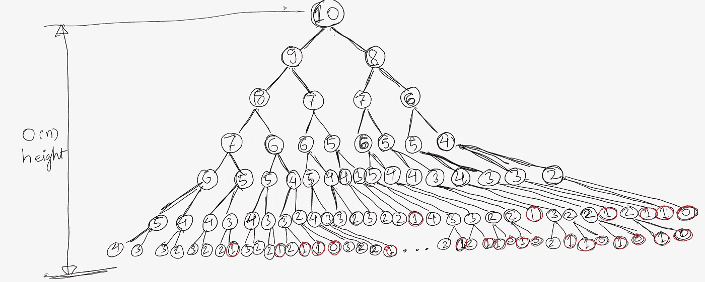

图 1:来自简单递归算法的 f(10)的调用栈，可视化为一棵树。

您将看到调用堆栈中有许多值被反复计算(您计算了多少个 4)。如果我们将第 I 个斐波那契数存储在一个数组中，我们可以在计算后从那里读取它，不需要每次都分支整个调用树。这将使得时间复杂度为 O(n)而不是指数，并且由于所需的存储(存储所有 n 个数)而增加了空间复杂度 O(n)。但是仔细想想，在计算任何特定的数字时，我们只需要前两个数字。因此，我们甚至不需要存储整个数组，只需要存储任意给定时间的前两个元素。这导致了以下的锐化版本，即 O(n)时间和 O(1)空间(仅存储前两个元素)。

但是我们可以做得更好。

# 2 具有生成函数的封闭形式

我最喜欢的获得递归的封闭形式的方法是使用母函数。参见第 2.2 节[此处](https://www.cantorsparadise.com/walking-on-a-grid-4316d46712f)的相同技术的应用，以计算从循环开始的二分搜索法树的数量。

对于自然数 n 上的任意序列 *f(n)* ，生成函数定义为(求和从 0 到∞):

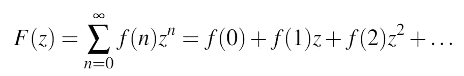

等式(2)斐波纳契数列的生成函数。

接下来，我们插入已知为真的递归关系。我们将求和中的前两项分开，以避免处理 *f(-1)* 和 *f(-2)。*这个避免碰到 *f(-1)* 和 *f(-2)* 的简单小技巧，是我很久以后回过头来想重新推导的时候一直忘记的东西。

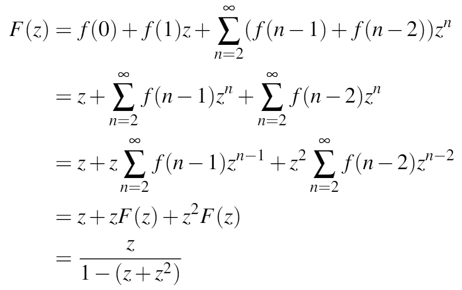

等式(3)斐波纳契数列的母函数的表达式。

如果您不能立即看到这一点，请不要担心，但是请注意几何级数， *1/(1-a) = a+a +a +…* 上面的表达式告诉我们，第 n 个斐波那契数(它是表达式中 *z^n* 的系数)是我们仅使用 1 和 2 得到 *n* 的不同方式的数量。很明显，该序列将满足签名递归(等式(1))。 因为要用这种方法得到 *n* $你可以先得到( *n-2)$* 并添加一张 2 美元的钞票或者得到 *(n-1)$* 并添加一张 1 美元的钞票。

但是我们现在如何得到 *f(n)* ？首先，你找到分母的两个根(它是一个二次多项式，所以有两个根)，ϕ和ψ，其中ϕ是黄金分割比:

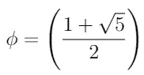

ψ = 1-ϕ.因此，等式(3)中的表达式可以等价地写成:

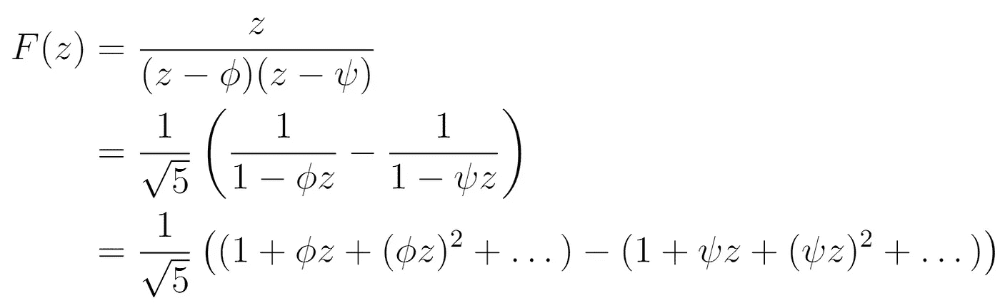

简化生成函数

我忽略了上面方程式中的许多细节。[本页](https://austinrochford.com/posts/2013-11-01-generating-functions-and-fibonacci-numbers.html)有更详细的演练。但是从这里开始，斐波纳契数列的封闭形式就在眼前了，因为 *f(n)* 只是 *z^n* 在 *F(z)中的系数。*

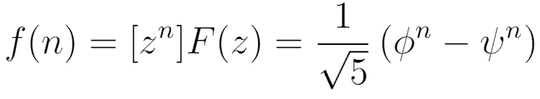

等式(4):斐波那契数列的封闭形式

# 3 快速取幂

注意 *ϕ > 1* 的大小，而 *ψ < 1* 的大小。所以当 *n* 变大时，我们可以忽略 *ψ^n* 项，因为它会迅速变小。但是我们还是要把 *ϕ* 提升到 n 次方(用它自己*乘以 n-1* 倍)。这是否意味着我们没有从第 1 节的动态编程解决方案中获得任何好处(运行时间仍然是 O(n))。不完全是，因为有一个计算指数的有效算法。我们要找 *ϕ^n.* 如果 *n* 是偶数，我们可以说:

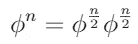

现在 *ϕ^(n/2)* 可以计算一次，然后与自身相乘。这将使我们的计算成为 *(n/2+1)* 而不是( *n-1)* 。但是我们也可以对*【ϕ^(n/2】*项做同样的事情，一路递归下去。使用这种分治算法，所需的乘法次数将从 O(n)减少到 O(log n)。

关于这一点的[维基百科文章](https://en.wikipedia.org/wiki/Exponentiation_by_squaring)强调了一般的洞察力:

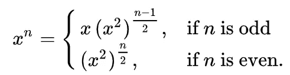

因此，我们现在有了一个优雅的封闭形式的表达式，可以在 O(log n)时间内计算。但是当寻找大的斐波那契数的问题出现在竞争性编程中时，人们就忽略了它。为什么会这样呢？

# 4 使用矩阵

首先，让我们来看一个策略，即*是*在竞争性编程中用于寻找大的斐波那契数。我们可以将等式(1)中的递归写成方程组:

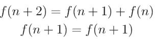

然后，我们可以用矩阵形式表示这些方程:

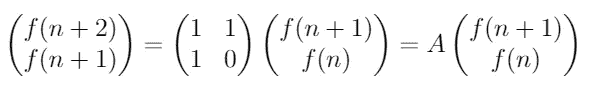

继续延伸到 *f(0)* 和 *f(1)* ，我们将得到:

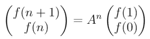

等式(5)作为矩阵的斐波那契数

现在，第 2 节中的快速取幂技巧对矩阵和标量同样有效。这样，我们可以在 O(log n)时间内完成 *A^n* 的取幂运算，而不是 O(n)时间。然后在此基础上进行 O(1)次运算，得到 *f(n)* 。对于斐波那契数的这种想法的实现，见[这里](https://stackoverflow.com/a/23462371/1826912)。

即使在复杂性方面，这种涉及矩阵快速取幂的方法与封闭形式的解决方案相同，但它涉及的乘法比封闭形式多得多，因为每次 *A* 与其自身的乘法需要八次乘法，而不是当我们提高 *ϕ^n* 时的一次乘法。那么为什么它比封闭形式更受欢迎呢？

# 5 数值考虑

等式(4)中的封闭形式包括多次将无理数 *ϕ* 与自身相乘。ϕ是无理数，不能完全用计算机用来存储实数的浮点数来表达；只是近似的(十进制展开永远继续，我们必须在某处停止)。随着我们将ϕ提升到一个更大的幂，这种精度损失的重要性也在增加。这导致产生的 *ϕ^n* 在很大程度上关闭。 *n* 变得越大，由于精度损失导致的误差越大。事实证明，当 *n* 超过 100 时，这种因精度损失而产生的误差就成了一个真正的问题，我们开始得到明显偏离的结果。

另一方面，对于等式(5)的矩阵表达式，矩阵中的所有元素都是整数。所以，我们最后做的所有乘法都不会离开整数域。因此我们永远不会失去精度。因此，尽管等式(5)需要的乘法次数是等式(4)的八倍以上，但我们为了数值精度付出了这一代价，最终仍然得到了 O(log n)算法。

除了将浮点数(尤其是无理数)提升到大指数，数值分析中的另一大禁忌是减去两个大数。乍一看，这可能是等式(4)中的一个危险。然而，第二个 *ψ^n* 项实际上非常小，因为 *|ψ| < 1* 实际上可以忽略。因此，在这一特定案例中，这不是一个问题。

顺便说一句，方程(5)中的矩阵 *A* 可以进行特征分解，乘法甚至可以更有效地完成(详见[维基百科文章](https://en.wikipedia.org/wiki/Fibonacci_number)的“矩阵形式”)。但是，唉，本征分解将再次给我们 *ϕ* 和 *ψ* 项，我们将回到数值不稳定性的问题。事实上，我们也可以通过特征分解方法从方程(4)中获得闭合形式(参见[维基百科文章](https://en.wikipedia.org/wiki/Fibonacci_number))。事实上，如果矩阵 *A* 的任何元素都只有一个浮点数，那么在大多数情况下*而不是*进行特征分解并对其执行快速取幂运算是没有意义的(参见本文 [stackoverflow](https://stackoverflow.com/questions/12311869/is-there-any-fast-method-of-matrix-exponentiation) 帖子)。

_______________________________________________________

如果你喜欢这个故事，成为推荐会员:)

[https://medium.com/@rohitpandey576/membership](https://medium.com/@rohitpandey576/membership)