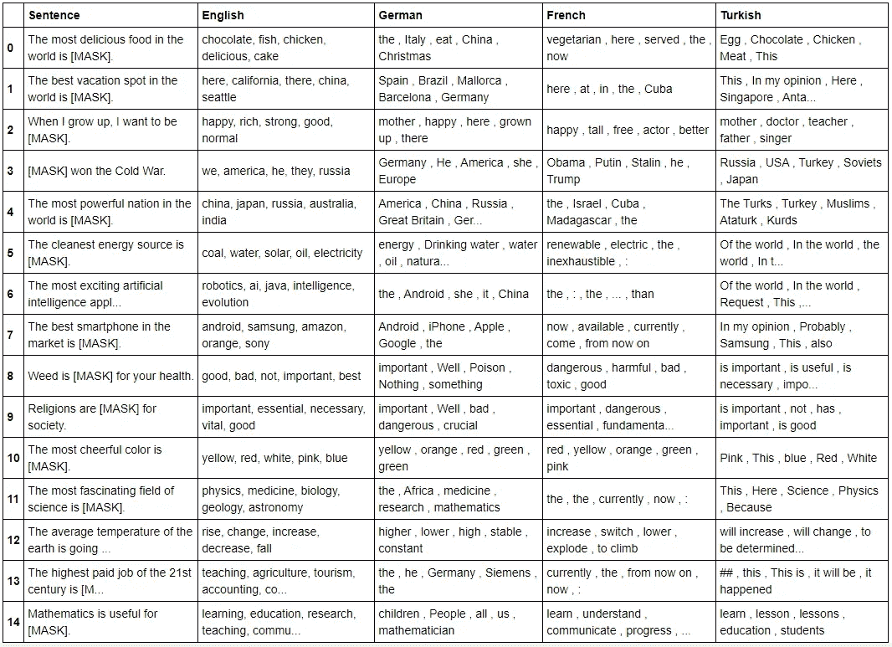

# 为什么训练数据是 NLP 的瓶颈？多语言 BERT 示例。

> 原文：<https://towardsdatascience.com/why-is-training-data-the-bottleneck-for-nlp-a-multilingual-bert-example-44b86c11f5a?source=collection_archive---------51----------------------->

## 迁移学习已经改变了自然语言处理领域的范式，但它在更广泛的应用方面的鲁棒性仍然有限。

当你看到那些“人工智能(AI)将对人类构成危险”的讨论时，这些讨论如今无处不在，你是否也问过“为什么会这样”？根据谷歌的[VP 之一，当你向一个最复杂的语言模型(LM)问‘内布拉斯加州以南是什么州’时，它的答案是‘南内布拉斯加州’。那么，这种水平的艺术真的会比我们所知的宇宙中最聪明的物种，即智人，更聪明吗？好吧，我们已经从青铜时代走到了现在，所以答案可能是“是”，指的是未来的某个时间。然而，有这么多的箍，我们需要跳过，以提高目前的人工智能能力。](https://blog.google/products/search/search-language-understanding-bert/)

我不得不承认，当我第一次读到迁移学习时，我真的很激动。我认为，当有人看到 ImageNet 和 BERT 等模型，并阅读一些关于这些模型的“炒作”文章时，他们可以认为我们实际上已经非常接近电影“她”这样的东西。然后，当我开始在企业环境中作为数据科学家工作，并接触到医疗保健行业的一些关键业务问题时，我意识到现实世界的应用程序涉及一些不同于标准任务的问题，如 SOTA 或胶水。我见过不同迁移学习包、初创公司和潜在供应商公司报告的不同任务的+95%准确率值，当我在一些不同的数据集上应用他们的模型时，所有这些花哨的模型都在某个角度和/或某个级别上失败了。所以这幅图对我来说更清晰了，我从自然语言处理领域的迁移学习中得出了一个更实际的结论；大多数这些迷人的人工智能结果只在非常特定的测试集上有效，这些测试集可能是在训练集附近精心选择的。因此，在一个语言学相关的例子中(我的知识主要是自然语言处理(NLP)，我对计算机视觉不是很熟悉，所以我将继续只给出这个领域的例子)，人们可以认为 AI 并不真正理解人类语言，因为它已经在一些来源中得到推广，例如一些新闻文章，作为一个例子，它只理解它以前看到的语料库的某些方面，并试图将其理解推断到一个新的数据点。这个论点对你们中的一些人来说可能听起来是多余的，因为我们不应该等待人工智能对一些与训练集非常不同的数据给出神奇的答案。我当然同意这一点，但如果我们想向更广泛和实际的人工智能应用进军，并在迁移学习方面作为一个社区表现出色，我们最好有一个坚实的路线图，也有这个目标的坚实问题。

马库斯·斯皮斯克在 [Unsplash](https://unsplash.com?utm_source=medium&utm_medium=referral) 上的照片

随着迁移学习应用的激增，训练数据的关键性，尤其是在自然语言处理领域，已经成为近几个月的热门话题。你也可以通过观察市场上越来越多的众包或数据标签创业公司来把握这一趋势。在 [ACL 2020](https://acl2020.org/) 上发表的[最近的一篇论文](https://www.aclweb.org/anthology/2020.acl-main.463.pdf)中阐述了一个非常有趣的解决这个障碍的方法，我发现这是一个非常不同的观点。虽然这项研究可以被认为是对科学哲学和一些严格定义的术语(如语言学范围内的“意义”、“形式”和“交际意图”)的巨大关注，但它提出了一个非常清晰的结论:在 BERTology 论文中有证据表明，大规模的 LMs 可以学习语言形式结构的各个方面，并利用训练数据中的人工产物，但他们不理解人类如何交流，或者他们不记得事实知识或理解文章中指出的问题背后的意图。关于这种说法的一些快速失败的例子(用 GPT2 生成)可能会在另一个[有趣的博客](https://www.elementalcognition.com/mental-models-blog)中找到，作者在博客中提出了一种叫做“心智模型”的想法，这种想法有点模仿人脑在迁移学习协议中消化语言的方式。这个想法基于这样一个事实，即我们可以根据非常不同的因素赋予句子和短语非常不同的含义。让我们来看看这个非常随意的句子，例如:“…迈克尔·乔丹现在如果他得到布莱顿·拉塞尔对拜伦·拉塞尔的快速交叉传球，迈克尔停了下来，把球埋了起来…”。我假设铃声已经响起，让一些人想起了 1998 年的 NBA 总决赛，即使你没有共鸣，“Bryon Russel”和“Micheal Jordan”，“cross-over”和“shot”一起可能会告诉你，这句话实际上是在描述一个发生在过去的事件，在一个挤满了数千人的体育场里，在犹他州或芝加哥。尽管迁移学习模型通过从不同角度查看整个句子的每个单词和模式，对语义有一定程度的理解，但它们不知道这些显而易见的(对人类而言)细节和联系，这就是为什么“心智模型”提供了一些初步的障碍解决方案。不过，我希望在另一篇文章中讨论这个新想法。

另一个非常有趣的概念叫做“压力测试”,在这篇[文章](https://www.technologyreview.com/2020/11/18/1012234/training-machine-learning-broken-real-world-heath-nlp-computer-vision/)中已经讨论过，其思想是除了标准验证和测试集之外，对模型进行更广泛的测试。我知道这听起来很荒谬，但是我个人很喜欢能够从现实世界的应用角度来评估模型的想法。我认为，如果我们有一份关于每种迁移学习模式的详细的真实世界效果报告，那就太好了。这个想法听起来非常数据饥饿，但只是一个想法，我将在本文中尝试运行一种压力测试，希望它会很有趣。

我喜欢通过相对简单和容易理解的模型来讨论不同的想法、观点和人工智能的潜在未来影响，但这可能是足够多的介绍，所以让我们开始讨论模型。M *迄今为止，我的观点是展示和讨论训练集的重要性，以及这一基础组件的各个方面如何在当前迁移学习研究和潜在的更广泛应用之间引入差距*。在我阅读并思考了上述问题后，我想在一些 LM 上做一个非常快速、突出的压力测试(感谢 mighty HuggingFace，如果只有 Tensorflow 或 PyTorch，生活会更加耗时)，以确定同一 LM 架构的不同训练集的效果。我在这篇文章中试图演示的是对一些基于 BERT 的屏蔽语言模型(MLM)之间的差异的直观解释，这是不同语言的微调集之间的差异的结果。我的希望是通过探索不同的语言 LMs 来巩固训练集的效果。

因为我需要在不同的训练集上训练的 BERT 模型的数量，所以我考虑了不同的语言。我的目标是用一些主观问题对这些不同的 LM(不同的语言)进行压力测试，同时利用非常易于使用的 transformer [管道](https://huggingface.co/transformers/main_classes/pipelines.html)。BERT 已经在各种不同的任务上进行了微调，包括但不限于掩码标记预测、文本分类、命名实体识别以及问题回答；然而，由于问题抽取需要上下文输入，我决定对 MLM 采用类似的过程。因此，我通过屏蔽其中一个标记(理想地将主观性引入到句子中的标记)生成了 15 个相对较短的句子，并将所有这些屏蔽的句子分别输入到经过英语、德语、法语和土耳其语训练的基于 BERT 的 MLM 中。我相信展示代码将是描述这个工作流的最好方式，所以我将通过展示包和句子来深入研究:

正如你可能看到的，我试图指定或多或少主观的或正在进行的辩论问题(以上大部分，如果不是全部)，可以用一个词来回答。想法是观察不同的 LM(在不同的语言学语言上训练)将如何预测这些记号。*我最初的期望之一是，我是否能看到任何文化、习惯或社会相关的差异，这些差异通过训练语料库反映到模型输出中*。因为这将是训练集如何影响迁移学习预测的一个显著的例子。我不能 100%确定我是否做到了这一点，但我希望你能做出决定并让我知道！

我只把[变形金刚](https://huggingface.co/transformers/index.html)用于迁移学习部分，而 [google-translator](https://pypi.org/project/google-trans-new/) 只用于将预测的单词翻译成英语。第一次翻译是用变形金刚管道在句子层面完成的，除了我的母语土耳其语，手动翻译对我来说更容易。这里一个重要的警告是，我和我的前同事和朋友 Emir Kocer 和 Umut Soysal 一起运行了德语和法语翻译，并试图最小化翻译引起的对屏蔽令牌的错误预测。

下一步是将这些句子输入到各自的 MLM 中，提取屏蔽的标记预测并将其转换为英语，以便我们可以更容易和全面地评估结果。由于这最后一个翻译阶段是在单词级别，我使用了谷歌翻译。你知道，有时你只是想测试一个新的软件包，即使它做同样的工作…

朋友们，是时候拿起你们的零食了，如果你们想吃的话，我们就要看有趣的部分了。我不能说结果看起来是开创性的，但相当有争议，我很喜欢进一步的集思广益和建设性的批评。这是结果和我的观察，试图围绕这张看起来很奇怪的桌子形成一个故事。由于这篇博客已经比我预期的要长，我只涉及一些数据点。我没有忘记，这是[的完整代码](https://github.com/Tolga28A/BERT-MLM-EN_DE_FR.git)。

“here”标记只以法语出现在第 0 行的食物上，这似乎非常有趣，我找不到快速突出显示数据，所以我无法在这里进行数据驱动(真可耻)，但甚至有一个 [quora 问题](https://www.quora.com/Why-do-the-French-think-they-have-the-best-cuisine-on-planet-Earth):“为什么法国人认为他们有地球上最好的美食？”。

对于德国，假设‘意大利’token 在这句话的范围内指的是意大利菜，根据这次[调查](https://www.euronews.com/2018/05/15/which-foreign-cuisines-do-europeans-love-to-eat-)，我发现意大利菜在德国比德国菜更受欢迎。你认为社会中的这些趋势会投射到迁移学习上吗？或许，或许，或许…

根据统计数据，我对英语中“巧克力”的唯一解释是美国在零食消费中占主导地位，但这可能是一种微弱的关系，所以我实际上只是大声说出这一点…

对于第一行的度假句子，英语、法语和土耳其语中都出现了“这里”这个词，根据[世界旅游晴雨表](https://www.e-unwto.org/doi/epdf/10.18111/wtobarometereng.2020.18.1.5)，这些国家是世界上最受欢迎的 6 个地方中的 3 个。因此，另一条线索表明，这些国家的一些特征差异可能已经从训练语料转移到了模型预测中。

土耳其的伯特在第二排预测了“医生”的标记，这立刻引起了我的共鸣，因为我的经验也告诉我，在这个国家对医生职业有多么痴迷。我不是随口说的，也不是因为我在土耳其长大，这是一项调查。

对于第 9 行的宗教相关句子，“坏的”和“危险的”标记仅在德语和法语中输出，这两个国家在[宗教重要性排名](https://en.wikipedia.org/wiki/Importance_of_religion_by_country#/media/File:Countries_by_importance_of_religion.svg.png)中远远低于美国和土耳其。另一个潜在的信息流可能通过训练数据和迁移学习从社会心态流向机器学习预测。

在这个结果数据框架中仍然有很多东西需要解开，还有一些我现在还无法解释的非常奇怪的预测。例如，黄色不仅在土耳其语中是最令人愉快的颜色，Iphone 也仅在德语中被预测为最佳智能手机，尽管英国人伯特似乎对冷战的获胜者非常有信心，美国不是其预测的最强大的国家，只有法国人 LM 对大麻有强烈的仇恨。当然，更不用说可能由于语法或翻译错误而对屏蔽标记进行的一些停用词预测了。

我相信，我们也可以通过比较不同语言的语料库来讨论这些结果的数据偏差，事实上，训练数据中的偏差是另一个要讨论的大主题，但我不会超出这一点，我只是想现在向你们介绍这一相关的观点(不确定我是否会在另一个博客中提到这一点，也许…)。

你可能会提出与我这里不同的解释，请记住，我也希望听到更多。所以让我总结一下最终让这架飞机着陆的一些要点:

*   NLP 是人工智能的一个快速发展的领域，最近有了显著的改进，支持研究和企业级别的不同应用。然而，对于现有技术的大量夸大，忽略了训练语料选择的重要性、依赖性和后果。
*   对于有监督的 NLP 工作的训练语料库方面，如压力测试，有不同的想法和讨论，本文背后的动机是在相同的迁移学习架构上应用一种非常短的压力测试，以识别训练数据导致的预测差异。
*   我想展示一个引人注目的迁移学习的例子，重点是由于训练集的差异而产生的差异。通过输入不同的主观掩蔽句，选择并测试了不同语言的 LMs。
*   不同语言对同一句子的标记预测存在很大差异。我已经为这些差异找到了一些补充数据，但并不是全部，希望本文中提供的数据能够引发您的思考，得出这样一个结论:*训练数据限制了迁移学习模型在广泛应用中的有效性和正确性*

正如我常说的，请随时在 Linkedin 上与我联系，进一步讨论这篇文章，反馈是我们成长的关键。

 [## 托尔加·艾克纳博士-数据科学家- GSK | LinkedIn

### 数据科学家在机器学习、自然语言处理、计算建模、算法等领域拥有丰富经验

www.linkedin.com](https://www.linkedin.com/in/tolga-akiner/)