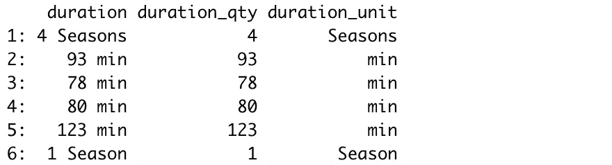
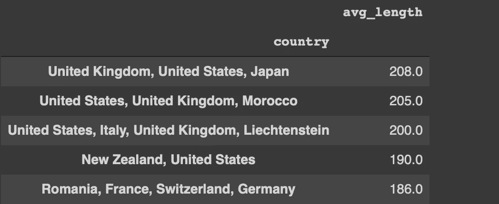

# 为什么选择 Python 或 R 进行数据分析并不重要

> 原文：<https://towardsdatascience.com/why-it-does-matter-to-choose-python-or-r-for-data-analysis-c251ba2aa6c8?source=collection_archive---------9----------------------->

## 比较实践指南


哈维尔·阿莱格·巴罗斯在 Unsplash 上的照片

Python 和 R 是数据科学生态系统中的主流编程语言。两者都提供了各种库来执行有效的数据争论和分析。

有抱负的数据科学家或分析师面临的最常见问题之一是选择哪种编程语言来学习数据科学。

有许多文章从不同的角度比较了 Python 和 R。这篇文章也是一个对比。然而，重点或目标不是宣布一个优于另一个。

我在本文中想要展示的是强调 Python 和 R 库都能够进行有效的数据争论和分析。我将介绍几个使用 Python 和 r 完成相同操作的例子。

我们将使用的库是 Python 的 Pandas 和 r 的“data.table”和“stringr”。我们将使用 Kaggle 上的[网飞](https://www.kaggle.com/shivamb/netflix-shows)数据集来做示例。我们从导入库和读取数据集开始。

```
# Pandas
import pandas as pd
netflix = pd.read_csv("/content/netflix_titles.csv") # data.table
library(data.table)
netflix <- fread("Downloads/netflix_titles.csv")
```

该数据集包含 7787 种图书的详细信息。以下是功能列表(即列)。

```
['show_id', 'type', 'title', 'director', 'cast', 'country', 'date_added', 'release_year', 'rating', 'duration', 'listed_in', 'description']
```

标题可以是电影或电视节目。我们先来看看每个类别的标题数量。在 Pandas 中，我们可以使用 groupby 或 value_counts 函数。

```
netflix['type'].value_counts()
Movie      5377 
TV Show    2410 netflix.groupby('type').agg(number_of_titles = ('show_id','count')) number_of_titles
type    
Movie                5377
TV Show              2410
```

在 data.table 中，我们可以按如下方式完成这项任务:

```
netflix[, .(number_of_titles = .N), by=type] type number_of_titles
1: TV Show             2410
2:   Movie             5377
```

by 参数的作用类似于 Pandas 的 groupby 函数。N 计算每个类别中的行数。

我们可能想计算网飞电影的平均长度。持续时间列的当前格式不适于计算。它包含数量和单位:

```
netflix.duration[:5] # Pandas
0    4 Seasons 
1       93 min 
2       78 min 
3       80 min 
4      123 min
```

我们将创建两个新列，分别包括持续时间数量和单位。

```
# Pandas
netflix['duration_qty']=netflix.duration.str.split(" ").str.get(0).astype('int')netflix['duration_unit']=netflix.duration.str.split(" ").str.get(1)# stringr and data.table
netflix[, duration_qty := as.numeric(str_split_fixed(netflix$duration, " ", 2)[,1])]netflix[, duration_unit := str_split_fixed(netflix$duration, " ", 2)[,2]]
```

我们所做的基本相同，但语法不同。我们在空格字符处拆分 duration 列，然后使用第一部分作为数量，第二部分作为单位。

数量部分需要转换为数字数据类型。在熊猫中，我们使用 astype 函数。同样的操作可以用 r 中的“as.numeric”函数来完成。

让我们看看派生列和原始列。

```
# data.table
head(netflix[, c("duration", "duration_qty", "duration_unit")]) 
```



(图片由作者提供)

我们现在可以用分钟来计算电影的平均长度。

```
# Pandas
netflix[netflix['type'] == 'Movie']['duration_qty'].mean()
99.30798# data.table
netflix[type == "Movie", mean(duration_qty)]
99.30798
```

电影平均时长 100 分钟左右。我认为电影长度在不同的国家变化很大。我想看看平均电影长度排名前五的国家。

```
# data.table
netflix[type == 'Movie', .(avg_length = mean(duration_qty)), by='country'][order(avg_length, decreasing = TRUE)][1:5]# Pandas
netflix[netflix['type'] == 'Movie'].groupby('country')\
.agg(avg_length = ('duration_qty', 'mean'))\
.sort_values(by='avg_length', ascending=False)[:5]
```



(图片由作者提供)

我们来详细说明一下语法。我们按国家对行进行分组，并在国家列中计算每个组的平均电影长度。然后我们将计算出的平均值按降序排序，选择前 5 名。

最大的 5 个值大约是 200 分钟，比 99 分钟的总平均值大得多。上面截图中显示的前 5 个值可能是极端情况。他们可能包含很少的电影，所以我们不能真正谈论一个平均值。

确认我们的怀疑的一种方法是，也添加每个类别中的电影数量，或者过滤电影数量超过一定数量的类别。

```
# Pandas
netflix[netflix['type'] == 'Movie'].groupby('country')\
.agg(avg_length = ('duration_qty', 'mean'), 
     qty = ('duration_qty', 'count'))\
.query('qty > 10').sort_values(by='avg_length', ascending=False)[:5] # data.table
netflix[type == 'Movie', .(avg_length = mean(duration_qty), .N), by='country'][N > 10][order(avg_length, decreasing = TRUE)][1:5]
```


(图片由作者提供)

我们添加了一个列来显示每一列中的电影数量。然后，在对值进行排序之前，我们根据该列过滤行。

最长的电影在巴基斯坦、印度和韩国。

## 结论

我们已经做了一些展示数据争论和分析的典型案例的例子。这里的要点是 Python 和 R 库都提供了完成这些任务的高效方法。

无论你选择哪种编程语言来学习数据科学，你都不会有问题。一旦你用其中一种学习或练习，习惯另一种就相对容易了。大多数任务的逻辑和实现方式非常相似。

感谢您的阅读。如果您有任何反馈，请告诉我。