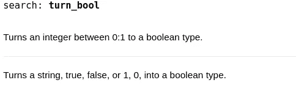

# 为什么 Julia 代码如此难以正确记录

> 原文：<https://towardsdatascience.com/why-julia-code-is-so-hard-to-document-properly-abccec3a42a?source=collection_archive---------33----------------------->

## Julia 包没有被很好地记录的真正原因。


(src =[https://pixabay.com/images/id-1149962/](https://pixabay.com/images/id-1149962/)

# 介绍

虽然大多数数据科学家最喜欢使用的语言可能是 Python，或者不太可能是 R，但我最喜欢的编程语言是 Julia。Julia 语言是一种相当年轻的、实时(JIT)编译的编程语言，它的范例围绕着通用编程概念多重分派。他们不仅使用这种泛型，而且在语言的任何地方都使用它，结果非常惊人。如果你想阅读我写的关于 Julia 和该语言中的 genius multiple dispatch 用法的整篇文章，你可以在这里查看这篇文章:

</how-julia-perfected-multiple-dispatch-16675db772c2>  

几天前，我写了一篇关于我认为 Julia 作为编程语言所面临的问题的文章。正如一些人可能预料的那样，这些问题中第一个也是最重要的一个是，朱莉娅需要一个更好的生态系统来合作。最后一点是，该语言的开发者没有明确表达该语言在行业中的定位，尽管他们明确说明了该语言的发展方向。然而，这种事情背后是否有更多的隐含意义——我真的不能说，因为我不是他们团队的成员。无论如何，在这两个问题之间是我想集中讨论的一整篇文章:

> 文档。

另外，如果你对那篇文章感兴趣，你可以在这里单独阅读:

</the-depressing-challenges-facing-the-julia-programming-language-in-2021-34c748968ab7>  

# 成因

在上面提到的文章中，我讨论了在我看来，Julia 的文档的问题是如何根源于 Documenter.jl 的。软件工程师是懒惰的，当涉及到软件工程文档时更是如此。完成开发一个包的整个任务可能会非常有压力。在软件包开发完成后，然后对其进行严格的测试，制作一些文件，选择一个许可——最后是一个发布版本……但是随后意识到您仍然必须担心文档。

幸运的是，Documenter.jl 可以用来自动化这个过程。此外，Julia Hub 网站会自动生成一致的软件包文档。不用说，这是一个非常棒的方法，但是，这是不是太简单了？让我们也记住，你必须做的是用 Julia 编写软件文档，只需调用一个 autodoc 宏。也就是说，许多主流软件包选择在文档管理器文件中编写完整的描述，这是一件好事。

也就是说，我认为这也使得文档变得如此简单，以至于很容易浏览一遍。不用说，当一个人唯一可以处理的东西是文档字符串时，这可能是有问题的，文档字符串可能很少包含示例或复杂的类型描述。不用说，在 HTML 文档中拥有比简单的自动生成的文档字符串更好的文档当然是最佳的。那个人说，做后者太容易了，我认为这已经损坏了文档。

另一件损害 Julia 文档的事情是，许多用户甚至不知道如何记录他们的软件。这是为什么呢？因为信不信由你，

> 文档管理器. jl，并且文档化 Julia 通常很少被文档化。

对我来说，这真是个可笑的讽刺。想象一下。

我无法记录我的包，因为我需要用来记录包的包的文档不完整然而，事实并非如此，只是没有很多全面的关于 Julia 的文章解释如何做到这一切——这肯定会令人沮丧！有些 Julia 程序员甚至不知道 Documenter.jl 的存在！

# 最大的原因

当我写上一篇文章的时候，我甚至没有想到 Julia software 经常没有文档记录或者文档记录很差的最大原因。直到后来，我从另一位 Julia 程序员和 fan 那里得到回复，谈到他们也遇到了许多文档方面的问题。事实上，他们写道，我是他们关于朱莉娅的最大信息来源——这也是我写朱莉娅的目的，就是不断地教授这门语言。话虽如此，我觉得自己很有成就，但也思考了为什么那些甚至没有 Documenter.jl 这样的工具的语言往往有更好的文档。我甚至研究了 C、Ruby、JavaScript、F#、Vala 等语言的其他包。

通过所有这些研究，我得出的结论是，朱莉娅很少被记录下来，而且也很难被记录下来，这是有一个非常坚实的原因的。原因深植于编程语言中，存在于编程范例本身:

> 多重派遣。

等等，所以多重派遣是问题所在！？虽然本文中讨论的问题都不是决定性的问题，但是很容易理解为什么多重分派会对工程师记录 Julia 代码的能力产生重大影响。

# 为什么多重派遣？

为了理解为什么多重分派对于文档来说是一个问题，让我们首先考虑 Julia 中多重分派的一个例子。考虑以下两种类型:

```
tru = "true"
fls = 0
```

这里我们有 fls，false，它是一个表示布尔值的整数。在上面声明的，我们有 tru，true，另一个布尔值，但是这个包含在一个字符串中。这两者需要以不同的方式处理。我们可以通过简单地将 bool 类型转换为整数 0 来处理整数。然而，如果我们试图对我们的字符串这样做，我们将得到一个方法错误。在我们进入字符串之前，让我们为这个整数写一个函数:

```
turn_bool(x::Int64) = Bool(x)
```

虽然这是一个相当简单的例子，但现在让我们来做字符串。需要使用 parse()方法将字符串解析为其各自的数据类型 bool:

```
turn_bool(x::String) = parse(Bool, x)
```

现在让我们考虑为这些函数编写一个文档字符串。

```
"""Turns an integer between 0:1 to a boolean type."""turn_bool(x::Int64) = Bool(x)"""Turns a string, true, false, or 1, 0, into a boolean type."""turn_bool(x::String) = parse(Bool, x)
```

每当我们使用。()语法，我们将按预期的顺序得到这两个，这是完美的！

```
?(turn_bool)
```



(图片由作者提供)

然而，当只有一个版本的函数是 doc-string 的，或者更常见的是，doc-string 不提供输入参数时，问题就来了。这是有问题的，因为它使得确定什么函数将对特定类型起作用变得不可能。例如，如果您研究索引 DataFrames.jl 数据帧，您最终会遇到一个使用 filter()方法的示例—这就是应该如何做的。如果你要调用 filter()方法。()，你会看到这个函数在 Base 和 DataFrames.jl 中的每一次使用都是完全没有记录的！！！从而展示了这些基本函数在整个语言中使用的根本缺陷——用户觉得没有必要记录它们的用法！

# 结论

我真的很高兴有一个关于朱利安软件文档的小对话。就个人而言，我必须承认我在记录我的软件方面也不是最好的。然而，我的主要软件包，车床和 OddFrames，有两个大的稳定版本即将在这里发布——这两个版本都将有很好的文档记录，并且易于理解，我可以保证！非常感谢您的阅读。我认为这些问题是可以解决的，社区只需要认同这个问题，并尝试从整体上改善它。希望作为朱利安，我们能走到一起，给这种语言它应得的包和各自的文档。祝你在 Medium 度过美好的时光！