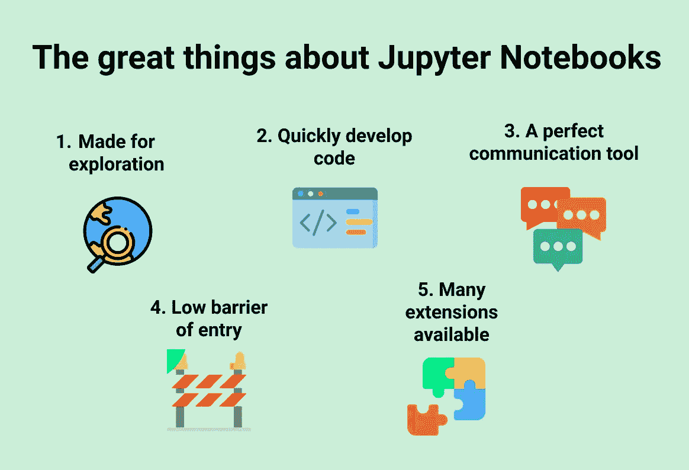
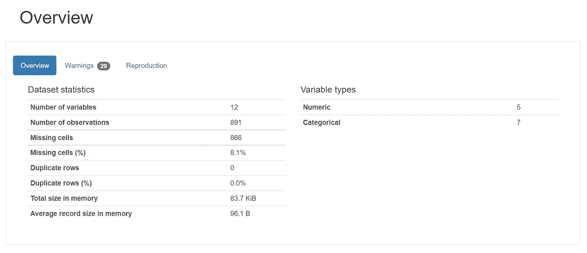
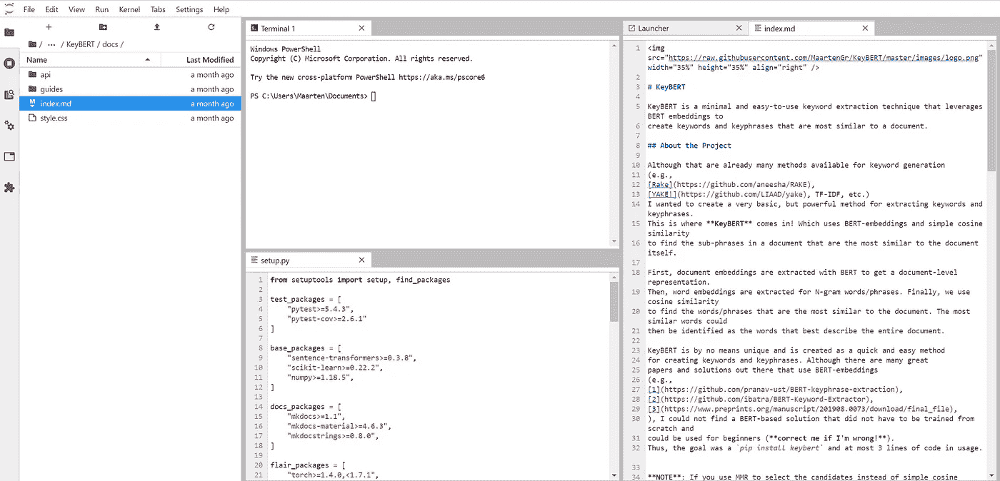

# 为什么 Jupyter 笔记本没有那么差！

> 原文：<https://towardsdatascience.com/why-jupyter-notebooks-arent-all-that-bad-d75e90d02c3a?source=collection_archive---------25----------------------->



图片由作者提供。由 [Vectors Market](https://www.flaticon.com/authors/vectors-market) 和 [Freepik](https://www.freepik.com) 从 [Flaticon](https://www.flaticon.com/) 制作的图标。

## [入门](https://towardsdatascience.com/tagged/getting-started)

## 以及如何给它们增压。

在过去的几年里，我注意到越来越多的人不喜欢 Jupyter 笔记本，很多人说你应该从 Jupyter 转向 scripts(这里是[这里是](/5-reasons-why-you-should-switch-from-jupyter-notebook-to-scripts-cb3535ba9c95)，这里是[这里是](/5-reasons-why-jupyter-notebooks-suck-4dc201e27086)，这里是[这里是](/the-case-against-the-jupyter-notebook-d4da17e97243)，这里是[这里是](https://medium.com/skyline-ai/jupyter-notebook-is-the-cancer-of-ml-engineering-70b98685ee71)等等)。).

事实上，使用 Jupyter 笔记本有一些缺点，但这并不意味着你应该忽略它的优势，它可以帮助你成为一名更高效的数据科学家！

> Jupyter 笔记本可以补充您的工作流程

与大多数工具一样，这是一个将工具用于其预期目的的问题。当然，有一些简单的方法可以让 Jupyter 笔记本在生产中使用，但它的真正潜力在不同的领域大放异彩。

我认为你不应该将**切换到**脚本，而是使用 Jupyter 笔记本，一个与脚本一起使用**的工具。**

> 使用 Jupyter 笔记本和脚本可以产生协同效应

在这篇文章中，我将通过几个原因来解释为什么 Jupyter 笔记本电脑没有一些人想象的那么糟糕。在这里，我将重点介绍它的优势、用例以及在您的技术堆栈中的潜在作用。

# 1.它们非常适合探险

Jupyter 笔记本是一个神奇的探险工具。它允许您快速，最重要的是，交互式地浏览您的数据，创建一些可视化，并计算结果都一气呵成。

像 [**熊猫概况**](https://github.com/pandas-profiling/pandas-profiling) 这样的工具可以帮助你增加 Jupyter 笔记本作为探索工具的实用性，因为它可以快速创建数据中可以发现的内容的概览。



熊猫-侧写示例。图片由作者提供。

由于它的交互性，您可以继续深入研究数据，并创建自己的可视化效果来补充个人资料。

为 Jupyter 创造了大量的探索工具，如 [**【小平面】**](https://github.com/PAIR-code/facets)[**【D-Tale】**](https://github.com/man-group/dtale)[**bq plot**](https://github.com/bqplot/bqplot)。对我来说，这证明了 Jupyter 对于探索的用途。

# 2.它们可以用于开发代码

我听到的关于 Jupyter 的一个主要担忧是它鼓励了糟糕的编码实践。事实上，如果您不小心，Jupyter 笔记本可能会导致污染全局名称空间，难以控制源代码，并且如果您不以线性方式运行笔记本，还会出现可再现性问题。

如果使用不当，这些都是主要问题。然而，这仅仅意味着您在使用 Jupyter 笔记本时应该更加小心，并了解如何改进您的工作流程。

为了改进工作流程并防止这些问题，有一件事通常可以解决大多数问题:**打包您的代码**。

> 在适当的地方以线性方式使用函数和类

如果你把你的代码打包在一个*中。py* 文件或者甚至是一个 *pip 可安装包*，你就可以把这些代码加载到你的 Jupyter 笔记本上并继续开发。

```
%load_ext autoreload  # Load the extension
%autoreload 2  # Autoreload all modules
```

允许你在执行代码前重新加载模块。把它放在你的笔记本的开头，每次你执行一个单元，所有载入的函数和类都会更新。

而且，随着 [**Jupyter Lab**](https://jupyterlab.readthedocs.io/en/latest/) ，笔记本越来越类似于合适的 ide。



Jupyter 实验室示例。图片由作者提供。

您甚至可以使用扩展来增强您的 Jupyter 环境，如 [**nbdev**](https://github.com/fastai/nbdev) 、 [**nbdime**](https://github.com/jupyter/nbdime) 、 [**nbviewer**](https://github.com/jupyter/nbviewer) 和**nbstripout****，这些扩展允许更多的可再现性和更丰富的功能。**

# **3.它们是完美的交流工具**

**对我来说，Jupyter 笔记本非常适合用于交流目的，如教程、演示和解释算法。用户可以使用它来隐藏代码，显示可视化，嵌入视频，交互式演示结果，等等！**

**例如，每当我创建一个包时，我都会确保包含一套 Jupyter 笔记本，其中包含几个关于如何使用该包的教程。这使得同事之间共享笔记本变得容易，特别是如果你已经花时间使它成为一个很好理解的文档。**

**您可以使用诸如[](https://github.com/bqplot/bqplot)****和 [**ipyleaflet**](https://github.com/jupyter-widgets/ipyleaflet) 等扩展来提高 Jupyter 笔记本的可视化能力。这些工具在扩展绘图功能方面非常出色。******

****我个人是[**Voila**](https://github.com/voila-dashboards/voila)**和 [**Fastpages**](https://github.com/fastai/fastpages) 的忠实粉丝。瞧，你可以用交互式小工具渲染 Jupyter 笔记本的实时版本。Fastpages 是一个支持 Jupyter Notebook 的博客平台，可以用作文档。******

# ****4.他们的准入门槛很低****

****Jupyter 笔记本的准入门槛极低。它们的交互性与简单易用的界面相结合，使用户可以快速开始编程。它们使探索和可视化您的数据变得轻而易举。****

****这对于那些主要不是程序员，但确实需要额外执行一些分析的人，例如不同领域的科学家，特别有帮助。****

****正如所料，有一堆扩展可以进一步降低这个障碍！****

****从 [**Jupyterhub**](https://github.com/jupyterhub/jupyterhub) 开始，这个工具可以创建单用户 Jupyter 笔记本服务器的多个实例。在实践中，您可以向一班学生提供笔记本电脑服务器。我自己在学习期间也用过它，并且用得很开心！****

****与学术环境保持一致，[**nbgradier**](https://github.com/jupyter/nbgrader)**可以让老师轻松分配和评分 Jupyter 笔记本。******

# ******5.插件/扩展/工具可以增压 Jupyter******

******从上面的段落中你可能已经注意到，有大量的扩展可以改进你的 Jupyter 笔记本工作流程。******

******这些扩展让您可以弥补 Jupyter 笔记本的任何缺点，并将其转化为优势！******

******下面，我将列出我之前提到的扩展的概述，但我也会添加一些我认为可能对您有很大好处的扩展。******

## ******核******

******内核是执行笔记本中代码的计算引擎。可用的有很多，比如[**【R】**](https://github.com/IRkernel/IRkernel)[**Scala**](https://github.com/almond-sh/almond)[**c++**](https://github.com/jupyter-xeus/xeus-cling)，甚至 [**GO**](https://github.com/gopherdata/gophernotes) 内核都可以在 Jupyter 内使用。******

********

****可能的 Jupyter 内核。图片由作者提供。****

****还可以使用[](https://github.com/nteract/hydrogen)****和[**Vscode-jupyter**](https://github.com/microsoft/vscode-jupyter)**分别在 Atom 和 vs code 中运行 Jupyter 笔记本。**********

## ******小部件和可视化******

******使用小部件和可视化扩展可以轻松快速地可视化和浏览您的数据。[**pandas-profiling**](https://github.com/pandas-profiling/pandas-profiling)**和[**D-Tale**](https://github.com/man-group/dtale)**是创建数据概览的绝佳工具，而[**ipywidgets**](https://github.com/jupyter-widgets/ipywidgets)**和[**ipyvolume**](https://github.com/maartenbreddels/ipyvolume)**使进一步扩展这些功能成为可能。**************

******有很多这样的扩展可以创造更好的视觉体验。几个值得注意的扩展是[**interact**](https://github.com/nteract/nteract)， [**Qgrid**](https://github.com/quantopian/qgrid) ， [**Lux**](https://github.com/lux-org/lux) 和 [**mpld3**](http://mpld3) 。******

## ****发展****

****对于开发来说，像[**paper mill**](https://github.com/nteract/papermill)[**nbdev**](https://github.com/fastai/nbdev)和[**NBD ime**](https://github.com/jupyter/nbdime)**这样的工具允许更多的再现性和更丰富的特性。它们包括在 Jupyter 笔记本中开发包的可能性，甚至在必要时应用单元测试。******

******尽管 Jupyter 笔记本并不是用来创建产品级代码的，但这些扩展肯定能帮助用户实现这一点。******

## ******出版******

******我们可以发布类似[**Voila**](https://github.com/voila-dashboards/voila)**和[**fast pages**](https://github.com/fastai/fastpages)**这样的扩展名的 Jupyter 笔记本来渲染 live 版本。这使得我们可以交流研究结果，同时允许同事们进行实验。**********

******我们甚至可以更进一步，将 Jupyter 笔记本转换成更适合您的使用案例的格式。以 [**nbconvert**](https://nbconvert.readthedocs.io/en/latest/) 为例，它将 Jupyter 笔记本转换成 pdf，HTML，甚至 LaTeX！******

****类似的扩展还有[**jupytext**](https://github.com/mwouts/jupytext)**和 [**jupyter-book**](https://github.com/executablebooks/jupyter-book) ，它们允许有趣的选项来发布或转换您的 jupyter 笔记本。******

# ****感谢您的阅读！****

****Jupyter 笔记本不仅仅是他们做得不好的事情。通过专注于他们做得好的事情，你肯定可以提高你的工作流程！****

****如果你和我一样，对人工智能、数据科学或心理学充满热情，请随时在 [**LinkedIn**](https://www.linkedin.com/in/mgrootendorst/) 上添加我，或者在 [**Twitter**](https://twitter.com/MaartenGr) 上关注我。****