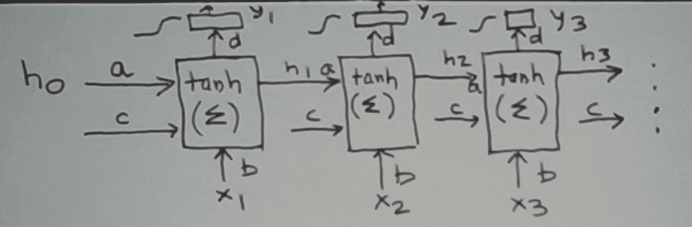

# 为什么在递归神经网络中“学会遗忘”

> 原文：<https://towardsdatascience.com/why-learn-to-forget-in-recurrent-neural-networks-ddf89df3f0ab?source=collection_archive---------45----------------------->

## 用一个简单的例子来说明


照片由[妮可·罗德里格兹](https://unsplash.com/@cryo789?utm_source=unsplash&utm_medium=referral&utm_content=creditCopyText)在 [Unsplash](https://unsplash.com/s/photos/network?utm_source=unsplash&utm_medium=referral&utm_content=creditCopyText) 拍摄

考虑下面的二进制分类问题。输入是任意长度的二进制序列。当且仅当输入中出现 1 但不是最近才出现 1 时，我们希望输出为 1。具体来说，最后的 *n* 位必须为 0。

我们也可以把这个问题写成语言识别问题。对于 *n* = 4，描述为正则表达式的语言是`(0 or 1)*10000*`。

以下是案例 *n* = 3 的一些标记实例。

```
000 → 0, 101 → 0, 0100100000 → 1, 1000 → 1
```

为什么会出现这个看似奇怪的问题？它需要记住(I)1 出现在输入中，以及(ii)不是最近。正如我们将很快看到的，这个例子有助于解释为什么简单的递归神经网络是不够的，以及注入一个学习遗忘的机制如何有所帮助。

**简单递归神经网络**

让我们从一个基本的递归神经网络(RNN)开始。 *x* ( *t* )是在输入中的时间 *t* 到达的位，0 或 1。这个 RNN 保持一种状态 *h* ( *t* )，试图记住它是否在过去某个时候看到了 1。经过适当的转换后，输出将从该状态中读出。

更正式地说，我们有

```
*h*(*t*) = tanh(*a***h*(*t*-1) + *b***x*(*t*) + *c*)
*y*(*t*) = sigmoid(*d***h*(*t*))
```

接下来，我们考虑以下(*输入序列*，*输出序列*)对，假设 *n* = 3。

```
x 10000000
y 00011111
```

讨论这对 RNN 的行为和学习，将有助于像通常所做的那样及时展开网络。



简单的 RNN 在时间中展开

把这想象成一个有阶段的管道。状态从左向右移动，并在过程中由某一阶段的输入进行修改。

让我们更详细地了解一下阶段内部发生的情况。考虑第三阶段。它输入状态 *h* 2 和下一个输入符号 *x* 3。 *h* 2 可以被认为是从 *x* 1 和 *x* 2 导出的用于预测 *y* 3 的特征。该框首先从这两个输入计算下一个状态 *h* 3。 *h* 3 然后被结转到下一阶段。 *h* 3 也决定了工作台的输出 *y* 3。

考虑当看到输入 1000 时会发生什么。y 4 是 1，因为 y ^4 小于 1(总是这样)，所以有一些误差。遵循通过时间反向传播的学习策略，我们将通过时间使误差波动回到更新各种参数所需的程度。

考虑参数 *b* 。它有 4 个实例，分别连接到 *x* 1 到 *x* 4。附加到 *x* 2 到 *x* 4 的实例不会改变，因为 *x* 2 到 *x* 4 都是 0。所以这些 b 实例对 y^没有任何影响。当进行这种改变使 *y^* 4 更接近 1 时，连接到 x1 的 b 的实例增加。

随着我们继续看到 *x* 5、 *x* 6、 *x* 7、 *x* 8，以及它们对应的目标 *y* 5、 *y* 6、 *y* 7、 *y* 8，同样的学习行为也会发生。 *b* 会一直增加。(尽管如此，因为我们需要更早地反向传播误差，以到达 *x* 1。)

现在想象一下 *x* 9 是 1。 *y* 9 必须为 0。然而，^9 很大。这是因为参数 *b* 已经得知 *x* i = 1 预测 *y* j = 1 对于*j*=*I*。 *b* 无法强制要求 *x* i = 1 后面必须只跟 0，编号至少为 3。

简而言之，这个 RNN 无法捕捉到 *x* i = 1 的联合交互作用，并且它后面的所有位都是 0，编号至少为 3，以预测 *y* j。还要注意，这不是一个长期影响。 *n* 只有 3。因此，这个例子中 RNN 的弱点不能用时间反向传播时误差梯度的消失来解释[2]。这里还发生了别的事情。

一个学会遗忘的 RNN

现在考虑这个版本

```
z(*t*)    = sigmoid(*a***x*(*t*) + *b*)
*h*new(*t*) = tanh(*c***x*(*t*) +*d*)
*h*(*t*)    = (1-*z*(*t*))**h*(*t*-1) + *z*(*t*)**h*new(*t*)
*y*(*t*)    = sigmoid(*e***h*(*t*))
```

我们不是凭空想象出来的。它是流行的门控递归神经网络 GRU 中的一个关键方程。我们从[1]中对它的描述中得到这个方程。

这个 RNN 有一个显式的遗忘机制！它是 *z* ( *t* )，一个介于 0 和 1 之间的值，表示遗忘的程度。当 *z* ( *t* )趋近于 1 时，状态 *h* ( *t* -1)被完全遗忘。

当 *h* ( *t* -1)被完全遗忘的时候， *h* ( *t* )应该是什么？我们将它封装在一个表示“新状态”的显式函数 *h* new( *t* )中。 *h* new( *t* )仅来自当前输入。这是有道理的，因为如果要忘记 *h* ( *t* -1)，我们面前只有新的输入 *x* ( *t* )。

更一般的是，下一个状态 *h* ( *t* )是前一个状态 *h* ( *t* -1)和一个新状态 *h* new( *t* )的混合，由 *z* ( *t* )调制。

这个 RNN 有能力在这个问题上做得更好吗？我们将通过开出一个可行的解决方案来肯定地回答这个问题。随附的解释将揭示各种神经元在使该解决方案工作中所扮演的角色。

考虑 *x* ( *t* )为 1。 *y* ( *t* )必须为零。所以我们要将 *y* ^( *t* 向 0 驱动。我们可以通过将 *e* 设置为一个足够大的负数(比如-1)并迫使 *h* ( *t* )接近 1 来实现这一点。获得期望的 *h* ( *t* )的一种方法是强制 *z* ( *t* )接近 1，并将 *c* 设置为足够大的正数，并将 *d* 设置为足够大的正数，使得 *c* + *d* 足够大。我们可以通过将 *a* 设置为足够大的正数，将 *b* 设置为足够大的正数，使得 *a* + *b* 足够大，从而强制 *z* ( *t* )接近 1。

这个处方的作用就好像

```
If *x*(*t*) is 1
   Set *h*new(*t*) to close to 1.
   Reset *h*(*t*) to *h*new(*t*)
   Drive *y*^(*t*) towards 0 by setting *e* sufficiently negative
```

由于 *y* ( *t* )依赖于 *x* 的最近过去值，因此 *x* ( *t* )为 0 的情况更复杂。让我们以下面的设定来解释一下:

```
Time … *t*    *t*+1     *t*+2      *t*+3
*x*    … 1     0       0        0
*y*    … 0     0       0        1
*h*new … 1 D=tanh(*d*)   D        D
*z*    … 1     ½       ½        ½
*h*    … 1  ½(1+D) ½(*h*(*t*+1)+D) ½(*h*(*t*+2)+D)*h*^   … >>0  >>0      >>0     <<0y^   … → 0  → 0      → 0     → 1
```

这里有很多！所以让我们一行一行地走一遍。

我们正在查看顺序处理输入 *x* = …1000 的最后 4 位时的情况。对应的目标是 *y* = …0001。我们假设 RNN 的参数已经以某种方式被选择得恰到好处(或被学习),如下所示。(当然，这些必须与我们在 *x* (t)为 1 时使用的设置一致。)简而言之，我们描述的是固定网络在这种情况下的行为。

现在看 *h* new。当 *x* ( *t* )为 1 时，我们已经讨论过 *h* new( *t* )应该趋近于 1。当 *x* ( *t* )为 0 时， *h* new( *t* )等于 tanh(*CX*(*t*)+*d*)= tanh(*d*)。我们称之为 d。

接下来看 *z* 。当 *x* ( *t* )为 1 时，我们已经讨论过 *z* ( *t* )应该趋近于 1。当 *x* ( *t* )为 0 时，既然要记住过去，我们就把 *z* ( *t* )设为近似值。为此，我们只需将 *b* 设置为 0。这可以在不忘记当 *x* ( *t* )为 1 时工作的 *z* ( *t* )的情况下实现。

对于剩余的行，让我们从最后一行开始，一步一步来。在 *y* ^行中，给定 *y* 目标，我们描述我们想要什么。假设我们已经把 e 固定在一个足够大的负数上，这就给出了我们想要的状态。我们称他们为^.

因此，现在剩下的就是展示如何制造出与^.相匹配的产品首先让我们放大这两行，同时也将 *h* 转换成更方便的形式

```
h  … 1        ½ + ½D        ¼ + ¼D + ½D          ⅛ + ⅛ D + ¼ D + ½ D
h^ … >> 0     >> 0          >> 0                 << 0
```

可以看出，选择 d 使得-⅓ < D < -1/7 will meet the desiderata. It's easy to find *d* 使得 tanh( *d* )在这个范围内。

案例 *x* ( *t* ) = 0 的处方可以总结为

```
If *x*(*t*) is 0
   Set *h*new(*t*) to be slightly negative.
   Set *h*(*t*) as average of *h*(*t*-1) and *h*new(*t*)
```

所以只要看到 1 后面的 0， *h* ( *t* )就一直下降。如果看到足够多的 0， *h* ( *t* )变为负值。

**总结**

在这篇文章中，我们讨论了有和没有显式“遗忘”机制的递归神经网络。我们在一个简单描述的预测问题的背景下讨论了这个问题，而更简单的 RNN 无法解决这个问题。具有“忘记”机制的 RNN 能够解决这个问题。

这篇文章将对那些想了解简单 RNNs 如何工作，带有遗忘机制的增强版本如何工作(特别是 GRU)，以及后者如何改进前者的读者有用。

**延伸阅读**

1.  [https://colah.github.io/posts/2015-08-Understanding-LSTMs/](https://colah.github.io/posts/2015-08-Understanding-LSTMs/)
2.  [https://www . superdata science . com/blogs/recurrent-neural-networks-rnn-the-vanishing-gradient-problem](https://www.superdatascience.com/blogs/recurrent-neural-networks-rnn-the-vanishing-gradient-problem)