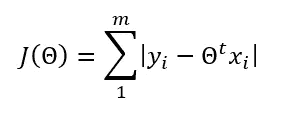

# 为什么最小二乘这么特别？

> 原文：<https://towardsdatascience.com/why-least-squares-regression-whats-with-the-l1-norm-criterion-51e8b7f905eb?source=collection_archive---------27----------------------->

## *为什么没人谈‘绝对损失’？*

在这个故事中，我们将解决为什么我们通常更喜欢最小化偏移的平方而不是它们的绝对值的问题，至于简短的回答，这主要是因为它更容易**，它更稳定**，它更强大**。******

******回想一下，对于 OLS(普通最小二乘法)，我们寻求最小化******

************

******问题是，为什么我们不把******

************

******先说我们简答的第一点。最小化前者更容易。特别是，最小化涉及平方偏移的成本函数的系数向量θ是通过一个封闭形式的表达式找到的，这也是我最近一篇文章的主题(你可以在这里查看)。)相反，对于最小化涉及绝对偏移的成本函数的系数，没有“封闭形式”。我们能做的最好的事情也许是达成一个迭代方案，它能帮助我们最终在数值上收敛到属于最佳拟合超平面的系数。******

******最小化前一个成本函数更容易的事实源于这样一个事实，即 *y = f (x)* 有一个很好的导数，即 *y' = 2f(x)。f '(x)* 与 *y' = |f(x)|f '(x) /f(x)* 那是因为 *y = |f(x)|。*对于后者，绝对值在微分后保持不变，这使得求和表达式等于零(尤其是涉及求和的情况下)变得非常重要。******

******吉菲的扎克·加利费安纳基斯反应******

******我们简短回答的第二点是稳定。两个成本函数都承诺存在一个系数向量θ，该向量在全局上最小化从超平面到数据集的偏移。这是两个函数都是凸的直接结果(有自己的证明)。******

******问题在于，涉及绝对失调的成本函数可能有点过了，因为它实际上可以提供无限数量的不同系数向量θ，所有这些向量都可以最小化成本函数。同时，对于 OLS 方法，总是有一个唯一的系数向量θ使成本函数最小化(除非数据集非常小，在这种情况下两个问题都简化为插值)。)这两个事实是从 L1 范数的
**非严格**凸性和 L2 范数的严格凸性中推导出来的，两者也都有自己的证明。******

****如果你想看到与我们的论点一致的东西，考虑为一些随机数据集绘制两个成本函数(你可以考虑拟合类似于 *y=ax* 的东西来使它变得简单)，然后根据你的数据集，你可能会看到类似这样的东西。****

********

****L1 vs L2 损失-作者图片。****

****最小值明显不同，对于平方损耗，最小值是一个唯一点，而对于 L1 损耗，最小值是无穷多个点。****

****我们简短回答中的最后一点是关于 L2 损失的回归比 L1 损失的回归在统计上更有说服力。让我们首先强调这样一个事实，即在某种意义上，两种选择都可能是真正最优的，特别是，如果我们假设误差(偏移)遵循**正态分布**，那么最小化 L2 损失与寻找最大似然估计 **(** )相一致，这主要用于统计推断。)另一方面，如果我们假设误差遵循**拉普拉斯分布**，那么最小化 L1 损失与找到最大似然估计相符。当然，这两个事实都有自己的证明。****

****下图显示了两种分布的曲线图(在 2D)。红色和蓝色分别对应正态和拉普拉斯分布。****

********

****正态分布与拉普拉斯分布-作者图片。****

****现在的问题是，我们应该相信误差服从哪个分布，即使是近似的。答案是，这通常是正态分布，因为我们通常认为误差是独立的(不以任何方式相互影响)，这使得它们随着数据集的增长而接近正态分布，这要归功于中心极限定理。事实上，你可能只听说过正态分布，因为它在现实生活中出现的频率更高。****

******原来如此？使用 L1 标准是没有意义的？答案肯定是**没有**。事实上，使用 L1 范数准则进行回归是一件真实的事情，也可以按需使用。如果你不知道，它通常也被称为最小绝对偏差(缩写为 LAD)。在一种情况下，LAD 似乎优于 OLS，特别是当数据集包含许多异常或异常值时，因为 OLS 会在尽量减少损失的同时大肆渲染这些异常或异常值，因为对它们的偏移量求平方会产生很大一部分误差，结果是一个位于实际数据集和异常值之间的超平面，如果你没有理解我在这里试图说的话，请仔细观察******

****

**小伙子对 OLS-GIF 和作者的项目。**

**此处的数据集包括左侧表格中的 8 个点，黄线(yₐ)is 归因于 LAD，白线归因于 OLS。数据集不包含任何异常值，这两条线似乎是合理的。当然除了我们每次计算时，LAD 的意见略有不同(迭代格式每次从不同的初始点开始，LAD 不保证有唯一的极小值)。**

**现在，如果我们把点(9，6)换成(9，50)会发生什么**

****

**小伙子对 OLS-GIF 和作者的项目。**

**对于 LAD 线来说没什么大不了的，同时 OLS 很容易被诱惑牺牲整个数据集，只为了离群值，这证实了 LAD 比 OLS 更健壮的事实。**

**如果您想自己尝试一下，请访问:**

 **[## 最小绝对偏差

mathemati.herokuapp.com](http://mathemati.herokuapp.com/LeastAbsoluteErrors)** 

**希望这有助于你理解为什么我们通常选择 OLS，下次再见。**

**参考资料:**

**[1]:吉菲。*https://giphy.com/gifs/reaction-BmmfETghGOPrW*扎克·加利费安纳基斯[反应](https://giphy.com/gifs/reaction-BmmfETghGOPrW)**

**[2]:维基百科。最大似然估计 https://en.wikipedia.org/wiki/Maximum_likelihood_estimation[T4](https://en.wikipedia.org/wiki/Maximum_likelihood_estimation)**

**[3]:维基百科，*最小一乘偏差*https://en.wikipedia.org/wiki/Least_absolute_deviations**

**[4]:维基百科，正态分布[https://en.wikipedia.org/wiki/Normal_distribution](https://en.wikipedia.org/wiki/Normal_distribution)**