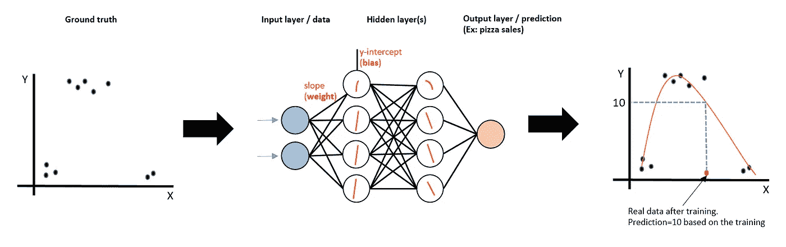
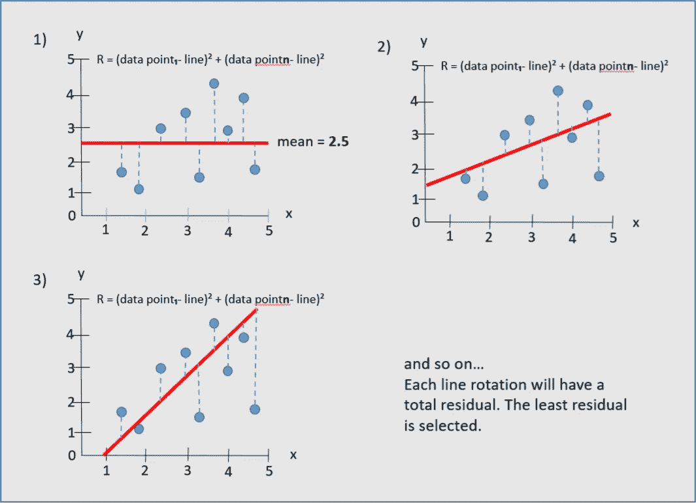
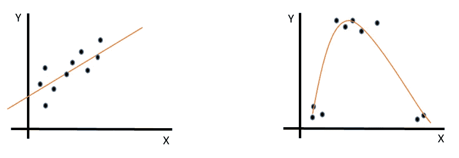

# 为什么线性回归是你所需要的

> 原文：<https://towardsdatascience.com/why-linear-regression-is-all-you-need-afb1304f8f8e?source=collection_archive---------11----------------------->

## 理解它，进入深度学习将变得不那么困难(仍然是困难，但更少)

图一。从地面真相到使用深度学习的预测。图片由作者提供。

这篇短文是为那些开始学习线性回归，并且正在进入深度学习领域的初学者写的。但是我不会在本文中深入讨论这些话题。

我的意图只是给出一个概念，为什么线性回归可以促进进入更深水域的路径。我以前写过线性回归。这里可以看[，这里](https://betterprogramming.pub/understand-basic-linear-regression-concepts-to-get-started-with-machine-learning-49e2c7a02c39)可以看[。](https://medium.com/geekculture/machine-learning-algorithm-from-scratch-4a1a48a9a355)

# *“哦，线性回归真的是机器学习吗？！.."*

这是我的想法。

我听到人们开玩笑(或半开玩笑)说[线性回归](https://betterprogramming.pub/understand-basic-linear-regression-concepts-to-get-started-with-machine-learning-49e2c7a02c39)不是机器学习。我懂了。如果你决定进入这个领域来建造你的自动驾驶汽车或机器人来清理你的房子，就像电影中一样，线性回归可能会令人失望。

但是相信我，线性回归对于获得其他更复杂主题的直觉是必不可少的。而理解逻辑回归就更好了。不要因为它的简单(相对而言)而失去动力。继续学习。

# 权重、偏见、乐观主义者——无处不在！

这条线的公式也一样！y-hat =重量*x +偏差

我开始研究神经网络和深度学习，我很庆幸我先学会了线性回归。了解基础知识真的很有帮助。

*   权重(线的斜率)
*   偏差(直线的 y 截距)
*   一个[优化器](https://medium.com/geekculture/machine-learning-algorithm-from-scratch-4a1a48a9a355)预测某个值，与实际数据(地面真实值)进行比较，并计算误差(预测值与实际数据之间的距离)。然后，算法调整权重和偏差以最小化误差。

图二。各种线的旋转表示。图片由作者提供。

***所有*这些概念也是深度学习的一部分。同样的事情也发生在神经网络中。**

简而言之，一个问题需要深度学习，因为直线可能无法覆盖，或者更好地说，很好地代表数据。一条直线不能符合下面右边的例子。

图 3。线性和非线性表示。图片由作者提供。

但核心逻辑是一样的。在神经网络中，简单地说，每个节点代表一条线。它们组合起来形成表示数据点所需的线。

图 4。从地面真相到使用深度学习的预测。图片由作者提供。

# 最后的想法

我读过关于节点、隐藏层、权重和偏差的内容，但我并不清楚所有这些东西是什么或做什么。得益于学习线性回归，我有了更清晰的认识。

神经网络还有更多的东西，它们的内部工作可能会变得非常复杂。

有没有尝试过跟随语言翻译器(encoder-decoder/seq2seq)或者 word2vec 算法的实现？试一试，你就知道了。

我的目标是在深度学习主题上覆盖更多内容。不同的激活功能，RNNs 到 LSTM 和 GRUs 到 seq2seq 到 seq2seq 的演变，注意变压器。用于图像识别的卷积网络等等。

暂时就这样。感谢阅读。