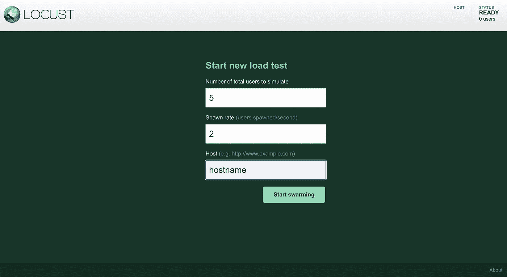

# 为什么负载测试对于将您的 ML 应用程序投入生产至关重要

> 原文：<https://towardsdatascience.com/why-load-testing-is-essential-to-take-your-ml-app-to-production-faab0df1c4e1?source=collection_archive---------25----------------------->

## [行业笔记](https://towardsdatascience.com/tagged/notes-from-industry)

## 使用 Locust 对 Flask ML 应用程序进行负载测试

图片来自 [Unsplash](https://unsplash.com/photos/2JDDn7iSGH8)

随着我继续在数据科学、人工智能、人工智能的世界里航行，无论你想叫它什么，我继续发现越来越多的术语，这些术语最初是我害怕涉足的。正如我在[之前的一篇文章](/transitioning-from-pre-health-to-a-career-in-data-science-tech-2c3b61a57bf5)中提到的，我来自一个非技术背景的人，经常把关键的软件术语，比如“[测试](https://www.geeksforgeeks.org/types-software-testing/)”藏在心底。在获得了更多构建由 ML 驱动的应用程序的经验后，我明白了一种特殊形式的测试的必要性，这种测试被称为 [**【负载测试】**](http://tryqa.com/what-is-load-testing-in-software/) ，也被称为性能测试。负载测试是一种模拟或测试应用程序预期流量的方式。在 Flask 服务器上抛出一个端点并期望它保持运行是很容易的，但是在现实中，顺序测试一个**端点**并不能显示关于**端点性能**的真实情况。这就是为什么我们将使用一个名为[**Locust**](https://locust.io/)**的开源 Python 工具来**模拟我们的端点的**多个**并发用户**，看看它如何保持明智的性能。这种类型的测试对于理解您可能需要对您的**项目/软件**进行的**优化**所带来的变化以及关于**成本节约**以正确利用您正在使用的服务器是至关重要的。**

**在本文中，我们将构建一个基本的 ML powered Flask 应用程序，但我们不会太关注这些步骤，因为它主要是测试我们用应用程序创建的端点。**

# **目录**

1.  **构建烧瓶应用程序和 ML 模型**
2.  **创建蝗虫脚本**
3.  **模拟用户**
4.  **整个代码和结论**

# **构建烧瓶应用程序和 ML 模型**

**在我们开始负载测试之前，我们必须创建我们的模型，并在一个简单的 Flask 应用程序上进行推理。对于我们的模型，我们将使用一个回归数据集，使用随机森林模型来预测[汽油消耗量](https://www.kaggle.com/harinir/petrol-consumption)。下面的代码有助于将我们的模型训练和部署成一种 Flask 可以加载和处理的推断格式。**

**模型结构**

**现在我们已经建立了模型，我们可以使用 Flask 服务器来使这个模型可用于推理。**

**Flask 服务器**

**我们的模型现在可以在我们的服务器上的**/预测**路径下进行推理。为了确保我们的端点正常工作，我们创建了另一个文件，并使用[请求](https://docs.python-requests.org/en/master/)库来测试推断。在这种情况下，使用另一个工具如 [Postman](https://learning.postman.com/docs/designing-and-developing-your-api/mocking-data/mocking-with-examples/) 也是可行的。**

**测试 API**

**要测试这个脚本，请确保您的 flask 服务器已经安装了 **flask，运行**并执行 API 测试脚本来查看模型结果。**

****

**API 测试结果(作者截图)**

**现在，我们已经有了为推理加载的模型的 API，并且我们准备好开始用 Locust 进行负载测试。如果您想了解更多关于在 Flask 上部署 ML 模型的知识，请查看这篇很棒的文章，它专门围绕这个主题。**

# **创建蝗虫脚本**

**如前所述，Locust 帮助模拟同时拥有许多用户，您可以在您的 **locustfile.py** 中定义一个**任务**来执行这个模拟。任务是 locust 中的关键特性，每次我们开始负载测试时，都会为用户创建一个我们创建的类的实例，它们执行 Python 脚本中定义的任务。**

**导入和设置**

**首先，我们从 Locust 导入必要的模块，然后创建一个类，该类将包含我们用于模拟的主要功能。继承 HttpUser **使**用户能够**处理我们想要加载测试的 HTTP 请求**，比如我们例子中的端点。**

**在我们班里**

**在执行任何 Locust 任务之前调用 On_Start，当用户停止执行任务时调用 On_Stop。现在我们创建一个任务，将模拟数据发布到我们的 API。**

**发布模拟数据进行模拟**

**我们现在已经准备好测试我们的简单的 Locust 脚本，为了学习更多关于 Locust 的知识并开始使用您自己的脚本，请查看他们的文档[这里](https://docs.locust.io/en/stable/quickstart.html)。**

# **模拟用户**

**随着我们所有的资源准备就绪，我们现在终于可以看到蝗虫在行动，并查看它提供的一些指标。确保您的 flask 服务器已经启动，要运行我们的 locust 文件，只需在终端中键入 **locust** 。如果您的 locust 脚本没有命名为 locustfile.py，确保使用 **locust -f filename.py** 指向它。**

****

**作者截图**

**您应该到达如下屏幕，对于主机，您通常应该输入您正在使用的实际 IP。点击开始，你会看到蝗虫在行动。**

****

**作者截图**

****

**RPS(作者截图)**

****

**响应时间(作者截图)**

**在您的终端中单击 stop 之后，您应该会看到一些通用的统计数据，您也可以将其下载为 csv 文件，以运行进一步的分析或可视化。**

****

**综合统计(作者截图)**

**我们看到，Locust 跟踪各种指标，如**请求/秒**、**平均吞吐量**、**响应时间**，以及**端到端延迟**的**百分点**。在浏览文档时，您可以使用更高级的 Locust 功能，下载这些统计数据来运行您自己的函数或服务，以确定您的应用程序的限制，或者当您接近某个延迟或吞吐量阈值时，您不希望越过该阈值。**

# **整个代码和结论**

**<https://github.com/RamVegiraju/Locust-ML>  

要访问该应用程序的完整代码，请查看上面的链接。Locust 是一种非常干净的方法，可以帮助您以高效而简单的方式对应用程序进行负载测试。关于负载/性能测试，还有许多其他的软件或方法，但是我只想强调负载测试在将你的应用提升到生产水平时的普遍重要性。从**节约成本**到**优化**您的**资源**，负载测试对于了解您的端点实际上如何应对您在实时场景中预期的流量至关重要。

我希望这篇文章是对蝗虫和负载测试的一个很好的介绍。请随时在 LinkedIn 上与我联系，或者在 Medium 上关注我，了解我更多的写作内容。分享任何想法或反馈，谢谢阅读！**