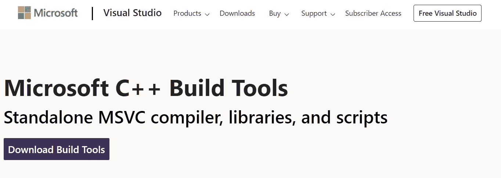
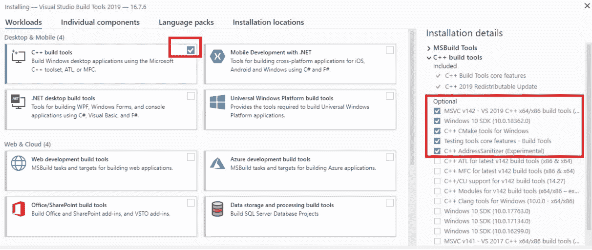

# 为什么 Matplotlib 不能安装在 Visual Studio 代码中

> 原文：<https://towardsdatascience.com/why-matplotlib-cant-be-installed-in-visual-studio-code-cb1261c822ad?source=collection_archive---------4----------------------->

## 因为有了 MVC++构建工具


作者制作的图片

我们知道“Matplotlib 是一个用于在 Python 中创建静态、动画和交互式可视化的综合库”。如果允许安装 Anaconda，通常使用 Matplotlib 没有问题。但是最近 Anaconda 为商业用户更新了服务条款。详细信息解释如下:

> “为了应对过去几年商业用户对 Python 和 Anaconda 的使用和采用的急剧增加，我们更新了我们的[服务条款](https://www.anaconda.com/terms-of-service)。展望未来，我们要求依赖我们的包装&分销工作到**的**商业用户**购买**我们的商业产品之一。”—[https://www . anaconda . com/blog/anaconda-commercial-edition-FAQ](https://www.anaconda.com/blog/anaconda-commercial-edition-faq)

如果公司还没有准备好为 Anaconda 付费，一些工程师可能会转向 VS Code。

在 python 可以在 VSC 正常运行之前，有一些设置会困扰用户。大部分都是要求你安装库的错误，像“导入错误:没有名为 numpy 的模块”，可以通过“pip”或“pip3”或“python pip”或“python3 -m pip”等命令解决。来解决。

但是今天，我想把重点放在 Matplotlib 问题上，这个问题可能不能仅仅通过 pip 命令来解决。

万一:

1.  你有一个视窗系统
2.  您的电脑上没有安装 Anaconda
3.  Python 扩展已在 VSC 安装
4.  解释器(在 VSC 的左下角)选择正确
5.  **没有安装 visual studio 构建工具**(你可能也不知道为什么你需要它，直到问题发生，一个工程师(比如机械工程师)写 python 代码。

现在我们来举个例子。

尝试测试以下 py 文件:standardplot.py:

```
import numpy as np
import matplotlib.pyplot as pltx = np.linspace(0, 20, 100)  # Create a list of evenly-spaced numbers over the rangeplt.plot(x, np.sin(x))       # Plot the sine of each x pointplt.show()                   # Display the plot
```

**你是否得到了下图的美丽身材:**


**还是你得到了错误？像下面:**

```
Import Error: No module named numpy
```

谷歌一下，解决方案可能是:

```
pip install numpy
or 
pip3 install numpy
or
python3 -m pip install numpy
or
python3 -m pip install numpy
```

类似的问题如“没有 sklean 的模块”可以用类似的解决方案来解决。

再次运行它，现在 NumPy，**没有问题，但是可能会有一个错误，如**:

```
ERROR: Command errored out with exit status 1:
...... error: Microsoft Visual C++ 14.0 or greater is required. Get it with "Microsoft C++ Build Tools": [https://visualstudio.microsoft.com/visual-cpp-build-tools/](https://visualstudio.microsoft.com/visual-cpp-build-tools/)
```

这是因为您的计算机上没有安装 Microsoft C++Build Tools。为了在 Microsoft for Python 中运行 matplotlib 或类似的交互式界面，需要构建工具，而不仅仅是 Microsoft C++可再发行版。

**如何:**

单击链接，它会将您带到下面的窗口:



下载构建工具，运行。exe 文件，在安装过程中使用如下的 C++编译工具。一定要选择正确的物品。



图片来自[这个网站](https://docs.microsoft.com/en-us/answers/questions/136595/error-microsoft-visual-c-140-or-greater-is-require.html)

这需要一点时间，在这个过程中喝水或走动。:-)

如果构建工具安装正确，现在以正常方式安装 Matplotlib。

运行 py 文件，你会得到如上的美丽图形。

**外卖:**

1.  我写这个故事是因为当我搜索解决方案时，大多数人提到安装它，但很少有人提到这个案例。是的，这可能是一种罕见的情况(想想 Anaconda 无法安装…)，但当它发生时，可能需要您花时间来解决它。希望这能让你想起这个案子。
2.  Microsoft Visual C++ build tool 是在 VSC 用 python 运行 Matplotlib 的先决条件的可能原因，我在下面找到了一个解释，但如果我错了，请随时纠正我。

> Windows Python 需要通过 SDK 安装 Visual C++库来构建代码，比如通过`setuptools.extension.Extension`或`numpy.distutils.core.Extension`。例如，使用 Python 在 Windows 中构建`[f2py](https://www.scivision.dev/tags/f2py)`模块需要安装如上所述的 Visual C++ SDK。在 Linux 和 Mac 上，C++库随编译器一起安装。-[https://www . scivision . dev/python-windows-visual-c-14-required/](https://www.scivision.dev/python-windows-visual-c-14-required/)

谢谢你的时间。希望有助于解决你在 VSC 的 Matplotlib 问题。