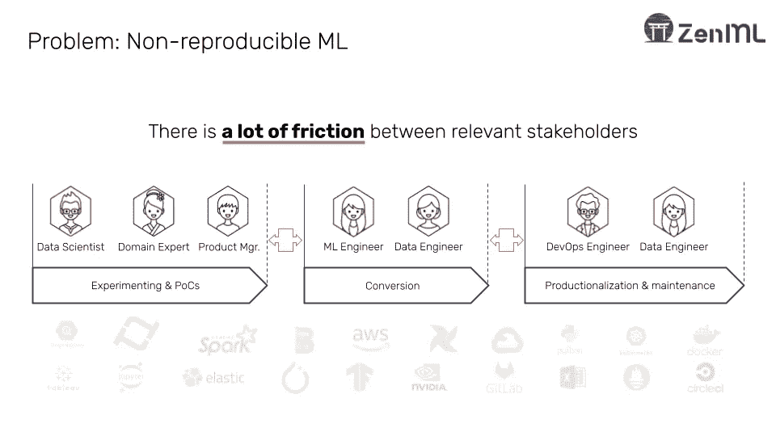
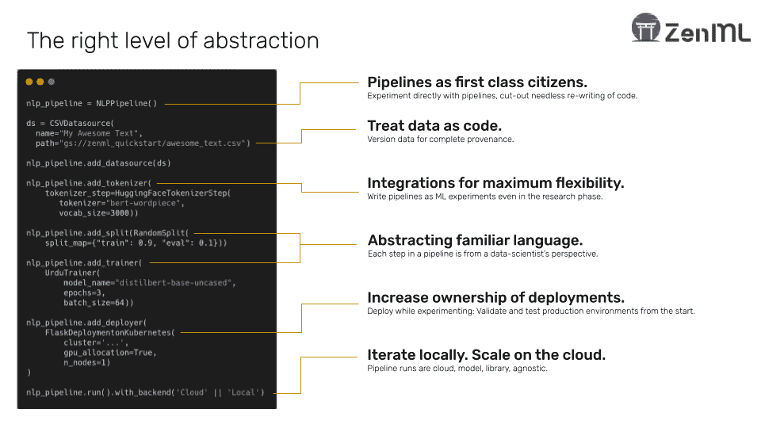
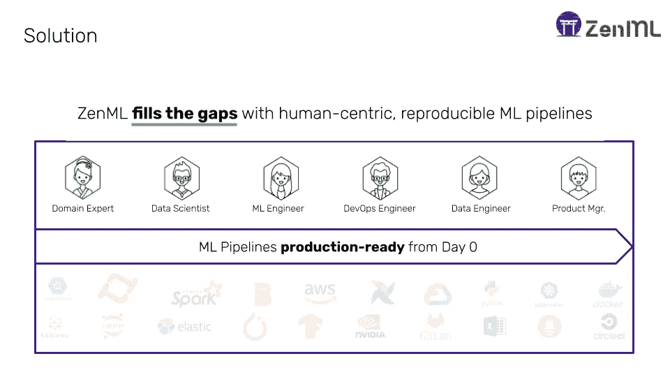

# 为什么 ML 应该从一开始就写成管道

> 原文：<https://towardsdatascience.com/why-ml-should-be-written-as-pipelines-from-the-get-go-b2d95003f998?source=collection_archive---------14----------------------->

## MLOps

## 通过迭代、可复制的管道消除技术债务

照片由[EJ·斯特拉特](https://unsplash.com/@xoforoct?utm_source=medium&utm_medium=referral)在 [Unsplash](https://unsplash.com?utm_source=medium&utm_medium=referral) 上拍摄

今天，机器学习为世界上最有价值的 1%的组织(FB、ALPH、AMZ 等)提供动力。然而，99%的企业努力生产 ML，即使拥有超特定数据集和卓越的数据科学部门。

更深入地研究 ML 如何在组织中传播会更深入地揭示这个问题。下图显示了机器学习的典型设置的公认简化表示:

图 1:为什么很难复制 ML 模型

上述过程有三个阶段:

## 实验和概念验证:

*   **技术** : Jupyter 笔记本、Python 脚本、实验跟踪工具、数据探索工具
*   **角色**:数据科学家
*   **描述**:快速科学的实验定义了这个阶段。该团队希望尽快增加他们对数据和机器学习目标的理解。

## 转换:

*   **技术** : ETL 流水线工具，如 Airflow
*   **角色**:数据工程师
*   **描述**:将最终实验转化为自动化的、可重复的过程是本规范的目的。有时这在下一阶段之前开始，有时在下一阶段之后，但本质是相同的——从数据科学家那里获取代码，并尝试将它们放入某种形式的自动化框架中。

## 生产和维护:

*   **技术** : Flask/FastAPI，Kubernetes，Docker， [Cortex](http://cortex.dev/) ， [Seldon](https://www.seldon.io/)
*   **角色** : ML 工程师/运营
*   **描述**:这是从模型部署开始的阶段，跨越监控、再培训和维护。这一阶段的核心重点是保持模型健康，并在任何规模下提供服务，同时考虑漂移。

每个阶段都需要不同的技能、工具和组织。所以，一个组织一路走来能碰到的坑坑洼洼也是理所当然的。不可避免的是，下游重要的东西在早期阶段没有被考虑。例如，如果培训与部署策略相分离，那么这在生产场景中就永远不会有好的表现——导致不一致、无声的失败以及最终失败的模型部署。

# 解决方案

查看上面图 1 中的多阶段过程，简单地减少所涉及的步骤并因此消除它们之间存在的摩擦似乎是显而易见的。然而，考虑到每个步骤的不同需求和技能，这说起来容易做起来难。数据科学家没有被训练或装备来勤奋地关心生产概念，如再现性——他们被训练来迭代和实验。他们并不真正关心代码质量，考虑到速度和开销之间的权衡，在早期过分努力地执行这些标准可能不符合公司的最佳利益。

因此，我们需要的是一个框架的实现，它是**灵活的，但是从一开始就执行生产标准**。实现这一点的一种非常自然的方式是通过某种形式的管道框架，该框架公开了一种在受控环境中运行 ML 实验的自动化、标准化的方式。ML 本质上是一个过程，可以分解为单独的具体步骤(如预处理、训练、评估等)，因此管道是一个很好的解决方案。至关重要的是，通过在早期阶段标准化这些管道的开发，组织可以通过多种工具和步骤减少 ML 模型的破坏/重建周期，并加快从研究到部署的速度。

如果一个组织能够激励他们的数据科学家购买这样一个框架，**，那么他们就已经赢得了生产化之战的一半。然而，真正的问题在于细节——如何在一个足够健壮的框架中为数据科学家提供他们进行实验所需的灵活性，以便一直应用到生产中？**

# 寻找正确抽象的练习

从一开始就有了在管道中写作的动机，公平地说，我给出了关于如何实现这一点的框架的更具体的例子。然而，在我看来，目前的工具领域被分割成了许多框架，这些框架要么是为 ML 人员设计的 ML 工具，要么是为 Ops 人员设计的 Ops 工具，并没有真正满足我在上一节提到的所有要求。缺少的是一个面向 ML 人员的 Ops(读取管道)工具，带有适合数据科学家的高阶抽象。

为了理解这一点的重要性，我们可以看看 web 开发是如何从基于 PHP/JQuery 的原始脚本(web 开发的 Jupyter 笔记本)和 LAMP 堆栈发展到今天强大的基于 React/Angular/Vue 的现代 web 开发堆栈的。看看这些现代框架，它们的成功是由提供更高阶的抽象决定的，这些抽象更容易被更多的受众消费和消化。它们没有改变底层 web 技术工作的基本原理。他们只是以一种更容易被更多的观众理解和接受的方式改变了它的用途。具体来说，通过将*组件*作为一等公民提供，这些框架引入了一种分解、利用和重新共享为现代网络提供动力的 HTML 和 Javascript 的新机制。然而，ML(Ops)并没有相应的动作来找出正确的抽象顺序，以达到类似的效果。

为了展示我上面更抽象的想法的一个更具体的例子，我将使用 [ZenML](https://github.com/maiot-io/zenml) ，一个开源的 MLOps 框架来创建迭代的、可复制的管道。

> 声明:我是 ZenML 的核心维护者之一。

ZenML 是一个为 ML 寻找正确抽象层的练习。在这里，我们将*管道视为一等公民。*这意味着数据科学家直接接触框架中的管道，但与来自 ETL 空间的数据管道的方式不同( [Prefect](https://www.prefect.io/) 、 [Airflow](https://airflow.apache.org/) 等)。管道被视为*实验—* 意味着它们可以被直接比较和分析。只有到了转向生产化的时候，它们才能转换成经典的数据管道。

图 2: ZenML 用熟悉的语言抽象管道来增加模型部署的所有权。

管道中有步骤，这些步骤是用数据科学家熟悉的 ML 语言抽象出来的。例如有`TokenizerStep`、`TrainerStep`、`EvaluatorStep`等等。比将脚本插入某种形式的 orchestrator 包装器更容易理解的范例。

每个管道运行都会跟踪元数据和参数，并且可以与其他运行进行比较。每个管道的数据在流经时都会自动进行版本控制和跟踪。每次运行都链接到 git 提交，并编译成一个易于阅读的 YAML 文件，该文件可以选择性地编译成其他 DSL，例如 Airflow 或 Kubeflow 管道。这对于满足价值链中的数据工程师和 ML 工程师等其他利益相关者是必要的。

此外，为各个步骤公开的接口大多是以一种易于以幂等方式扩展的方式设置的，因此也是一种分布式方式。因此，当数据科学家处理更大的数据集时，他们可以使用不同的处理后端(如数据流/火花)进行横向扩展。

总而言之，ZenML 试图达到以下场景:

图 3: ZenML 统一了 ML 过程。

当然，ZenML 并不是实现上述目标的唯一机制——许多公司构建了自己的抽象框架来解决他们的特定需求。通常这些都是建立在我上面提到的一些其他工具之上的。不管如何实现，目标应该是明确的:让数据科学家**尽可能接近生产**并尽可能减少摩擦，激励他们在部署后增加对模型的所有权。

这是一个双赢的局面，对于任何一个将 ML 作为业务增长核心驱动力的组织来说都是一个巨大的胜利。

# 插头

如果你喜欢这里的想法，我们很乐意听到你对 ZenML 的反馈。这是[开源](https://github.com/maiot-io/zenml)，我们正在寻找早期采用者和[贡献者](https://github.com/maiot-io/zenml)！如果您发现这是适合您/您的数据科学家的抽象顺序，那么也请通过我们的 [Slack](http://zenml.io/slack-invite) 告诉我们，期待您的回复！