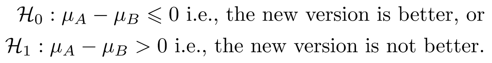
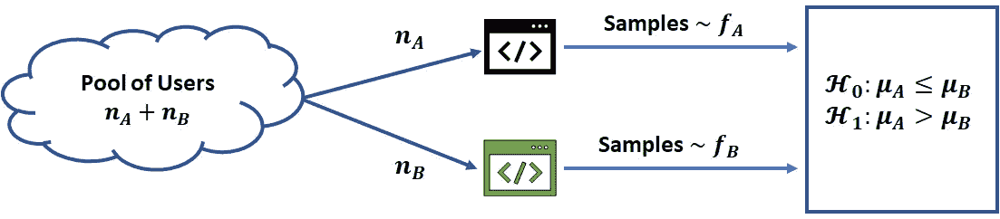
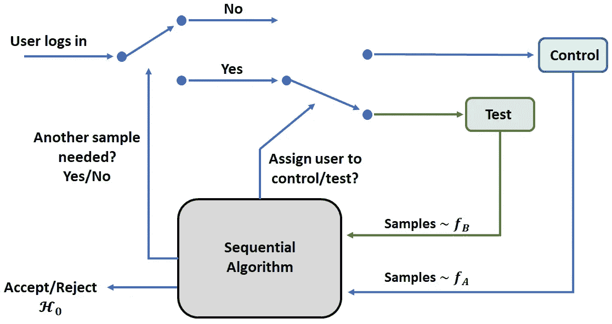
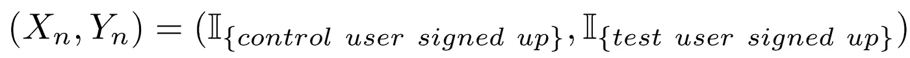
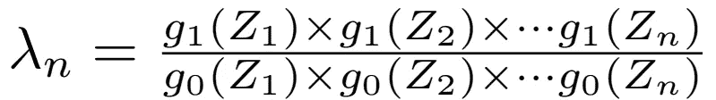

# 为什么大多数 A/B 测试效率不高

> 原文：<https://towardsdatascience.com/why-most-a-b-tests-are-not-efficient-11b289414191?source=collection_archive---------19----------------------->

## [行业笔记](https://towardsdatascience.com/tagged/notes-from-industry)

## 揭开纯粹探索的神秘面纱(第 0 部分)

A/B 测试有许多应用领域，例如药物测试。(图片由[在](https://unsplash.com/@thisisengineering?utm_source=medium&utm_medium=referral) [Unsplash](https://unsplash.com?utm_source=medium&utm_medium=referral) 上拍摄)

几十年来，A/B 测试一直是统计学的支柱，成为整个受控随机测试体系的基石，这是最神圣的科学确证技术。鉴于这个网站上关于这个主题的文章太多了，我认为没有必要让读者相信 A/B 测试的重要性，或者就此而言，参考这种技术似乎找到了自己的方式的不断扩展的应用领域列表。然而，A/B 测试的一个重要方面
却很少受到关注，这篇文章的目的就是填补这个空白。

# 快速总结 A/B 测试。

目前执行的基本程序本身非常简单。
以网站优化为例。一家公司希望推出其网站的新版本，希望新版本能比旧版本更好地影响用户注册该公司的服务。用户被分成两组，*控制*组(A 组)和*测试*组(B 组),分别展示新旧版本。每个用户，无论注册与否，都被假定提供一些关于他们所看到的网页版本质量的嘈杂反馈。通过两个概率密度(或质量函数，视情况而定)fA 和 fB，用平均值 A 和 b 对这种有噪声的反馈进行建模。然后，每组中的注册百分比指示哪个版本是优选的。从统计学上来说，这可以归结为使用噪声样本来测试以下哪个假设是正确的

**(图片作者)**

也可以通过用τ代替上面不等式中的 0 来测试所选的容差τ > 0。如下图所示，行业中最常用的方法包括

*   利用经典统计学预先求出用户的数量 nA 和 nB(我从现在开始用通称“样本”代替“用户”)，
*   进行测试，以及
*   做决定。

**进行 A/B 测试的传统方式。(图片由作者提供)**

听起来不错，不是吗？嗯，不完全是。虽然这个过程在科学上是正确的，但这不是本文的重点。如标题所示，其目的是通过向读者介绍更现代、更复杂的测试假设的方法来帮助提高 A/B 测试的效率。

什么意义上的高效？考虑测试消耗的样本数，即 N = (nA + nB)项。这个数字称为*样本大小*，由几个因素决定，如噪声方差和设计者认为可接受的【I 型，II 型】误差范围。请注意，在上面的过程中，所有与采样相关的决定都是在实验开始之前做出的*。具体来说，没有利用输入数据提供的越来越清晰来帮助决策的概念。即使使用了可能的最佳样本量估计，我现在也将论证为什么在许多情况下，*可以证明这是*次优的。自然，另一种选择是让数据本身决定取多少样本。换句话说，把 A/B 测试*转到在线*。*

# 顺序统计

允许基于输入数据做出决策的数学方法，因此，其样本大小不是预先固定的，被称为序列统计学。取而代之的是，对输入的数据进行逐个样本的分析，当收集到“足够”的证据支持某个假设时，预定义的停止规则会停止进一步的数据收集。因此，通常的网页优化 A/B 测试的顺序版本对进入的用户流起作用，并且包括

*   一个*采样规则*将一个进入的用户分配到控制组或测试组(这里是网页版本)，
*   一个*停止规则*，以及
*   基于可用证据接受/拒绝 H0 的*决策规则*。

**顺序测试可以提供高达 4 倍的速度！(图片由作者提供)**

# 说明性示例

在进一步讨论之前，让我们先用一个简单的例子来证明顺序测试的优越性。对于给定水平的 I 型和 II 型错误，最有效的序贯检验之一是亚伯拉罕·瓦尔德的**序贯概率比检验** (SPRT)。与我们的网页示例保持一致，这个测试如下进行。

为简单起见，假设 A < µB and that we know fA and fB up to a permutation, i.e., we are only trying to find which of the two webpages generates sign up samples from fA and which from fB: Let f0 = fA ⊗ fB
代表对照网页并不比测试网页更好的情况，f1 = fB ⊗ fA，相反的情况。预先选择两个阈值 L0 和 L1 (0 < L0 < 1 < L1 ),并使用以下

## 1.采样规则:

*   进入的用户流被分成成对的流，并且每对中的用户被随机分配到两个网页中的一个。
*   第 n 对的反应被记录为样本二元组

**(图片作者)**

*   定义 Zn = Xn — Yn，设 g0，g1 分别是 Zn 在 f0 和 f1 下的分布。

## 2.停止规则:

直到时间 n 的累积似然比，由下式给出

**(图片作者)**

并与阈值进行比较。如果任一λn < L0 or λn > L1，测试停止。否则，对 n + 1 对重复测试。

## 3.决策规则:

如果λn < L0 accept H0 and if λn > L1 拒绝 H0。

当 fA N(A；σ)和 fB≡N(B；σ)，这在许多自然应用中是正确的，可以表明 SPRT 的平均样本量约为(2σ )/( A- B)。另一方面，普通的 A/B 测试需要大约(8σ )/( A- B)个样本。因此，顺序程序代表着效率提高了 4 倍！

上面的例子虽然很能说明问题，但并不完全符合实际情况，因为一般来说，平均值 A 和 B 是未知的。在文献中，这个例子是一个更一般的(序列)统计结构的特例，称为**双臂土匪**。具体来说，它属于一类被称为“最佳手臂识别”的问题，或称**纯探索**。这篇文章的目的是激起读者的兴趣，在本系列的后续部分，我们将更详细地讨论
当前背景下的多股武装匪徒。

从多臂强盗(MAB)的角度进行 A/B 测试有几个优点。

*   纯探索的 MAB 算法不需要手段的知识。
*   如果需要同时测试多个(3 个或更多)假设，该怎么办？在我们的例子中，公司可能想在几个网页版本中找到最好的。MAB 算法可以轻松处理这种
    情况。
*   正如我们将要看到的，纯探索分析对样本量有非常严格的限制，因此，可以显著地提高这种检验的效率。

# 结束语

我希望我已经说服了读者需要更详细地理解最佳 Arm 标识。在本系列的下一部分，我们将设计并分析一个非常简单的纯探索算法(不，是*不是*汤普森采样)。我们将一点一点地检查这个算法的样本大小的表达式，并看到它包含了与自然现象相关的重要因素，这些自然现象是随机过程理论的核心。

值得注意的是，在过去的三十年里，纯探索领域的许多研究都受到了这些因素的影响。因此，对它们的含义以及它们是否可以避免的讨论将构成本系列的结论部分。

(注:参考资料将在第 2 部分末尾提供。)