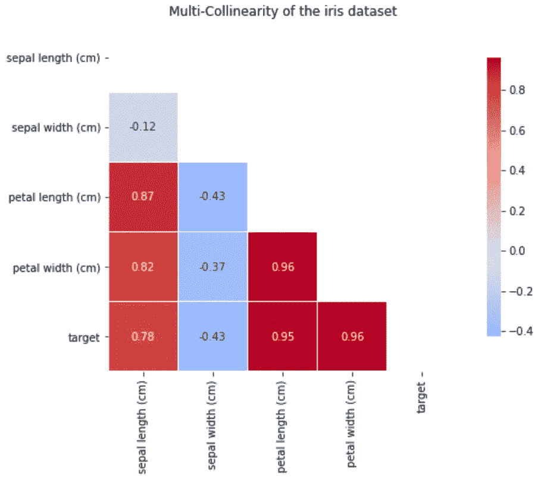
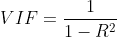
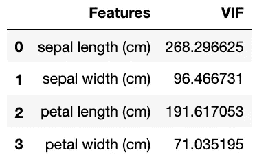
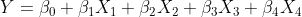
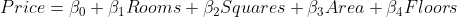
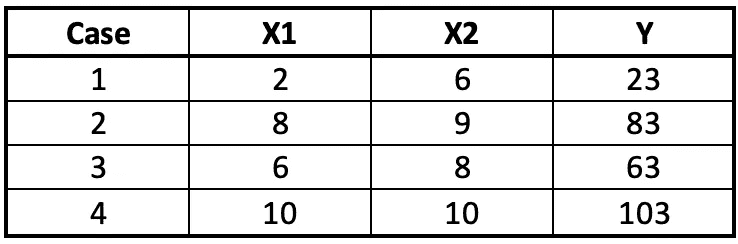
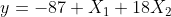
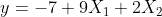

# 为什么多重共线性不是机器学习中的问题

> 原文：<https://towardsdatascience.com/why-multicollinearity-isnt-an-issue-in-machine-learning-5c9aa2f1a83a?source=collection_archive---------12----------------------->

## 多重共线性的处理取决于分析的目的。学会区分模型解释和预测将影响数据准备步骤。

由作者编辑的 [Unsplash](https://unsplash.com/photos/ukzHlkoz1IE) 上的 [Austin Chan](https://unsplash.com/@austinchan) 照片

H 阿文在哥本哈根商学院教了三年统计学，我已经非常习惯于解释多元线性回归的模型假设(如果你需要重述的话，[)。简单线性回归和多元线性回归在假设上的唯一区别是多重共线性的问题。](https://statistics.laerd.com/spss-tutorials/multiple-regression-using-spss-statistics.php)

我教我的学生如何检查这个假设，如何处理它，但是突然一个教授告诉我忽略它。本文将概述他的回答，并通知您何时注意多重共线性的可能性。

## **什么是多重共线性？**

当特征之间高度相关时，我们通常说存在多重共线性或相互关联的问题。有多种方法可以检测多重共线性。一种方法是使用如下所示的相关矩阵:

*作者图片*

该矩阵清楚地显示了花瓣长度(cm)和花瓣宽度(cm)之间的高度相关性。发现多重共线性的另一种方法是计算方差膨胀因子(VIF ),经验法则是 VIF 不应高于 10:

作者图片

我们显然发现了数据集中的多重共线性，但是我们应该处理它吗？看情况！

## 模型解释

向学生介绍统计学目标通常是模型解释。换句话说，目标是了解当自变量(也称为特征)之一发生变化时，目标变量(也称为因变量)的影响或变化。例如，我们有下面的等式(为了简单起见，忽略误差分量):

我们可以通过假设我们正在计算一所房子的价格来使它更加相关，我假设这取决于房间的数量、平方、基底面积和楼层的数量:

通过计算参数估计值(β系数),我们可以了解房价和独立变量之间的关系。假设正方形的数量独立于其他变量，增加将意味着房子的价格将增加β2。

假设我们有由房间数和楼层数之间的强相关性引起的多重共线性，不调整或处理多重共线性将导致错误的参数估计，并破坏要素的统计显著性。在这种情况下，我将不得不移除一个独立变量，以便获得更可靠的估计值(为了更直观地展示效果[，请单击此处](https://medium.com/analytics-vidhya/what-is-multicollinearity-and-how-to-remove-it-413c419de2f))。

多重共线性的一个典型示例是某个要素的所有名义类别都包含在回归模型中。通过排除一个类，我可以用它作为解释参数估计的基线，同时避免多重共线性。

## 模型预测法

当数据准备的目标是预测而不是解释时，我们会发现自己处于另一种情况。这一点在考特纳(2005)的《应用线性统计模型*一书中有所概述:*

> 事实上，一些或所有的预测变量之间是相互关联的，这通常不会抑制我们获得良好拟合的能力，也不会影响对新观察结果的平均反应或预测的推断。

要了解为什么会出现这种情况，让我们假设有以下数据集:

作者图片

两个独立变量 X1 和 X2 完全相关。这通常意味着不可靠的参数估计，但是让我们从给定的数据着手，并拟合一个多元线性回归模型。第一个等式可能如下:

该方程完全符合数据，但另一个很好的拟合将是下面的(尝试插入表格中的数字并自己查看):

第一个等式表示 X2 对目标变量有很大影响，而第二个等式则讲述了一个完全不同的故事。这意味着，只要我们不开始解释参数估计，我们就可以很容易地拥有完全符合数据的模型，甚至可以用它们进行预测。

换句话说，在为以预测为目标的机器学习上下文准备数据集时，您不必删除任何列。

文章中图表的代码:

我希望你像我喜欢写这篇文章一样喜欢它。如果你理解我的代码有任何困难，请留下评论。数据科学社区给了我很多，所以我总是乐于回馈。

请随时在 [Linkedin](https://www.linkedin.com/in/tarekghanoum/) 上与我联系，并在 Medium 上关注我以接收更多文章。