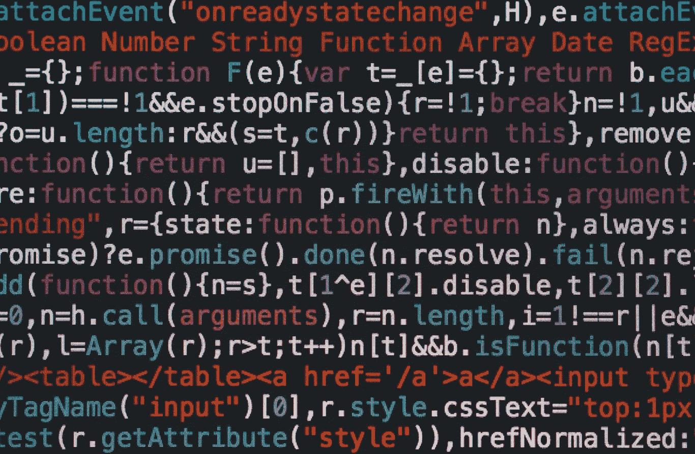

# 为什么多重分派是我最喜欢的编程方式

> 原文：<https://towardsdatascience.com/why-multiple-dispatch-is-my-favorite-way-to-program-786bf78f4878?source=collection_archive---------10----------------------->

## 多种调度的优势概述，以及我为什么这么喜欢它。



([https://unsplash.com/photos/cvBBO4PzWPg](https://unsplash.com/photos/cvBBO4PzWPg)

# 简介—一些历史

Julia 语言是一项令人难以置信的技术壮举，自 2008 年以来一直在进行中，并在过去几年中真正取得了进展。这种语言以其独特的范式和编程风格令人兴奋、面向科学，并且使用起来很有趣。要理解 Julia 编程语言，您需要理解多重分派。

多重分派是一个基于参数多态性的通用编程概念。一般来说，多态性有趣的地方在于，它通常是声明式和函数式编程的一种品质，但是这种品质本身似乎在其他编程范例中有更好的描述。多重分派是 Julia 编程语言的支柱，但这肯定不是编程概念的起源。多重分派的编程概念实际上最早是在 48 年前的 1973 年提出的！第一个实现是用一种叫做 ML 的小语言实现的，这种语言是由爱丁堡大学的 Robert Milner 和其他同事发明的。

这种语言与我们今天使用的许多高级编程和脚本语言非常相似。ML 和许多更具声明性的现代语言之间的最大区别是 ML 也是一种非常命令式的语言，当你考虑到这种语言也是函数式的时，这似乎有点奇怪。从 70 年代中期开始，许多语言实际上都遵循这种语调，我认为这是一个有趣的观察。我们总是称赞 C++真正发明了泛型的概念，但是在 70 年代出现了如此多的多范例语言，以至于几乎不可能跟踪它们。

# 什么是多重派遣？

多重分派是一个编程概念，它允许程序员多次编写一个函数来处理不同的类型。许多程序员倾向于远离函数式编程范式，因为它具有全局范围。这是可以理解的，让一切全球化，尤其是像 Julia 这样的出口，可能会很成问题。这主要是因为命名。实际上，很久以前我写过一篇关于 Julia 语言中的名称空间的文章，在那里我讨论了为什么一个类似于 C++的名称空间的实现可以减轻这个问题。我认为这是一个有趣的阅读，如果你想看看你可以在这里:

[](/julias-big-problem-with-namespace-996d2e9ed71e) [## Julia 关于名称空间的大问题

### 作为一名 Julia 开发者，这是一个可能会影响你的重大问题。

towardsdatascience.com](/julias-big-problem-with-namespace-996d2e9ed71e) 

这个问题在函数中尤其普遍。这是因为 Julia 不是一种面向对象的语言，因此没有一个真正的类作用域，我们可以使用它来使函数私有，以便处理特定的类型，我们只是编写方法来将我们的类型放入全局作用域中。这意味着很多时候我们可能有名字完全不同的方法，却做着完全相同的事情。当然，在朱丽亚身上完全不是这样，之所以不是这样，是因为多次派遣。

多重分派是一种我们可以将函数调用作为类型属性来应用的方式。换句话说，我们可以一次又一次地重新定义同一个函数，但只是计划不同的类型通过它，以便从本质上重新创建方法来处理新的类型。考虑下面的例子。

```
x = [1, 2, 3, 4, 5]
y = 5
function add_5(x)
    x + 5end
```

上面的函数给作为 x 传递的参数加了 5，对于这个例子，我们只能通过这个函数传递 y。如果我们试图通过这个函数传递 x，我们会很快意识到没有匹配+(Array，Int64)的方法。这当然是因为我们没有办法把一个整数加到数组中。我们也不想草率地用另一个名字写另一个函数，就像这样:

```
function add_5_array(x)
     [x += 5 for x in array]
end
```

那太荒谬了。幸运的是，多重分派正是为了解决这个问题而产生的。使用 dispatch，我们可以将一个类型转换为这两个函数的参数，当该类型通过函数传递时，只有该特定类型的函数才会运行。

```
function add_5(x::Array)
     [x += 5 for x in array]
endfunction add_5(x::Int64)
    x + 5end
```

现在我们可以毫无顾虑地让 x 和 y 通过这里。

# 朱莉娅的现代调度

multiple 的 Julian 实现类似于典型的 multiple dispatch，但是使用了类固醇。我们不仅获得了能够在一行中非常快速地调用多个分派的额外好处，就像我们在用 Python 编写 lambda 表达式一样，我们还可以选择以两种方式交替编写函数。此外，朱莉娅有更多的锦囊妙计，使多重调度更好。

给 Julia 的调度增加美感的第一件事是创建子类型的能力。在 Julia 中，大多数类型都属于一种叫做超类型层次结构的东西。超类型层次结构只允许我们跨具有相似类型的方法创建继承，并且可以由这些函数以相同的方式处理。例如，假设我们有一个可以接受无理数、整数或浮点数的函数。我们可以通过简单地从我们的函数中分派实类型来限制这将到达树的哪一部分。

```
add5(x::Real) = x + 5
```

我们也可以在这个函数的使用中包括复杂类型，取而代之的是沿着树向上并调用所有的数字:

```
add5(x::Number) = x + 5
```

这意味着我们不仅可以分派我们的类型，还可以让其他类型继承我们分派给抽象类型的那些函数。如果你想了解更多关于我刚刚提到的数字层级的知识，我有一整篇文章，你可以在这里阅读:

[](/julia-and-imaginary-numbers-the-numerical-hierarchy-694aef87a7ce) [## 朱莉娅和虚数:数字等级

### 对朱莉娅如何处理数字的深入探究。

towardsdatascience.com](/julia-and-imaginary-numbers-the-numerical-hierarchy-694aef87a7ce) 

Julia 令人敬畏的内部构造函数为 dispatch 增添了美感。内部构造函数允许您创建多个输入来实现相同的输出。这些基本上是初始化函数，可以接受任意数量的参数，然后从提供的参数中构造应用它们的类型。真正酷的是，dispatch 会注意是否有人在调用内部或外部构造函数，所以您仍然可以使用普通参数创建类型，但您也可以使用新参数创建它。考虑下面的例子:

```
mutable struct broken_array
    dim1
    dim2
end
```

这里我们有一个新的类型叫做 broken_array。为了从两元素数组中构造这种类型，我们需要填充 dim1 和 dim2 数据值。我们当然可以这样做:

```
array = [5, 2]
broken = broken_array(array[1], array[2])
```

然而，这对于终端用户来说有些不方便。我们可以用内部构造函数来解决这个问题，就像这样:

```
mutable struct broken_array
    dim1::Int64
    dim2::Int64 function broken_array(x::Array)
        new(x[1], x[2]) end
end
```

我们之前执行的旧调用仍然会被调度来通过调用外部构造函数直接创建类型，但是现在我们有了扩展的功能，可以像这样用我们的数组调用内部构造函数。

```
broken = broken_array(array)
```

> 很酷，对吧？

另一个很棒的事情是，它还使得语言中的所有类型和方法都具有难以置信的可扩展性。我们可以从任何包中取出任何类型或任何方法，直接导入，并扩展它做我们想做的任何事情。类型的内部构造函数甚至也不需要在构造函数中，所以我们可以真正利用和编写函数来创建其他包中已经存在的类型，并在任何地方使用它们。此外，我们甚至可以用自己的类型扩展其他方法。一个非常酷的结果是，Julia 中的所有包经常使用相同的一组基方法，而你可能习惯于使用完全不同的类型。

# 结论

在我工作和涉足的所有编程语言中，Julia 很容易成为我最喜欢的编程语言。这是多次调度的直接结果。Julia 语言中的多重分派概念不仅允许一些非常激进和富于表现力的编程，而且允许对该语言中使用的任何方法或类型进行扩展。不用说，这是一个非常强大的概念。此外，这也是科学编程的一个好方法，因为方法调用和函数定义经常看起来就像在论文中一样。非常感谢您阅读我的文章，并希望它可能会使您倾向于检查出美妙的礼物是多派遣！