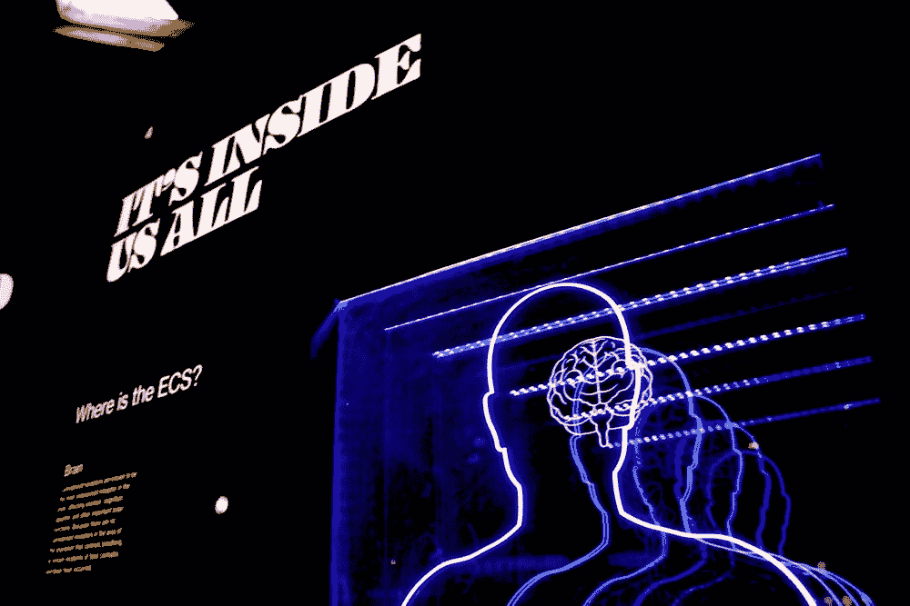

# 我的认知科学学位如何为数据科学和机器学习奠定了坚实的基础

> 原文：<https://towardsdatascience.com/why-my-cognitive-science-degree-was-a-great-foundation-for-data-science-and-machine-learning-f5838b527d40?source=collection_archive---------14----------------------->

## 数据科学中的个人故事

## 从认知科学背景进入机器学习和数据科学领域令人生畏——但最终提供了一个有益的基础。

Bret Kavanaugh 拍摄的 Unsplash 图像

我进入了数据科学和机器学习的领域，其中隐藏着许多不确定性和不安全性。我有无尽的好奇和兴奋——天真而乐观。但是萦绕在我脑海深处的是一种不安全感，*我不是来自任何传统背景，*例如，计算机科学、统计学或商业。相反，我毕业时获得了认知科学学士学位。然而，随着时间的推移和我经验的增长，一个想法开始慢慢解开——也许，我的背景提供了比我最初预期的更坚实的基础。

## 首先，什么是认知科学？

每当有人问起我的专业，我往往会背诵:

> "认知科学是神经科学、人工智能、计算机科学、哲学、心理学、语言学和人类学的交叉领域."

这并不能解释太多，通常会得到缓慢的点头和不确定的*“…好的。”*

因此，我想花一点时间来表达我所学到的东西，以及为什么我会对它提供给我的框架心存感激。

## **心灵的神秘**

我怀着强烈的愿望开始了我的研究，想了解心灵；发现的最有力途径之一是通过认知失败的案例。

照片由 E [ngin Akyurt](https://unsplash.com/@enginakyurt?utm_source=medium&utm_medium=referral) 在 [Unsplash](https://unsplash.com/?utm_source=medium&utm_medium=referral) 上拍摄

我了解到有些人不能识别面孔。其他人通过颜色来看声音。有些人在看到痛苦的人时会感到痛苦。其他人强烈渴望截肢，因为他们认为这是一个入侵的实体。有些人醒来时会不由自主地被自己的手掐住脖子。最重要的是，我已经意识到每种疾病都伴随着一种生物损伤。这些生物损伤有治疗方法。

在我们对这些疾病的存在有所了解之前，我们会把任何偏离常态的人归类为“疯子”。例如，那些患有**面孔失认症**的人可能在识别他们的孩子或同事方面有困难。这意味着如果他们走过一个他们认识但不认识的人身边，却没有和他们打招呼，他们可能会显得很粗鲁。

或者一些患有**身体完整性认同障碍**的人想要截肢，因为他们觉得这是一种阻碍。因此，旁观者会认为他们“疯了”，而不是考虑造成这种情况的潜在身体缺陷。

## **那么什么是认知科学，为什么它是跨学科的？**

然而，精神障碍只是我研究的一个方面。我的专业，简而言之就是围绕*【理解认知】*。换句话说，这种神秘的能力我们必须*去思考、推理和获取知识。*

在这门学科中，我获得了一种新的自我意识，以及思考人类经历所包含的东西的途径。在认知科学领域之前，我们使用严格的内省和心理学，或者严格的神经科学和生物学来研究这个主题。

但是认知科学提出，为了理解大脑的复杂性，我们不能依赖一个单一的学科来获得所有的答案。我们需要理解思维的内部状态以及大脑的解剖结构——但这还不够。我们需要了解社会、文化、语言、现代技术以及其他一切可能有助于发展我们思考能力的事物。

更准确地说，我的研究使我能够深入研究意识、梦、记忆、注意力、存在、神经系统、社会、文化、药物对大脑的影响、开发略微模拟大脑神经网络的计算机系统的过程，以及不断发展的技术的其他方面。

## **那么数据科学和机器学习在哪里呢？**

我在下面列出了我看到的认知科学世界和数据科学/机器学习世界碰撞的几种方式。

国家癌症研究所[拍摄的 Unsplash 照片](https://unsplash.com/photos/BDKid0yJcAk)

1.  **神经网络和神经科学:**神经网络的灵感来源于人脑的神经回路。在 了解这种生物现象的数学表示之前，研究神经元、连通性以及信息如何向前传播 ***是很有见地的。尽管深度学习领域引入了新奇的术语，但这些数学模型所启发的潜在生物过程要复杂得多；*网络架构是简化的数学表示*。此外，深度学习架构中的许多变体也是受生物副本的组件或模仿人类认知的想法的启发。有了更复杂的生物学灵感的基础后，概念化这些模型和概念就容易多了。***
2.  **人机交互和数据可视化/讲故事:**理解思维的一个关键部分是理解人类如何捕捉和保留信息。在认知科学中，我们研究记忆和注意力的基本过程。我们研究注意力是如何被捕捉的，人们可能会关注什么，以及我们如何自然地将视觉线索分组以理解一个总体故事。此外，我们调查了不同文化之间的认知差异，以及生活方式和传统如何影响我们的思维方式。这一背景使我能够批判性地思考可视化。*谁是观众，这些颜色对这个群体来说代表什么？我的视觉化能把观众的注意力引向我想要传达的东西吗？是否有太多的杂乱会分散我的听众快速直观地理解信息的注意力？人类一次能理解多少信息？*
3.  **统计分析:**任何科学努力都会带来统计分析。科学研究数据检查、概率评估和预测分析。从我完成的统计学课程中，我对我遇到的每一条新信息或统计数据都抱着健康的怀疑态度。我喜欢问这样的问题:“*谁是研究的对象？取样是如何进行的？实验设计符合最初的问题吗？实验设计是否让我们有信心做出更广泛的结论？我们能利用这些信息做些什么，这符合道德吗？”这种怀疑同样适用于机器学习问题。重要的是要采取一种方法和全面的方法，特别是如果我们的模型的部署具有社会影响。*
4.  **计算社会科学和网络分析**:认知科学中有一个探索分布式认知的框架，根据维基百科，“指的是**一个认知资源在**中被社会共享以扩展个体认知资源的过程”。目标是分析认知是如何在个体范围之外产生的，包括探索个体之间的相互作用。我的计算社会科学课相当直接地翻译成了网络分析。我的班级通过模拟和建模调查了社会互动和行为互动。为了分析连接度，我们应用了网络分析技术。这些技术在数据科学领域中无处不在。
5.  **神经信号处理与一般时间序列分析:**神经信号处理的目标是对神经信号进行分解，以提取大脑如何表征和传递信息的信息。由于这些神经信号具有时间成分，我们可以将它们表示为时间序列数据。因此，我能够将该课程中使用的相同技术应用于其他时间序列数据集。

虽然我只阐述了我的认知科学和机器学习研究之间的 5 个联系，但这个列表并没有结束。其他一些共享主题包括微积分、线性代数、A/B 测试、数据伦理等。慢慢地发现我以前的学习并没有让我处于劣势，这让我感到很温暖；相反，它提供了一个坚实的基础框架。

## 冒名顶替综合症

我带着一种强烈的冒名顶替综合症的感觉开始了向数据科学和机器学习的过渡。尽管我不确定，但我从未对研究心灵感到后悔。对思维的研究让我产生了一种愿望，那就是为那些遭受神经损伤或与精神健康问题作斗争的人服务。与此同时，对数据科学和机器学习的研究激发了人们利用我们所拥有的计算能力来为社区服务的热情。

由[卢卡斯·法夫尔](https://unsplash.com/photos/JnoNcfFwrNA)拍摄的 Unsplash 照片

最后，值得注意的是，虽然冒名顶替综合症可能会让人麻痹，但在许多情况下，它促使我更快、更有意识地学习。我开始害怕这些话题会从我的头上飞过，却发现我的背景出人意料地让我有了直观的联系。现在我有了一个“缩小”的镜头，不是来自“传统背景”的恐惧和不确定性被纯粹的感激所取代。

## 建议

如果任何读到这篇文章的人也感受到来自非传统背景的不确定性，要知道你并不孤单。许多数据科学家和机器学习实践者并没有传统背景。请记住，这项研究涉及到我们可以应用于任何领域的工具，您的道路将使您能够建立独特的联系，帮助您巩固新概念。

最后，不要让冒名顶替综合症的感觉压倒你。相反，让它为你提供必要的动力和意图，以跟上数据科学和机器学习不断变化的格局。