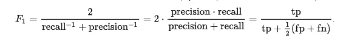

# 为什么我 90%准确率的模型不工作

> 原文：<https://towardsdatascience.com/why-my-model-with-90-accuracy-doesnt-work-685817a2b0e?source=collection_archive---------9----------------------->

## 不平衡数据集的模型性能度量

阿菲夫·库苏马在 [Unsplash](https://unsplash.com?utm_source=medium&utm_medium=referral) 上拍摄的照片

当您处理客户流失(当客户在一定时间内停止使用公司的产品)预测等营销问题时，原始数据集通常是不平衡的，这意味着类别本质上是不平衡的。基本上，这意味着你的客户流失的百分比可能比那些没有流失的要低得多。在本例中，二进制分类问题可能有 80–20%的分裂，只有 20%的客户停止与该公司的合作，80%的客户继续购买。

> 问题是，这 20%可能对企业的底线非常重要。

想想看，一家礼品公司有 100，000 名客户，平均每人价值 50 美元。这些客户给了你 500 万美元，但是如果有 20%的人不再购买该公司的产品，你就损失了 100 万美元！在几年的时间里，即使是最大的电子商务公司或实体店，这一数字也会增加。因此，公司营销部门的一个主要目标是预测客户何时会流失，并实施某种干预措施来防止这种情况发生。

# 用于流失预测的机器学习

现在，如果你的公司有一个好的数据科学/数据分析团队，你可能会很幸运。有了一个好的客户流失预测模型，你可以在客户放弃你的业务之前进行干预，并有可能让他们回到他们的忠诚状态。现在，我们进入下一个问题——当我们使用二元分类模型时，不平衡的类往往会使事情变得有点混乱。主要是，许多分析师转向的核心性能指标是准确性，但准确性只能告诉你这么多…

# 什么是准确性？

在另一篇关于走向数据科学的文章中， [Koo Ping Shung 评论了不同的性能指标来评估你的 ML 模型](/accuracy-precision-recall-or-f1-331fb37c5cb9)。在本文中，我们将回顾其中的一些选项，以及为什么它们可能比准确性更适合不平衡的数据。

**准确度** =正确预测总数/预测总数

直觉上，准确性是有意义的——你想知道你有多少预测是正确的。不幸的是，有了不平衡的数据，事情就没那么简单了。让我们看一个例子…

您有来自营销部门的去年客户流失数据，总共有 100，000 名客户和 20，000 名流失客户。现在，如果我们预测所有 100，000 个都不会流失，这意味着我们有 80，000/100，000 个正确(80%的准确率)。在这个例子中，您实际上没有识别出任何问题案例。如果你更进一步，你的数据更加不平衡(90-10 分裂)，如果你预测每个人都不会流失，你的模型实际上会有 90%的准确率，尽管没有识别出一个问题案例。

> 最终，准确率为 90%的模型可能无法工作。

# 那么，我们该如何解决这个问题呢？

正如前面提到的文章中所讨论的，还有模型性能的其他度量。出于我们的目的，我们将回顾三种这样的措施:

*   精确
*   回忆
*   子一代

# **精度**

精度=真阳性/(真阳性+假阳性)

这可能看起来不像精确度那么清晰，但是本质上，精确度告诉你离你的目标有多近。也就是说，如果你预测正确，你会得到更多的“分数”，但是如果你错误地分类，你也会失去一些分数。因此，如果我们要抓住所有 20，000 名流失的客户，这是 20，000 个真正的阳性，但如果我们还包括另外 20，000 名没有真正流失的客户，我们的精确度就会下降，如下所示。

> 无误报:20，000/(20，000+0)= 100%
> 
> 误报率:20，000/(20，000+20，000)= 50%

当您有一个不平衡的数据集，并且您想要防止误报(或者在 stats 中称为类型 1 错误)时，Precision 就很方便了。例如，如果你正在诊断癌症并实施有风险的治疗，你要确保你只治疗那些病人。如果你对大部分没有真正生病的人使用这种治疗(假阳性)，你可能会有一些非常负面的影响。

# **回忆**

回忆=真阳性/(真阳性+假阴性)

如果使用精确度来防止假阳性，那么召回是防止假阴性(也称为“遗漏”或 2 型错误)的等效措施。看同类型的例子，如果我们正确地分类我们所有的搅拌，我们不会错过任何一个，我们将有完美的回忆，如下所示:

> 无漏报:20，000/(20，000+0)= 100%

现在，如果我们错过了 5，000 个目标案例，我们的召回率就会下降，包括分子和分母，如下所示:

> 有假阴性:15000/(15000+5000)= 75%

如果你的班级不平衡，回忆是一个很好的选择，最重要的是你找到所有的问题案例。在前面的客户流失预测示例中，假设分析的目标是找出谁最有可能流失，并向这些客户发送非侵入性消息，提醒他们再次购买。

如果出现误报的唯一风险是发出一些额外的通知，那么召回可能是一个很好的性能指标选择。你可能不在乎把 500 张明信片寄给那些不太可能流失的人，从而浪费了它们——你在乎的是你抓住了所有真正的正面案例。(您识别了每一次点击)。

# **F1 得分**

F1 分数可能是最不直观的性能指标，但它可能是解决您的问题的正确方法。

F1= 2 X(精度*召回)/(精度+召回)

基本上，F1 分数是精确度和召回率的组合，它允许您在确定模型性能时权衡您的误报和漏报。

如果你想更好地理解你计算中的原始数字，[维基百科在分解数学方面做得很好。](https://en.wikipedia.org/wiki/F-score)

来源:https://en.wikipedia.org/wiki/F-score

如果您识别了 20，000 个目标案例中的 15，000 个，但是您也错误地识别了 5，000 个(并且遗漏了 5，000 个)，您的 F1 分数将如下所示:

f1:15000/(15000+. 5(5000+5000))=**75%**

F1 分数的顶点是精确度和召回指标的[调和平均值](https://medium.com/towards-data-science/on-average-youre-using-the-wrong-average-geometric-harmonic-means-in-data-analysis-2a703e21ea0)。

# 后续步骤

现在我们已经看了一个如何分析不平衡数据集的例子，很明显，准确性可能并不总是最好的衡量标准。底线是，你可以有一个准确率为 90%的模型，但召回率或精确度为 0%。如果您在 python 中运行逻辑回归，您可能需要考虑一些选项来处理这些类型的问题:

*   [SMOTE](https://medium.com/analytics-vidhya/balance-your-data-using-smote-98e4d79fcddb) —这个包允许你过采样或欠采样来平衡你的类
*   [加权逻辑回归](https://medium.com/towards-data-science/weighted-logistic-regression-for-imbalanced-dataset-9a5cd88e68b) —通过选择每个类别的权重(或简单地选择根据类别分布平衡权重)，您可以设置 TP、FP 和 FN 的重要性级别，从而对结果进行更多控制。

摘要

不平衡的分类问题可能很难处理，即使使用 R 和 python 作为机器学习算法。然而，本文的目标是防止您基于不完整的数据分析而犯逻辑错误。关键要点如下:

*   准确性并不总是最好的
*   定义你的商业目标
*   查看用于平衡数据的包

我希望你喜欢这篇文章，如果你有任何问题，请随时联系我们！