# 为什么神经网络有激活功能

> 原文：<https://towardsdatascience.com/why-neural-networks-have-activation-functions-9732e5405d4e?source=collection_archive---------25----------------------->

## [入门](https://towardsdatascience.com/tagged/getting-started)

## 它们是强制性的。

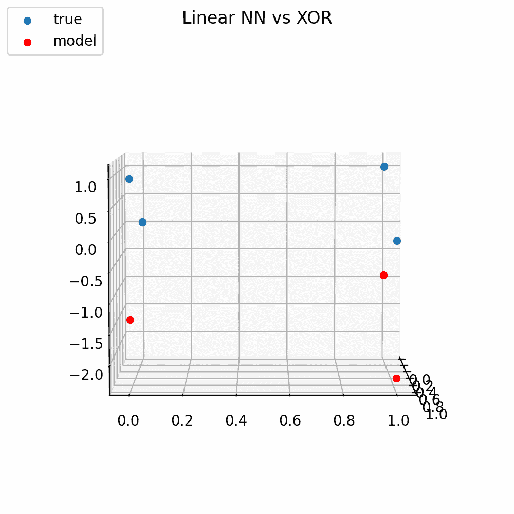

作者图片

有一次面试，有人问我“为什么神经网络有激活功能？”那一刻，我坚信没有激活功能的神经网络只是线性模型，因为我在某本书上读到过，但我不确定为什么是这样。不过我自信地回应道，“因为一个没有任何非线性激活函数的神经网络只是一个线性模型。”面试官回答，“嗯，有意思，我不确定这是不是真的，我想知道的是‘它们让计算梯度变得更容易’。”这立刻成了我新宠的面试问题。

会后，我翻遍了我的书，试图找出我是在哪里第一次了解到这个事实的。我是在伊恩·古德菲勒、约舒亚·本吉奥和亚伦·库维尔的《深度学习》 中找到它的。第 168 页，关于前馈神经网络的主题[1]:

> f⁽ ⁾应该计算什么函数？到目前为止，线性模型为我们提供了很好的服务，让 f⁽ ⁾成为线性模型也很有吸引力。不幸的是，如果 f⁽ ⁾是线性的，那么前馈网络作为一个整体将保持其输入的线性函数。暂时忽略截距项，假设 f⁽ ⁾ ( **x** ) = Wᵀx，f⁽ ⁾ (h) = hᵀw.，那么 f(x) = xᵀWw.我们可以把这个函数表示为 f(x) = xᵀw'，其中 w' = Ww。

随着近年来对人工智能和机器学习的兴趣激增，我觉得以几种替代形式写一篇文章来说明这一事实似乎是有价值的。我希望其中的一种表示能引起你的共鸣，在这篇文章中，我将提供大量的视觉效果和代码片段供你自己观察和使用。为本文编写的所有代码都是开源的，可以在我的 [GitHub](https://github.com/ChristianWLang) 上获得。如果在本文中出现的代码片段的上下文不清楚，请参考本文的[伙伴 GitHub repo](https://github.com/ChristianWLang/nn-activations) 以获得完整的上下文。

# 在我们讨论神经网络之前

我认为，首先概念化一个具有数百万参数的巨大神经网络如何可能是一个线性模型，如果我们没有向它添加任何非线性激活函数，这有点势不可挡，所以在我们开始将我们的讨论与神经网络联系起来之前，让我们谈谈单变量模型。假设我有一个单变量模型，其中我将一个输入( **x** )乘以某个数量( **n** )的系数( **β** )，并添加相同数量( **n)** 的偏差(**偏差**):


相乘后:


上述内容可以重新表述如下:


从这里，我们可以将公式的各个部分分配给变量:


然后最后替换为:


最终，尽管我们做了所有的乘法和加法，我们只剩下一个线性模型。这是有意义的，因为 **β** 和**偏置**都是简单的常数。一个代表一串随机实数的乘积，一个代表一串随机实数的乘积之和。因此，如果我们选择用实际值替换等式中的 **β(s)** 和**偏差**，我们会发现自己留下了一个非常熟悉的公式，其中我们将变量 **x** 乘以某个斜率 **β** ，然后添加一些截距**偏差**。为了用[一些代码](https://github.com/ChristianWLang/nn-activations/blob/main/single_example.py)形象化这个事实，我们将首先编写一个随机模型类:

这个类从我们的原始公式中初始化 **β(s)、bias(es)和 n** 。当被调用时，这个模型执行上面详述的相同过程来计算 **f(x)** 。最后，我们需要一个单变量线性回归，代表我们的最终方程:

从这里，我们可以初始化一个随机模型，并拟合我们的 OLS 回归。

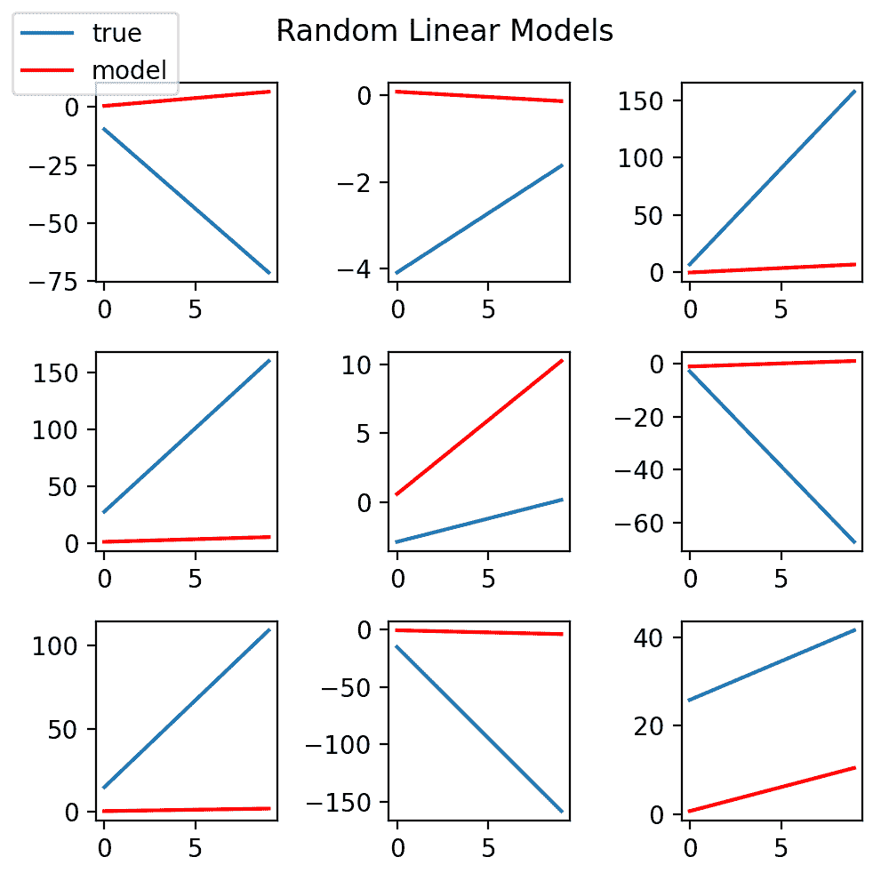

完整的脚本，点击这里。作者图片

正如你所看到的，由这种方法生成的每个随机模型都可以用一个简单的单变量 OLS 来表示。我选择强调这个过程，因为迭代地将一个输入乘以一个系数，然后添加一个偏差项，这与神经网络的前向传播步骤中发生的过程没有太大的不同。也许现在感觉，如果没有任何非线性激活函数的神经网络仅仅是一个线性模型，这应该是正确的，但是在我们接受这种直觉作为事实之前，让我们说明一个平凡的小神经网络。

# 一个玩具神经网络

假设我们有一个简单的神经网络，它有两个输入，一个具有两个节点的隐藏层(具有线性激活函数)，和一个输出。

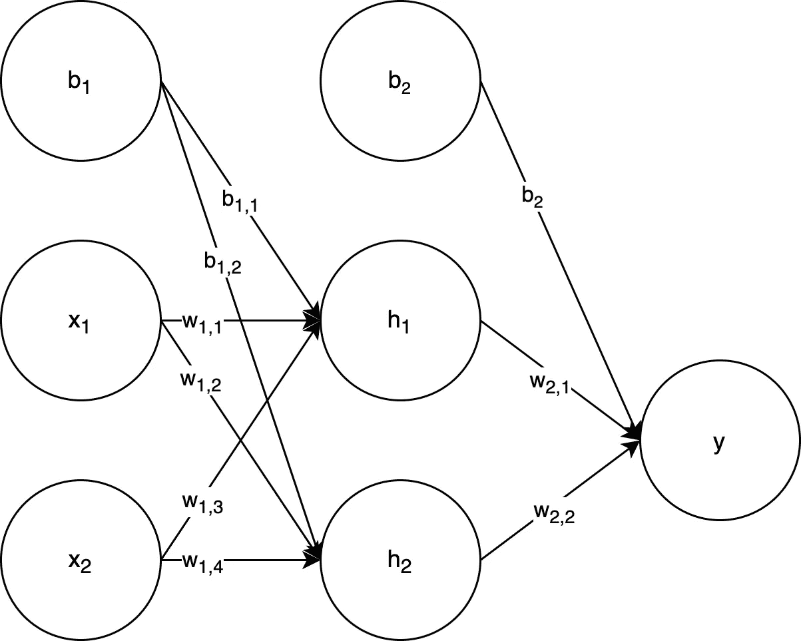

为了便于阅读，对权重和偏差进行了标注。作者图片

从这里我们可以得出结论:

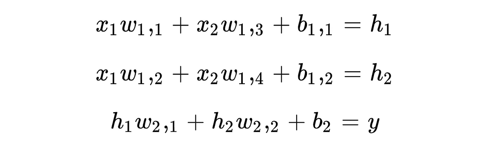

我们应该已经注意到，这些方程都是一个简单的线性模型。接下来，我们可以为等式的各个部分分配新的变量(在这个例子中，我选择替换，以使我们接下来的每一步更具可读性，我们可以轻松地避开这种替换):


因此:


从这里开始，让我们将 **h₁** 代入**一个**等式，然后乘以:

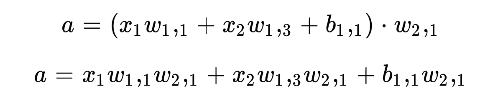

现在让我们用 **h₂** 和我们的 **c** 等式做同样的事情:

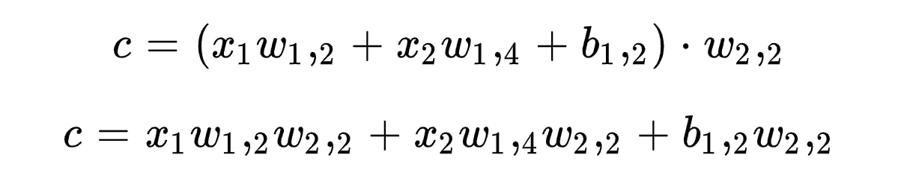

从这里开始，让我们将 **a** 和 **c** 代入我们的方程 **y** :


分组相似术语:


将新变量分配到等式的各个部分:

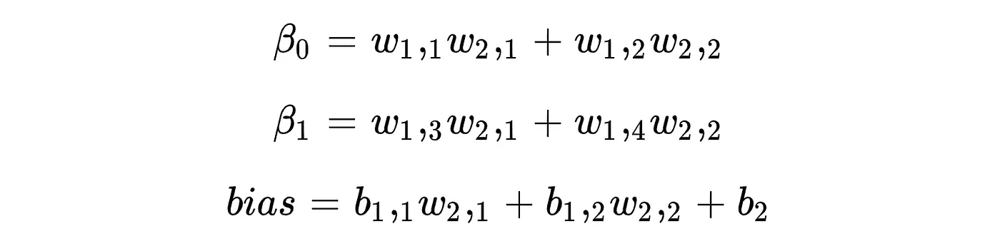

最后，将这些代入我们的公式:


我们又一次只剩下一个线性模型。事实上，如果我们选择增加神经网络的大小和深度，不管有多剧烈，我们都可以执行相同的简化，并最终从中导出一个线性模型。

正如我们之前所做的，让我们编写一些代码[来测试这个发现，方法是生成非平凡大小的神经网络，并对它们的输入和输出进行线性回归拟合。首先，创建随机前馈神经网络的函数:](https://github.com/ChristianWLang/nn-activations/blob/main/ff_example.py)

我正在覆盖默认的偏差初始化“零”，以确保偏差对输出有影响，因为我们不会改变任何初始化的权重

接下来，让我们使用随机神经网络生成一些输入和输出，我们可以使用它们来训练线性回归(这次我们将使用 scikit-learn 的线性回归实现，而不是扩展我们的实现以包括多个输入和输出):

运行完整脚本会返回:

```
$ python3 ff_example.pyr2 score: 0.999999999999102
mse: 1.7702930123167377e-14
```

在这一点上，我们可以非常肯定伊恩·古德费勒、约舒阿·本吉奥和亚伦·库维尔是正确的(我的意思是，通常可以非常安全地假设这些人是正确的)。然而，你们中的一些人可能会想，“到目前为止，我们只做了简单的前馈神经网络，那么具有卷积层或递归层的神经网络呢？”好了，现在我们有了一个比较神经网络和线性函数的框架，我们可以简单地修改我们的函数来测试其他层类型:

```
$ python3 cnn_example.pyr2 score: 0.9999999999793131
mse: 7.416074040925858e-16
```

```
$ python3 rnn_example.pyr2 score: 0.9999999999749045
mse: 5.490464324395404e-08
```

如你所见，如果你所有的激活函数都是线性的，那么递归层、卷积层、甚至池层都不会产生任何非线性。

# 异或线性与异或非线性

作为最后一个例子，我觉得这是最快速地说明具有所有线性激活函数的神经网络和具有非线性激活函数的神经网络之间的差异，让我们检查不同的神经网络如何在 XOr 上执行。

## 异或运算

XOr 读作“异或”是一个著名的逻辑连接词。[2]

> 逻辑上称为“异或”或“异或”的连接词。如果两个条件中恰好有一个(但不是两个)为真，则产生 true。—[https://mathworld.wolfram.com/XOR.html](https://mathworld.wolfram.com/XOR.html)

我们将关注二进制异或方程。二进制异或有如下真值表:

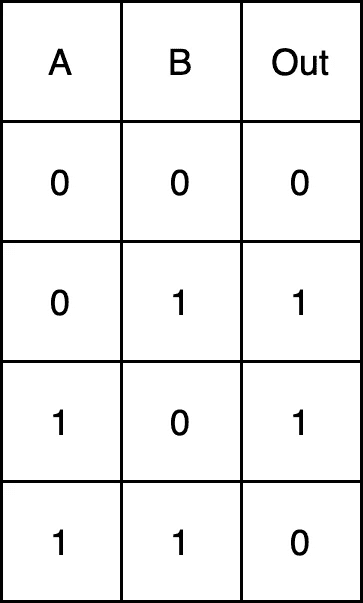

作者图片

## 模型

在本练习中，我们唯一要参数化的是激活函数，关于架构的其他一切都将保持一致:

我们的神经网络，可视化后，看起来像这样:

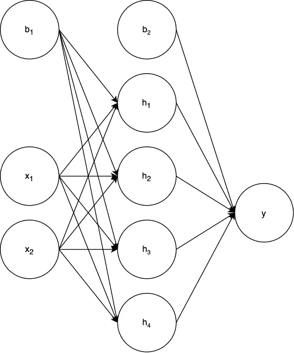

作者图片

## 线性模型

基于我们现在所知道的，我们如何期望完全线性激活的神经网络运行？


完整的脚本，[点击这里。](https://github.com/ChristianWLang/nn-activations/blob/main/xor_example.py)作者图片

正如预期的那样，我们的神经网络具有所有线性激活函数，其表现与线性回归模型完全一样。

## 非线性模型

现在，如果我们改变隐藏层的激活函数为 sigmoid 而不是线性的呢？

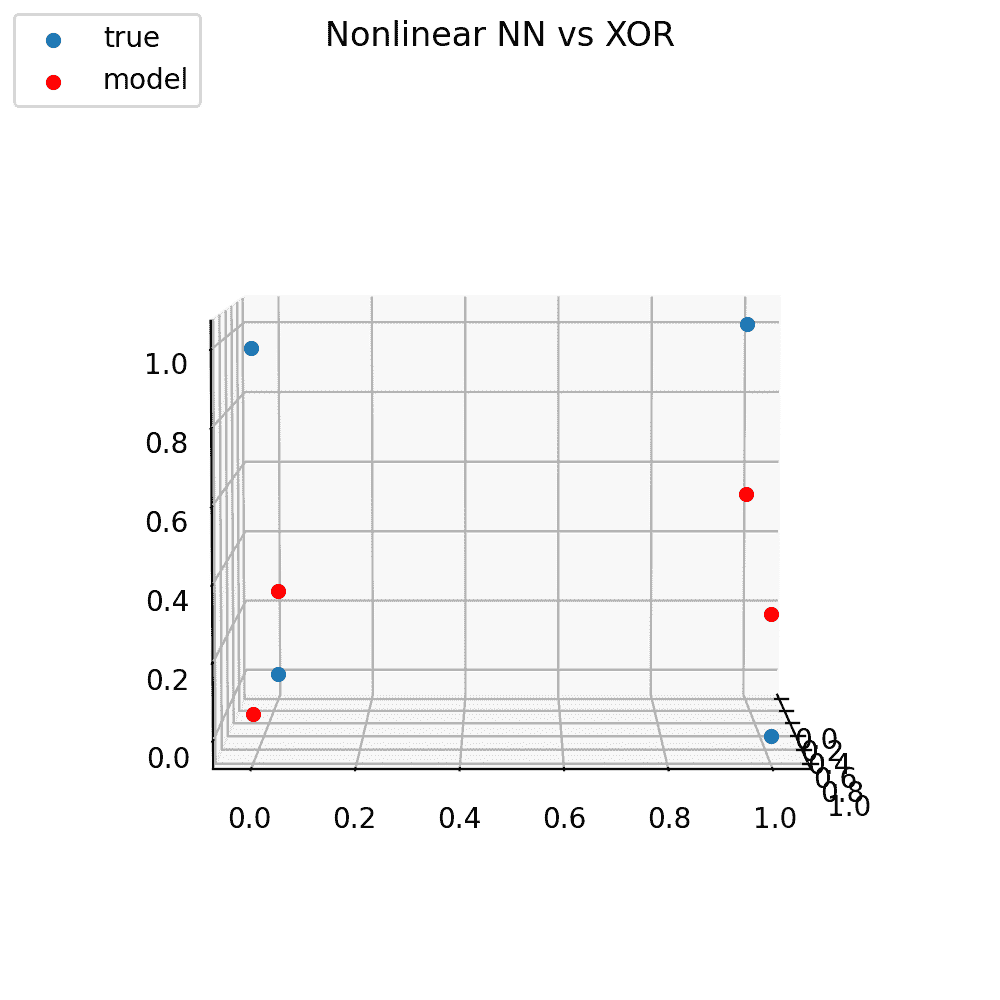

完整的脚本，[点击这里。](https://github.com/ChristianWLang/nn-activations/blob/main/xor_example.py)作者图片

通过简单地将隐单元的激活函数改变为非线性 sigmoid 方程，神经网络可以适当地解决 XOr 问题。这是相同的神经网络，但是使用 ReLU(校正线性单元)激活:

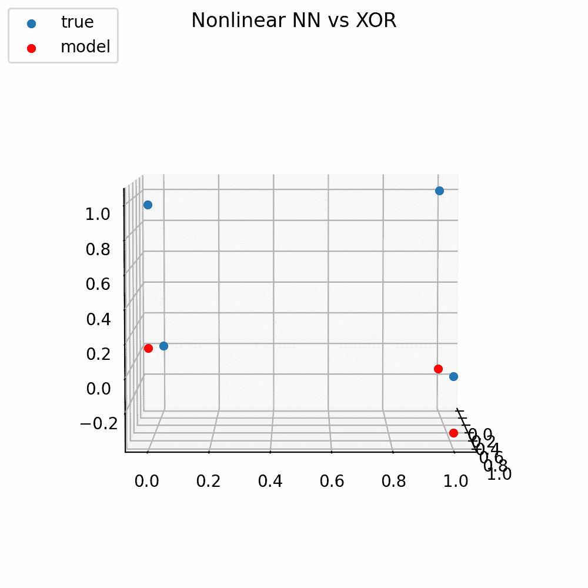

完整的脚本，[点击这里。](https://github.com/ChristianWLang/nn-activations/blob/main/xor_example.py)图片作者

# 结论

对于神经网络来说，没有所谓的“最重要”组件，然而，激活函数为第一个获得该头衔提供了有力的论据。在本文中，我们了解到，没有任何非线性激活函数的前馈神经网络(无论是包含递归层、卷积层还是池层)都只是线性模型。我们通过数学符号、实验和大量的可视化展示了这一事实。

# 参考

[1] I .古德费勒，y .本吉奥和 a .库维尔，[深度学习](http://www.deeplearningbook.org) (2016)，[https://www.deeplearningbook.org/](https://www.deeplearningbook.org/)

[2] [杰蒙德松，罗杰](https://mathworld.wolfram.com/topics/Germundsson.html)和[魏斯泰因，埃里克 W.](https://mathworld.wolfram.com/about/author.html) “异或”来自 [*数学世界*](https://mathworld.wolfram.com/)——一个 Wolfram 网络资源。[https://mathworld.wolfram.com/XOR.html](https://mathworld.wolfram.com/XOR.html)