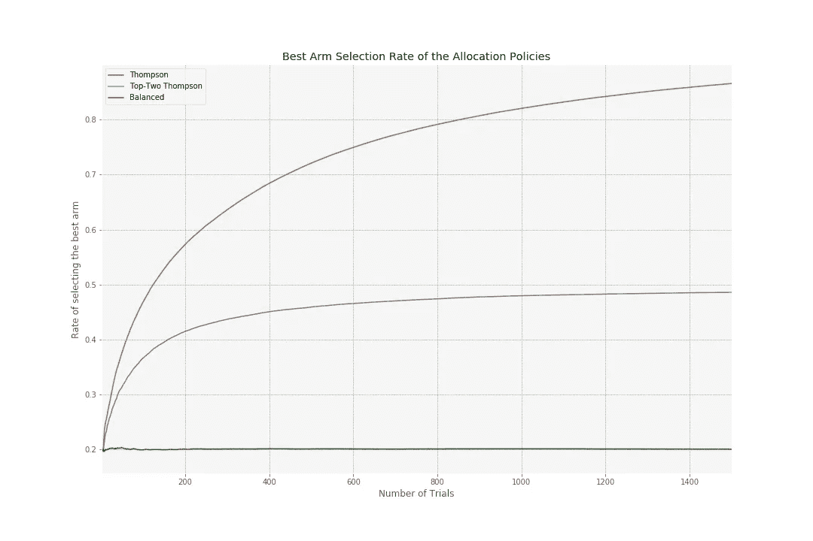
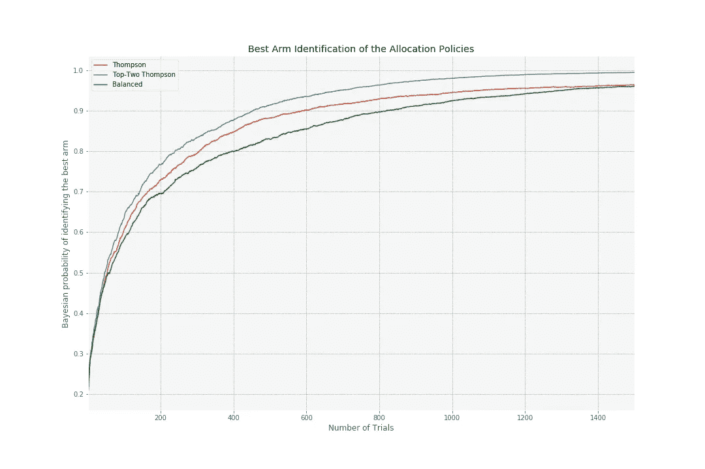
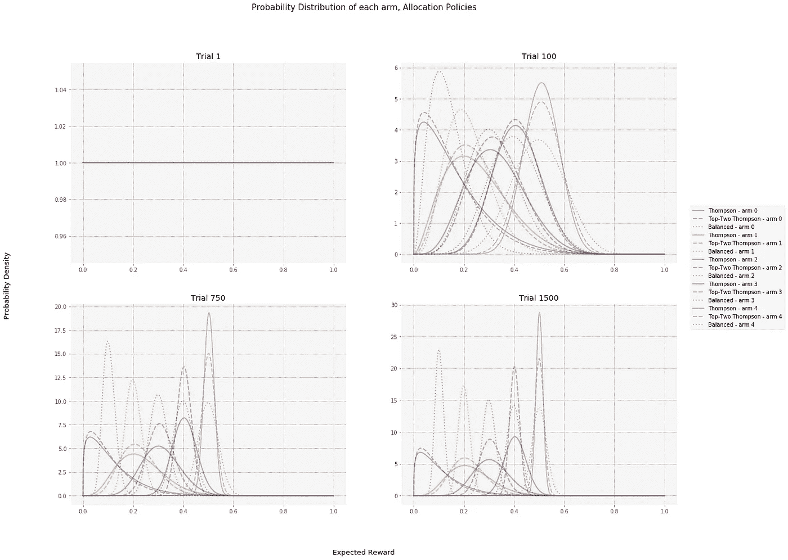
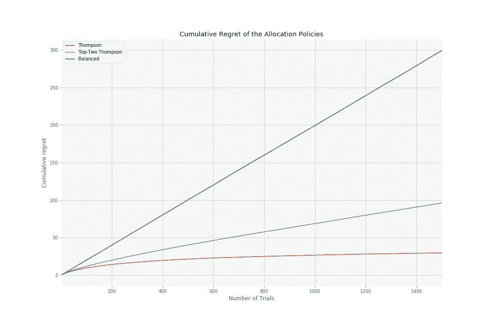

# 为什么不使用 Thompson 采样进行最佳 Arm 识别。

> 原文：<https://towardsdatascience.com/why-not-to-use-thompson-sampling-for-best-arm-identification-8ed458428126?source=collection_archive---------27----------------------->

## [思想和理论](https://towardsdatascience.com/tagged/thoughts-and-theory)

## 如何使用多臂 bandit 分配方法在最少次数的试验中找到最佳臂？


由[内森·杜姆劳](https://unsplash.com/@nate_dumlao?utm_source=unsplash&utm_medium=referral&utm_content=creditCopyText)在 [Unsplash](https://unsplash.com/s/photos/choice?utm_source=unsplash&utm_medium=referral&utm_content=creditCopyText) 上拍摄的照片

在本帖中，我们展示了当目标是识别最佳手臂时，为什么不应该使用汤普森采样。特别是，我们将比较 Thompson 抽样和最近引入的名为 Top-two Thompson 抽样的分配方法，并展示它们的使用案例。在我们的实验中，前两名汤普森需要少 35%的试验来确定最佳手臂。Thompson 抽样是近年来越来越流行的多臂土匪问题中的一种分配方法。多臂 bandit 方法以一种平衡的方式顺序做出决策，探索可能提高未来性能的新信息，并利用已知信息最大化性能。这通常被称为勘探开发权衡。在多武器强盗问题中，我们的目标是最小化累积遗憾，这是最优武器的平均奖励和所玩武器的奖励之间的差异。最常用的方法之一是汤普森抽样(有时也称为贝叶斯土匪)。Thompson sampling 从获得的奖励中构建一个概率模型，并从中抽取样本来选择一只手臂进行游戏。Thompson 抽样在工业中被广泛使用，因为就最小化累积遗憾而言，它是分配臂的最佳方法之一[1]。

从业者有时使用多臂土匪的方法来确定最好的手臂。在这种情况下，Thompson 采样在有限的时间范围内运行(即勘探阶段)，并从那时开始发挥最佳作用(即开采阶段)。开发阶段的这种性能保证被称为简单后悔。简单的遗憾可以解释为在探索阶段结束后一定要打出最好的手臂。Russo 最近的一篇文章[2]表明，Thompson 抽样是一种远非最佳的分配方法，无法决定开采期的最佳策略。在这篇博客中，我们讨论了 Top-two Thompson 采样，并提供了一个 Python 代码示例来复制和比较最佳 arm 识别情况下的方法。

**前两名汤普森抽样。**

Thompson 抽样是多臂土匪问题的一种流行的分配方法。这个博客主要关注伯努利分布案例。在伯努利分布中，奖励只能有两种可能的结果，1 和 0。更多关于汤普森取样的信息，请阅读[这篇](/thompson-sampling-fc28817eacb8)精彩的文章。

当奖励具有伯努利分布时，Thompson sampling 从贝塔分布中取样，并播放具有最高返回值的手臂。在实验开始时，所有的分布都很宽，并且在所玩的武器之间存在相对均匀的分配。随着实验中试验次数的增加，概率分布变得更窄，汤普森抽样将更频繁地使用更高概率的奖励。因此，勘探减少，开采增加。在识别最佳臂的情况下，这种行为远非最佳。

Top-two Thompson 采样是对标准 Thompson 采样的简单修改，增加了一个重采样步骤[2]。与 Thompson 抽样相似，在每个试验中，从所有的组中提取一个样本。与 Thompson 采样相反，不是使用具有最高样本奖励的手臂，而是在最高和第二高返回值之间抛硬币。这种抛硬币的方式可以防止只玩样本奖励最高的牌。这导致更多地探索第二个表现最好的武器，而不是发挥最好的武器。硬币翻转的量可以通过超参数β来改变，但通常是。这意味着最好的和第二好的手臂被打的概率相等。

**汤普森抽样实现。**

我们将首先创建一个名为 *ThompsonSampling* 的类，在 ThompsonSampling 中的参数标准(如成功次数( *a* )和失败次数( *b* )旁边，我们添加了参数 *top_arms* 。该参数允许在标准 Thompson 抽样和 Top-two Thompson 抽样之间变化。

```
import numpy as np
import pandas as pd
from datetime import datetimeclass ThompsonSampling():
    """Class to implement a Thompson sampling policy 
    for a multi-armed bandit problem.

    Args:
        a (list): The alpha parameter of a Beta 
        distribution. For multiple arms, this will be a list of
        float values.
        b(list): The beta parameter of a Beta 
        distribution. For multiple arms, this will be a list of
        float values.
        top (int): Either 1 to use a standard Thompson sampling
        or 2 to use Top-two Thompson.
    """

    def __init__(self, a, b, top_arms=1):
        self.top_arms = top_arms

        # Beta parameters
        self.a = a
        self.b = b
        return

    def initialise(self, num_arms):
        """Initialises the arms.

        Args:
            num_arms (positive int): The number of arms.
        """
        self.num_arms = num_arms

        # Use Uniform distribution as prior for all the arms
        self.a = [1 for arm in range(self.num_arms)]
        self.b = [1 for arm in range(self.num_arms)]
        return

    def select_arm(self, random_seed):
        """Selects an arm for each round.

        Args:
            random_seed (int): The seed for random number generator.

        Returns:
            An integer corresponding to the index of the selected 
            arm.
        """
        # Select each arm at least once
        arms = []
        for i in range(self.num_arms):
            if self.a[i] == self.b[i] == 1:
                arms.append(i)
        if arms:
            np.random.seed(seed=random_seed)
            return np.random.choice(arms)

        # Perform random draw for all arms based on their parameters
        np.random.seed(seed=random_seed)
        all_draws = np.random.beta(self.a, self.b, 
                                   size=(1, self.num_arms))
        all_draws = np.concatenate(all_draws, axis=0)

        # Return index of arm with the highest reward for Thompson
        # Return index of any top-two arm for top-two Thompson 
        np.random.seed(random_seed)
        return np.random.choice(all_draws.argsort()[::-1]
                                [:self.top_arms])

    def update(self, chosen_arm, reward):
        """Updates the parameters of the chosen arm.

        Args:
            chosen_arm (int): The index of the selected arm. 
            reward (int): The reward obtained. Either 0 or 1.
        """
        # a is based on total counts of successes of an arm
        self.a[chosen_arm] = self.a[chosen_arm] + reward

        # b is based on total counts of failures of an arm
        self.b[chosen_arm] = self.b[chosen_arm] + (1 - reward)

        return
```

为了比较，我们还创建了类 *BalancedPolicy。*这个职业完全随机选择一只手臂。我们用这个类来比较 Thompson 和前两名 Thompson 的均衡分配。平衡分配与传统 A/B 测试一样，随机分配一个臂。该类需要成功次数( *a* )和失败次数( *b* )来更新 arm，以便我们可以执行最佳 arm 识别。

```
class BalancedPolicy():
    """Class to implement a Balanced policy 
    for a multi-armed bandit problem.
    It selects an arm completely at random.

    Args:
        a (list): The alpha parameter of a Beta 
        distribution. For multiple arms, this will be a list of
        float values.
        b(list): The beta parameter of a Beta 
        distribution. For multiple arms, this will be a list of
        float values.
    """

    def __init__(self, a, b):
        self.arms = []

        # Beta parameters
        self.a = a
        self.b = b
        return

    def initialise(self, num_arms):
        """Initialises the arms.

        Args:
            num_arms (positive int): The number of arms.
        """
        self.arms = [arm for arm in range(num_arms)]
        self.num_arms = num_arms # Use Uniform distribution as prior for all the arms
        self.a = [1 for arm in range(self.num_arms)]
        self.b = [1 for arm in range(self.num_arms)]
        return

    def select_arm(self, random_seed):
        """Selects an arm for each round.

        Args:
            random_seed (int): The seed for random number generator.

        Returns:
            An integer corresponding to the index of the selected 
            arm.
        """
        # Select each arm at least once
        arms = []
        for i in range(self.num_arms):
            if self.a[i] == self.b[i] == 1:
                arms.append(i)
        if arms:
            np.random.seed(seed=random_seed)
            return np.random.choice(arms)

        # Perform random selection of arms
        np.random.seed(seed=random_seed)
        return np.random.choice(self.arms)

    def update(self, chosen_arm, reward):
        """Updates the parameters of the chosen arm.

        Args:
            chosen_arm (int): The index of the selected arm. 
            reward (int): The reward obtained. Either 0 or 1.
        """
        # a is based on total counts of successes of an arm
        self.a[chosen_arm] = self.a[chosen_arm] + reward

        # b is based on total counts of failures of an arm
        self.b[chosen_arm] = self.b[chosen_arm] + (1 - reward)

        return
```

为了模拟使用每种分配方法选择手臂的结果(奖励)，我们实现了一个 *BernoulliArm* 类，其中奖励只能有两种可能的结果，1 和 0，这取决于每只手臂的预期奖励。

```
class BernoulliArm():
    """Class to simulate a Bernoulli arm.

    Args:
        p (float): The probability of success.
    """
    def __init__(self, p):
        self.p = p

    def get_reward(self, random_seed):
        """Obtains a reward based on Bernoulli.

        Args:
            random_seed (int): The seed for random number generator.

        Returns:
            1 for success, 0 otherwise.
        """
        np.random.seed(seed=random_seed)
        if np.random.random() > self.p:
            return 0.0
        else:
            return 1.0
```

由于目标是识别最佳手臂，我们需要计算找到最佳手臂的概率。在这样做的时候，我们利用了一个模拟，其中我们从带有参数的 beta 分布中抽取成功次数( *a* )和失败次数( *b* ) *N* 次。

```
def calculate_bayesian_probability(num_arms, N, random_seed, a, b):
    """
     Calculated the bayesian probabilities by performing 
     sampling N trials according to the provided inputs.

    Args:
        num_arms (int): The number of variations to sample from.
        N: The number of sampling trials.
        random_seed: The seed for random number generator.
        a (list): The alpha parameter of a Beta 
        distribution. For multiple arms, this will be a list of
        float values.
        b(list): The beta parameter of a Beta 
        distribution. For multiple arms, this will be a list of
        float values.

    Returns:
        Ordered list of floating values indicating the success 
        rate of each arm in the sampling procedure.
        Success rate is the number of times that the sampling 
        returned the maximum value divided by the total number 
        of trials.
    """
    np.random.seed(seed=random_seed)
    sim = np.random.beta(a, b, size=(N, num_arms))
    sim_counts = sim.argmax(axis=1)
    unique_elements, counts_elements = np.unique(sim_counts, 
                                                 return_counts=True)
    unique_elements = list(unique_elements)
    counts_elements = list(counts_elements) for arm in range(num_arms):
        if arm not in unique_elements:
            counts_elements.insert(arm, 0) return counts_elements / sum(counts_elements)
```

为了将前两个 Thompson 采样与标准 Thompson 采样和平衡策略进行比较，我们进行了模拟。在这些模拟中，我们对每个策略进行分配 *num_sims* 次，以消除随机性。在仿真中，我们计算了(1)识别最佳 arm 的贝叶斯概率，以比较最佳 arm 识别的分配方法。(2)累积遗憾:打出的手臂和打出最好的手臂之间的奖励差异。(3)选择最佳手臂的比率，因此所有分配方法使用定义为最佳(即成功概率最高)的手臂的频率。

```
def simulate(policy, arms, best_arm, num_sims, trials, N):
    """Simulates a multi-armed bandit process.

    Args:
        policy: The policy class.
        arms (list): A list of arm classes. 
        The leght of the list equals the number of arms.
        best_arm (int): The index of arm with the highest reward.
        num_sims (int): The number os simulations.
        trials (int): The numbe of trials in each simulation.
        N: The number of sampling trials to calculate the 
        bayesian probabilities.
        balanced (bool): If True, a uniform distribution is used 
        to calculate the bayesian probabilites, if False, then a 
        beta distribution.

    Returns:
        A dataframe with information such as the select arm, 
        reward and regret per simulation per trial.
    """
    # Initialise a dataframe to store the results of the simulations
    columns = ['num_sims', 
               'trials', 
               'chosen_arms', 
               'rewards', 
               'rewards_best_arm', 
               'prob_best_arm']
    for a in range (len(arms)):
        columns.append('prob_arm_{}'.format(a))
    for a in range (len(arms)):
        columns.append('alpha_arm_{}'.format(a))
    for a in range (len(arms)):
        columns.append('beta_arm_{}'.format(a))
    results = pd.DataFrame(index=range(0,num_sims*trials),
                           columns=columns, dtype='float') for sim in range(num_sims):
        sim = sim + 1
        policy.initialise(len(arms))        
        for t in range(trials):
            t = t + 1
            index = (sim - 1) * trials + (t - 1)
            # Selection of best arm
            chosen_arm = policy.select_arm(random_seed=index)
            # Obtain reward information from the chosen arm
            reward = arms[chosen_arm].get_reward(random_seed=index)
            bayesian_probabilities = \
                calculate_bayesian_probability(num_arms=len(arms),
                                               N=N,
                                               random_seed=index,
                                               a=policy.a,
                                               b=policy.b)
            # Obtain reward information from the best arm 
            # to calculate regret later
            reward_best_arm = \
                arms[best_arm].get_reward(random_seed=index)
            results.loc[index] = \
                [*[sim, t, chosen_arm, reward, reward_best_arm, 
                   bayesian_probabilities[best_arm]],
                 *bayesian_probabilities, *policy.a, *policy.b]
            policy.update(chosen_arm, reward) # Calculate the cumulative reward
    results['cumulative_rewards'] = \
        results.groupby('num_sims')['rewards'].cumsum()
    results['cumulative_rewards_best_arm'] = \
        results.groupby('num_sims')['rewards_best_arm'].cumsum()

    # Calculate the average reward
    results['average_rewards'] = \
        (results['cumulative_rewards'] / results['trials'])

    # Calculate the regret
    results['regrets'] = \
        results['rewards_best_arm'] - results['rewards']
    results['cumulative_regrets'] = \
        results['cumulative_rewards_best_arm'] - \
        results['cumulative_rewards'] # Calculate the rate of choosing the best arm
    results['is_best_arm'] = \
        (results['chosen_arms'] == best_arm).astype(int)
    results['is_best_arm_count'] = \
        results.groupby('num_sims')['is_best_arm'].cumsum()
    results['rate_of_choosing_best_arm'] = \
        (results['is_best_arm_count'] / results['trials'])

    return results
```

为了展示 Thompson 与 Top-two Thompson 采样的不同用例，我们创建了一个具有五个分支的模拟，每个分支的预期回报为*【0.1，0.2，0.3，0.4，0.5】*。我们做出 1500 个分配决策(即*试验*)并运行模拟 500 次以创建稳健的结果(即 *num_sims* )。

在这个模拟中，arm 4 是最好的 arm。均衡策略随机分配臂，因此最佳臂的分配率约为 20%。假定超参数β设置为，前两个 Thompson 采样将接近 50%的最佳臂选择率。最后，Thompson 抽样将逐渐提高在接近 100%的试验次数中选择最佳臂的比率。



在最佳 arm 识别方面，Top-Two Thompson 在识别最佳 arm 方面优于其他分配方法。例如，在 200 次试验后，识别最佳手臂的贝叶斯概率约为 77%。相比之下，汤普森抽样有 73%的概率识别最佳手臂。就最佳武器识别而言，武器的均衡分配低于汤普森和排名前两位的汤普森抽样。为了达到识别最佳手臂的 95%贝叶斯概率，前两名汤普森平均需要 689 次试验，而汤普森平均需要 1073 次试验。在 1500 次试验后，汤普森和平衡分配都有 96%的概率识别最佳臂，而前两个汤普森在识别最佳臂时达到 99.6%的贝叶斯概率。



对贝叶斯概率的深入研究解释了为什么汤普森采样在最佳臂识别上表现不佳。例如，在 100 次尝试后，Thompson 对第 4 手牌的概率密度相对较高，但对第 1-3 手牌的概率密度相对较低，因为他不经常使用这些手牌。换句话说，Thompson sampling 播放 1-3 号手臂的频率不足以区分 4 号手臂。相比之下，平衡策略对于 arm 0 具有相对较高的概率密度，尽管这对于最佳 arm 识别来说是不必要的，因为 arm 0 和 arm 4 之间的概率分布已经彼此可区分。



在累积后悔方面，汤普森抽样的累积后悔最低。累积遗憾是在所有回合中使用的武器和使用最佳武器之间的奖励差异。正如预期的那样，Thompson 采样优于排名前两位的 Thompson 采样，因为排名前两位的采样选择最佳臂的频率较低。武器的平衡分配导致最高的累积遗憾，因为随着时间的推移，它不会开始玩性能最差的武器。



**何时使用哪种策略？**

在这篇博客中，我们证明了在最佳 arm 识别中，Top-two Thompson 采样优于 Thompson 采样和平衡分配。因此，在寻找最佳臂的情况下，数据科学家应该使用像 Top-two Thompson 采样这样的方法。这样做时，数据科学家应该监控最佳 arm 的贝叶斯概率，并将其用作自适应停止规则，以最小化勘探阶段的成本。如果业务涉众不打算停止实验(即连续测试)，则应使用 Thompson 抽样，因为它会导致更低的累积遗憾。本博客提供了 Python 示例代码来实现和比较这两种方法，以便数据科学家可以向他们的业务利益相关者演示这些分配方法的用例。通过使用面向对象的方法，读者能够很容易地为他们在日常工作中遇到的用例修改代码。

**参考文献。**

[1] Russo，d .，Van Roy，b .，Kazerouni，a .，Osband，I .和 Wen，z .(2017 年)。汤普森采样教程。arXiv 预印本 arXiv:1707.02038。

[2] Russo，d .,“最佳武器识别的简单贝叶斯算法”运筹学 68，6(2020):1625–1647。