# 以正确的方式轻松提升您基于数字的分析

> 原文：<https://towardsdatascience.com/why-numba-sometime-way-slower-than-numpy-15d077390287?source=collection_archive---------5----------------------->

## 理解并使用 Numba——Numpy 的掺杂版本

我最近遇到了`[Numba](https://numba.pydata.org/)`，这是一个针对 python 的开源实时(JIT)编译器，可以将 python 和`Numpy`函数的子集翻译成优化的机器代码。原则上，带有低级虚拟机(LLVM)编译的 JIT 会使 python 代码更快，如 [numba 官方网站](https://numba.readthedocs.io/en/stable/user/examples.html#mandelbrot)所示。当我尝试我的例子时，起初看起来并不那么明显。

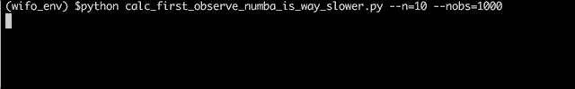

函数的 Numba 版本比 Numpy 版本长得多，**为什么**？

> 如图所示，我得到的`**N**umba`运行时间比 `**Numpy**`长 600 倍**！我可能做错了什么？**

在进行详细的诊断之前，让我们后退一步，回顾一些核心概念，以便更好地理解`Numba`是如何工作的，并希望能更好地使用它。如果您熟悉这些概念，请直接进入**诊断部分。**

## Python，字节码和 PVM？

Python 作为一种高级编程语言，需要被翻译成本机语言，以便硬件(例如 CPU)能够理解并执行这些指令。

对于像 C 或 Haskell 这样的语言，翻译是直接从人类可读语言到本地二进制可执行指令。这是在代码执行之前完成的，因此通常被称为提前(AOT)。其他语言，如 JavaScript，在运行时被一条一条地翻译。

预编译代码的运行速度比解释后的代码快几个数量级，但是需要权衡平台特定性(特定于编译代码的硬件)和预编译的义务，因此是非交互式的。

Python，像 Java 一样，使用这两种翻译策略的混合:高级代码被编译成一种中间语言，称为`Bytecode`，它是进程虚拟机可以理解的，它包含所有必要的例程来将`Bytecode`转换成 CPU 可以理解的指令。在 Python 中，进程虚拟机被称为`Python virtual Machine (PVM)`。

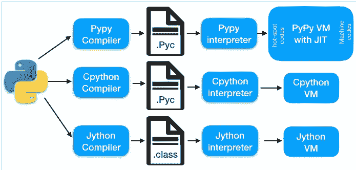

不同实现中的 Python 编译—图片由作者提供

与纯解释语言相比，这种策略有助于 Python 的可移植性和更快的速度。然而，由于解释高度复杂的`CPython Bytecode`需要时间，所以`PVM`上的运行时间`Bytecode`与本机代码的运行时间相比仍然很慢。出于这个原因，新的 python 实现通过优化`Bytecode`来提高运行速度，以直接在`Java virtual Machine (JVM)`上运行，就像对于`Jython`一样，或者甚至在`[Pypy](https://www.pypy.org/)`中使用`JIT`编译器更有效。`JIT-compiler`基于低级虚拟机(LLVM)是`Numba`背后的主要引擎，这通常会使其比`Numpy`功能更有效。

## 那么 Python 中的 JIT 是什么呢？

实时(JIT)编译器是运行时解释器的一个特性。而不是像在`CPython`解释器中那样，每次调用一个方法就解释字节码。JIT 将分析代码以找到将被多次执行的`hot-spot`，例如循环中的指令，并将该部分编译成本机语言。这允许在需要时动态编译代码；与`bytecode`解释相比，减少编译整个代码的开销，同时显著提高速度，因为常用指令现在是底层机器的本地指令。JIT 编译器还提供了其他优化，比如更有效的垃圾收集。

## **Numba 如何工作？**

简单地说，一个 python 函数可以简单地通过使用装饰器`"@jit"`转换成`Numba`函数。当编译这个函数时，`Numba`会查看它的`Bytecode`来找到操作符，同时也拆箱函数的参数来找出变量的类型。这两个信息帮助`Numba`知道代码需要哪些操作数以及它将修改哪些数据类型。然后沿着分析管道向下，创建函数的中间代表(IR)。之后，它在后端将此处理给后端低级虚拟机`LLVM`，以进行低级优化并使用`JIT`生成机器码。一旦生成了机器码，它就可以被缓存并执行。缓存允许我们下次需要运行相同的函数时跳过重新编译。如需更多详细信息，请查看此[技术说明。](https://numba.pydata.org/numba-doc/latest/developer/architecture.html)

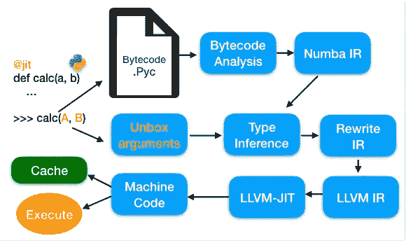

Numba 的工作模式——作者提供的图片——改编自 Stan Seibert (Numba 的合著者)

> 对 Numba 明显迟钝的诊断

1.  **研究案例的设定**

有了所有这些先决知识，我们现在准备诊断我们的`Numba`代码的缓慢性能。

首先让我们安装`Numba` : `pip install numba`

我们的测试功能如下。

```
def calc_numpy(x, y, n):
    res = np.zeros(len(x))
    for i in range(n):
        for j in range(n):
            res += np.add(i*x, j*y)
    return res

**@jit(nopython=True, cache=True)**
def calc_numba(x, y, n):
    res = np.zeros(len(x))
    for i in range(n):
        for j in range(n):
            res += np.add(i*x, j*y)
    return res
```

正如你可能注意到的，在这个测试函数中，有两个循环被引入，因为`Numba`文件表明`loop`是其中一种情况，这时`JIT`的好处将会很明显。除了装饰器`"@jit"`之外，`calc_numba`与`calc_numpy`几乎相同。我们将使用大小为`nobs`和`n`的循环来检查每个函数在模拟数据上的运行时间。

```
args = parse_args()
nobs = args.nobs
n = args.n
x = np.random.randn(nobs)
y = np.random.randn(nobs)res_numpy = calc_numpy(x, y, n)
res_numba = calc_numba(x, y, n)
```

这产生了

```
check res_numpy == res_numba: True
run time Numpy / Numba [ms]: 1.34 / 839.37
```

2. **Numba 开销**

很明显，在这种情况下，`Numba`版本比`Numpy`版本长得多。由于代码完全相同，唯一的解释就是`Numba`用`JIT`编译底层函数时增加了开销。如果是这样的话，如果我们再次调用`Numba`函数(在同一个会话中),我们应该会看到改进。

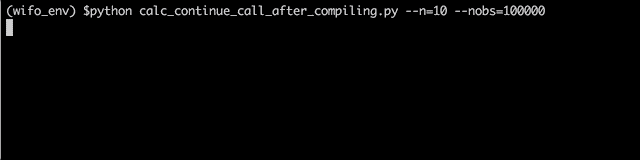

Numba 函数在编译后速度更快——Numpy 运行时不是不变的

如图，第一次调用后，`Numba`版本的函数比`Numpy`版本快。同时，如果我们再次调用`Numpy`版本，它需要相似的运行时间。这很好的展示了`Numba`中编译的效果。

**问题是**:我们想用`Numba`来加速我们的计算，然而，如果编译时间那么长，那么运行一个函数的总时间会不会比 cannonical `Numpy`函数的**时间太长了？**

> Numba 哪里可以发光？

## **1。交互式 Jupyter 笔记本**

作为构建您的 Jupiter 笔记本的一种常见方式，一些函数可以在顶部单元格上定义和编译。然后，这些函数可以在后面的单元格中多次使用。在这种情况下，编译时间的损失可以通过以后使用时的时间增益来补偿。

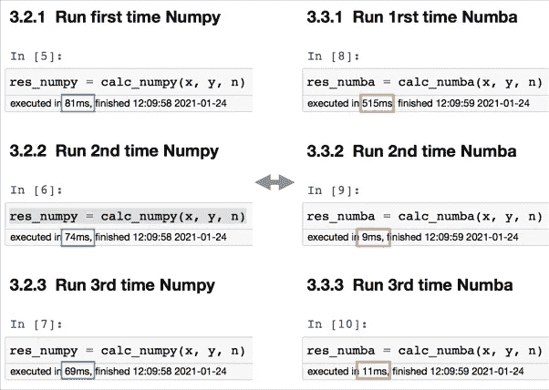

作者在 Jupyter 笔记本中重用快速编译的数字函数

## 2.**缓存功能**

现在，如果您没有使用交互式方法，如`Jupyter Notebook`，而是在`editor`中运行`Python`或直接从`terminal`运行。我们如何从一个函数的编译版本中获益？事实上，这是装饰器`jit`中的选项`cached`的直接结果。

```
@jit(nopython=True, **cache=True**)
def calc_numba(x, y, n):
    res = np.zeros(len(x))
    for i in range(n):
        for j in range(n):
            res += np.add(i*x, j*y)
    return res
```

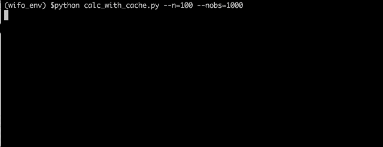

Numba 中的缓存选项允许避免重新编译

如图所示，当我们第二次重新运行相同的脚本时，测试函数的第一次运行所用的时间比第一次少得多。这是因为它利用了缓存的版本。还要注意，即使使用了缓存，函数的第一次调用仍然比随后的调用花费更多的时间，这是因为检查和加载缓存函数的时间。

事实上，如果我们现在签入 python 脚本的同一个文件夹，我们会看到一个包含缓存函数的`__pycache__`文件夹。

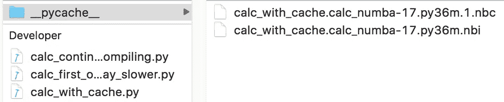

当使用' cache '选项时，编译的函数将被缓存到 __pycache__ 中

## 3.**大**循环次数

你可能会注意到，在上面讨论的例子中，我故意改变了循环数`n`。实际上，`Numba`或`Numpy`版本之间运行时间的增加取决于循环的数量。让我们试着比较一下测试函数中大量循环的运行时间。

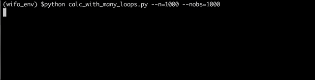

Numba 在高循环数时表现出色

更普遍的是，在我们的函数中，循环的次数非常多，编译一个内部函数的成本，比如 np。`add(x, y)`将在很大程度上由每次循环迭代重新解释`bytecode`的时间增益来重新补偿。

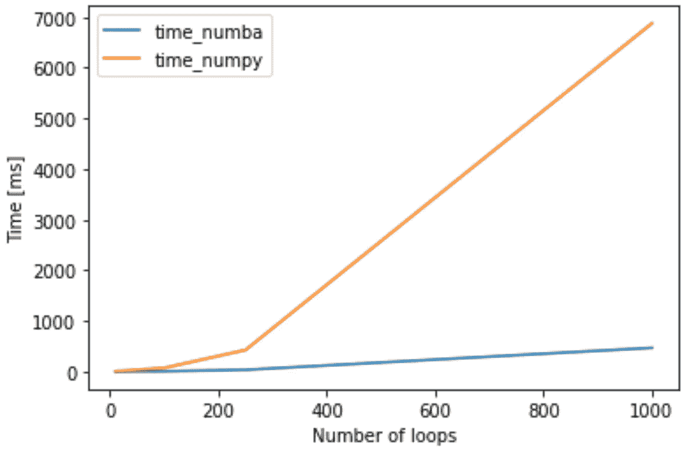

在高循环数(nobs=1000)下,“Numba”运行时间低于“numpy ”-图片由作者提供

## 4.大数据

与循环次数类似，您可能也会注意到数据大小的影响，在本例中是由`nobs`调制的。我们可以测试将输入向量的大小从`x, y`增加到`100000`。


Numba 也因大量输入数据而大放异彩

对于较大的输入数据，`Numba`版本的函数必须比`Numpy`版本快，即使考虑到编译时间。

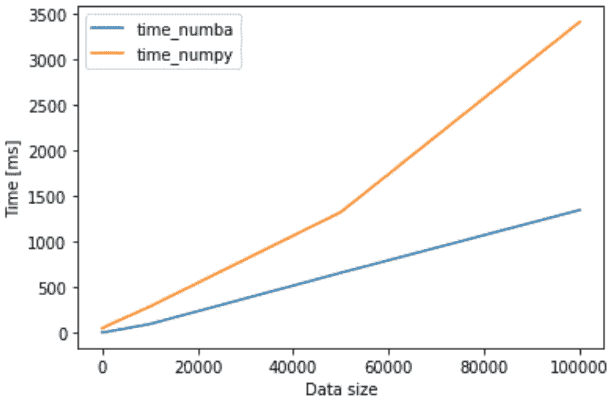

对于大输入(nloop=100)，运行时间“Numba”低于“Numpy 图片由作者提供

事实上，`Numpy`和`Numba`运行时间的比率将取决于数据大小和循环次数，或者更一般的函数性质(要编译)。下面是这两个参数的`Numpy/Numba`运行时比率的一个例子。

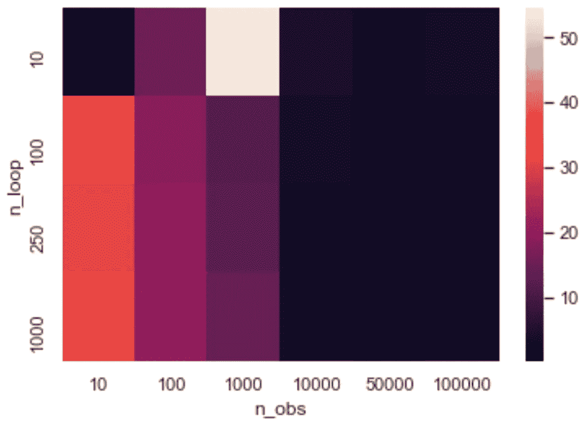

比率 Numpy/Numba 运行时间与循环次数和输入数据大小的函数关系—图片由作者提供

## 最终注释

我发现`Numba`是优化计算时间的一个很好的解决方案，使用`jit` decorator 对代码的改动很小。包中还有更多令人兴奋的东西有待发现:**并行化、矢量化、GPU 加速**等，这些超出了本文的范围。好奇的读者可以从 [Numba 网站](https://numba.pydata.org/)找到更多有用的信息。

通过这个简单的模拟问题，我希望讨论一些我觉得有趣的`Numba`、`JIT-compiler`背后的工作原理，希望这些信息对其他人有用。像往常一样，如果你有任何意见和建议，请不要犹豫让我知道。

## 参考

[1] [编译语言 vs 解释语言](https://finematics.com/compiled-vs-interpreted-programming-languages/)
【2】[JIT vs 非 JIT 的比较](https://stackoverflow.com/questions/8789000/why-does-interpreter-with-jit-produce-faster-codes-than-the-one-without)
【3】[Numba 架构](https://numba.pydata.org/numba-doc/latest/developer/architecture.html)
【4】[pypypy 字节码](https://doc.pypy.org/en/latest/interpreter.html)