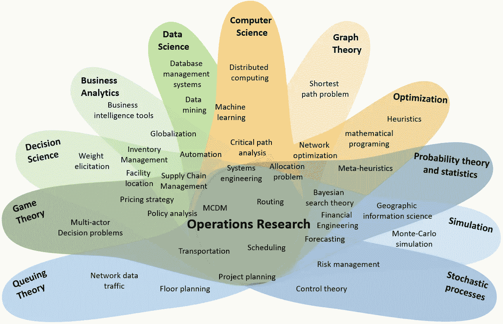

# 为什么运筹学很棒——简介

> 原文：<https://towardsdatascience.com/why-operations-research-is-awesome-an-introduction-7a0b9e62b405?source=collection_archive---------1----------------------->

## 数学是宇宙的语言，根据定义，它是逻辑的。但是做数学不仅仅是逻辑——它是一个利用数学给我们的工具的高度创造性的过程。在运筹学中，你可以用数学工具创造性地解决一些令人兴奋的问题！

运筹学(OR)是一个应用数学领域，其中数学工具和运算符不是用于进一步研究数学，而是通过设计创新的解决方法来分析和解决 OR 领域内的问题。

图一。美国宇航局在 [Unsplash](https://unsplash.com?utm_source=medium&utm_medium=referral) 拍摄的照片

# 理解运筹学的动机

未来的决策将尽可能接近完全自动化(想想“托尼·斯塔克”级别的自动化)。研究和促进这种转变的一个研究领域是 OR。其核心是一个应用数学领域，将高级分析方法集成到决策支持/决策中。

随着问题和决策环境变得越来越复杂，推进强调人机界面的研究以避免误解是至关重要的。未来的一个经典恐怖例子是，如果决策者寻求最大化客户幸福，那么(人工智能)系统会将这一点转化为将每个人置于类似于“黑客帝国”中的多巴胺昏迷状态(我们可能已经进入，也可能没有进入)..).

但是，我们今天还面临着更多的实际问题。例如包裹递送的路线安排，其中路线的总距离应该最小化，同时仍然使递送的包裹的数量最大化。在极端情况下，这两个目标要么不让司机递送任何包裹，要么不让他们有任何空闲时间，但在这两者之间也有许多次优实例。这些问题只是冰山一角，杰克。因此，未来的决策者能够恰当地整合他们的偏好以避免这些情况是至关重要的——而运筹学恰恰研究了这一点！

图 2:无限长手套说明了或者(当然！)，因为 OR 带来的工具包将会抹去未来问题的一半。照片由[晨酿](https://unsplash.com/@morningbrew?utm_source=medium&utm_medium=referral)在[破浪](https://unsplash.com?utm_source=medium&utm_medium=referral)

我还是研究生的时候偶然发现了数学和经济学，这两个方向都有可能研究；要么还是金融工程。相比较而言，后者处理金融、交易和风险/投资方面的决策，而运筹学更广泛地处理工业和商业领域的决策。虽然，一些术语将金融工程作为一个更专业的子类别放到了当时更广泛的 OR 领域。

# 什么是运筹学？

一般来说，或涉及获得一些现实世界目标函数的极值；最大值(利润、性能、效用或收益)，最小值(损失、风险、距离或成本)。它结合了数学建模、优化和统计分析的技术，同时强调了人机界面。然而，回答这个问题的一个困难是，科学术语中有很多重叠——有时术语变得非常流行，影响了术语的前景。例如，人工智能和大数据等模糊而宽泛的术语的流行，这两个术语对营销都很有用，但对研究的讨论毫无帮助。因此，我试图用 ORs 相关的字段、子字段和图 3 中解决的问题来说明它。

图 3:运筹学相关学科和问题的整体说明。注意，我很大程度上受限于 2D 的表述，因为除了这里显示的，学科之间还有许多其他的联系。例如概率论和统计学是机器学习的固有部分。Alex El kjr Vasegaard 的插图。

运筹学起源于 17 世纪，当时博弈论方法和期望值被用来解决问题。现代版的 OR 起源于第二次世界大战期间，当时很明显，军方需要解决战争中出现的一些重要的后勤和供应链问题。

当时，它被定义为“一种为行政部门提供有关其控制下的业务决策的定量基础的科学方法”，并被创造为“运营分析”(仍在丹麦)，或“定量管理”。

# 运筹学的未来？

OR 的一个吸引人的特点是知识、技能和工具在各个行业的适用性。如今，OR 在大多数企业和行业中以或多或少的专业化版本应用，从农业、能源交易、生产和销售到航天工业、资产定价、军事行动和需求预测，无所不包。最显著的用例可能是:

*   供应链管理
*   物流和库存管理
*   路由和寻路问题
*   预测性维护
*   调度和分配问题
*   评估问题(多标准决策)
*   系统工程
*   预测

工具的共同点是以下四项技能，使您能够:

*   利用数学优化方法，如线性规划、动态规划、随机规划等。
*   开发求解算法。通常需要近乎实时的解决方案。也就是说，最优解不是必须的。人们“只是”想要一个足够好的解决方案。对于具有高复杂性的大问题(例如，NP-Hard 问题)，诸如专家启发的启发式算法或生物启发的遗传算法、蚁群优化、甚至神经网络或决策树启发的梯度推进方法的解决算法。这取决于问题的框架，以及它是基于模型还是基于数据的解决方法。
*   进行广泛的模拟，以调查衍生解决方案的稳健性和灵活性。或者通过蒙特卡罗模拟、灵敏度分析等。
*   对问题进行广泛的分析，例如确定网络中的关键路径。为了举例说明正确分析的重要性，在网络分析中，更具体地说，在交通网络中，已经观察到通过移除道路，可以增加交通流量。这是布赖斯悖论，它也被发现欺骗其他系统，如电网，生物学和团队运动策略。因此，正确分析自己的解决方案至关重要。

我希望这是非正式的，让你知道什么是运筹学——我的家人、朋友和其他研究领域的同事一直在问我这个问题，所以我希望这澄清了你的兴趣。