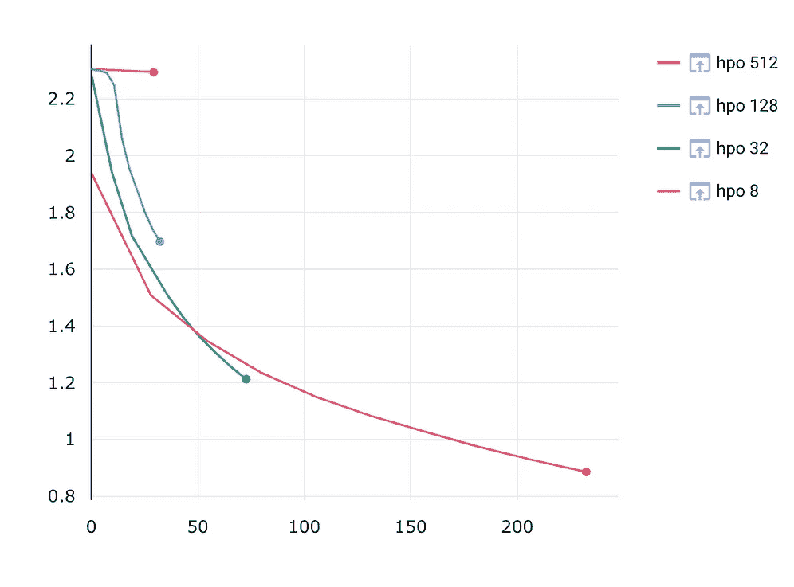
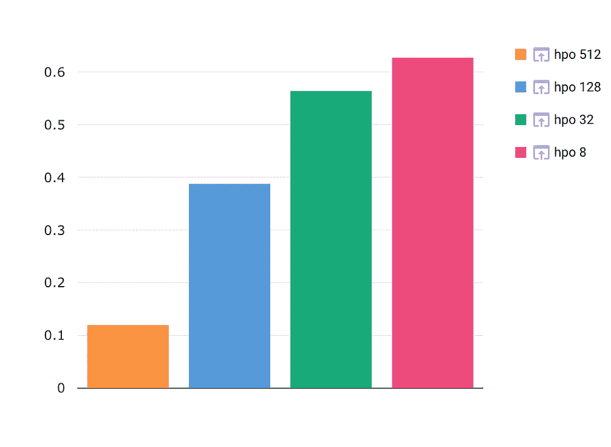
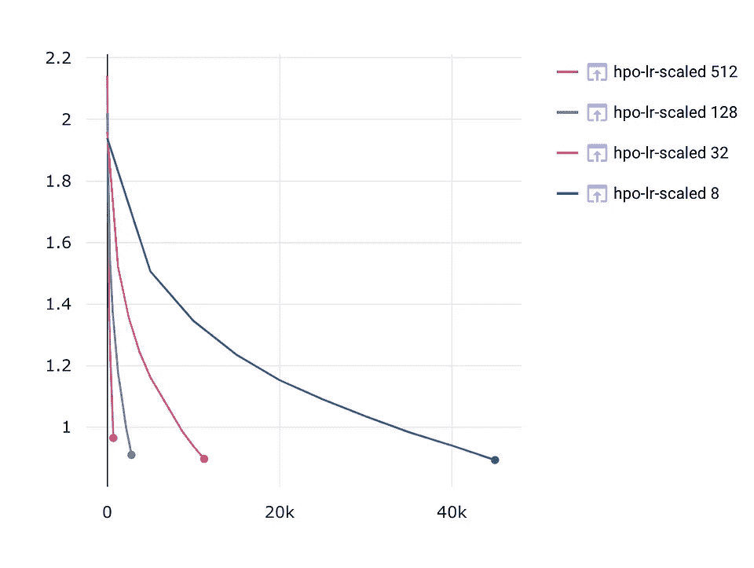
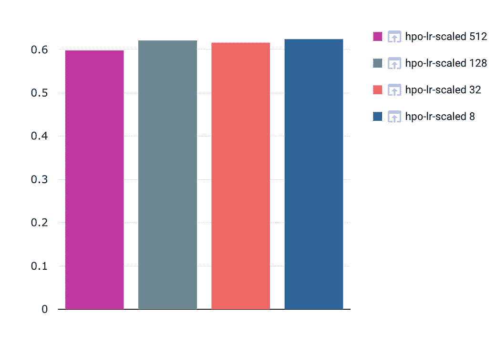
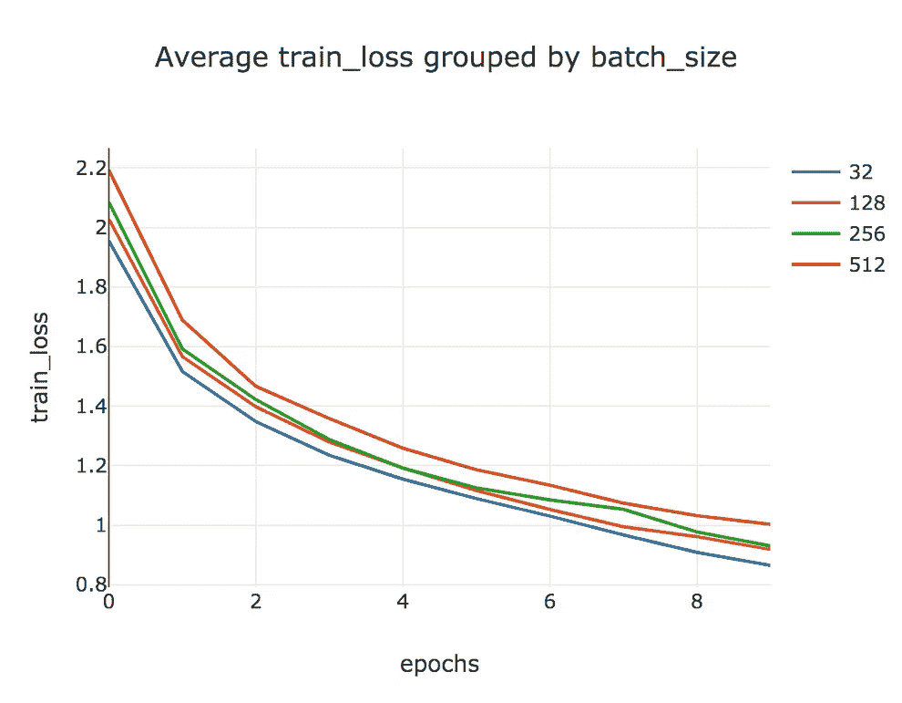
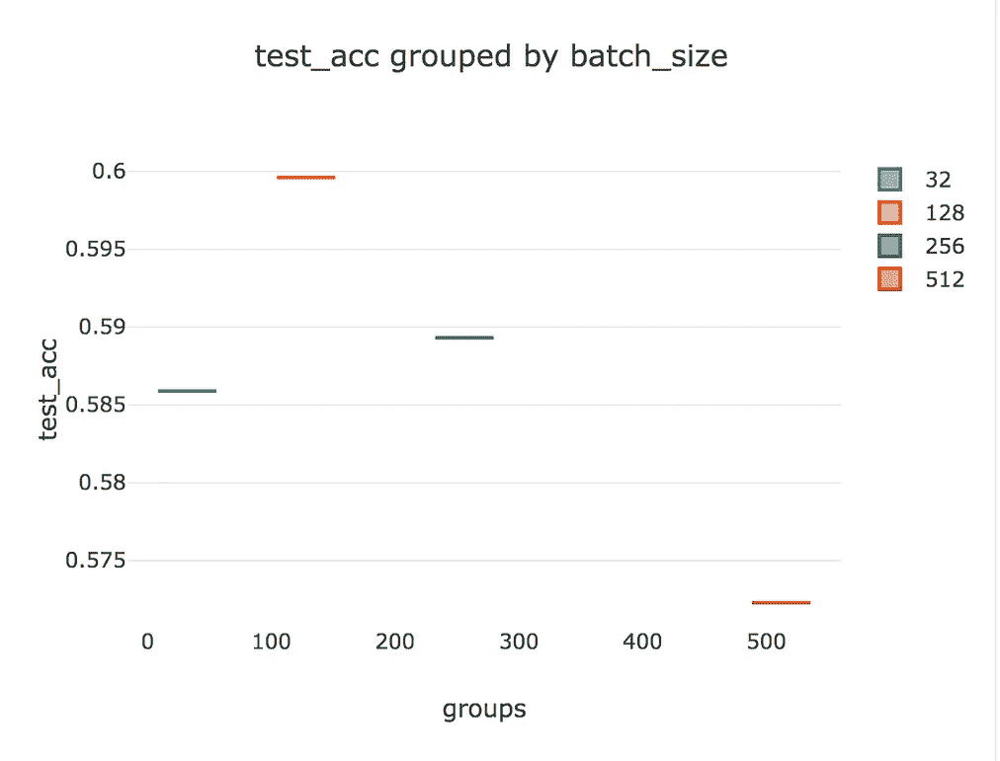
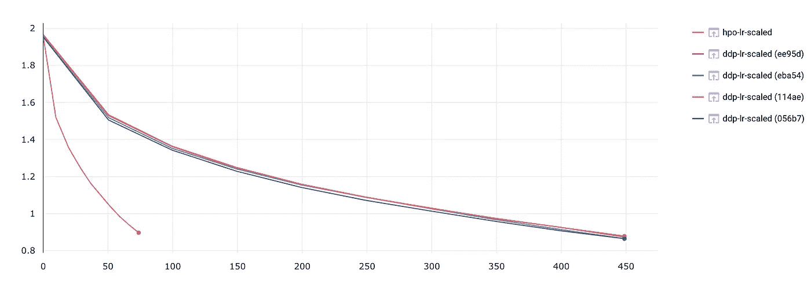

# 为什么并行培训可能不适合您

> 原文：<https://towardsdatascience.com/why-parallelized-training-might-not-be-working-for-you-4c01f606ef2c?source=collection_archive---------15----------------------->

## [理解大数据](https://towardsdatascience.com/tagged/making-sense-of-big-data)

## 神经网络并行训练的动机、益处和注意事项指南

# 介绍

有几种并行训练神经网络的方法。

1.  模型间并行性，也称为并行化超参数搜索
2.  数据并行性
3.  模型内并行性，又称模型并行性
4.  流水线并行

在这篇文章中，我们将探讨两种最常见的并行方法，模型间并行和数据并行。我们将在 CIFAR10 数据集上使用一个简单的 CNN 模型来演示这些技术。我们将在运行 AWS 深度学习 AMI 和 Pytorch (1.7.1)的 4 GPU 机器上训练这个模型

# 并行培训的优势

并行训练最明显的优势是速度。在超参数搜索的情况下，同时评估多个配置允许我们快速缩小最有希望的选项。

通过分布式数据并行(DDP)训练，模型参数的副本被放置在每个可用的 GPU 上，并且每个副本被提供给整个数据集的不同子集。

每次批量评估后，副本的梯度将被同步和平均。基于这些同步的梯度来更新模型副本的权重。

这增加了模型使用的有效批处理大小，允许它在比单个 GPU 的内存容量更大的批处理上进行训练。随着训练数据集大小的增加，DDP 成为一种保持训练时间合理的方法。

# 批量的重要性

使用较大的批量会导致更快的训练，因为网络能够以更少的步骤迭代整个数据集。然而，经验证据表明，更大的批量倾向于收敛到损失面的尖锐最小值，这导致泛化能力差[ [1](https://arxiv.org/pdf/1609.04836.pdf) ]。相比之下，批量越小，最小值越宽、越平，具有良好的泛化能力。

让我们通过对一组候选批量运行超参数搜索来测试这一点。我们将使用恒定的学习速率 **0.001** 在 CIFAR10 上训练我们的 CNN**10 个时期**。

我们将并行运行 [Comet Optimizer](https://www.comet.ml/docs/python-sdk/Optimizer/) ，并作为命令行参数输入一个 Optimizer 配置文件。

```
comet optimize -j 4 comet-pytorch-parallel-hpo.py optim.config
```

> [并行化超参数优化的源代码](https://www.comet.ml/team-comet-ml/parallelism/e35cc986496e4c9c835008a658fc00ab?experiment-tab=code&utm_source=medium)

这里的`j`是我们想要启动的并行进程的数量。你可以在这里找到更多关于彗星优化器[的细节](https://www.comet.ml/docs/command-line/#comet-optimize)

`optim.config`文件只是一个 JSON 对象，包含我们的参数搜索网格。

```
{
   # We pick the Bayes algorithm:
   "algorithm": "random",
   # Declare your hyperparameters in the Vizier-inspired format:
   "parameters": {
      "batch_size": {
         "type": "discrete", 
         "values": [8, 32, 128, 512]
      },
   },
   # Declare what we will be optimizing, and how:
   "spec": {
     "metric": "val_loss",
     "objective": "minimize",
   },
}
```



左:每个批量配置的运行时间(秒)，右:每个批量配置的相应测试准确度。来源:[comet . ml](https://www.comet.ml/site?utm_source=medium)

当查看折线图时，我们看到批量越大，训练运行时间越短。然而，较大的批量也会导致更差的训练误差和测试精度。事实上，批量越小，测试准确度越好。这是一个问题，因为最小批量的完成需要将近**8 倍的时间**。

> 完成最小批量需要将近**8 倍于**的时间。

# 提高学习速度

使用大批量的一个关键方面是调整学习速度。一般的经验法则是遵循[线性缩放规则](https://arxiv.org/pdf/1706.02677.pdf)【2】。这意味着当批量增加 **K** 倍时，学习率也必须增加 **K** 倍。

让我们在超参数搜索中对此进行研究。让我们根据批量大小来线性调整我们的学习速度。我们将使用批次大小 **8** 作为我们的缩放常数。

> [这些比例学习率实验的源代码](https://www.comet.ml/team-comet-ml/parallelism/dbd4eb2a1df549f4834eda8a80142fec?experiment-tab=code&utm_source=medium)



左图:具有成比例学习率的不同批量的训练损失曲线，右图:具有成比例学习率的配置的测试精度。*来源:*[*comet . ml*](https://www.comet.ml/site?utm_source=medium)

这似乎起了作用。根据批量调整学习速度可以缩小泛化差距！让我们将这个想法与我们的分布式数据并行方法结合起来。

# 使用更大的有效批量

通过 DDP 训练，数据集在多个可用的 GPU 之间进行划分。

让我们使用 [Pytorch 分布式数据并行模块](https://pytorch.org/tutorials/intermediate/ddp_tutorial.html)运行一组实验。该模块处理将模型复制到每个 GPU，以及跨 GPU 进程同步梯度和更新权重。

使用 ddp 模块非常简单。将您的现有模型包装在 DDP 模块中，并将其分配给 GPU

```
model = Net()
model.cuda(gpu_id)
ddp_model = DDP(model, device_ids=[gpu_id])
```

我们将使用 DistributedSampler 对象来确保数据正确地分布在每个 GPU 进程中

```
# Load training data
    trainset, testset = load_data()
    test_abs = int(len(trainset) * 0.8)
    train_subset, val_subset = random_split(
        trainset, [test_abs, len(trainset) - test_abs]
    )

    train_sampler = torch.utils.data.distributed.DistributedSampler(
        train_subset, num_replicas=world_size, rank=global_process_rank
    )

    trainloader = torch.utils.data.DataLoader(
        train_subset,
        batch_size=PER_REPLICA_BATCH_SIZE,
        sampler=train_sampler,
        num_workers=8,
    )
    valloader = torch.utils.data.DataLoader(
        val_subset, batch_size=PER_REPLICA_BATCH_SIZE, shuffle=True, num_workers=8
    )
```

最后，使用 DDP 包装的模型运行训练循环

```
for epoch in range(args.epochs):
   train_loss = train(ddp_model, optimizer, criterion, trainloader,       epoch, gpu_id)
   val_loss, val_acc = evaluate(ddp_model, criterion, valloader, epoch, gpu_id)
```

> [DDP 示例源代码](https://www.comet.ml/team-comet-ml/parallelism/c63d294dfb9b416b9d95d954bcdd3aaf?experiment-tab=code&utm_source=medium)

在我们的例子中，每个 GPU 接收四分之一的数据集。当我们以这种方式运行训练时，我们的有效批量大小是 GPU 数量和每个 GPU 的批量大小的乘积。因此，当我们将每个 GPU 的批处理大小设置为 8 时，我们的有效批处理大小实际上是 32。我们可以通过将 DDP 训练运行与批处理大小为 32 的单个 GPU 训练运行进行比较来验证这一点。注意曲线看起来是多么的相似，并且跑相似的训练步数。这些曲线表明，即使我们**在每个 GPU 进程**中使用较小的批量，我们的模型性能仍然依赖于**的有效批量**。

# 把所有的放在一起

让我们结合我们所学的学习率调整，重新运行 DDP 培训。



左图:使用比例学习率和 DDP 训练的训练损失，右图:使用比例学习率和 DDP 训练的测试 Acc。*来源:* [*Comet.ml*](https://www.comet.ml/site?utm_source=medium)

看起来，即使是学习率缩放也有其局限性。当我们将批量增加到某个值时，训练得到了改善，在此之后，我们看到我们的测试精度开始下降。

# 警告

理论上，将训练分布在多个 GPU 上应该会加快训练模型所需的总时间。实际上，情况并非总是如此。跨多个 GPU 进程同步梯度会导致通信开销，这对于最小化是不可忽视的。

在下面的面板中，我们将批量为 32 的单个流程培训运行的运行时间与具有相同有效批量的 DDP 培训运行的运行时间进行了比较。单个流程运行需要 73 秒才能完成，而 DDP 培训运行几乎比慢八倍**，需要 443 秒才能完成。**

这可能是因为每次我们在训练代码中调用`loss.backward()`时，梯度都是同步的。进程之间的持续通信导致总体运行时间增加。这是设置 DDP 培训时需要注意的一点。如果您在多机器设置中运行您的实验，请确保网络带宽足以处理发送和接收整个模型的检查点数据的每个进程。

加速这个过程的另一个方法是改变梯度的同步时间表，但是这超出了本报告的范围。



单一流程培训与分布式培训的培训损失曲线。*来源:* [*Comet.ml*](https://www.comet.ml/site?utm_source=medium)

# 结论

我们希望这份并行培训入门指南对您有所帮助。在随后的文章中，我们将讨论如何优化您的分布式培训代码，以充分利用您的计算基础设施。

> [点击此处阅读完整的交互式可视化报告](https://www.comet.ml/team-comet-ml/parallelism/reports/advanced-ml-parallelism?utm_source=medium)
> 
> [Comet.ml](https://www.comet.ml/site?utm_source=medium) —轻松跟踪、比较和调试您的模型！
> 
> 如果你还没有试用过 Comet，它是一个很棒的工具，可以让你跟踪、比较和调试你的 ML 模型！
> 
> 它可以与 Colab、Jupyter 笔记本和脚本一起使用，最重要的是它是 100%免费的！
> 
> *入门* [*实验跟踪*](https://www.comet.ml/site/data-scientists?utm_source=medium) *今天！*
> 
> [*今天免费试用彗星！*](https://www.comet.ml/signup?utm_source=medium)

# 参考

[1] Keskar，Nitish Shirish 等，“关于深度学习的大批量训练:泛化差距和尖锐极小值。” *arXiv 预印本 arXiv:1609.04836* (2016)。

[2] Goyal，Priya 等，“精确的大型迷你批次 sgd:在 1 小时内训练 ImageNet。” *arXiv 预印本 arXiv:1706.02677* (2017)。