# 为什么需要游戏玩家

> 原文：<https://towardsdatascience.com/why-player-of-games-is-needed-a01505c4bad7?source=collection_archive---------5----------------------->

## 游戏玩家(PoG)和 AlphaZero 的比较

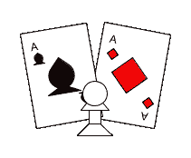

国际象棋和扑克图片|作者图片

大家好，今天我们将比较[游戏玩家](https://arxiv.org/abs/2112.03178) (PoG)和 [AlphaZero](https://arxiv.org/pdf/1712.01815.pdf) 。PoG 是 DeepMind 开发的新 AI 智能体，是同类产品中第一个在完美和不完美信息游戏中都实现高水平性能的智能体。

在完美信息博弈中，每个参与者都知道博弈中的所有信息。对于国际象棋和围棋来说，了解游戏中的所有信息意味着玩家可以看到自己和对手的棋子。

在不完善的信息博弈中，玩家无法看到所有的信息。对于扑克，玩家看不到对手的牌，这增加了难度，因为你并不总是知道玩家是否在说实话。对于这样的游戏，人工智能很难学习，因为它没有可靠的信息来源，只能依靠自己的判断。

传统上完美信息和不完美信息游戏机器人使用不同的方法。完美信息游戏 ai 如 AlphaZero 使用[蒙特卡罗树搜索](https://en.wikipedia.org/wiki/Monte_Carlo_tree_search) (MCTS)。然而成功的不完全信息博弈人工智能使用博弈论推理。这种方法上的差异是因为算法不适合另一种类型的游戏。AlphaZero 在众多完美信息游戏中实现了最先进的游戏性。然而，对 AlphaZero 最大的批评之一是它无法在不完美的信息游戏中表现良好，这使得 PoG 成为广义人工智能的又一次飞跃。

# AlphaZero 描述

首先，我将简要介绍一下什么是 AlphaZero 以及它是如何工作的。关于 AlphaZero 的更深入的解释，请查看我的另一篇博文[这里](/building-a-chess-engine-part2-db4784e843d5)，在那里我将 AlphaZero 和变形金刚结合在一起。

AlphaZero 是一种强化学习算法，学习玩完美信息游戏。AlphaZero 之所以如此引人注目，是因为它完全通过自我游戏实现了最先进的游戏。这一特性让许多人将 AlphaZero 视为长期规划端到端学习能力的证明点。

## AlphaZero 和不完美博弈

AlphaZero 在计划采取何种行动时，结合使用了神经网络(NN)和 MCTS。这种方法对于完美信息游戏非常成功，因为在给定足够计算能力的情况下，对于这种类型的游戏，MCTS 理论上与 [MiniMax](https://en.wikipedia.org/wiki/Minimax) 搜索算法收敛。MiniMax 是一种贪婪的搜索算法，它搜索博弈树的所有可能的移动，理论上可以在给定足够计算能力的情况下“解决”所有完美信息博弈。AlphaZero 使用 MCTS 而不是极大极小，因为现代的计算限制使得极大极小对于像国际象棋和围棋这样的高复杂度游戏来说是不可行的。然而，MCTS 在不完美信息博弈中表现不佳，因为它无法保证收敛于 T2 纳什均衡。

博弈树对于完美信息博弈非常有用，因为理论上你可以知道每一个行动的反应，因为这类博弈处于纳什均衡。然而，对于不完美的游戏，这种逻辑是不成立的。为了更好地理解这个逻辑失败的原因，让我们以扑克为例。在扑克游戏中，玩家可以虚张声势，即使他们的牌不比对手好，他们也有能力获胜，这给游戏增加了很大的不确定性。由于这种额外的不确定性，除非你在游戏中有最好的牌，否则你永远无法确定自己是否会赢，这使得正确遍历游戏树变得非常困难。正因为如此，AlphaZero 不适合不完美信息博弈，因为在使用 MCTS 时结果不一致。

# PoG 描述

PoG 使用神经网络和生长树反事实后悔最小化(GT-CFR)来规划要采取的行动。GT-CFR 是[反事实后悔最小化](https://poker.cs.ualberta.ca/publications/NIPS07-cfr.pdf) (CFR)算法的变体。GT-CFR 是一个两步算法，使用 [CFR+](https://www.ijcai.org/Proceedings/15/Papers/097.pdf) 来优化其策略，以最小化遗憾，随后是一个扩展阶段，在该阶段中，它扩展游戏树，类似于 MCTS。

## 更新策略阶段

为了更好地理解这个算法，我们先来看看策略优化阶段。CFR 算法家族使用最小化遗憾的思想作为最优策略。GT-CFR 使用 CFR+来最小化遗憾，因为它是普通 CFR 算法的前身，并且具有更快的纳什均衡收敛。CFR+算法对后悔的定义是；

> “事后来看，通过遵循一些替代策略可以获得多少额外效用的衡量”[【9】](https://www.ijcai.org/Proceedings/15/Papers/097.pdf)

也就是说，它寻找平均来说可能会产生更好结果的行动。

为了最小化遗憾，CFR+使用遗憾匹配+搜索完整的公共树。后悔匹配+是 CFR+对普通 CFR 算法的一个实质性升级。在后悔匹配+中，我们归一化累积后悔值 Q 来更新策略。通过以这种方式更新策略，我们有效地解释了不完美信息博弈中的不确定性。

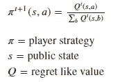

后悔匹配+政策方程式|作者图片

Q 值是对遗憾匹配+的改进之一，因为它允许在向前传递期间计算累积遗憾，而不需要存储遗憾。为了确定累积遗憾，我们使用下面的等式。

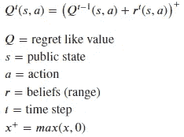

累积后悔方程式|作者图片

通过查看所有其他选项，看看是否存在任何更好的举措，可以发现瞬间后悔。为了确定瞬间后悔，我们使用下面的等式。

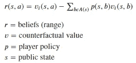

瞬间后悔方程式|作者图片

PoG AI 使用价值和政策网络(CVPN)来预测反事实的价值和政策。在叶节点上，我们对 CVPN 进行查询，允许它充当 oracle。以这种方式使用 CVPN，使得扩展阶段成为可能，因为如果没有 CVPN，我们将无法预测之前未见过的节点的反事实价值和策略。

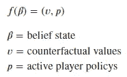

CVPN 方程|作者图片

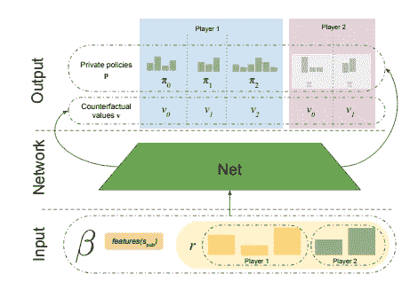

CVPN 图|图片来自[https://arxiv.org/pdf/2112.03178.pdf](https://arxiv.org/pdf/2112.03178.pdf)

在 CFR+算法中，线性加权策略平均通过基于迭代次数向遗憾添加自然衰减来帮助在迭代过程中平滑策略。为了帮助说明线性加权策略平均对策略更新阶段的积极影响，这里有两个图表，以便您可以比较使用策略和不使用策略的情况。

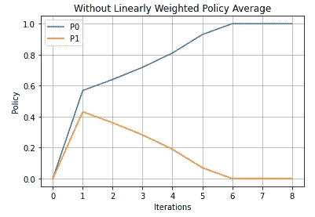

无线性加权保单平均值的保单|作者图片

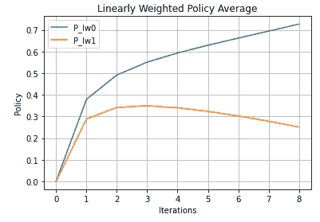

采用线性加权策略平均值的策略| |作者图片

正如您在上面的图表中所看到的，在更新阶段使用线性加权策略平均值时，策略变化更加稳定。线性加权策略平均使用以下等式。

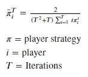

线性加权策略平均方程|作者图片

GT-CFR 政策更新阶段

## 树扩展阶段

既然我们已经了解了 CFR+是如何在这个算法中用来优化策略的，我们就来看看树扩展阶段。如果您熟悉 MCTS，树扩展阶段应该与您非常相似。当遍历游戏树时，使用下面的等式来确定最佳路径。

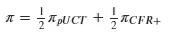

扩展节点选择方程|作者图片

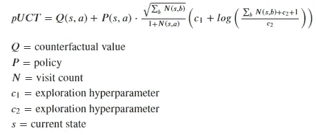

pUCT 方程式|作者图片

当遍历游戏树时，当遇到一个叶子节点时，我们扩展 k 个子节点。一旦树被展开，我们的节点访问计数被更新以用于 pUCT 等式。

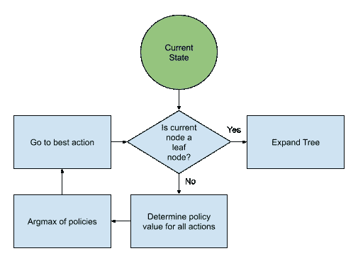

GT-CFR 扩展流程图|图片由作者提供

扩展游戏树的想法对 GT-CFR 来说是新的，并提供了与 MCTS 类似的好处，在那里我们可以通过用神经网络指导树搜索来玩高复杂度的游戏。

GT-CFR 扩展阶段

## 谢谢

现在你知道了。希望你现在能更好地理解 PoG 和 AlphaZero 之间的区别，以及为什么 PoG 是广义人工智能的又一进步。

感谢阅读。如果你喜欢这样，可以考虑订阅我的账户，以便在我最近发帖时得到通知。

# 参考

*   [https://arxiv.org/abs/2112.03178](https://arxiv.org/abs/2112.03178)
*   【https://arxiv.org/pdf/1712.01815.pdf】T2【2】
*   【https://en.wikipedia.org/wiki/Monte_Carlo_tree_search】T4【3】
*   [https://en.wikipedia.org/wiki/Game_theory](https://en.wikipedia.org/wiki/Game_theory)【4】
*   [https://towards data science . com/building-a-chess-engine-part 2-db 4784 e 843d 5](/building-a-chess-engine-part2-db4784e843d5)[5]
*   [https://en.wikipedia.org/wiki/Minimax](https://en.wikipedia.org/wiki/Minimax)【6】
*   [https://en.wikipedia.org/wiki/Nash_equilibrium](https://en.wikipedia.org/wiki/Nash_equilibrium)【7】
*   [https://poker.cs.ualberta.ca/publications/NIPS07-cfr.pdf](https://poker.cs.ualberta.ca/publications/NIPS07-cfr.pdf)【8】
*   [https://www.ijcai.org/Proceedings/15/Papers/097.pdf](https://www.ijcai.org/Proceedings/15/Papers/097.pdf)【9】