# 为什么 Python 如此喜欢下划线

> 原文：<https://towardsdatascience.com/why-python-loves-underscores-so-much-de03cf7bdcdd?source=collection_archive---------19----------------------->


图片由 [Manuel Enriquez](https://pixabay.com/users/tranquitelocuento-20314169/?utm_source=link-attribution&utm_medium=referral&utm_campaign=image&utm_content=6277391) 来自 [Pixabay](https://pixabay.com/?utm_source=link-attribution&utm_medium=referral&utm_campaign=image&utm_content=6277391)

## 使用下划线的一些技巧可以改进您的 Python 代码

很多编程语言在很多场景下使用下划线“_”，Python 也是如此。如果你曾经使用 Python 进行过面向对象的编程，你一定知道 Python 对象的构造函数是`__init__()`。这可能是我们在 Python 中需要使用下划线的最常见场景。

然而，在更多的情况下，我们可以使用一个或多个下划线来玩一些把戏。这可以提高我们代码的可靠性，甚至带来一些新的特性。在本文中，我将列出下划线的一些技巧。希望他们能帮忙。

# 1.临时变量


图片来自 [Pixabay](https://pixabay.com/?utm_source=link-attribution&utm_medium=referral&utm_campaign=image&utm_content=5935651) 的 [Tonda Tran](https://pixabay.com/users/sontung57-19733131/?utm_source=link-attribution&utm_medium=referral&utm_campaign=image&utm_content=5935651)

我要介绍的第一个技巧与临时变量有关。当我们不知道变量名或者不想给变量命名时，下划线可以帮助我们。

## REPL 的最后结果

REPL 指的是“阅读评估印刷循环”。当我们在 Python 控制台中运行一些东西时，结果将作为变量缓存在 REPL 中。这个变量没有名字，但是我们可以用下划线得到它。

最典型的例子就是 Jupyter 笔记本。假设我们在一个单元格中运行一些东西，那么我们可以在下一个单元格中使用下划线得到结果。

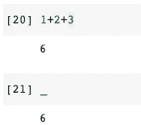

但是，需要强调的是,“无”值不会被缓冲。因此，下划线的值不会被替换，如下例所示。

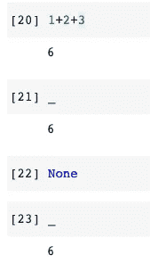

## 匿名变量

作为一个经验法则，当我们不需要命名变量时，我们也可以用下划线来命名它。通常，这只是因为我们以后不需要使用这个变量，但是它必须被放在某个地方。

```
for _ in range(10000):
    # Do something 10000 times
    pass
```

在上面的例子中，我们只需要一个 for 循环来运行一些代码片段 10k 次。然而，循环并不重要。因此，我们可以使用下划线作为 for 循环的索引。

同样值得一提的是，大多数 IDE 都知道这条“经验法则”,这样就不会在以后检查下划线的用法。相反，如果我们在这个 for 循环中使用一个命名变量，一些 IDE 工具可能会警告我们“定义了一个变量却没有使用它”。

## 占位符

下划线作为临时变量的另一个常见用法是作为占位符。当我们想从一个元组中提取值时，通常使用这种方法。请参见下面的示例。

```
my_tuple = (1, 2)x, _ = my_tuple
print(x)
```

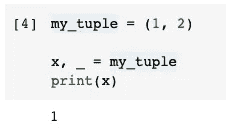

如图所示，我们从元组中获取第一个值，并将其赋给变量`x`。第二个被忽略，因为我们使用下划线作为“占位符”。

另一个您可能不知道的技巧是，我们可以使用带下划线的星号作为多个值的“占位符”。假设我们有一个包含多个值的元组，我们想从中获取第一个和最后一个值。

```
my_long_tuple = (1, 2, 3, 4, 5)x, *_, z = my_long_tuple
print('x =', x)
print('z =', z)
```

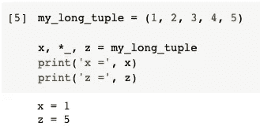

不管中间有多少个值，`x, *_, z`总会得到第一个和最后一个值。

# 2.提高可读性


图片来自 [Pixabay](https://pixabay.com/?utm_source=link-attribution&utm_medium=referral&utm_campaign=image&utm_content=1866951) 的 [Pexels](https://pixabay.com/users/pexels-2286921/?utm_source=link-attribution&utm_medium=referral&utm_campaign=image&utm_content=1866951)

这个大概很多开发者都知道，但我还是想放在这里。这个小技巧在很大程度上提高了程序中数字的可读性。

```
num = 1_000_000
print(num)
```

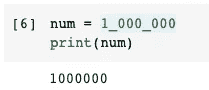

我们通常用逗号来分隔一个数字中的每 3 个数字，这样我们就可以很容易地阅读这个数字。在 Python 中，我们不能使用逗号，但是我们可以使用下划线来做同样的事情。

此外，对于一些文化和习俗，不要担心，我们可以把下划线放在任何地方。也不会影响结果。

```
num = 100_0000
print(num)
```

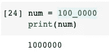

# 3.解决名称冲突


图片来自 [Pixabay](https://pixabay.com/?utm_source=link-attribution&utm_medium=referral&utm_campaign=image&utm_content=2430046)

下划线通常也用于避免名称空间中的冲突。请注意，在解释者层面没有关于这个的定义。所以，这又是下划线的另一个“经验法则”。

例如，我们想定义一个函数来获取某些产品的“类”。如果我们按如下方式编写代码，它将引发一个错误。

```
def print_class(class):
    print('Class:', class)
```

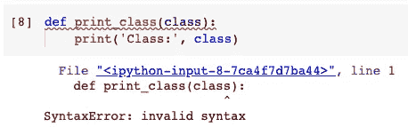

这是因为术语`class`是 Python 中的保留关键字之一。具体来说，Python 认为我们在定义一类对象，但语法显然是错误的。

在这种情况下，经验法则是在变量后面加上下划线，如下所示。

```
def print_class(class_):
    print('Class:', class_)print_class('Premium')
```

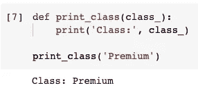

当然，我们不必使用“class”作为变量名，因为它只是一个变量名。然而，有时不避免保留关键字会提高代码的可读性。

# 4.私有/受保护的属性和功能


很不幸，此时此地的图片结束了我在 Pixabay 的旅程

下划线也可以用来保护一些我们不希望下游引用的属性和函数，或者是不必要让它们被导入或调用。

## 保护进口

例如，在一个`.py`文件中，我们可以定义一些常量和函数。然后，这个 Python 文件的意思就是被别人作为库导入。然而，我们可能在这个文件中有一些不应该被导入的本地帮助函数。

在这种情况下，我们可以在常量或函数前加一个下划线，这样它们就不会被`from ... import *`导入。

让我们创建一个文件`lib.py`并将以下两个函数放入其中。

```
def test_func():
    print("I'm a test")def _test_func():
    print("I'm a _test")
```

然后，让我们从这个文件中导入所有内容。

```
from lib import *
```

之后，我们可以验证`test_func()`是进口的，而`_test_func()`不是。

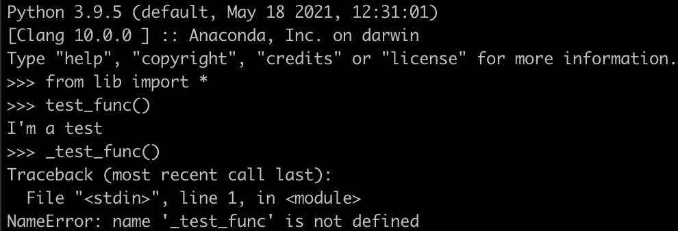

但是，请注意，这是一个相当“方便”的方法，可以防止我们导入不必要的函数。它不会阻止用户显式导入它。

如果我们显式导入该函数，它将工作。

```
from lib import _test_func
```

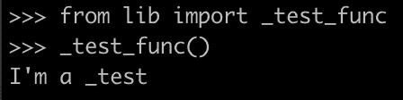

# 5.保护类属性/功能


图片来自 [Pixabay](https://pixabay.com/?utm_source=link-attribution&utm_medium=referral&utm_campaign=image&utm_content=801826) 的[自由照片](https://pixabay.com/photos/?utm_source=link-attribution&utm_medium=referral&utm_campaign=image&utm_content=801826)

不仅仅是导入，我们还可以使用下划线来保护类中的属性和函数不被外部调用。

这可以通过在需要保护的属性或函数前面添加双下划线`__`来实现。

让我们定义一个名为`Person`的类，然后实例化它。

```
class Person():
    def __init__(self, name, age):
        self.name = name
        self.__age = age def show(self):
        print(f"My name is {self.name} and I'm {self.__age} years old.") def __show(self):
        print(f"Hey {self.name}, you shouldn't call this function.")p1 = Person('Chris', 33)
```

所以，我们可以调用`show()`函数来打印预定义的字符串。

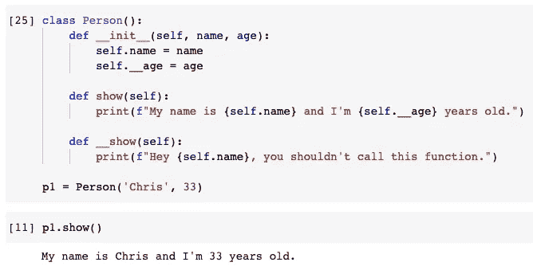

然而，如果我们试图调用受双下划线“保护”的属性`__name`和函数`__show()`，就会抛出错误。

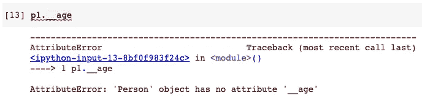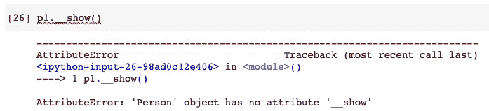

同样，这种“保护”不限于解释器级别。如果我们想在一个类中隐藏一些东西不让它被调用，这是很方便的。但是有一种方法可以显式调用。只是在他们前面加上`_<class_name>`。

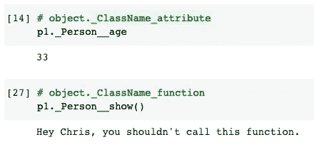

# 6.神奇的功能


Image by [萩原 浩一](https://pixabay.com/users/hanpen2-9510270/?utm_source=link-attribution&utm_medium=referral&utm_campaign=image&utm_content=3528638) from [Pixabay](https://pixabay.com/?utm_source=link-attribution&utm_medium=referral&utm_campaign=image&utm_content=3528638)

嗯，每个人都知道魔法功能，但它非常重要，所以我不想跳过它。在前面的例子中使用的`__init__()`函数是一种神奇的函数。除此之外，最重要的一个是类中的`__repr__()`函数。它定义了当我们打印一个对象时要输出什么。如果你熟悉 Java，这几乎等同于`toString()`方法。

让我们定义一个没有`__repr__()`函数的类，并尝试打印对象。

```
class Person():
    def __init__(self, name, age):
        self.name = name
        self.age = agep1 = Person('Chris', 33)
print(p1)
```

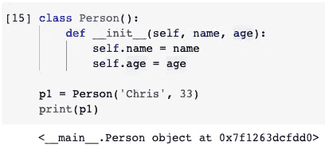

它只是告诉我们类名和内存地址，帮助不大。现在，让我们定义`__repr__()`函数，再试一次。

```
def __repr__(self):
        return f"My name is {self.name} and I'm {self.age} years old."
```

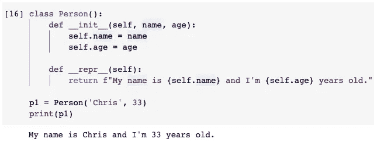

# 摘要


图片由 [Franz Bachinger](https://pixabay.com/users/franz26-1553839/?utm_source=link-attribution&utm_medium=referral&utm_campaign=image&utm_content=5961642) 提供，来自 [Pixabay](https://pixabay.com/?utm_source=link-attribution&utm_medium=referral&utm_campaign=image&utm_content=5961642)

在本文中，我介绍了几个与 Python 编程语言中的下划线相关的技巧。有时，它使我们能够拥有某些能力，有时它提高可读性和可靠性。此外，它为保护导入和类属性/函数提供了一些便利。

这些技巧值得了解，有时对于理解他人的代码也很重要。希望这些建议会有所帮助。

[](https://medium.com/@qiuyujx/membership) [## 通过我的推荐链接加入 Medium 克里斯托弗·陶

### 作为一个媒体会员，你的会员费的一部分会给你阅读的作家，你可以完全接触到每一个故事…

medium.com](https://medium.com/@qiuyujx/membership) 

如果你觉得我的文章有帮助，请考虑加入 Medium 会员来支持我和成千上万的其他作者！(点击上面的链接)