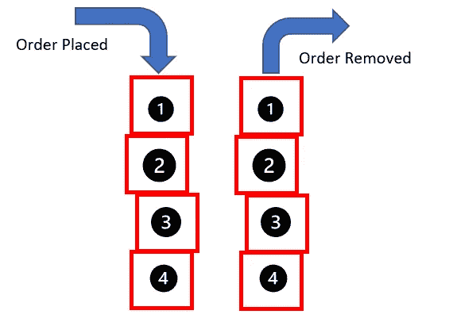
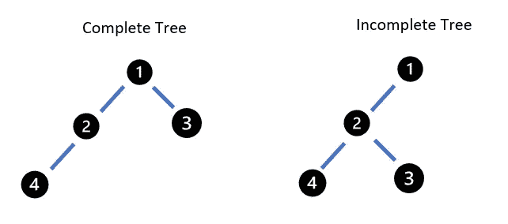
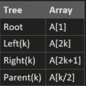

# 为什么理解 Python 中的队列和堆至关重要

> 原文：<https://towardsdatascience.com/why-queues-and-heaps-in-python-are-critical-to-understand-ac56fc17e3ee?source=collection_archive---------28----------------------->

## 队列和堆是编程中开发序列的基本构件

Melanie Pongratz 在 [Unsplash](https://unsplash.com?utm_source=medium&utm_medium=referral) 上的照片

队列是人类与生俱来的东西，因为当我们需要做一些事情并且很忙的时候，你通常不得不排队等候。在 Python 和其他编程语言中，队列和堆是构建对象顺序列表的一种方式，也是保持它们有序的一种整洁方式。对于依赖于时间或序列的程序，队列和堆是捕获这种类型的信息以流过程序所需进程的理想方式。

# 什么是优先级队列？

在 Python 中，优先级队列是一种特殊类型的数据结构，它包含一个项目集合，每个项目都有一个指定的优先级。优先级决定了它在队列中所属的顺序，并有助于保持项目在结构中的顺序。Python 中的术语是 pqueue。

## 操作优先级队列的操作

关于优先级队列的两个基本概念是关于如何将对象添加到队列中，有两种主要方法可以做到这一点，它们是:

*   Stack — (LIFO)或后进先出，顾名思义，思考堆栈工作原理的一种更简单的方式。如果您在堆叠块的“队列”中将一个块堆叠在另一个块的顶部，那么当从该堆叠中移除块时，它将总是最后一个进入。

堆叠的视觉表现展示了如何通过插入和移除来构建和解构堆叠。图片作者。

*   队列— (FIFO)先进先出更符合我们人类更习惯的队列概念。基本上，当建立队列时，队列中的下一个人走到队列的后面，第一个位置的人被处理并从队列中删除。

照片由 [Charles Deluvio](https://unsplash.com/@charlesdeluvio?utm_source=medium&utm_medium=referral) 在 [Unsplash](https://unsplash.com?utm_source=medium&utm_medium=referral) 上拍摄

有几个不同的操作用于操纵项目在优先级队列中被捕获、移除和排序的方式。三个主要操作是 Insert、delMax/Min 和 findMax/Min。实际上，有 5 个操作，但是 del 和 find 操作的行为方式是相同的，它们分别在范围的两端执行操作。

**插入** —这是一个简单的操作，它主要是在优先级队列中插入项目

**delMax/Min** —该操作还试图从位于范围一端的队列中删除一个项目，这取决于队列的结构(如上所示的堆栈或队列)。

**findMax/Min** —为了理解队列中的项目，可能有必要知道队列的 bookend 对象是什么，findMax/Min 将完成这项工作。

在 [Unsplash](https://unsplash.com?utm_source=medium&utm_medium=referral) 上[科普高清](https://unsplash.com/@scienceinhd?utm_source=medium&utm_medium=referral)照片

优先级队列的用例:

*事件驱动的模拟* —如前所述，如果时间是一个您想要在一个序列中捕获的变量，那么使用一个队列来表示事物的归属是以编程方式构建它的理想方式。

*数值计算—* 编码的一个更“枯燥”的方面，但是研究如何最小化与舍入相关的误差可以利用优先级队列来完成。理解给定测量值的有效数字并减少由舍入误差引入的误差可以被最小化。

*数据压缩—* 另一个用例是尝试寻找方法对数据进行排序并将其存储在合适的分区中。搜索霍夫曼代码了解更多细节。

*图搜索—* 在图论操作中遍历图是利用优先级队列的理想用例，因为您可以了解图中哪些节点已经被访问过，以及访问的顺序。

操作系统——调查和理解系统的负载平衡和中断处理有助于以系统的顺序和方法确定系统的输入和输出。

额外的用例是数论、人工智能、统计学、计算机网络、垃圾邮件过滤、离散优化。

塞萨尔·卡里瓦里诺·阿拉贡在 [Unsplash](https://unsplash.com?utm_source=medium&utm_medium=referral) 上的照片

## 有序与无序:

有序和无序队列之间的主要概念基本上是某些操作的复杂性和速度之间的平衡。

无序数组——这些数组很容易插入，因为顺序不是问题，但另一方面，在这种类型的数组中查找 max 或 min 对象可能会耗费大量时间和资源，

有序数组——与无序数组相比，这有完全相反的问题。如果数组已经是一个结构，那么在正确的位置插入一些东西可能会占用大量资源，但是找到数组的书挡总是很容易的。

> 与图书馆或干净的房间相比，使用有序数组可能是一种更理想的构建和利用方式，如果东西被放置在它们需要去的地方，那么之后找到物品通常会容易得多。

# 完全二叉树

为了将优先级队列的概念带到下一个实现层次，您可以将它想象成一棵二叉树。二叉树是一个层次树的概念，每个父节点只有两个子分支(最多)来自它。完整树的概念是，在构建树时，通过将第一个子节点放在左边，将后续节点放在右边，对放置在树中的后续项目进行排序和构建。此外，在添加后续子层之前，需要完成每一层节点。

完全树和不完全树之间差异的表示。请注意，在下一个级别开始之前，父节点(节点#1)下没有两个子节点。作者图片

## 堆如树木

堆是一种特定类型的数据结构，它的根是由优先级队列形成的。正如 Wikipedia 所言，堆是一种称为优先级队列的抽象数据类型的最高效实现，事实上，优先级队列通常被称为“堆”。如你所见，优先级队列和堆这两个词通常是可以互换的，但是它们之间有明显的区别。在堆内，总是将最大(或最小)优先级的元素(取决于实现)存储为根节点，并从那里构建树。例如，如果父节点总是比子节点大，那么这被称为最大堆，反之，它们被称为最小堆。

## 基本堆操作:

有一些基本的堆操作与上面提到的优先级队列非常相似。第一个是删除堆的根，这可能是出于多种原因。维护操作(通常称为维护操作)是下沉或游动元素的插入命令。如果元素具有较大的值，并且需要提升一个级别，则它们可以在优先级队列中向上移动，相反，如果与同一级别中的其他项目相比，它们具有较低的优先级，则项目被沉入。最后，可以再次 delMax/Min 来从树中删除项目，然后维护树以保持其完整性。

## 将二叉树转化为数组:

以编程方式存储树，如数组，允许计算机将图形表示转换为自己更容易操作的表示。下表基本解释了如何根据树的工作原理构建数组，以及如何根据相同的逻辑进行扩展。

CBT 中节点的位置及其数组表示的示例。图片作者。

# 包裹

在本文中，我们研究了如何从概念上以编程方式捕获优先级队列和堆，以及如何实现它们的一些其他用例。对这些核心概念的深刻理解可以通过一种系统的、更加优化的方法来构建现实世界问题的模型和模拟。

一如既往地评论，回复，和/或让我知道你想阅读的其他话题。