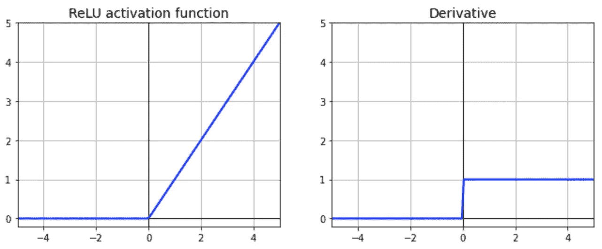

# 为什么在深度学习中使用校正线性单元(ReLU ),以及在 TensorFlow 中使用它的最佳实践

> 原文：<https://towardsdatascience.com/why-rectified-linear-unit-relu-in-deep-learning-and-the-best-practice-to-use-it-with-tensorflow-e9880933b7ef?source=collection_archive---------17----------------------->

## [入门](https://towardsdatascience.com/tagged/getting-started)

## Keras 和 TensorFlow 2 的 ReLU 实用介绍


为什么 ReLU 在深度学习(图片由作者使用【canva.com】T2)

激活功能是深度学习的核心。它们决定了模型的输出、精度和计算效率。在某些情况下，激活函数对模型的收敛能力和收敛速度有很大的影响。

在本文中，您将了解为什么在深度学习中使用 ReLU，以及在 Keras 和 TensorFlow 2 中使用它的最佳实践。

1.  Sigmoid 和 Tanh 激活函数的问题
2.  什么是整流线性单位(ReLU)
3.  使用 ReLU 训练深度神经网络
4.  将 ReLU 用于 He 初始化的最佳实践
5.  与具有 Sigmoid 和 Tanh 的模型相比
6.  ReLU 的局限性

> 源代码请查看[笔记本](https://github.com/BindiChen/machine-learning/blob/master/tensorflow2/011-relu/relu-and-best-practice.ipynb)。更多教程可以从 [Github repo](https://github.com/BindiChen/machine-learning) 中找到。

# 1.Sigmoid 和 Tanh 激活函数的问题

历史上，最广泛使用的两种非线性激活是 **Sigmoid** 和**双曲线正切** ( **Tanh** )激活函数。


Sigmoid 和 Tanh 激活函数的绘图(图片由作者提供)

**Sigmoid** 激活函数(也称为**逻辑函数**)，传统上是神经网络非常流行的激活函数。该函数的输入被转换为 0 到 1 之间的值。在很长一段时间里，直到 20 世纪 90 年代初，这是神经网络上使用的默认激活。

**双曲正切**，也称为**双曲正切**，是一个形状相似的非线性激活函数，输出值范围从-1.0 到 1.0(而不是 Sigmoid 函数的 0 到 1)。在 20 世纪 90 年代后期和 21 世纪初， **Tanh** 函数比 Sigmoid 激活函数更受欢迎，因为使用它的模型更容易训练，并且通常具有更好的预测性能。

## 消失梯度问题


函数及其导数的绘图(图片由作者提供)

**Sigmoid** 和 **Tanh** 函数的一个普遍问题是渐变消失。查看函数图，可以看到当输入变小时或变大时，**s 形函数**在 **0** 或 **1** 处饱和， **Tanh** 函数在 **-1** 和 **1** 处饱和，导数非常接近 0。因此，它几乎没有梯度通过网络传播回来，所以几乎没有什么留给低层[2]。该问题阻碍了网络模型有效地学习，尤其是在深度网络中，

## 计算开销大的问题

**Sigmoid** 和 **Tanh** 函数的另一个问题是它们有一个指数运算，这在计算上是很昂贵的。在我们的例子中，使用 ReLU 训练的模型在收敛速度方面获得了 **25%的改进**(与使用 Sigmoid 和 Tanh 的模型相比，请查看**部分的结果)。**

# 2.什么是整流线性单位(ReLU)？

**整流线性单元(ReLU)** 是深度学习中最常用的激活函数。如果输入是负的，函数返回 0，但是对于任何正的输入，它返回该值。该函数定义为:


函数及其导数的绘图:



ReLU 及其导数的图

我们可以看到:

*   从图形上看，ReLU 函数由两个线性部分组成，以解决非线性问题。如果斜率不是常数，函数就是非线性的。因此，ReLU 函数在 0 附近是非线性的，但斜率总是为 0(负输入)或 1(正输入)。
*   ReLU 函数是**连续的**，但是它是**而不是** **可微的**，因为它的导数对于任何负输入都是 0。
*   ReLU 的输出没有最大值(它是**未饱和**，这有助于梯度下降
*   该函数计算速度非常快(与 Sigmoid 和 Tanh 相比)

令人惊讶的是，这样一个简单的函数在深度神经网络中工作得非常好。

# 3.使用 ReLU 构建深度神经网络

出于演示目的，我们将构建一个图像分类器来处理时尚 MNIST，这是一个具有 10 个类的 70，000 个 28×28 像素的灰度图像的数据集。

## 使用 Keras 加载数据集

Keras 提供了一些实用函数来获取和加载公共数据集，包括时尚 MNIST。让我们装载时尚 MNIST

```
fashion_mnist = keras.datasets.fashion_mnist
**(X_train_full, y_train_full), (X_test, y_test) = fashion_mnist.load_data()**
```

数据集已经分为训练集和测试集。以下是定型集的形状和数据类型:

```
>>> X_train_full.shape
**(60000, 28, 28)**
>>> X_train_full.dtype
**dtype('uint8')**
```

我们将使用梯度下降来训练神经网络，我们必须将输入特征缩小到 0-1 范围。

## 创建一个深度网络

现在让我们建立一个深度神经网络！用 Keras 和 TensorFlow 2.0 创建机器学习模型有 [3 种方法。由于我们正在构建一个简单的全连接神经网络，为了简单起见，让我们使用最简单的方法:带有`Sequential()`的顺序模型。让我们为时尚 MNIST 创建一个具有 50 个隐藏层的深度神经网络:](/3-ways-to-create-a-machine-learning-model-with-keras-and-tensorflow-2-0-de09323af4d3)

```
from tensorflow.keras.models import Sequential
from tensorflow.keras.layers import Dense, Flattendef **create_model**(activation): 
    model = keras.models.Sequential()
    model.add(Flatten(input_shape=[28, 28]))
    **model.add(Dense(300, activation=activation))**
    **for layer in range(49):
        model.add(Dense(100, activation=activation))**
    model.add(Dense(10, activation="softmax"))

    model.compile(
        optimizer='sgd', 
        loss='sparse_categorical_crossentropy', 
        metrics=['accuracy']
    )
    return model
```

我们的型号有以下规格:

*   第一层(也称为输入层)有`input_shape`来设置匹配训练数据的输入大小`(28, 28)`。输入层是一个`Flatten`层，它的作用只是将每个输入图像转换成一个 1D 数组。
*   然后是 50 个`Dense`层，一个 300 个单位，另一个 49 个 100 个单位。
*   输出`Dense`层有`10`单元和`softmax`激活功能。

让我们用 ReLU 创建一个模型:

```
model_relu = create_model(**activation = 'relu'**)
```

若要使模型符合训练数据:

```
history_relu = **model_relu.fit**(
    X_train, 
    y_train, 
    epochs=10,
    validation_data=(X_valid, y_valid),
)
```

如果一切顺利，我们应该得到如下输出。

```
Train on 55000 samples, validate on 5000 samples
Epoch 1/10
55000/55000 [==============================] - 41s 751us/sample - loss: 2.3027 - **accuracy: 0.0991** - val_loss: 2.3028 - **val_accuracy: 0.0914**
Epoch 2/10
55000/55000 [==============================] - 42s 771us/sample - loss: 2.3027 - **accuracy: 0.0979** - val_loss: 2.3029 - **val_accuracy: 0.0914**
......
......
Epoch 10/10
55000/55000 [==============================] - 39s 715us/sample - loss: 2.3027 - **accuracy: 0.0993** - val_loss: 2.3028 - **val_accuracy: 0.0914**
```

在这种情况下，我们可以看到训练集和验证集的性能都很差，达到了大约 10%的准确率。这表明所配置的模型不能学习问题，也不能归纳出解决方案。

在训练期间，训练集和验证集上的模型准确度的线图讲述了类似的故事。


准确度图(图片由作者提供)

ReLU 不是深度学习中默认的激活函数吗？还有什么导致了这个问题？

# 4.降低学习率和使用 He 初始化的最佳实践

训练深度神经网络的超参数之一是**权重初始化器**。一般来说，有 3 种常见的初始化器:

*   **随机**初始化
*   **Glorot** (又名 **Xavier** )初始化
*   **何**初始化

如果你稍微搜索一下，你可能还会发现，如果激活函数是一个 **Tanh** ，那么应该使用 **Glorot (Xavier)初始化**，如果激活函数是一个 **ReLU** ，那么建议使用 **He 初始化**。默认情况下，Keras 使用 **Glorot** 初始化，这是以前模型的问题。

此外，在以前的模型中，学习率太高，因为我们已经看到训练和验证集的精度在训练期间都达到了 10%左右。让我们使用一个较小的学习率。

为了用 **He 初始化**来构建层，我们可以简单地将参数`kernel_initializer`设置为`'he_normal'`。要使用自定义学习率，我们可以将参数`optimizer`设置为`keras.optimizers.SGD(lr=1e-3)`。

```
def **create_model**(activation, **k_init**): 
    model = keras.models.Sequential()
    model.add(Flatten(input_shape=[28, 28]))
    model.add(Dense(300, activation=activation, **kernel_initializer=k_init**))
    for layer in range(49):
        model.add(Dense(100, activation=activation, **kernel_initializer=k_init**))
    model.add(Dense(10, activation="softmax"))

    model.compile(
        optimizer=**keras.optimizers.SGD(lr=1e-3)**, 
        loss='sparse_categorical_crossentropy', 
        metrics=['accuracy']
    )

    return model**model_with_he** = create_model(
    **activation = 'relu',** 
    **k_init='he_normal'**
)
```

现在，让我们再次将模型拟合到训练数据:

```
history_relu_he = **model_with_he.fit**(
    X_train, 
    y_train, 
    epochs=10,
    validation_data=(X_valid, y_valid),
)
```

这一次，您应该会获得更好的输出:

```
Train on 55000 samples, validate on 5000 samples
Epoch 1/10
55000/55000 [==============================] - 38s 687us/sample - loss: 1.3974 - **accuracy: 0.4666** - val_loss: 1.3329 - **val_accuracy: 0.5898**
Epoch 2/10
55000/55000 [==============================] - 38s 693us/sample - loss: 0.7728 - **accuracy: 0.7079** - val_loss: 0.7561 - **val_accuracy: 0.7154**
......
......
Epoch 10/10
55000/55000 [==============================] - 38s 687us/sample - loss: 0.4063 - **accuracy: 0.8545** - val_loss: 0.4198 - **val_accuracy: 0.8552**
```

通过绘制模型精度图，我们可以看到初始化后的模型比我们之前看到的有了巨大的改进。


准确度图(图片由作者提供)

# 5.与具有 Sigmoid 和 Tanh 的模型相比

现在，让我们建立两个模型，一个用 Sigmoid，另一个用 Tanh，用训练数据拟合它们。

```
**model_sigmoid** = create_model(**activation = 'sigmoid'**)**model_tanh** = create_model(**activation = 'tanh'**)
```

之后，让我们比较一下我们讨论过的所有模型的准确性:

*   在这种情况下，**用 ReLU 和 he 初始化**训练的模型性能最好，其次是**用 Tanh** 训练的模型。
*   我们可以看到，具有 ReLU 和 Sigmoid 的模型在训练集和验证集上都很差，达到了大约 10%的准确性。这表明配置的两个模型不能了解问题，也不能归纳出解决方案。
*   此外，我们发现使用 ReLU 训练的模型的平均执行时间约为每个时段 33 秒**，而使用 Sigmoid 或 Tanh 训练的模型的平均执行时间为每个时段 **40 秒**。在收敛速度方面提高了 25%。(请从[笔记本](https://github.com/BindiChen/machine-learning/blob/master/tensorflow2/011-relu/relu-and-best-practice.ipynb)查看日志详情)**


比较模型(图片由作者提供)


用 ReLU 和 he 训练的模型的日志(图片由作者提供)


用 Tanh 训练的模型的日志(图片由作者提供)

# 6.ReLU 的局限性

ReLU 在大多数应用程序中运行良好，但并不完美。它遇到了一个被称为**将死的问题。**

> *在训练过程中，一些神经元实际上已经死亡，这意味着它们不再输出除 0 以外的任何信号。在某些情况下，你可能会发现你的网络中有一半的神经元已经死亡，尤其是当你使用大的学习速率时。当神经元的权重被调整为训练集中所有实例的输入加权和都为负值时，神经元就会死亡。当这种情况发生时，它只是保持输出 0，梯度下降不再影响它，因为当 ReLU 函数的输入为负时，它的梯度为 0。*
> 
> *动手机器学习[1]，第 329 页*

为了解决这个问题，你可能想使用 ReLU 函数的一个变体，比如 **Leaky ReLU** 、**Parametric Leaky ReLU**(**PReLU**)、**指数线性单元** ( **ELU** )，或者**比例指数线性单元** ( **SELU** )。请查看以下文章中对它们的介绍:

[](/7-popular-activation-functions-you-should-know-in-deep-learning-and-how-to-use-them-with-keras-and-27b4d838dfe6) [## 深度学习中你应该知道的 7 个常用激活函数以及如何与 Keras 和…

### 西格蒙德，坦，雷卢，漏雷卢，普雷卢，eLU 和 SELU 的实用介绍

towardsdatascience.com](/7-popular-activation-functions-you-should-know-in-deep-learning-and-how-to-use-them-with-keras-and-27b4d838dfe6) 

# 结论

在本文中，我们讨论了在深度学习中使用 ReLU 激活函数的原因，以及如何在 Keras 和 TensorFlow 中使用它。

我希望这篇文章能帮助你节省建立和调整你自己的深度学习模型的时间。我建议你查看 Keras [文档](https://keras.io/api/layers/activations)中的激活功能，并了解你可以做的其他事情。

感谢阅读。请查看[笔记本](https://github.com/BindiChen/machine-learning/blob/master/tensorflow2/011-relu/relu-and-best-practice.ipynb)获取源代码，如果您对机器学习的实用方面感兴趣，请继续关注。

## 您可能对我的其他 TensorFlow 文章感兴趣:

*   [深度学习中你应该知道的 7 个热门激活函数](/7-popular-activation-functions-you-should-know-in-deep-learning-and-how-to-use-them-with-keras-and-27b4d838dfe6)
*   [用 Keras 和 TensorFlow 2 构建自定义回调](/building-custom-callbacks-with-keras-and-tensorflow-2-85e1b79915a3)
*   [tensor flow 2 中 Keras 回调实用介绍](/a-practical-introduction-to-keras-callbacks-in-tensorflow-2-705d0c584966)
*   [实践中的学习率计划](/learning-rate-schedule-in-practice-an-example-with-keras-and-tensorflow-2-0-2f48b2888a0c)
*   [谷歌机器学习实践的 7 个步骤:结构化数据的 TensorFlow 示例](/the-googles-7-steps-of-machine-learning-in-practice-a-tensorflow-example-for-structured-data-96ccbb707d77)
*   [用 Keras 和 TensorFlow 2.0 创建机器学习模型的 3 种方法](/3-ways-to-create-a-machine-learning-model-with-keras-and-tensorflow-2-0-de09323af4d3)
*   [批量规范化实践:以 Keras 和 TensorFlow 2.0 为例](/batch-normalization-in-practice-an-example-with-keras-and-tensorflow-2-0-b1ec28bde96f)
*   [实践中的提前停止:以 Keras 和 TensorFlow 为例](/a-practical-introduction-to-early-stopping-in-machine-learning-550ac88bc8fd)

更多可以从我的 [Github](https://github.com/BindiChen/machine-learning) 中找到

# 参考

*   [1]使用 Scikit-Learn 和 TensorFlow 进行机器实践学习:构建智能系统的概念、工具和技术