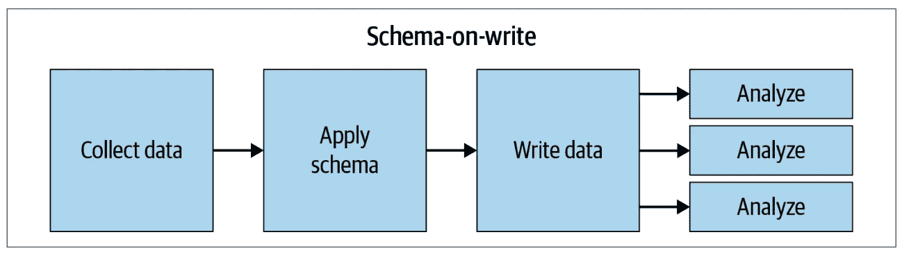
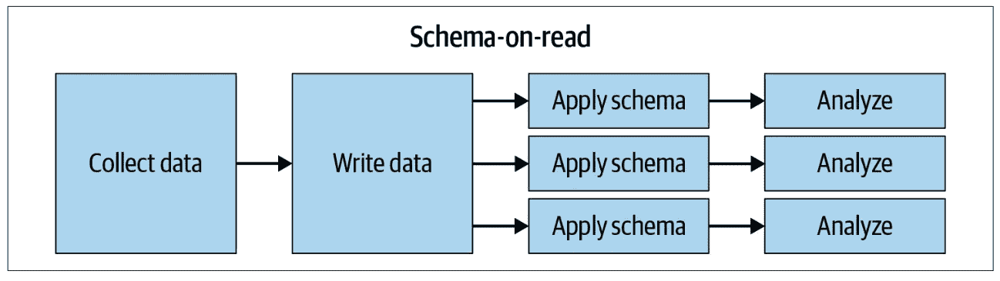
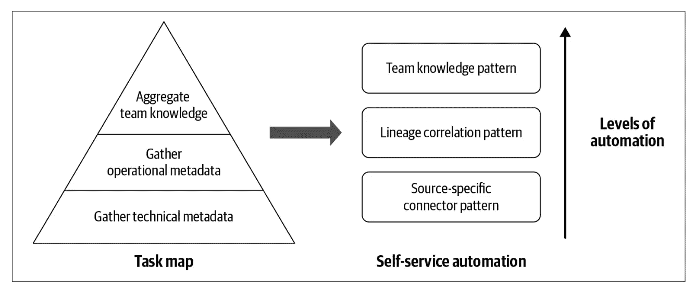

# 为什么可靠的元数据变得如此重要？

> 原文：<https://towardsdatascience.com/why-reliable-metadata-is-becoming-important-f29e01b01d4d?source=collection_archive---------21----------------------->

## 需要全面考虑数据操作中的元数据

企业内部并不缺乏数据，但是使用数据来解决业务问题是当今的一个主要挑战。在构建元数据管理框架方面有一个[日益增长的焦点](https://medium.com/knowledge-technologies/review-metadata-day-2020-e38c28c4cf1a):网飞的 [Metacat](https://github.com/Netflix/metacat) ，优步的 [Databook](https://eng.uber.com/databook/) ，Airbnb 的 [Dataportal](https://medium.com/airbnb-engineering/democratizing-data-at-airbnb-852d76c51770) ，LinkedIn 的 [Datahub](https://github.com/linkedin/datahub) ，Lyft 的 [Amundsen](https://www.amundsen.io/) ，WeWork 的 [Marquez](https://github.com/MarquezProject/marquez) ，Spotify 的 [Lexikon](https://engineering.atspotify.com/2020/02/27/how-we-improved-data-discovery-for-data-scientists-at-spotify/) ，Apache 的

> 为什么元数据变得重要？

在大数据时代之前，数据在添加到中央仓库之前是经过筛选的，包括模式、谱系、所有者、业务分类等在内的元数据细节首先被编目。这被称为*写模式*。

作者图片

如今，处理数据湖的方法是首先聚合数据，然后推断消费时的数据细节。这被称为*读取模式*。因此，没有可供数据用户使用的有组织的元数据目录。

作者图片

复杂性的另一个方面是给定数据集的元数据的孤岛性质。例如，考虑驻留在 MySQL 事务数据库上的销售数据集。为了在湖中获取这些数据，用 Spark 编写了一个 ETL 作业，并安排在 Airflow 上。张量流 ML 模型使用转换后的数据。

> 数据管道中的每个框架都有自己的端到端元数据的局部视图。考虑到数据持久化、调度、查询处理、服务数据库、ML 框架等等技术的多样性，缺乏端到端元数据的单一规范化表示使得数据用户的消费更加困难。

# 元数据的作用

元数据的作用是帮助理解数据。理解数据集有几个方面:

*   数据在逻辑上代表了什么？属性的含义是什么？它是真理的来源，还是从另一个数据集推导出来的？
*   数据的模式是什么？谁管理它？是怎么改造的？
*   最后一次更新是什么时候？数据是分层的吗？以前的版本在哪里？我能相信这些数据吗？数据质量有多可靠？
*   谁和/或哪个团队是所有者？哪些是普通用户？
*   使用什么查询引擎来访问数据？数据集版本化了吗？
*   数据在哪里？复制到哪里，格式是什么？
*   数据在物理上是如何表示的，能否被访问？
*   是否存在具有共同相似或相同内容的相似数据集，无论是整体还是单个列？

即使数据集最终确定用于构建 ML 模型，仍有**个操作用例**需要理解元数据:

*   有许多查询引擎可用于分析数据集。单个数据集可以由多个查询引擎交替使用，例如 Pig、Spark、Presto、Hive 等。例如，从 Hive 读取数据的 Pig 脚本需要读取 Pig 类型中带有 Hive 列类型的表。类似地，处理可能需要跨数据存储移动数据。在此过程中，目标数据存储中的表使用目标表数据类型。为了能够使用多种查询处理框架，需要将规范的数据类型映射到各自的数据存储和查询引擎类型。
*   部署模型或仪表板时，需要主动监控相关的数据集问题，因为它们会影响洞察力的正确性和可用性。与数据集运行状况相关的元数据用于对数据集架构的任何更改或其他团队已经发现的任何错误进行影响分析。这些信息有助于快速调试数据管道中的中断，针对延迟的数据可用性、数据质量问题以及其他部署后的操作问题发出违反 SLA 的警报。

# 元数据的三大支柱

数据集的元数据细节可以分为三类:技术、操作和团队元数据/部落知识。

作者图片

**技术元数据** 由数据集的逻辑和物理元数据细节组成。*物理元数据*涵盖与物理布局和持久性相关的细节，例如创建和修改时间戳、物理位置和格式、存储层以及保留细节。*逻辑元数据*包括数据集架构、数据源细节、生成数据集的过程以及数据集的所有者和用户。技术元数据通常是通过爬行单个数据源来提取的，而不必跨多个数据源进行关联。

**操作元数据**由两个关键桶组成:沿袭和数据分析统计。*沿袭包括追溯数据集是如何生成的以及它对其他数据集的依赖性。对于给定的数据集，沿袭包括所有依赖的输入表、派生表以及输出模型和仪表板。它包括实现转换逻辑以获得最终输出的作业。例如，如果作业 *J* 读取数据集 *D1* 并产生数据集 *D2* ，那么 *D1* 的沿袭元数据包含 *D2* 作为其下游数据集之一，反之亦然。*数据分析统计包括*货架可用性和质量统计。它捕获数据集的列级和集合级特征。它还包括捕获完成时间、处理的数据以及与管道相关的错误的执行统计信息。*

**团队元数据**:当数据科学家为他们的项目使用不同的数据集时，他们会发现关于属性含义、业务词汇、数据质量等等的更多细节。这些知识被称为*部落知识*。目标是通过丰富数据集的元数据细节，在数据用户之间积极地共享团队知识。

# 收集技术元数据的挑战

*   *格式的不同:*每个数据平台存储元数据的方式不同。例如，Hadoop 分布式文件系统(HDFS)元数据以文件和目录的形式存储，而 Kafka 元数据以主题的形式存储。创建一个适用于所有平台的单一规范化元数据模型并不容易。典型的策略是应用最小公分母，这将导致抽象泄漏。数据集以多种不同的数据格式和存储方式存在。提取元数据需要不同的驱动程序来连接和提取不同的系统。
*   *模式推断:*需要不自描述的数据集来推断模式。数据集的架构难以提取；半结构化数据集很难推断结构。没有通用的方法来支持对数据源的访问并生成 DDL。
*   *变化跟踪:*元数据是不断变化的。鉴于高流失率和不断增长的数据集数量，保持元数据更新是一项挑战。

# 收集运营元数据的挑战

操作元数据不是通过连接到数据源生成的，而是通过将跨多个系统的元数据状态拼接在一起生成的。例如，在网飞，数据仓库由存储在亚马逊 S3(通过 Hive)、Druid、Elasticsearch、Redshift、Snowflake 和 MySQL 中的大量数据集组成。查询引擎，即 Spark、Presto、Pig 和 Hive，用于消费、处理和生成数据集。

给定多种不同类型的数据库、调度器、查询引擎和商业智能(BI)工具，理解跨不同处理框架、数据平台和调度系统的整体数据流和谱系是一项挑战。鉴于处理框架的多样性，挑战在于将细节缝合在一起。从代码中推断血统并不简单，尤其是对于 UDF、外部参数等等。

复杂性的另一个方面是获得完整的血统。日志中数据访问事件的数量可能非常多，传递闭包的大小也可能非常大。通常，通过仅处理来自日志的数据访问事件的样本，以及通过仅在几跳内具体化下游和上游关系，与计算真正的传递闭包相反，在沿袭关联的完整性和效率之间存在折衷。

# 收集团队元数据的挑战

团队知识是元数据的一个重要方面。随着数据科学团队的成长，保留这些细节以供他人利用非常重要。有四个类别:

*   注释、文档和属性描述形式的用户定义的元数据。这些信息是通过社区参与和协作创建的，通过鼓励对话和对所有权的自豪感，可以创建一个自我维护的文档库。
*   业务分类法或词汇表，用于在业务直观的层次结构中关联和组织数据对象和指标。此外，还有与数据集相关联的业务规则，如测试帐户、战略帐户等。
*   数据集在合规性、个人身份信息(PII)数据字段、数据加密要求等方面的状态。
*   ML——以最流行的表格、查询等形式扩充的元数据。，并检查源代码和提取任何附加的注释。这些注释通常是高质量的，它们的词法分析可以提供捕捉模式语义的简短短语。

团队知识元数据面临三大挑战:

*   很难让数据用户简单直观地分享他们的团队知识。
*   元数据是自由格式的，但必须经过验证以确保正确性。
*   信息的质量很难核实，尤其是如果它是矛盾的。

# 构建元数据服务

元数据服务是数据湖/数据网格/数据湖库的关键构建块，并且通常是后特设的，即，它在数据集已经由各种管道创建或更新之后收集元数据，而不干扰数据集所有者或用户。

构建元数据服务并使其为数据用户提供自助服务涉及实现三种模式(如下图所示)，定义为[马斯洛需求层次](https://en.wikipedia.org/wiki/Maslow%27s_hierarchy_of_needs):

*   *特定于源的连接器模式:*简化了到不同数据源的连接和提取与数据相关的元数据信息。
*   *沿袭相关模式:*自动提取与源表和目标表相关的转换的沿袭。
*   *团队知识模式:*简化了数据用户之间的业务上下文聚合和知识共享。

作者图片

关于这个话题的更多讨论，请随意参考我的 O'Reilly 的书 [**《自助式数据路线图**](https://www.amazon.com/_/dp/1492075256?tag=oreilly20-20) 。