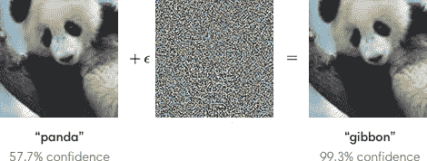
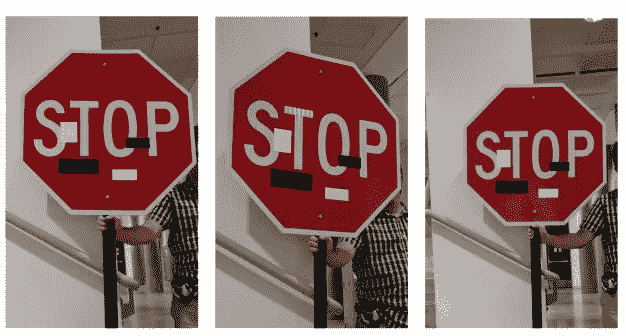
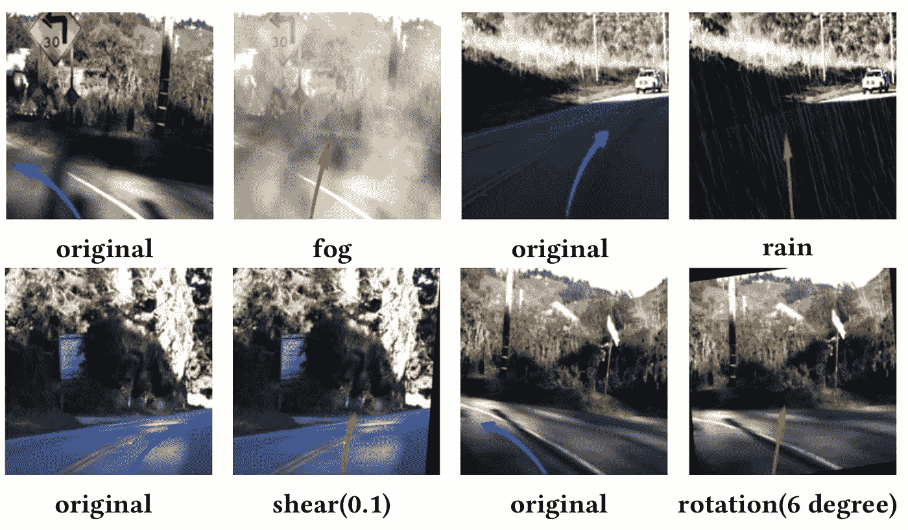
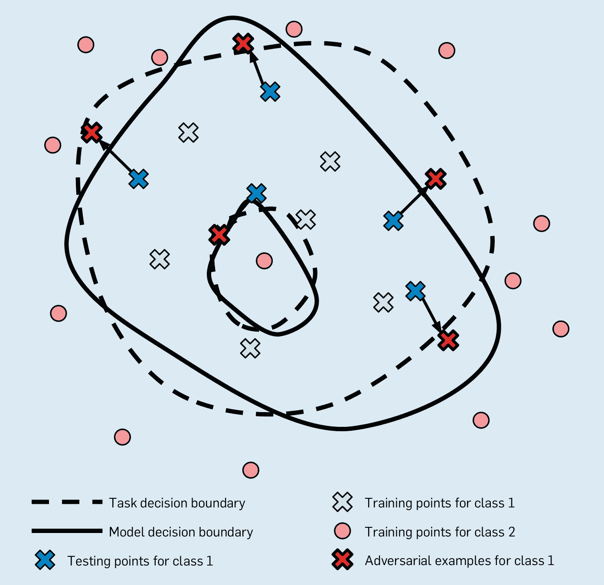
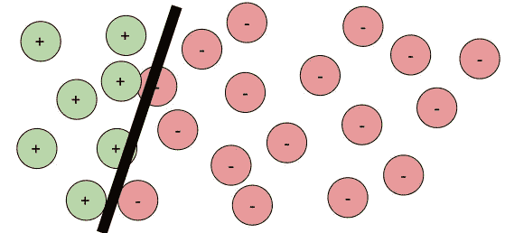

# 为什么机器学习中鲁棒性不足以保证安全性和安全性

> 原文：<https://towardsdatascience.com/why-robustness-is-not-enough-for-safety-and-security-in-machine-learning-1a35f6706601?source=collection_archive---------24----------------------->

## [人工智能校准和安全](https://towardsdatascience.com/tagged/ai-alignment-and-safety)

多个社区(机器学习、形式化方法、编程语言、安全、软件工程)的研究人员已经接受了对**模型健壮性**的研究，通常被称为*安全性或安全性验证*。他们朝着更好、更可扩展或更精确的技术不断取得令人印象深刻的进展，以评估鲁棒性和证明定理，但我在该领域阅读的许多论文基本上从未谈到如何利用这一点实际上使系统更安全。我认为这是[街灯效应](https://en.wikipedia.org/wiki/Streetlight_effect)的一个例子:我们专注于鲁棒性验证的研究，因为它有明确定义的评估论文的措施，而实际的安全和安保问题要困难得多，需要考虑整个系统，而不仅仅是模型的属性。*当考虑生产机器学习系统的测试、安全和保障时，我们需要超越狭隘的健壮性指标。*

# 从对立的例子到稳健

我们可能都见过这样的例子，机器学习模型很容易被愚弄，通过向人类可能察觉不到的输入添加轻微的噪音来做出错误的预测，例如当添加一些人类几乎看不见的轻微噪音时，这只熊猫(非常自信地)识别出它是一只长臂猿:

来自 [OpenAI](https://openai.com/blog/adversarial-example-research/) 的反例

简而言之，问题出现了，因为我们学习和使用模型，却不了解它们内部是如何工作的，也不知道它们是否真正*学到了反映人类认知的*概念。这些模型一般都能正常工作(正如我们在模型评估过程中的准确性度量所表明的)，但是我们通常真的不知道为什么以及如何工作——也许只要它们大部分都能正常工作，我们就不在乎。然而，由于我们不知道也无法具体说明这些模型是如何工作的，我们总是可以找到错误预测的例子，其中模型根本不会产生预期的结果。更糟糕的是，通过适当的搜索，通常有可能发现特定输入的微小变化，从而改变模型的预测。这就是所谓的**对立的例子**，有大量的研究是关于如何找到它们，有没有访问模型的内部。

虽然熊猫和长臂猿的例子看起来很有趣，但很容易将对立的例子重新定义为安全问题。例如，研究人员已经表明，贴在停车标志上的小贴纸可以欺骗视觉系统，将该标志识别为“限速 45”标志，这意味着这可能会导致自动驾驶汽车采取错误和危险的行动:

来自 [CVPR 2018 论文](https://arxiv.org/abs/1707.08945)的物理对抗示例

除了通过操纵输入的故意攻击之外，输入的自然变化也可能导致具有安全后果的错误预测。最常见的例子是自动驾驶汽车在雾天行驶，或者相机稍微倾斜或模糊，都会导致输入的小修改。例如，研究人员已经展示了图像的简单变换(反映现实世界中可能存在的问题)如何导致对汽车转向角度的错误预测:

来自 [DeepTest ICSE 2018 年论文](https://www.cs.columbia.edu/~suman/docs/deeptest.pdf)的可能输入转换示例，反映了自动驾驶系统在现实世界中的潜在条件，导致对转向角度的错误预测

在这种情况下， **robustness** 是指模型的预测对输入的微小变化是稳定的，希望是因为它的预测是基于真实任务的可靠抽象，反映了人类如何执行任务。也就是说，小的看不见的噪声不应该将预测从熊猫翻转到长臂猿，图像的小添加不应该阻止模型识别停止标志，天气条件或轻微倾斜相机不应该影响自动驾驶汽车的转向角度。

来自 Goodfellow 等人(2018)。[使机器学习对敌对输入具有鲁棒性](https://par.nsf.gov/servlets/purl/10111674)。*ACM 的通信*、 *61* (7)、56–66。

*边注:*我喜欢 Goodfellow 等人对对抗性例子的可视化解释，即实际决策边界(基础事实/规范)和模型学习到的决策边界之间的不匹配。不幸的是，我们使用机器学习正是因为我们没有明确的规范，不知道实际的决策边界(参见我在[机器学习是需求工程](https://medium.com/ckaestne/machine-learning-is-requirements-engineering-8957aee55ef4)中对规范的讨论)。因此，这种解释是一种很好的概念性观点，但在我们关心预测是否正确的实际环境中没有太大帮助。*稳健性只与我们是否接近模型的决策边界的问题有关，而不知道任何关于实际决策边界的事情。*

# 定义稳健性

鲁棒性是一个吸引人的研究属性，因为它很容易定义为两个输入之间关系的不变量(技术上称为[变形关系](https://en.wikipedia.org/wiki/Metamorphic_testing))，而不必依赖于规范和实际正确预测的基础事实。

所有的**局部鲁棒性属性**或多或少遵循这种形式:给定一个输入 *x* 和一个感兴趣的模型 *f* ，我们希望模型的预测对于在 *x* 的邻域中的所有输入*x’*保持相同，其中邻域由某个距离函数 *δ* 和某个最大距离*δ*定义:

∀ *x'* 。 *δ* ( *x，x '*)*≤δ*f(*x*)=*f*(*x '*)

根据问题的不同，定义距离的方式可能会有很大不同。典型的例子允许对所有输入特征(例如，所有像素)的低噪声量，对少数输入特征的任意改变(例如，改变任意三个像素)，或更复杂的变换(例如，倾斜图片或添加“雾”)。无论可能的变换或相应的距离函数和最大距离如何，我们总是对原始输入周围的一些邻域进行推理。

注意，这个定义不需要任何关于对 *f* ( *x* )或*f*(*x’*)的正确预测是什么的信息，我们简单地推理预测在邻域内应该保持一致(无论正确与否)的事实。

稳健性或者被建立为二元属性，即模型的输入被验证为稳健或不稳健(通常是保守的过度逼近，但也提出了具有置信水平的概率判断)，或者被建立为某种形式的相对度量，例如到最近的对立实例的距离或邻域中稳健输入的百分比。

研究人员现在开发了许多不同的搜索和验证策略，以评估深度神经网络的这种鲁棒性。这可以通过在邻域内搜索对立的例子，通过简单地采样和测试邻域中的大量数据点，或者通过正式证明邻域中没有点可以改变预测结果的不同形式的正式验证来完成。

请注意，鲁棒性研究基本上只关注深度神经网络，因为这是难以扩展验证技术的地方。相比之下，我不知道有关于决策树或线性模型的鲁棒性论文，鲁棒性评估似乎很容易实现，并且对于许多这样的模型来说也很容易扩展——我怀疑这就是为什么我没有看到这样的论文。

除了局部稳健性，一些研究人员还讨论了模型的**全局稳健性**，通常是所有可能输入的某种形式的*平均*稳健性。例如，可以测量可以验证的输入鲁棒性的百分比，或者从每个输入到最近的对立示例的平均距离。

*边注:*Borg 等人的研究[:健壮性是一个从业者经常使用的术语，但通常只是模糊地指模型预测的*正确性*或*可信度*，而不是研究文献中研究和这里讨论的健壮性的正式概念。](https://www.atlantis-press.com/journals/jase/125905766)

# 鲁棒性有用吗？

我读过几十篇分析机器学习模型鲁棒性的论文，其中大多数都以安全和安保问题为动机进行分析——然而这些论文中没有一篇讨论或评估鲁棒性在实际设置中如何真正使用。

首先，鲁棒性很难解读。对所有输入完全稳健的唯一模型是对所有输出返回相同预测的平凡模型。对于所有其他模型，有一个决策边界，一些输入将接近模型的决策边界，因此不稳定:决策边界附近的输入邻域的一些部分将位于决策边界的每一侧。

没有一个模型是完全鲁棒的:黑线显示了 **+** 和 **-** 预测之间的决策边界。一些输入接近决策边界，它们的邻域(圆)延伸超过决策边界。

## 用例 1:在推理时评估健壮性

最合理的使用场景似乎是**在推理时间**评估鲁棒性，也就是说，检查系统在运行期间做出的给定预测是否鲁棒。例如，当标记图像时，我们可以只标记那些我们有证据或信心该标记对微小扰动是鲁棒的图像(独立于模型可能已经提供的置信度分数),因此决定不放弃标记上面图像中的熊猫。类似地，我们可以识别停车标志没有被强有力地识别为停车标志，因此不相信它是自动驾驶汽车做出决策的任何标志。

这看起来很有吸引力，鲁棒性可能是一个强大的工具，但要将其用于系统的安全，工程师需要解决多个额外的问题:

*   **成本高昂的分析:**深度神经网络的鲁棒性分析是非常昂贵的。即使技术变得更好，它们目前只适用于小型和中型的神经网络(有人知道手写数字识别吗？)由于形式分析、SMT 求解或所需大量样本的成本，他们通常需要*分钟*来分析单个输入的鲁棒性。我们当然可以希望研究进展继续降低成本，但我很难想象任何人会在推理时间很快使用健壮性评估；不适用于像在脸书标记照片这样的大容量系统，当然也不适用于自动驾驶汽车这样的实时应用。
*   **定义最大距离:**为邻域的大小和形状定义合适的距离函数和阈值是一个不小的工程问题。邻域越大，分类为不稳定的预测就越多。如果邻域太小，攻击和意外的错误分类就更容易逃脱。此外，在实践中，由于事故或攻击，什么样的扰动是可能发生的，以及如何定义正确的邻域？我们想要防范的最糟糕的情况是什么？确定正确的距离函数和最大距离阈值是不小的工程挑战。
*   **稳健**≦**安全:**如果我们在推理时分析稳健性，并且我们已经找到了一个合理的最大距离，那么我们如何处理被确定为不稳健的模型预测呢？我们可以简单地决定不标记图像，但我们不能停止驾驶自动驾驶汽车。此外，我们是否假设一个预测将是正确的，仅仅因为它是稳健的？我们显然需要考虑模型之外的安全机制，仍然预期模型可能做出错误的预测，或者只是更经常地表明它不确定。

请注意，成本论证可能不适用于更简单的 ML 模型，如决策树，尽管我也没有看到任何人讨论在推理时使用健壮性。我真的很有兴趣看到试图设计安全系统的项目，并讨论他们如何应对这些挑战。

## 用例 2:全球模型评估

可以评估模型对于任意输入的平均稳健性，以某种*全局稳健性*来衡量。除了预测准确性(ROC、召回/精度、lift、MAPE，等等)，我们可以将此视为模型质量的额外度量，其中稳健性和准确性度量非常不同的质量。请注意，评估可以完全离线完成；成本可能很高，但这种策略不会降低生产中模型推理的速度。

平均来说更健壮的模型可能是优选的，因为它可以被假定为学习更多的实际概念，被限制到更少的更简单的决策边界，或者可以较少地受噪声或攻击的影响。

现在的挑战来自如何衡量和*有意义地解释全球稳健性*。我们真的同等地关心所有的输入吗，或者健壮性应该集中在更常见的输入上吗？例如，许多方法被用来产生不稳定的合成“测试”输入，但是我们真的关心不像任何真实世界输入的随机输入吗？与准确性度量类似，什么级别的稳健性被认为是好的？应该使用什么样的邻域大小？我们如何在准确性和健壮性之间进行权衡？总的来说，全局模型健壮性很容易定义为一个度量，但是如何利用这个度量还不清楚。

最后，假设我们已经建立了较高的平均稳健性，*这如何帮助我们做出任何安全声明？我们希望模型犯更少的错误或者更难被攻击，但是我们不知道任何关于推理时的特定预测。在实际环境中，攻击者很可能能够找到许多实际输入的对立例子。*

## 用例 3:调试模型

我们可以评估一组实际输入的健壮性，而不是评估全局的健壮性(用例 2)。例如，我们可以评估验证数据集(希望代表生产中的实际输入)甚至训练集中的每个输入的健壮性。我们还可以分析生产系统中接收到的输入样本的健壮性，比如说，随机输入或通过系统遥测标记为有问题的输入(例如，用户报告预测不正确)。

了解对样本输入的某些预测是否稳健可能有助于我们进行调试。我们可能会识别出许多预测不可靠的输入区域，要么是因为它们确实接近真实的决策边界，要么更有可能是因为模型不太擅长理解这些输入。我们可能会发现危险的情况，例如我们的模型无法处理雾——希望在测试期间发现，而不是在生产中。

如果我们理解了模型的问题，我们就可以尝试改进模型。最常见的策略似乎是数据扩充，即将来自训练输入邻域的输入添加到训练数据中。对模型架构或特征工程的改变也可能有助于推动模型学习更多相关的概念。许多论文探讨了不同的方法。

总的来说，这似乎是一个很有前途的调试、强化和改进模型的策略。一个关键的挑战是哪些输入应该用于健壮性分析的问题(导致关于[决定一个好的测试集](https://ckaestne.medium.com/a-software-testing-view-on-machine-learning-model-quality-d508cb9e20a6)的难题)，以及，如上所述，如何定义要考虑的最大距离。同样类似于用例 2，我们对模型在生产中的行为没有任何健壮性保证。*这些都不能提高系统本身的安全性。*

# 超越模型:安全是系统属性

安全是系统属性，而不是软件或机器学习模型的属性。正如安全研究员南希·莱韦森(麻省理工学院)在她的[ICSE 20 日主题演讲](https://youtu.be/5npRz-C2EHU?t=2558)中反复提到的:

> “软件不是不安全的。它会造成危险，但不会爆炸、着火、涉及有毒物质等。如果它不是关于危险，它就不是关于安全。[……]软件不是不安全的；它产生的控制信号可以是。[……]
> 不可能只看软件就确定安全性[……]几乎所有与软件相关的事故都是由不安全的要求造成的，而不是软件设计/实施错误。”

安全就是构建安全的*系统*，通常使用不可靠的组件，包括软件和硬件组件。它是关于确保系统整体是安全的，即使一个组件出现故障(例如，硬件故障，模型做出错误的预测)或多个组件之间出现意外的交互。

鉴于我们无法指定机器学习模型的预期行为，也无法验证它的功能正确性，安全问题必须关注系统如何根据通常不可靠的机器学习模型的输出与环境进行交互。我们必须考虑模型之外的安全措施，例如智能烤面包机中的热保险丝或最大烘烤时间，以确保烤面包机不会着火，无论其内部模型预测的烘烤时间是多少。

工程安全系统需要理解系统级的需求，[分析世界和机器之间的交互](https://ckaestne.medium.com/the-world-and-the-machine-and-responsible-machine-learning-1ae72353c5ae)，以及理解各种(可能不可靠的)组件的交互。决定模型是否安全的是如何使用模型的上下文。

*模型的稳健性既不保证安全性也不保证本身的安全性。稳健不能保证模型的“正确性”:稳健的预测仍然可能是错误的；一个非常健壮的模型可能完全没有用。在更大的安全故事中，鲁棒性可能是一个有用的构建块(上面讨论了所有开放的工程挑战)，因为当我们考虑与系统的其他部分和环境的交互时，它改变了我们可以对 ML 组件做出的假设。但是*仅仅*让一个模型健壮并不能让系统安全。*

有研究工作是利用机器学习模型构建安全系统，特别是围绕航空电子设备和自动驾驶汽车——这都是关于需求、系统设计和系统级测试的，而确保正式的鲁棒性通常似乎不是一个很大的问题。

路灯效果:寻找光在哪里

回到街灯效应，(以一个男人在街灯下寻找钱包的故事命名，当被问及“这是你丢钱包的地方吗”时，他回答说他在别处丢了钱包，但在有光的地方寻找更容易):深度神经网络的鲁棒性是一个令人欣慰的研究主题，因为它被很好地定义，具有挑战性，并有超过艺术水平的明显可测量的改进空间。许多研究人员做出了令人难以置信的贡献。然而，如果我们真的关心具有机器学习组件的生产系统的安全性，我们应该超越简单和明确定义的问题，看看现实世界系统的真实和丑陋的工程挑战。

进一步阅读:

*   我之前发表的关于支持 ML 的系统的质量保证的文章:[机器学习是需求工程](https://medium.com/analytics-vidhya/machine-learning-is-requirements-engineering-8957aee55ef4?source=your_stories_page-------------------------------------)(关于正确性的概念和规范的作用)[关于机器学习模型质量的软件测试观点](https://ckaestne.medium.com/a-software-testing-view-on-machine-learning-model-quality-d508cb9e20a6?source=your_stories_page-------------------------------------)(关于超越准确性的测试策略)[世界和机器以及负责任的机器学习](https://ckaestne.medium.com/the-world-and-the-machine-and-responsible-machine-learning-1ae72353c5ae?source=your_stories_page-------------------------------------)(关于系统级思维和需求工程)
*   论文调查当前汽车工程中 ML 系统的安全工程: *Borg、Markus、Cristofer Englund、Krzysztof Wnuk、Boris Duran、Christoffer Levandowski、Gao、Tan、Henrik Kaijser、Henrik lnn 和 Jonas trnqvist。* [*安全进入深度:机器学习的验证与确认综述及汽车行业的挑战启发*](https://www.atlantis-press.com/journals/jase/125905766) *。”汽车软件工程杂志。第 1 卷，第 1 期，第 1-19 页。2019*
*   关于自动驾驶汽车的安全工程和建筑安全模式的论文: *Salay，Rick 和 Krzysztof Czarnecki。"* [*在汽车软件中安全地使用机器学习:ISO 26262*](https://arxiv.org/pdf/1808.01614) *软件过程需求的评估与适应。"arXiv 预印本 arXiv:1808.01614 (2018)。*
*   另一篇论文讨论了自动驾驶汽车的不同安全策略:Mohseni，Sina，Mandar Pitale，Singh 和 Wang。"[自动驾驶汽车中机器学习安全的实用解决方案](https://arxiv.org/abs/1912.09630)"2020 年 AAAI 安全研讨会。
*   列举了许多最新稳健性验证技术的调查论文(第 4 节):【黄、、丹尼尔·克罗宁、阮、詹姆斯·夏普、孙友成、埃姆斯·塔莫、和易新平。" [*深度神经网络的安全性和可信度调查:验证、测试、对抗性攻击和防御、可解释性*](https://arxiv.org/abs/1812.08342) *。"计算机科学评论 37 (2020)。*
*   [人工智能系统软件工程的注释书目](https://github.com/ckaestne/seaibib)包括几篇关于健壮性、安全性和安全性的论文