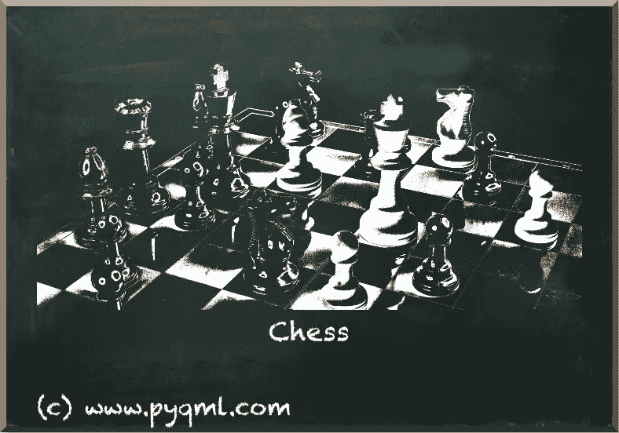
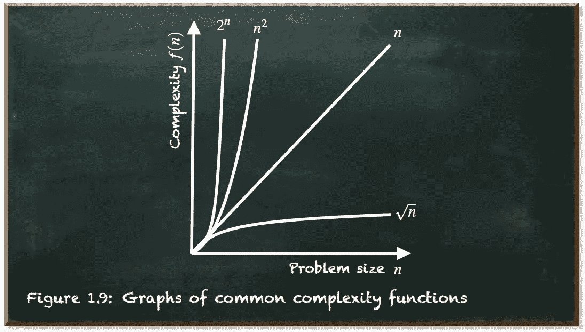
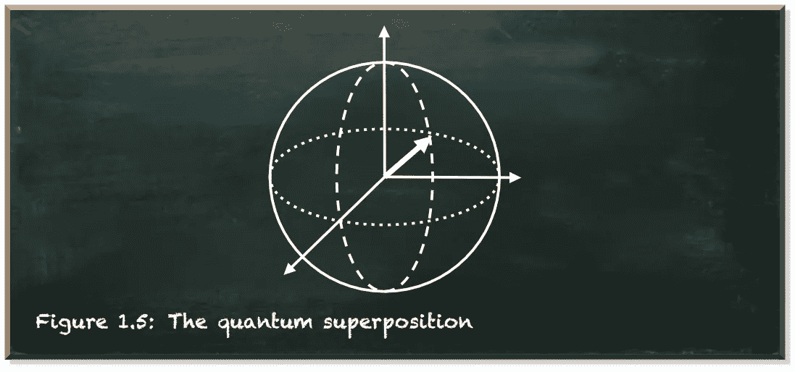
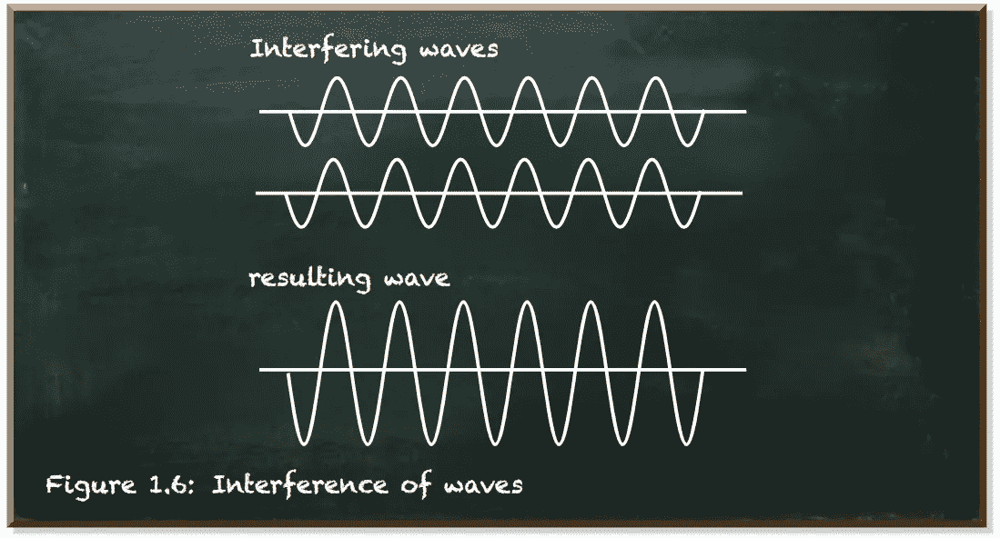
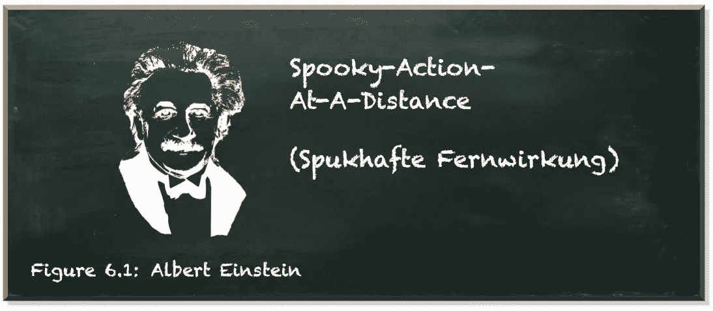

# 我为什么要为量子机器学习费心呢？

> 原文：<https://towardsdatascience.com/why-should-i-even-bother-with-quantum-machine-learning-f3ffbb776684?source=collection_archive---------44----------------------->

## 量子机器学习有望颠覆传统

本帖是本书的一部分: [**用 Python 动手做量子机器学习**](https://www.pyqml.com/page?ref=medium_bothers&dest=/) **。**

在最近的过去，我们目睹了算法如何学会驾驶汽车，并在国际象棋和围棋中击败世界冠军。



图片由作者 www.pyqml.com·弗兰克·齐克特提供

从军事到航空航天，从农业到制造业，从金融到医疗保健，机器学习几乎被应用到所有可以想象的领域。

但是机器学习算法已经变得越来越难以训练。所以当我们看到这种表示时，当前的机器学习算法，如 2020 年发表的*生成式预训练变压器 3* (GPT-3)网络，浮现在脑海中。GPT 3 号产生了类似人类的文本。

训练 GPT-3 需要在单个 GPU(图形处理单元)上花费 355 年时间，耗资 460 万美元。通过并行化，训练速度大大加快。然而，这需要大量的计算资源。

训练目标是为模型所包含的参数找到一组工作值。不幸的是，训练模型的复杂性随着参数的数量呈指数增长。

比方说，一个模型由四个布尔(真或假)参数组成。然后，有 2⁴=16 可能的配置。如果参数采用一位数(0–9)作为值，将有 10⁴=10,000 可能的配置。相应地，如果我们有 86 个而不是 4 个参数，那么这个模型将会有 10⁸⁶可能的构型。对了，这是可见宇宙中原子的数量左右！

GPT-3 模型包含 1750 亿个参数。我甚至不敢去想有多少种可能的构型。

当然，有精明的算法和启发来改善训练，并最终导致一个工作系统。然而，当前机器学习模型的复杂性成为一个问题。一些人甚至认为，我们正在走向下一个人工智能冬天，因为用当前的计算技术来训练我们正在寻找的模型是难以处理的。

量子计算机有望解决这类问题。它们同时计算多个状态的能力使它们能够并行执行几乎无限多的任务。这种能力有望改善和加速机器学习技术。与基于顺序信息处理的经典计算机不同，量子计算利用了量子物理的特性。

让量子计算如此强大的不是它的处理速度。其实挺慢的。让量子计算如此强大的也不是它的内存。事实上，它小得荒谬。所以我们谈论的是一些量子比特。

让量子计算如此强大的是它所实现的算法。此外，这些算法表现出不同于经典算法的复杂性特征。

为了理解这意味着什么，让我们简单看一下复杂性理论。复杂性理论是对运行算法所需的计算工作的研究。



作者弗兰克·齐克特的图片

例如，加法的计算量是 O(n)。这意味着两个数相加的工作量随着数的大小(位数)线性增加。乘法的计算量是 O(n)。努力随着数量大小的平方而增加。据说这些算法在多项式时间内是可解的。

但是这些问题相对简单。例如，解决因式分解问题的最佳算法是寻找一个 n 位数的质因数:O (e^(n^1/3).不幸的是，这意味着随着位数的增加，工作量呈指数增长。

O(n)和 o(的区别我们一定不能低估 e^ (n /3)复杂度。虽然你的智能手机可以在几秒钟内将 800 位数字相乘，但在超级计算机上，这种数字的因式分解需要大约 2000 年。

但是量子计算是一种不同形式的计算。它利用了量子物理的三个基本性质:叠加、干涉和纠缠。

这些就是**叠加**、**纠缠**、**干涉**。但是量子计算并没有增加可用的计算能力，而是减少了解决问题所需的能力。

**叠加**是指一个量子系统可以同时存在多个态的量子现象。

```
Actually, the quantum system does not exist in multiple
states concurrently. It exists in a complex linear combination
of a state 0 and a state 1\. It is a different kind
of combination that is neither "or" nor is it "and".
```



作者弗兰克·齐克特的图片

量子**干涉**是允许我们将量子系统偏向期望状态的东西。这个想法是要创造一种干扰模式，其中导致错误答案的路径会破坏性地干扰和抵消，但导致正确答案的路径会相互加强。



作者弗兰克·齐克特的图片

**纠缠**是量子粒子之间极强的关联。此外，即使相隔很远，纠缠的粒子仍然保持完美的关联。



作者弗兰克·齐克特的图片

阿尔伯特·爱因斯坦生动地拒绝了量子纠缠的概念，称之为“超距作用”。

量子计算要求我们改变对计算机的看法。它需要一套全新的算法。编码和使用量子信息的算法。这包括机器学习算法。我们不能简单地把我们目前的算法放在量子计算机上运行。我们需要开发新的算法。

我们需要一批新的开发人员来开发这些算法——理解机器学习和量子计算的开发人员。开发者有能力解决以前没有解决的实际问题。一种罕见的显影剂。今天解决量子机器学习问题的能力已经让你与众不同了。

# 结论

量子机器学习有望成为颠覆性的。虽然机器学习和量子计算这两个活跃的研究领域的合并主要是在概念领域，但已经有一些应用于解决现实生活问题的例子。谷歌、亚马逊、IBM、微软和一大批高科技创业公司都在努力成为第一批制造和销售量子机器学习系统的公司。

当一项技术即将证明其优势时，研究这项技术的机会是一个独特的机会。不要错过它。

本帖是本书的一部分: [**用 Python 动手做量子机器学习**](https://www.pyqml.com/page?ref=medium_bothers&dest=/) **。**


在这里免费获得前三章。