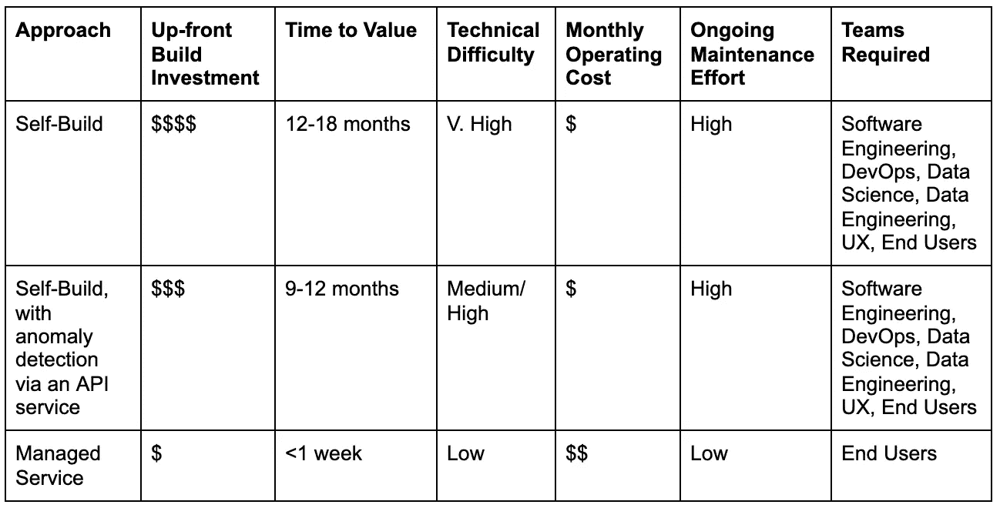
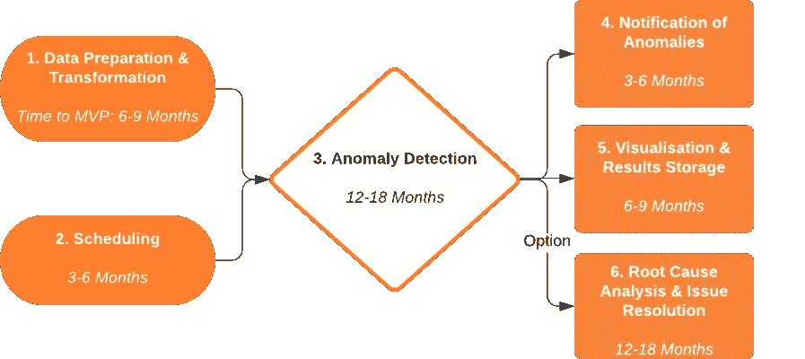

# 我为什么要为异常检测付费？自己打造自己不是很容易吗？

> 原文：<https://towardsdatascience.com/why-should-i-pay-for-anomaly-detection-isnt-it-easy-to-build-it-ourselves-c0f8627542ce?source=collection_archive---------22----------------------->

## 使用业务绩效数据构建成功的异常检测系统的三个关键方法

Josue Isai Ramos Figueroa 在 [Unsplash](https://unsplash.com?utm_source=medium&utm_medium=referral) 上的照片

构建异常检测系统可能看起来很简单，但这不仅仅是要求您的数据科学团队实施现成的算法，所有支持基础架构对于最终用户来说都是系统成功的关键。

在本指南中，我将列出构建成功的异常检测系统的 3 种关键方法，以及需要哪些核心组件。

# **不同的笔画，适合不同的人**

有很多方法可以处理业务指标的时序异常检测。根据您的团队及其需求，您可能已经考虑了以下方法之一:

*   **自我构建** —您在自己的基础设施上托管异常检测算法&逻辑，并构建所有周围的设备来运行检测，以及使用内部人员配置&资源来维护系统。通常，这需要最长的时间来实现价值，最高的前期成本，以及对团队时间的最高需求。
*   **自行构建，通过 API 服务进行检测** —与自行构建相同，但使用 API 服务进行异常检测逻辑，接收时序数据并返回结果。除此之外，您还需要构建和维护所有相关的基础设施。
*   **托管服务** —所有方面都由您的提供商托管和管理。使用他们的 SaaS 产品，你只需提供数据并选择要跟踪的内容。这通常是最快实现价值的，产生适度的持续成本，由团队花费在维护上的很少时间来抵消。

就成本、实现价值的时间和技术难度而言，每种方法都有自己的优缺点:

异常检测方法——利弊权衡。图片作者。

# 除了算法，我还需要什么？

无论您采用哪种方法，这些都是成功部署基本异常检测系统所涉及的元素和任务——我还提供了每个组件可能需要多长时间开发的实际指示，以及所需的技能:

成功的异常检测系统的关键组件。图片作者。

## **1。数据准备&转换**

**团队:**数据工程、软件工程
**价值实现时间**:6-9 个月

存储的业务绩效数据需要转换为适合异常检测的时间序列格式，这涉及到:

*   将数据输入到数据存储系统中，并直接耦合到异常检测算法中，无论该算法位于何处
*   定义要跟踪的指标&基于这些指标以期望的频率生成时间序列
*   说明并删除任何不完整的期间、缺失值和其他数据卫生注意事项
*   重复数百/数千次，详细反映用户对跟踪内容的偏好

## **2。调度异常检测运行**

**团队** : DevOps，软件工程
价值实现时间:3-6 个月

必须构建和维护基础架构，以定期触发后续的异常检测流程—新数据预计会定期到达。为了实现最高效率，应该以不同的频率跟踪不同的指标(例如，每小时监控一次销售额，但每天只检查新客户注册情况)

## **3。异常检测**

**团队:**数据科学、软件工程
**价值实现时间**:12–18 个月

这是大多数人在考虑异常检测时想到的组件，即识别业务指标中异常行为的智能算法。核心任务包括:

*   从数据准备阶段无缝接受来自各种时间序列的输入，无论频率、噪声和形状如何，并进行扩展以处理同时跟踪的数百/数千个指标。
*   优化设置，最大限度地提高检测准确性，同时最大限度地减少误报和漏报，几乎不需要人工干预— [并非所有算法都能提供相同的性能](https://buff.ly/3AKqJGs)
*   要达到高水平的性能，并具有可接受的假阳性/假阴性水平，可能需要 12 个月以上的时间！
*   清楚地输出检测到的异常，以便采取后续措施

**4。通知交付&任务分配**
**团队** : DevOps、软件工程、UX
**价值实现时间**:3-6 个月

一旦检测到异常，就需要通知业务用户。如果没有这一步，异常情况就会隐藏在系统中，看不到。常见的集成渠道包括:

*   应用程序内弹出窗口
*   电子邮件
*   工作场所聊天工具(例如 Slack、微软团队)
*   Webhooks(用于交付给 OpsGenie、PagerDuty 等事故管理系统)

同样重要的是，能够与企业中可能没有收到相同警报的其他个人共享通知，并为他们分配任务以解决手头的问题。

## **5。可视化&结果存储**

**团队:**软件工程，UX
时间价值:6–9 个月

虽然有一个通知是有用的，但是业务用户可能希望以一种更自由的方式探索其他已经被识别的异常。最好通过图形格式可视化检测到的异常，允许用户:

*   对照历史背景交叉引用他们被告知的异常情况
*   找到其他类似的异常，或者调查其他可能受到影响的指标
*   开始理解绩效变化背后的[根本原因](https://avora.com/root-cause-analysis/)
*   为了获得可接受的访问速度，这需要将异常检测算法的结果存储在数据湖/数据仓库中。

## **6。根本原因分析和问题解决**

**团队:**数据科学、软件工程、UX、DevOps
**价值实现时间:**12–18 个月

一旦发现异常情况，很自然会尝试找出它发生的原因。如果没有此功能，业务用户对检测到的异常情况快速采取行动的能力就会受到限制。虽然对数据集进行手动分析是可能的，但这需要的技能不是业务用户关注的重点，可能需要几个小时或几天才能完成。

使用机器学习的自动化根本原因分析系统有助于发现性能变化的最相关原因，如异常所识别的。这通常在几秒钟内完成，包括:

*   开发底层根本原因分析算法，足够灵活地回答任何基于指标和已识别异常的问题，并与正常行为进行比较。
*   解释趋势的变化。
*   最大限度地减少绩效变化背后的不相关原因，例如巧合的相关性
*   以一种易于理解的方式显示这些信息，业务用户可以探索其他原因，并快速与他人分享这些见解以解决问题。

# **总结一下:**

业务绩效指标的异常检测不仅仅是检测算法，所有的支持组件都有助于使系统及其洞察力对业务用户可用且有用，方法的选择对成本和价值实现时间有实际影响！

我希望这在您为您的企业实施异常检测的过程中是一个有用的指南——如果您想了解 Avora 的方法，请访问我们的[www.avora.com](http://www.avora.com)！