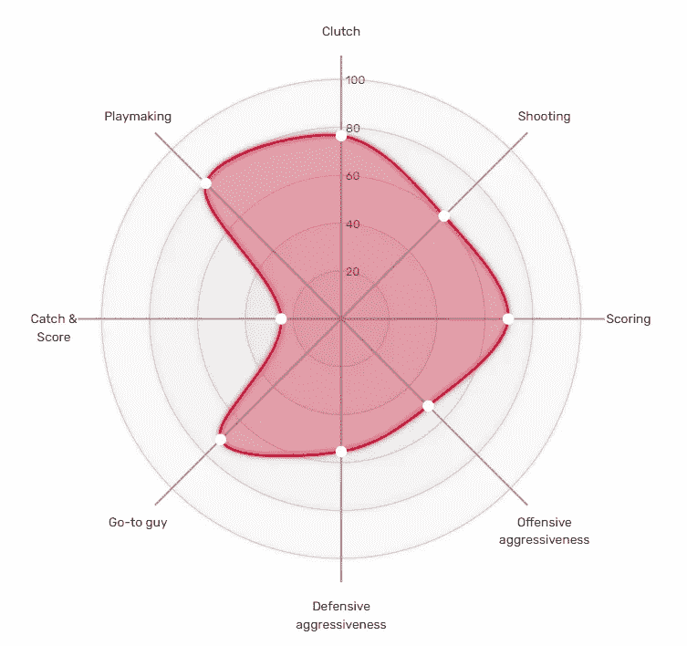
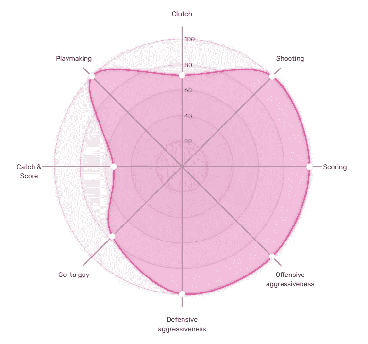
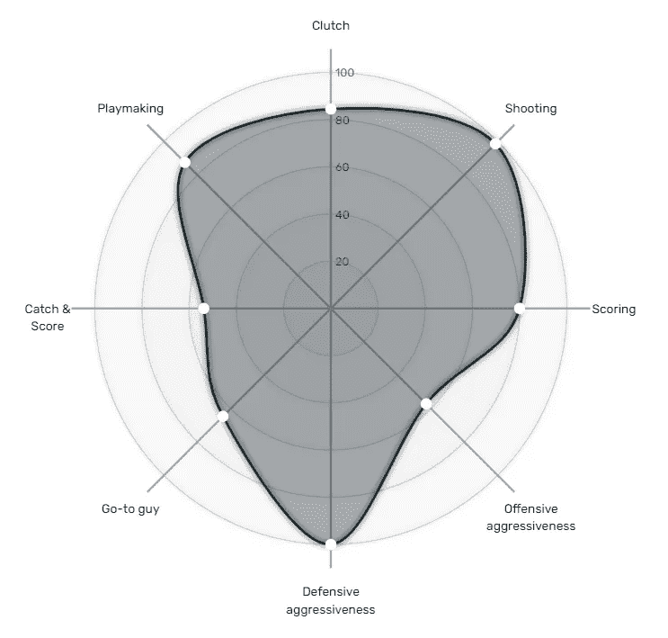
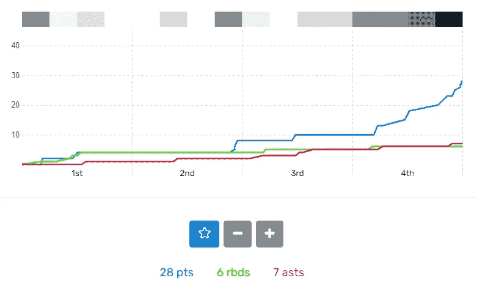
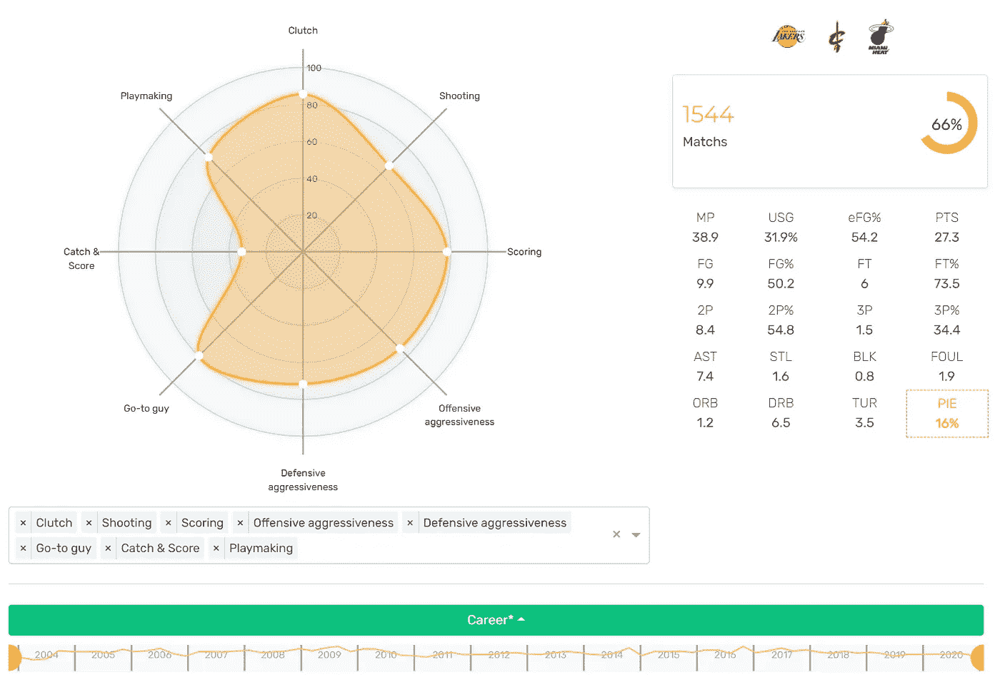
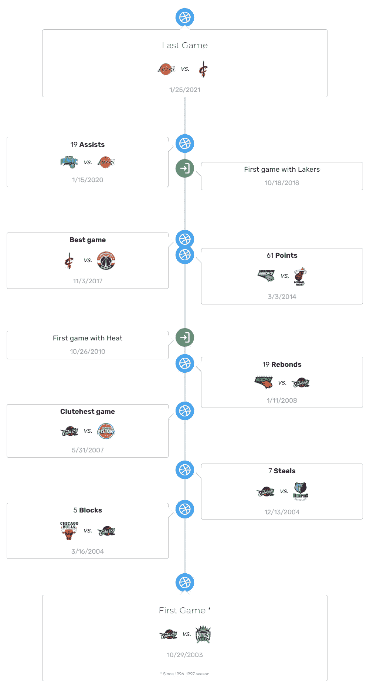
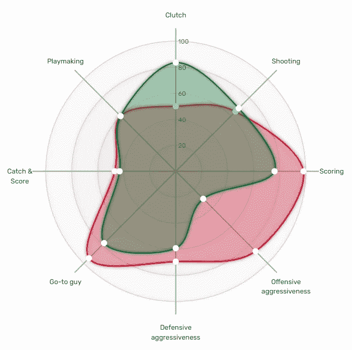
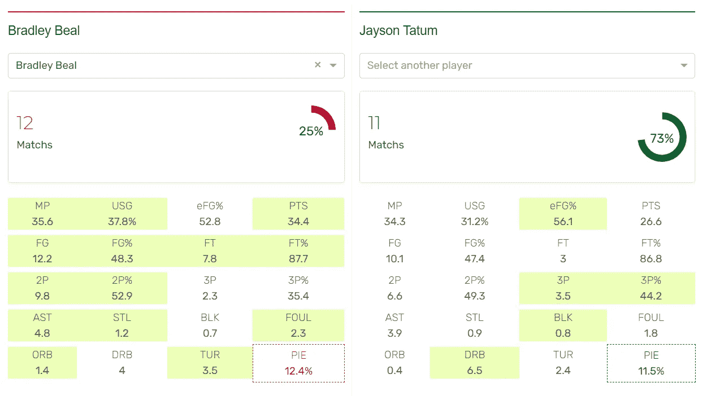
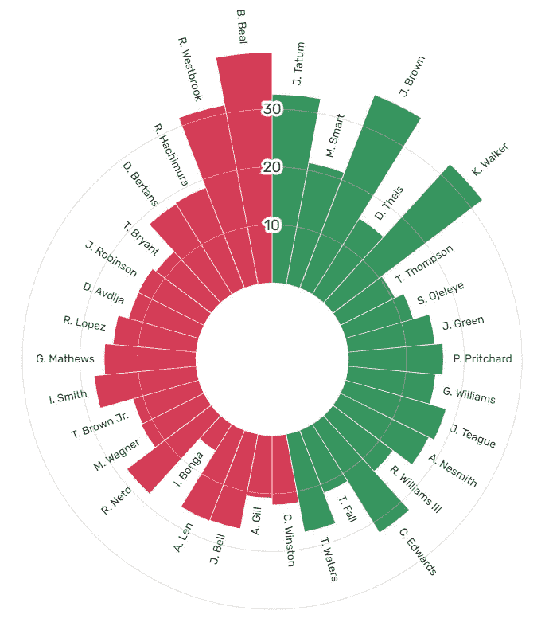
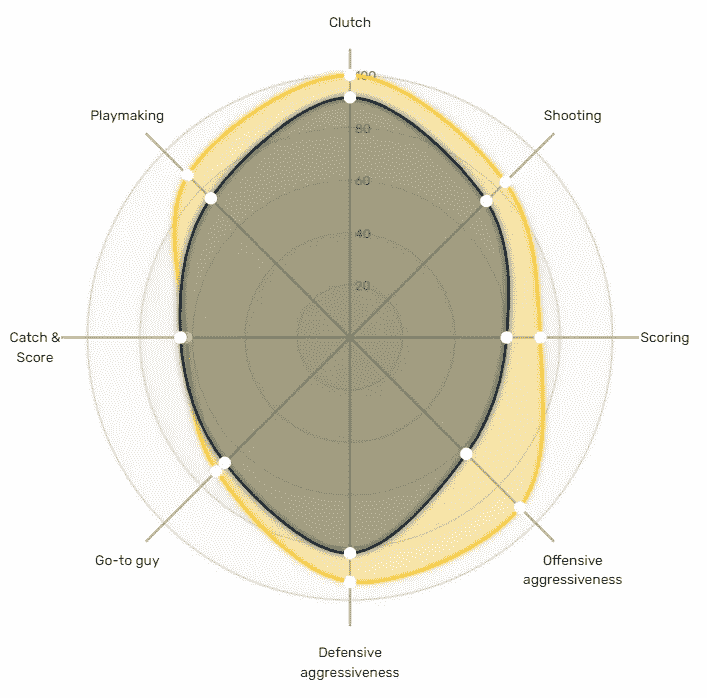

# 为什么要用 Viziball 来分析比较篮球运动员的表现？

> 原文：<https://towardsdatascience.com/why-should-we-use-viziball-to-analyze-and-compare-basketball-players-performance-f03fbf498dd8?source=collection_archive---------41----------------------->

## 看一眼图表可以帮助我们得出结论。这就是数据可视化的美妙之处。

在之前的一篇文章中，我讨论了我们如何在篮球分析网站[的 Viziball](https://viziball.app/en) 中使用 PIE ( *球员影响力评估*)。这种通用的测量方法旨在汇总统计结果，以便快速总结玩家对游戏的影响。

尽管这给了我们很多，但这一指标也有局限性(和其他指标一样)。首先，我们只有可见的游戏事实，除了产生统计数据，还有其他方法可以影响游戏。第二个限制是*派*给出了一个总体的评估，因此，很难追踪受影响的游戏方面。

这是我们试图解决的第二个限制。为了提供更详细的见解，我们建议围绕 8 个轴对饼图进行细分:**投篮、得分、进攻侵略性、防守侵略性、抢断、接球得分&、进攻和配合**。

对于这些轴中的每一个，我们根据我接下来将讨论的各种公式来计算分数(在 0 到 100 之间)。但是在我继续之前，我想介绍一下我们的视觉特征，这就是为什么我们必须把所有的轴放在同一个刻度上:蜘蛛图。

达米恩·利拉德的职业表现概述。图表由 [Viziball](https://viziball.app/player/en/736) 绘制。

蜘蛛图(或雷达图)对于以一种吸引人的方式比较数据是有用的。它们对于查看数据集中哪些变量得分高或低非常有效，这使它们成为显示性能统计数据的理想选择。此外，蜘蛛图很容易被大量受众理解，并且已经相当普遍(并非所有数据可视化图形都是如此)。然后，图表几乎没有注释，可以很容易地共享。

分析人士表示，这很快带来了许多见解。球员如何控制和分配球(*得分球*指示器)？他在团队层级中处于什么位置(*关键人物*指示器)？他在赚钱时间(*离合*指示器)好不好？他的进攻特点是什么？他如何影响防守(*防守侵略性*)？他是在创造自己的水桶，还是更像一个接球手(接球得分)？

为了让你更详细地了解 Viziball 如何试图提供一些答案，这里是如何建立指标。一些是基于基本的统计数据，而另一些是基于更高级的公式或逐场分析。

为了让你更详细地了解 Viziball 如何试图提供一些答案，这里是如何建立指标。有些是基于基本的统计数据，有些是基于更高级的公式或详细的分析。

1.  **造球**:基于*助攻失误率*。该指标衡量控球和创造高效比赛的能力。
2.  **投篮**:混合*有效投篮命中率* (EFG%)和*真实投篮命中率* (TS%)来衡量从任何距离射门得分的能力。
3.  **计分**:点数*。*
4.  ***Go-to guy** :基于出场*分钟数*和*使用*指标(球员在场上结束时手中财产的百分比)。*
5.  ***接球&得分**:跟随一次助攻得分的能力(基于*助攻得分%)* 。得分低并不意味着球员错过了他的接球&投篮，而是意味着他的大部分投篮都来自个人动作(没有队友的助攻)。*
6.  ***进攻侵略性** : *平局犯规*和*进攻篮板*。*
7.  ***防守侵略性** : *抢断*，*盖帽，*，*个人犯规。**
8.  ***Clutchness** :这结合了几个基本的统计数据来产生一个单一的值。与*派*或*游戏分数*不同，这里我们为每个属性添加一个系数，这取决于剩余的游戏时间和动作发生时的点数差异。*

*如你所见，所有指标都是基于比赛期间记录的统计数据。我没有给出将所有指标放在同一尺度上的标准化过程。我同意这个过程听起来可能有些武断。但是，我们必须记住的是，我们正在尝试比较球员的表现。所以在这个过程的最后，当所有的表现都在蜘蛛图上时，这就是我们得到的。*

*同样重要的是要注意，在我们的计算中没有引入主观意见。比如说，看完比赛后，鲁迪·戈贝尔在防守方面度过了一个美好的夜晚。当然，如果有一个我们可以配置和调节值的仪表板，那就太好了。这样做，人们可以想象更多的轴。但这不是 Viziball 的哲学。我们避免在工作流程中引入偏见。我们做的是给分析师和内部人士带来工具，而不是相反。然后他们就可以自由下结论了。*

*做最后一个评论，我们也可以说这不应该代表玩家的内在价值，就像电子游戏试图做的那样。出于任何原因，球员的表现可能会被环境改变:教练的选择，裁判的决定，甚至是受伤。*

*我们的定位可以讨论很长时间(我也鼓励你给我反馈，帮助我们丰富我们的模型)，但我认为是时候看看我们如何使用蜘蛛图了。*

# *赛后报道*

*每天，对于所有可用的游戏，Viziball 建立一个赛后报告，其中每个玩家的蜘蛛图都是可用的。*

*例如，下面是巴姆·阿德巴约在 2021 年 1 月 23 日对阵布鲁克林篮网的比赛[后的蜘蛛图。很快，在知道他在那场比赛中的统计数据之前，我们可以理解他在各个方面都度过了一个伟大的夜晚。](https://viziball.app/game/en/nets/heat/20210123)*

*

巴姆·阿德巴约 2021 年 1 月 23 日的表现概述。[维兹鲍尔赛后报道](https://viziball.app/game/en/Nets/Heat/20210123/pie/556)。* 

*与此同时，凯里·欧文度过了一个关键的夜晚:三分球，突破上篮，关键罚球帮助篮网在第四节取得胜利。这可以通过他的蜘蛛图看出来，图中*投篮*和*离合*指标都很高。*

*

凯里·欧文 2021 年 1 月 23 日的表现概述。[维兹鲍尔赛后报告](https://viziball.app/game/en/Nets/Heat/20210123/pie/77)。* 

*Viziball 还在同一个赛后报告中提供了一个热图，显示了球员在每个序列中的影响。在这里，这种影响用砖块的强度来表示。颜色越深，影响越高。下面，与最后一节相关的最后 4 个砖块看起来是垂怜经游戏中最激烈的。我们还可以看到这与他的积分线(蓝色)的关系，积分线在游戏结束时会增加。*

*

凯里·欧文在对阵迈阿密的比赛中的表现。[维兹鲍尔赛后报告](https://viziball.app/game/en/Nets/Heat/20210123/pie/77)。* 

# *玩家的个人资料页面*

*Viziball 数据库中记录的每个球员都有自己的[球员个人资料页面](https://viziball.app/player/en/222)，其中有一个蜘蛛图和其他各种小部件。使用这个功能，我们可以观察一个球员在特定时期的表现，可以是他们的整个职业生涯，一个特定的赛季，或者任何个性化的持续时间。*

*这个网页可以高度定制(比如显示或隐藏蜘蛛图的轴)，并且可以使用个性化的 URL 或嵌入式模式轻松共享。*

*图像底部是日期选择器模块。我们可以看到黄线显示了总体绩效(PIE)如何随着时间的推移而变化。*

*

勒布朗詹姆斯职业表现概述。图表由 [Viziball](https://viziball.app/player/en/222) 绘制。* 

*该页面还包括一个名为*职业道路的时间线模块，*显示了玩家职业生涯的最高记录和他在所有球队的第一场比赛。*

*

勒布朗詹姆斯的职业道路。时间线由[维兹鲍尔](https://viziball.app/player/en/222)。* 

# *比较玩家*

*在我看来，蜘蛛图带来最重要的洞察力的地方是当我们覆盖几个玩家的时候。Viziball 的比较功能使得同时可视化两个玩家成为可能。这带来了各种各样的场景:比较对手，比较来自同一支球队的球员以了解他们如何才能适应，或者也比较同一名球员在职业生涯的不同时刻。*

*例如，下面是当前赛季(2020–2021)前几场比赛杰森·塔图姆(绿色)和布拉德利·比尔(红色)的对比蜘蛛图。我们可以看到他们在*接球&得分*、*组织进攻*和投篮指标上的相似之处，但在其他方面也有一些明显的差距，在*得分*和*进攻&防守侵略性上比布拉德利·比尔有优势。**

*另一方面，塔图姆似乎在所选期间的第四季度表现出色，他获得了 84 *的离合器性能指标(布拉德利·比尔为 49)。**

*

杰森·塔图姆(绿色)与布拉德利·比尔(红色)在 2020-2021 赛季首场比赛中的表现。 [Viziball](https://viziball.app/player/en/807/84/stats/cm-ads-pts-oagr-agr-usg-col-att/seasons/20201222/20210304) 蜘蛛图。* 

*比尔似乎是进攻中的第一选择，他的指标等于 93(杰森·塔图姆是 78)。为了了解这与传统数字的关系，让我们更深入一点。Beal 记录了每场比赛 35.6 分钟*和 37.8% *的使用率。*塔图姆 34.3 分钟，31.2% *使用率*。**

**

杰森·塔图姆和布拉德利·比尔的平均数字。图表由 [Viziball](https://viziball.app/player/en/807/84/stats/cm-ads-pts-oagr-agr-usg-col-att/seasons/20201222/20210304) 绘制。** 

**这意味着杰森·塔图姆正在更多地分享球权。为了更进一步，我们可以观察*的使用*是如何在两个团队中分配的。我们可以在下面看到，与所有队友相比，比尔的*使用率*很高(除了拉塞尔·维斯特布鲁克，他有 31.42%)，而凯尔特人似乎在三个关键人物之间分享进攻阶段:杰森·塔图姆、杰伦·布朗和肯巴·沃克，分别有 31.2%、35.75%和 32.35% *、*。**

**

两队使用分布:奇才 vs 凯尔特人。图表由 [Viziball](https://viziball.app/game/preview/en/celtics/wizards/20210228) 绘制。** 

# **观察性能演变**

**寻找未来*进步最多的玩家*(或者也是*最衰退的玩家)*辨别玩家换队时的进化，或者只是观察玩家在游戏某个方面的进化:所有这些都可以通过这个功能来完成。**

**就我个人而言，我选择用尼古拉·约基奇的比较蜘蛛图来说明这个特征:**

1.  **蓝色的是他 2019-2020 赛季的统计数据(包括泡沫和季后赛)。**
2.  **黄色部分是他本赛季第一场比赛的数据。**

**

尼古拉·约基奇在两个时期的比较蜘蛛图:2019 年至 2020 年(深蓝色)与 2020 年至 2021 年的第一场比赛(黄色)。 [Viziball](https://viziball.app/player/en/303/303/stats/cm-ads-pts-oagr-agr-usg-col-att/seasons/20201222/20210304/seasons/20191022/20201011) 的蜘蛛图。** 

**这使得更好地反映他令人印象深刻的演变成为可能。我们可以看到，他几乎在所有方面都有所提高，但不一定会延长他的*关键人物*指标(与上个赛季相比，该指标仅从 68 分钟增加到 72 分钟，即每场比赛+2.7 *分钟*，使用率+1.8%*)。***

***深入一点细节，我们可以理解小丑是如何在不玩太久的情况下设法增加他的影响的。首先，他改进了*射击*轴，这使他可以直接增加他的*得分*(几乎每场+5 分)。他也制造了更多的犯规，这让他更经常地站在罚球线上。最后，他似乎扩大了他的控球和分配技能，一个*制造比赛的*指标从 75 增加到 88(即每场比赛+2.5 *助攻*和-1.1 *失误*)。***

**最后，我们可以观察他在第四节的巨大影响。他的*离合*ness 指标本赛季初是 100！而且上个赛季已经很高了。每个人(从爵士和快船开始)都记得去年的季后赛和丹佛在赚钱时间的表现。**

# **更进一步**

**正如您所看到的，这个特性是高度可配置的。显然，有些事情还不可能(例如，在同一个蜘蛛图上比较两个以上的球员)，但该工具已经能够适应大量的组合，这可能会使球迷、分析师、赌徒甚至篮球专业人士优化他们的调查过程。因此，你可以通过这个工具自由地表达你的分析！**

**我想指出的是，Viziball 是一项 100%免费的服务，任何人都可以不受任何限制地使用。该研究项目于 2019 年底启动，由法国公司 Data Nostra 领导，该公司是 R&D 数据分析领域的专家(不仅限于体育)，旨在确定体育数据处理的创新方法。该网站在不同的层面上不断发展。我们必须处理一个网站的经典问题(UX 设计，搜索引擎优化)，但也对篮球分析方面。这就是我们尽量沟通工作的原因。更进一步说，我们特别喜欢来自专业体育分析家的信息反馈。**

**如今，该项目完全依靠公司自有资金运行，旨在延续 Viziball 服务。为此，我们对任何合作提议都持开放态度，无论是俱乐部、联盟还是专业媒体。**

**我们刚刚推出了一个 Twitter 账户，在那里我们定期分享基于 Viziball 的内容。这使得用不同的统计轴跟踪篮球新闻成为可能。因此，我邀请您跟随我们，分享我们的内容并亲自体验这一工具！**

****