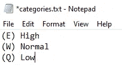
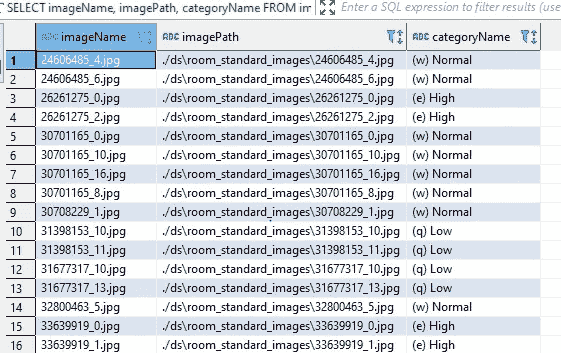

# 为什么要在图像分类实验中标注自己的数据？

> 原文：<https://towardsdatascience.com/why-should-you-label-your-own-data-in-image-classification-experiments-6b499c68773e?source=collection_archive---------17----------------------->

## 尽管单调乏味，给你的图片贴标签可以提供有价值的见解。使用 tkteach 在 5 分钟内设置好您的贴标管道


凯利·西克玛在 Unsplash 上的照片

获取高质量的影像分类标签决定了您的项目是否有机会取得成功。互联网上有几乎无限的图像资源，但如果你的任务比猫狗分类器更复杂，往往很难找到适合解决你的特定问题的标记图像。

让事情变得更复杂的是，定义你的问题并提出正确的问题本身就是一个挑战。当您处理结构化数据时，您可以使用平均值、最大值或中值等聚合来轻松汇总数千条记录，使您在半小时内对整个样本有一些基本的了解。

当处理图像时，这变得复杂得多，因为你所能做的只是快速检查几十个图像，并希望你收集的任何见解将很好地推广到整个数据集。

影像数据的这一特征使得为您的模型定义正确数量的类或快速验证您尝试使用影像分类解决的问题的可行性变得非常棘手。

# 1.为什么手动标注数据集的子样本是个好主意？

从标记几千张图像开始实验听起来并不是最先进或最有趣的方法，但这种大胆的方法有几个优点:

*   标注样本数据集是探索图像的最佳方式，因为它要求您为每一幅检查的图像做出决定，从而使您比浏览数据集时更加集中注意力
*   对一个图像类做出数百个决定是验证您选择的类是否正确的快速方法，通常您需要添加一个新的类，因为您发现一些意外的图像类型比预期的更常见
*   您可能会发现，您正在尝试解决的任务的大部分信息包含在图像的一小部分中，在这种情况下，可能值得添加一些成帧算法来增强重要部分并减少噪声，然后再将其提供给分类器
*   自己对图像进行分类可以让你很好地洞察人类的表现以及你的模型可能面临的障碍。在错误分析过程中，这种经验是必不可少的，因为你经常会发现模型产生的错误类似于你花了最长时间来分类的图像
*   如果你发现自己很难对图像进行分类，它们可能不是你试图解决的问题的答案。在这种情况下，您只是为自己节省了几个小时无价值的编码，因为您的模型可能不会超过人类的性能。后退一步，想想你是否问对了问题，这是一个好主意

好吧，以上所有观点听起来都很有说服力，但是谁有时间给成千上万的图片贴标签呢？好消息是，你可以在 3 个小时的工作时间内获得这些好处——比你花在调整模型上的时间要短得多。

虽然为了获得最佳的图像分类性能，您可能需要数万或数十万张图像，但从大约 5000 张手动标记的图像开始是验证您的分类器是否有机会的快速方法。5k 图像听起来很多，但是经过几分钟的练习，你可以每小时标记大约 1.5k-2k 图像。这几个乏味的小时可以快速验证项目的可行性，如果初始实验成功，您将拥有一个值得信赖的数据样本，可以将其用作测试集，以查看在更广泛的数据集上训练的模型与人类相比表现如何。

# 2.如何在 5 分钟内建立一个图像标注管道？

从我的经验来看， [**tkteach**](https://github.com/Serhiy-Shekhovtsov/tkteach.git) 正是建立一个简单而有效的标签管道的合适工具。这三个步骤是你开始标记你的图像所需要的，我将使用我自己的图像分类项目，在这里我试着以平面室内标准为例进行分类:

1.  将 tkteach 资源库克隆到您的项目中

```
git clone [**https://github.com/Serhiy-Shekhovtsov/tkteach.git**](https://github.com/Serhiy-Shekhovtsov/tkteach.git)
```

2.在克隆的 tkteach 存储库中创建一个 ds 文件夹，并在 ds 文件夹中创建一个包含要标记的图像的文件夹


3.打开已存在于克隆 tkteach 存储库中的 categories.txt，并按照({keyboard key}) {class name}格式创建您自己的类。



现在你已经准备好开始你项目中最无聊的几个小时了，但是相信我，你的勇气会在以后得到回报的。将目录切换到您的 tkteach 文件夹并运行 tkteach.py。这将触发一个弹出窗口，要求您找到包含您要标记的图像的文件夹。选择好准备好的文件夹后，你就可以开始享受标签了——只需点击选择的键(在我的例子中是 q，w，e ),然后进入下一张图片。


# 3.访问标记的图像

您的图像标签存储在 tkteach 文件夹中名为 storage.db 的 sqlite 数据库中。您可以使用 dbeaver 或类似的 sqlite 数据库工具轻松访问它，只需选择 storage.db 路径。您的数据库应该如下所示:


*图片*和*标签*表是查询图片及其标签的关键表，而*类别*表将 *category_id* 映射到实际的标签名称。如果您有多个包含图像的文件夹，您将只需要*数据集*表，因为它将允许您按文件夹过滤标记的图像。您可以通过一个简单的查询提取带标签的图像数据，该查询输出图像名称、位置及其类别。

```
SELECT imageName, imagePath, categoryNameFROM images aJOIN labels bON a.id = b.image_idJOIN categories cON b.category_id = c.id
```



# 4.一次乏味却有益的经历

我知道了艰难地标记自己的图像数据的好处——花费数小时试图改进计算机视觉模型，这些模型注定会失败，原因有两个:

*   图像和/或其标签的质量太低
*   图像中的信息与解决我的特定任务无关，我自己也没有很好地标记它们

在这两种情况下，几个小时无聊的图像标记让我实现了十几个小时的花式编码。

我不建议标记成千上万的图像——一旦你在自己的数据上取得了一些初步的成功，你可以找到其他方法来扩大你的数据集或找人来为你做标记。

然而，我鼓励你在开始你的计算机视觉项目时，试着花几个小时来标记几千张图像中值得信赖的子集。它允许您快速验证您的想法，是探索您的数据的一种很好的方式，可以节省您大量的时间。