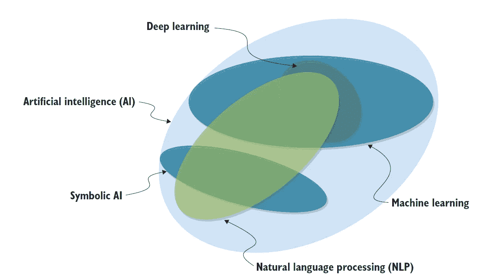
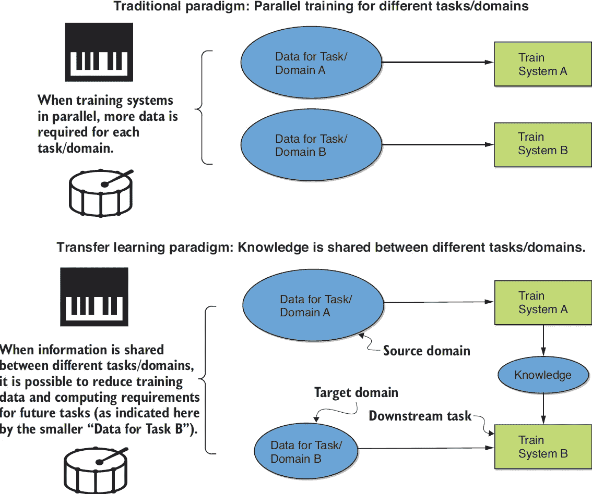
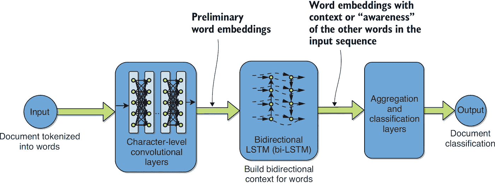
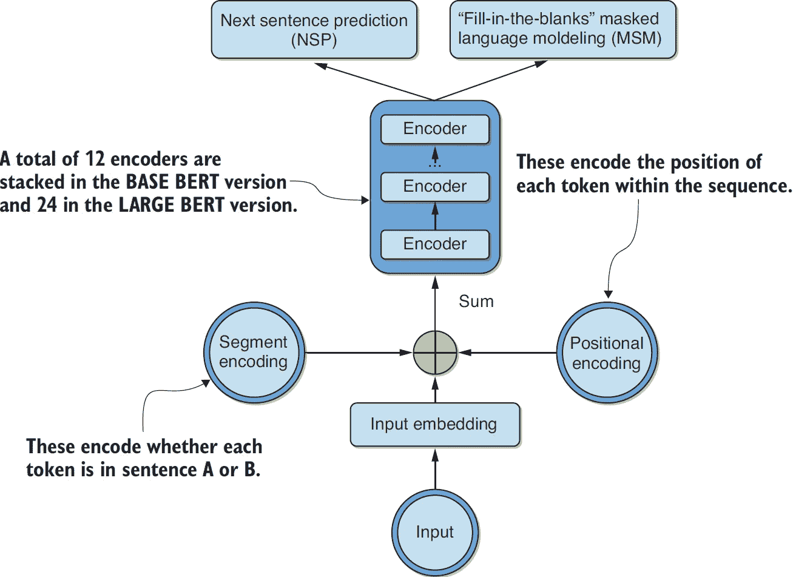
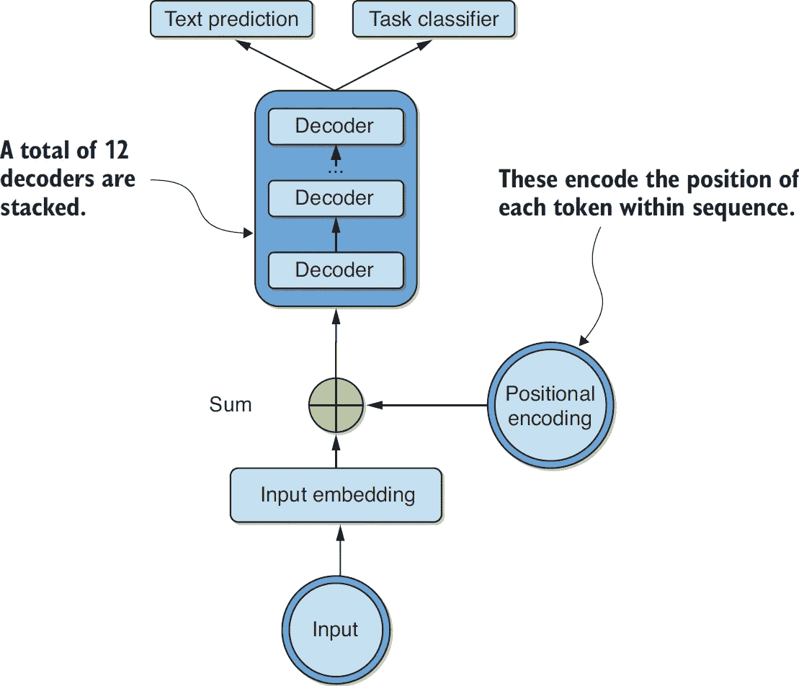

# 自然语言处理中迁移学习的新进展

> 原文：<https://towardsdatascience.com/why-should-you-leverage-transfer-learning-14d08a60f616?source=collection_archive---------19----------------------->

## [思想和理论](https://towardsdatascience.com/tagged/thoughts-and-theory)

## 自然语言处理中迁移学习技术的发展综述

> 以下是我新发布的《自然语言处理的迁移学习》一书的节选。摘要总结了一些最近的 NLP 模型架构依赖于迁移学习的概念。

人工智能已经戏剧性地改变了现代社会。以前由人类完成的任务现在可以由机器来完成，速度更快，成本更低，在某些情况下效率更高。这方面的流行例子包括计算机视觉应用——涉及教计算机如何理解图像和视频——例如，用于在闭路电视摄像中检测罪犯。其他计算机视觉应用包括从患者器官的图像中检测疾病，以及从植物叶子中检测植物种类。人工智能的另一个重要分支，特别处理人类自然语言数据的分析和处理，被称为*自然语言处理* (NLP)。NLP 应用的例子包括语音到文本的转录和各种语言之间的翻译，等等。在图 1 中，AI 和 NLP 在维恩图中与相邻的场并列。

图一。维恩图是自然语言处理(NLP)、人工智能(AI)、机器学习和深度学习等术语相对于彼此的可视化。也显示了符号 AI。(图片作者，来自 [*《自然语言处理的迁移学习》*](https://www.manning.com/books/transfer-learning-for-natural-language-processing) )

人工智能、机器人和自动化领域技术革命的最新体现，被一些人称为第四次工业革命的，是由训练大型神经网络的算法进步、通过互联网获得的大量数据以及通过最初为个人游戏市场开发的*图形处理单元*(GPU)获得的大规模并行能力的交叉引发的。更具体地说，最近依赖于人类感知的任务自动化的快速发展，特别是计算机视觉和 NLP，要求神经网络理论和实践取得这些进展。这使得输入数据和期望的输出信号之间的复杂表示能够被学习，以处理这些困难的问题。

与此同时，对人工智能在不久的将来能够完成的事情的预测已经大大超过了在实践中已经取得的成就。我们被警告一个世界末日的未来，它将抹去大多数人类工作，取代我们所有人，甚至可能对我们的生存构成威胁。自然地，自然语言处理也不排除在这种推测之外，并且它是今天人工智能中最活跃的研究领域之一。

迁移学习旨在利用不同背景下的现有知识——无论是不同的任务、语言还是领域——来帮助解决手头的问题。它受到人类学习方式的启发，因为我们通常不会针对任何给定的问题从零开始学习，而是建立在可能相关的先验知识上。例如，当一个人已经知道如何演奏另一种乐器时，学习演奏一种乐器被认为更容易。显然，乐器越相似，例如风琴和钢琴，先前的知识就越有用，学习新乐器就越容易。然而，即使乐器大不相同，比如鼓和钢琴，一些先前的知识仍然是有用的，即使不那么有用。在这个思维实验中，部分原因可能是因为坚持一个节奏是两种乐器共有的技能。

大型研究实验室，如 Lawrence Livermore 国家实验室或 Sandia 国家实验室，以及大型互联网公司，如谷歌和脸书，能够通过对数十亿个单词和数百万张图像训练非常深度的神经网络来学习非常大型的复杂模型。例如，谷歌的自然语言处理模型 BERT】接受了来自英语维基百科(25 亿个单词)和图书语料库(8 亿个单词)的超过 30 亿个单词的预训练。同样，深度*卷积神经网络*(CNN)已经在 ImageNet 数据集的超过 1400 万张图像上进行了训练，学习到的参数已经被许多组织广泛外包。今天，从零开始训练这种模型所需的资源量对于神经网络的普通从业者来说通常是不可用的，例如在较小企业工作的 NLP 工程师、较小学校的学生等。这是否意味着较小的参与者无法在他们的问题上取得最先进的成果？令人欣慰的是，如果应用正确，迁移学习的概念有望减轻这种担忧。

## 迁移学习为什么重要？

迁移学习使您能够将从一组任务和/或领域获得的知识调整或转移到另一组任务和/或领域。这意味着，一个用海量资源训练出来的模型——包括数据、计算能力、时间、成本等。—一旦开源，更广泛的工程社区就可以对其进行微调，并在新的环境中重新使用，而所需资源只是原始资源的一小部分。这是 NLP 民主化的一大步，更广泛地说，是 AI 民主化的一大步。图 2 展示了这个范例，以学习如何演奏乐器为例。从图中可以看出，不同任务/域之间的信息共享可以导致后面的或*下游*任务 b 实现相同性能所需的数据减少

图二。转让好处的说明。收入模式，显示在底部面板中，其中信息在为不同任务/领域训练的系统之间共享，而传统模式，显示在顶部面板中，其中训练在任务/领域之间并行发生。在迁移学习范式中，通过信息/知识共享可以减少数据和计算需求。例如，如果一个人先知道如何弹钢琴，我们期望他更容易学会打鼓。(图片作者，来自 [*《自然语言处理的迁移学习》*](https://www.manning.com/books/transfer-learning-for-natural-language-processing) ，灵感来自[图 3 本文](/a-comprehensive-hands-on-guide-to-transfer-learning-with-real-world-applications-in-deep-learning-212bf3b2f27a))

## NLP 迁移学习的最新进展

传统上，对于任何给定的问题设置(任务、领域和语言的特定组合)，学习都是在完全监督或完全无监督的方式下从零开始进行的。早在 1999 年，在*支持向量机* (SVMs)的背景下，半监督学习就被认为是一种解决潜在的有限标记数据可用性的方法。对较大的未标记数据集合的初始无监督预训练步骤使得下游监督学习更容易。这种方法的变体研究如何处理潜在的噪音，即可能不正确的标签——这种方法有时被称为*弱监督学习*。然而，通常假设标记和未标记数据集具有相同的采样分布。

迁移学习放松了这些假设。迁移学习的需要在 1995 年被公认为是“学会学习”的需要。NeurIPS 可能是机器学习领域最大的会议。本质上，它规定智能机器需要拥有终身学习的能力，将学到的知识重新用于新的任务。它后来被冠以几个不同的名称进行研究，包括*学会学习*、*知识转移*、*归纳偏差*、*多任务学习*等。在多任务学习中，算法被训练成同时在多个任务上表现良好，从而揭示可能更普遍有用的特征。然而，直到 2018 年左右，人们才开发出实用且可扩展的方法，在 NLP 中实现最难的感知问题。

2018 年见证了自然语言处理领域的一场革命。对如何最好地将文本集合表示为向量的理解发生了巨大的变化。此外，开源模型可以被微调或转移到不同的任务、语言和领域，这一点得到了广泛的认可。与此同时，几个大的互联网公司发布了更多更大的 NLP 模型来计算这种表示，他们还指定了定义良好的程序来微调它们。突然之间，普通的从业者，甚至是一个独立的从业者，都有能力在 NLP 中获得最先进的结果。它甚至被广泛称为 NLP 的“ImageNet 时刻”，指的是 2012 年后计算机视觉应用的爆炸，当时一个经过 GPU 训练的神经网络赢得了 ImageNet 计算机视觉竞赛。就像最初的 ImageNet moment 一样，预训练模型库第一次可以用于任意 NLP 数据的大型子集，以及定义良好的技术，用于微调它们以适应手头的特定任务，其标注数据集的大小远远小于其他情况下所需的大小。这本书的目的是描述、阐明、评估、论证性地应用、比较和对比属于这一类别的各种技术。接下来我们简要概述这些技术。

对自然语言处理的迁移学习的早期探索集中在对计算机视觉的类比上，它已经成功地应用了十多年。一个这样的模型— [本体建模的语义推理(SIMOn)](https://arxiv.org/pdf/1901.08456.pdf) — SIMOn 采用字符级 CNN 结合双向*长短期记忆网络* (LSTMs)进行结构化语义文本分类。它展示了 NLP 迁移学习方法，与计算机视觉中使用的方法直接类似。大量关于计算机视觉应用的迁移学习的知识推动了这种方法。通过该模型学习的特征被证明对于无监督的学习任务也是有用的，并且在社交媒体语言数据上工作得很好，这些数据可能有些特殊，并且与维基百科和其他基于书籍的大型数据集上的语言非常不同。

word2vec 最初表述的一个显著缺点是歧义。没有办法区分一个词的各种用法，这些用法根据上下文可能有不同的含义，即同形异义词:例如，鸭子(姿势)对鸭子(鸟)，公平(聚会)对公平(公正)。在某种意义上，原始 word2vec 公式通过表示单应词的这些不同含义的向量的平均向量来表示每个这样的词。 [*来自语言模型的嵌入*](https://arxiv.org/abs/1802.05365)——在流行的芝麻街角色后缩写为 ELMo 是使用双向 LSTMs 开发单词的语境化嵌入的尝试。ELMo 模型的高级架构图如图 3 所示。

图 3。在文档分类示例的上下文中可视化 ELMo 架构。(图片作者，来自 [*【自然语言处理的迁移学习】*](https://www.manning.com/books/transfer-learning-for-natural-language-processing) )

单词在该模型中的嵌入在很大程度上取决于其上下文，对于每个这样的上下文，相应的数字表示是不同的。ELMo 通过训练来预测单词序列中的下一个单词，这是语言建模领域的一项重要任务。巨大的数据集，例如维基百科和各种书籍的数据集，在这个框架中很容易用于训练。

*(ULM-FiT)通用语言模型微调(Universal Language Model Fine-tuning)是一种被提出来为任何特定任务微调任何基于神经网络的语言模型的方法，最初在文本分类的上下文中被演示。这种方法背后的一个关键概念是*区别性微调*，其中网络的不同层以不同的速率进行训练。OpenAI *生成预训练转换器* (GPT)修改了转换器的编码器-解码器架构，以实现 NLP 的可微调语言模型。这个模型架构如图 4 所示。*

**

*图 4。GPT 架构的高级表示，显示了堆栈解码器、输入嵌入和位置编码。来自顶部的输出可以用于文本预测/生成和分类。(图片作者，来自 [*《自然语言处理的迁移学习》*](https://www.manning.com/books/transfer-learning-for-natural-language-processing) )*

*GPT 丢弃了编码器，保留了解码器和它们的自我关注子层。 [*来自变压器*](https://arxiv.org/abs/1810.04805) (BERT)的双向编码器表示可以说是相反的，通过保留编码器和丢弃解码器来修改变压器架构，还依赖于*屏蔽*单词，这些单词随后需要作为训练度量来准确预测。BERT 如图 5 所示。*

**

*图 5。BERT 架构的高级表示，显示了堆栈编码器、输入嵌入和位置编码。在训练期间，来自 top 的输出被用于下一句预测和填空屏蔽语言建模目标。(图片作者，来自 [*《自然语言处理的迁移学习》*](https://www.manning.com/books/transfer-learning-for-natural-language-processing) )*

*这些概念在书中进行了详细的讨论，在实践中的例子问题，如垃圾邮件检测，假新闻分类，列类型分类，聊天机器人，等等。*

*在所有这些基于语言模型的方法中——ELMo、ULM-FiT、GPT 和 BERT——都表明，生成的嵌入可以针对特定的下游 NLP 任务进行微调，只需要相对较少的标记数据点。对语言模型的关注是有意的；假设由它们诱导的假设集通常是有用的，并且已知大规模训练的数据是容易获得的。*

*从那时起，在前面描述的思想的基础上开发了各种新的模型——从旨在减少 BERT 的大小同时实现几乎相同的性能的模型，如 ALBERT 和 DistilBERT，到旨在处理长文档的模型，如 LongFormer 和 BigBird。*

*NLP 迁移学习领域目前是一个非常活跃和令人兴奋的领域，现在是学习如何利用它的好时机！*

*要了解更多，请查看 Sebastian Ruder 的优秀博客和拥抱脸的优秀变形金刚库。也请查看我在 [GitHub 和 Kaggle](https://github.com/azunre/transfer-learning-for-nlp) 上的代表性代码示例报告。*

*《自然语言处理的迁移学习》的硬拷贝和电子书版本可从[manning.com](https://tinyurl.com/47p8zzrv)、[亚马逊](https://www.amazon.com/Transfer-Learning-Natural-Language-Processing/dp/1617297267)、[巴恩斯&诺布尔](https://www.barnesandnoble.com/w/transfer-learning-for-natural-language-processing-paul-azunre/1137938357)和[塔吉特](https://www.target.com/p/transfer-learning-for-natural-language-processing-by-paul-azunre-paperback/-/A-82704702)获得。*