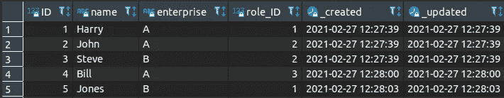
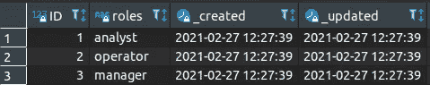
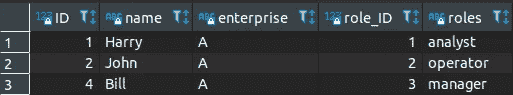
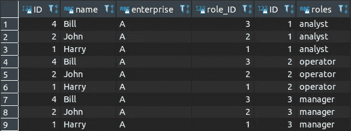

# 为什么您应该重新考虑您的查询

> 原文：<https://towardsdatascience.com/why-should-you-rethink-your-queries-aca569560638?source=collection_archive---------36----------------------->

## 了解什么是隐式连接、显式连接及其区别


托拜厄斯·菲舍尔在 [Unsplash](https://unsplash.com/) 上的照片

作为一名数据科学家，查询数据库是我日常生活的一部分。

因此，以精确的方式提供信息并构建查询以使它们易于被重新访问是至关重要的，因为这不仅减少了可能的错误，还节省了维护过程中的大量时间。

然而，为了达到这个理想的查询级别，有必要理解它们行为中的细微差别。

然而，没有人天生就是专家，我们试图一次理解一个人的细微差别，不管是出于需要，还是出于好奇，至少这是我的哲学。

介绍完毕，让我们继续挑战，考虑以下场景:

你的老板向你要一份 a 公司所有员工的名单。

您打开数据库，看到以下表格:

雇员



“作者截图”

和

角色



“作者截图”

很简单，不是吗？(我希望真正的查询在这个层次上，但是我们将关注一个简单的例子)。

您立即开始编写，得到的查询是:

```
SELECT Employees.ID, name, enterprise, role_ID, roles 
FROM Employees
INNER JOIN  Roles
ON Employees.role_ID = Roles.ID
WHERE Employees.enterprise = "A";
```



“作者截图”

你导出名单，交给你的老板，任务完成。恭喜你。

你的老板没有提到的是，他也把同样的任务交给了另一个同事，唯一的目的就是取笑你(毕竟谁不喜欢好的恶作剧呢！).

5 分钟后，你的老板打电话给你，向你展示你同事的解决方案，并问你:下面的问题和你的有什么不同？

```
SELECT Employees.ID, name, enterprise, role_ID, roles
FROM Employees, Roles
WHERE Employees.role_ID = Roles.ID
AND Employees.enterprise = "A";
```

没错，你的老板在跟你胡闹。

两个查询产生相同的结果！

然而，它们并不平等。

尽管如此，如果你想改变你的查询，我会试着永远驱除这种想法。

为此，让我们把它分成几个部分，你刚才看到的只是隐式连接(第二个版本)和显式连接(第一个版本)之间的区别。

这让我想到了第一点:

**#1。通过使用隐式版本，您可以委托表合并选择**

当你试图弄清楚信息是从哪里来的以及如何来的时，一个简单的事实是，你正在委托那个选择，这可能会导致将来的麻烦(下面有更多关于这个的信息)。

因此，如果可以选择的话，采用显式路径，这样可以保证在构造查询时选择的清晰性。

实际上，默认情况下，当使用条件(其中 Employees.role_ID = Roles)请求隐式连接时。ID 和 Employees.company = 'A ')执行内部联接。

这让我想到了第二点:

**#2。如果你忘记了条件呢？**

在只有两个表的场景中，这种情况不会发生，但是当我们讨论复杂的查询时，我们很容易调用多个表，因此忘记一个关系条件的可能性增加了。

当我们使用隐式连接时，默认情况下，如果没有指定条件，就会执行交叉连接，对于大多数健忘的人来说，这是表之间的笛卡尔积。

在我们的场景中，这将是一个包含按 *n* 个角色排列的 *n* 个雇员行的表。

```
SELECT Employees.ID, name, enterprise, role_ID, Roles.ID, roles 
FROM Employees, Roles
WHERE  Employees.enterprise = "A";
```



“作者截图”

(你有没有注意到我们从 3 排的桌子跳到了 9 排？！)

不同的是，当使用显式连接时，如果没有指定条件，查询只会返回一个错误。

**#3。维护**

自从你的老板对你恶作剧以来，两年过去了，他现在要求你对你的同事(现在在另一家公司)在同一时期所做的查询进行调整。

您打开查询，面对无限多的隐式连接，当您开始分析关系条件时，您注意到有一个条件没有声明。

当这样一个问题出现时:是我的前同事忘记了关系条件，还是查询实际上是正确的，他想进行交叉连接？

然而，没有人记录该查询的目标，并且您正在推断它的目标。由于你已经在公司工作了两年，你可以看到两种情况(有或没有条件)都有道理的现实，此外，现在甚至你的前同事可能都不记得你是正确的版本。

使用显式连接，因为没有条件查询将无法工作，如果确实存在交叉连接，则必须声明它，因此不会出现此问题。

此外，通过显式连接，查询变得更具可读性(谁不喜欢更愉快的阅读呢？).这样你就可以一点一点地浏览正在发生的事情。

还记得[模块化代码](https://medium.com/@scott.waring/use-modular-programming-to-improve-your-code-and-life-5a25c98feaa0)的原理吗？

这是非常相似的，每个显式连接代表一个模块，所以如果您已经知道问题所在，您可以直接转到一个模块并更改它，而不是遍历每个条件来解开表之间的关系。

如果你仍然不相信，我有几个额外的要点:

**#4。通过显式连接，您可以控制执行的顺序**

**#5。自从 1992 年显式连接被确立为标准以来(没错，将近 30 年前！！！)**

特别是在 SQL-92 语言的第三个版本中。

(如果你的战士想要额外的挑战，你可以在这里查阅修订版[)。](http://www.contrib.andrew.cmu.edu/~shadow/sql/sql1992.txt)

总而言之，在一天结束的时候，由你来质疑你自己的查询:它们是否带来了你需要的结果，是否有不准确的倾向？但最重要的是，你的目标够清楚吗？？如果没有，你能说得更清楚吗，或者你需要在过程中记录任何东西吗？

请记住，第二天，你将在另一端试图解决留下的烂摊子。

所以，在这一切之后，我问你:

您将使用哪种类型的查询？

附注:你有没有想到任何其他的观点，或者你不同意以上提到的任何观点？在 [Linkedin](https://www.linkedin.com/in/rpinto02/) 上与我评论或交谈，让我们一起改进这篇文章。

**信息来源:**

1.维基百科| [SQL](https://en.wikipedia.org/wiki/SQL)

2.维基百科| [SQL-92](https://en.wikipedia.org/wiki/SQL-92)

3. [SQL-92](http://www.contrib.andrew.cmu.edu/~shadow/sql/sql1992.txt)

4.Stackoverflow | [SQL 左连接 vs 多个表 on FROM 行？](https://stackoverflow.com/questions/894490/sql-left-join-vs-multiple-tables-on-from-line)