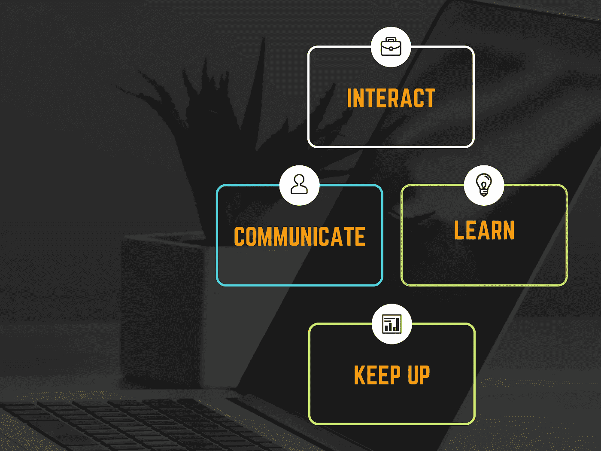

# 为什么智能数据科学家总是在基础数据科学面试中失败

> 原文：<https://towardsdatascience.com/why-smart-data-scientists-keep-failing-basic-data-science-interviews-3a0f70f1fad8?source=collection_archive---------18----------------------->

## 如何抓住每一个工作机会

在 [Unsplash](https://unsplash.com?utm_source=medium&utm_medium=referral) 上由 [Austin Distel](https://unsplash.com/@austindistel?utm_source=medium&utm_medium=referral) 拍摄的照片

数据科学家的头衔不仅仅是放在盘子里交给纯粹的技术极客，而是实至名归的。从参加编程课程到科技盛会再到实习，成为本世纪最性感工作[的专业人士并不是一件容易实现的壮举。你会同意，获得数据科学家的职业需要大量的申请、意向书、面试和考试，这些都有可能被不同的机构拒绝。](https://hbr.org/2012/10/data-scientist-the-sexiest-job-of-the-21st-century)

该领域的大多数专业人士都在不断寻找新的更好的机会来增加他们的经验，并在他们的银行账户上添加更多的零。有这么多合格但有限的职位，要找到那份理想的工作相当具有挑战性。IBM 最近发布的一项研究表明，全球还需要另外 28%的数据科学家来满足日益增长的需求。然而，大多数公司都倾向于在重要职位上雇佣有丰富经验的专业人士。

面试和你的技能一样重要。在面试中尽你最大的努力是你获得工作的首要条件。你花了几个月的时间准备你的作品集和申请，但是你带着焦虑的心情去参加面试，结果你把一切都搞砸了。根据我三年来进行数据科学工作面试的经验，以及顶级公司其他专业人士的研究，以下是大多数数据科学家面试失败的核心原因以及如何避免这些原因。

作者创造的形象。

# 默默工作

你喜欢在工作时保持安静吗？当你一个人的时候，它可能对你有用，但是当你在你潜在的雇主面前练习的时候，它肯定不会有用。大部分人编码的时候都不会大声说出来，我也懂。有点压力。但是你需要为你的面试说话和支撑你的步伐。大多数面试通常很简短，你的面试官希望实时了解你的技术、进步和行为特征。因此，如果你在这些方面有所欠缺，你的分数会大幅下降。

当被要求解决一个问题时，重复问题，以清楚地了解问题。通过这样做，你让面试官看到了解决问题时的同理心和准确性。积极地与面试官交流也为你赢得了思考的时间，并刷新了你解决问题所需技巧的记忆。

这是一个协调数据分析访谈的例子——展示工作时的互动:

“所以如果我答对了问题，你要我(重复问题)。我们在同一页上吗？

“在我继续之前，我会查看我正在处理的数字和统计数据，以防止在我进行过程中出现任何不必要的错误。

“首先，我启动我的 Jupyter 笔记本并导入依赖项，然后运行以检查错误。同时，预览数据的文件位置。这可以接受吗？

“我已经通过输入`data.isnull()`检查了空值，但是我可以看到它运行缓慢并且充满了一些错误。为了不浪费任何时间，我将运行一个不同的命令，看看是否也能提高速度和效率……”

从这个例子中，你可以看到要点是如何分解的，面试官是如何随着每一步的进展而进行的。这只是技术性和交互性完美和谐工作的一个例子。更好更直接的改进方法是与你的教练、客户和同事进行多次模拟面试——熟能生巧。反馈至关重要；它们是你需要知道的最好的方法。

# **在准备阶段忽略面试的重要方面**

为了赢得面试，你已经严格学习了编程、数据科学和/或机器学习的基础知识。你扮演了你的角色，尽你最大的努力尝试了这些问题。如果一切都那么“完美”，你为什么没有得到这份工作？我见过很多人哀叹，因为他们的质量和专业精神，他们被欺骗或被敲竹杠。不要误解我，这些人是技术天才，拥有健康的投资组合，但他们缺乏必要的技能。这些技能决定了数据科学家在压力下与团队和管理层一起工作时的效率。

> *找对职业技能堪比玩* [*俄罗斯方块设置为隐形*](https://kotaku.com/the-craziest-games-of-tetris-ive-ever-seen-1678232306) *。因此，除了统计和算法，你还需要展示一些积极的技能来打动你的听众。*

67%的人力资源专业人士表示，由于缺乏软技能，他们拒绝了一位有才华的 IT 候选人的工作邀请，原因如下。让我们面对它；没有人想雇佣一个不知道如何与该领域其他专业人士恰当互动的*科技机器人*。数据科学不像许多人认为的那样仅仅与数字有关。一旦你的项目完成，你需要向你的团队或上级展示你的工作。因此，一旦你的读者发现了这些基本但重要的技能中的漏洞，他们就会把你的简历从他们的办公桌上拿走——你就失去了这份工作。

大多数数据科学家未能开发和实践技能，如基本的沟通，带有一点幽默、协作、互动、无私、多才多艺和依赖。这些听起来可能没有技术诀窍重要，但它们对你的成功至关重要。在面试的前一天，读一些专业人士写的书，集中在发展专业交流上——[**像 TED 一样说话:卡门·盖洛**](https://www.amazon.com/Talk-Like-TED-Public-Speaking-Secrets/dp/1250041120) 写的 9 个公开演讲的秘密是一个守护者。向你自己或最好是有共同兴趣的同事解释你对某个项目的解决方案和观察结果，也是提高沟通技巧的一个很好的练习。

# **未能跟上行业的最新趋势**

越来越多的行业正在使用数据科学来满足他们各种复杂的业务需求-在瞬间提取和分析数据是所有公司都希望实现的现代进步。随着更多的参与和自动化技术，我们所知道的数据科学正在经历快速发展；因此，从发布之日起，及时了解最新变化是至关重要的。

[物联网(IoT)](https://www.wired.co.uk/article/internet-of-things-what-is-explained-iot) 、机器学习、统计学只是数据科学的几个方面。数据无疑是一个广阔的领域，跟上最新的趋势和变化通常具有挑战性。跟上时代对我来说也很难适应——你并不孤单——这是压倒性的，每个人，不管知识如何，都在努力跟上。

准备面试时，你必须掌握与你申请的职位和整个数据科学相关的最新趋势信息。面试官会很好奇，想获得关于行业发展和其他前景的新观点。

为了加快您的旅程，以下是数据科学家如何保持自我更新的列表:

*   参加会议:会议和技术聚会是向其他专业人士学习和获取对当前话题的看法的好方法。如果你需要最新的科技发展，那就开始参加会议吧。
*   **推特:**如今每个人都有智能手机；信息的移动性是好处之一。行业内的公司和顶级科学家使用微博平台将信息快速传递给更广泛的受众。如果你是新手，你会对你错过的大量有趣的数据科学更新感到惊讶。@GoogleAI、@OpenAI、@AndrewYNg、@KDNuggets、@Goodfellow_Ian 和其他人是我在旅途中获取更新的首选来源。

谷歌人工智能展示数据集的更新。作者截图

*   **时事通讯:**你可能会因为你的“电子邮件隐私政策”而对此不以为然，但是订阅几份时事通讯总是个好主意。你可以从网上博客和出版物中找到好的时事通讯。如果你和我一样，不喜欢每日时事通讯，那么像[走向数据科学](https://towardsdatascience.com/)这样的出版物每周都会让我了解最新消息。

# **最终想法**

完成一项认证或四年的课程会让你成为一名数据科学家，但不是一名称职的数据科学家。公司需要不仅仅会编程的应聘者。数据科学、数据工程、DevOps 工程、人工智能领域的职业生涯都是基于棘手的面试。但好消息是，通过适量的练习、积极的态度和不断学习的动力，这些问题很容易克服。如果你正在为下一次面试做准备，或者正在寻找磨练和掌握这种技能的方法，这里有一些小贴士可以指导你:

1.事先对你申请的公司和职位进行调查。

2.互动。互动酝酿伟大的关系。

3.你的语言要精确而广博。我认为所有的数据科学家都必须具备 Python、R 和 SQL 方面的高深知识。

4.面试时，边练习边解释你的模型。带着你的听众——包括技术性和非技术性的。

5.最重要的是，要诚实。不要用你不完全熟悉的技术、语言或工具填充你的应用程序。