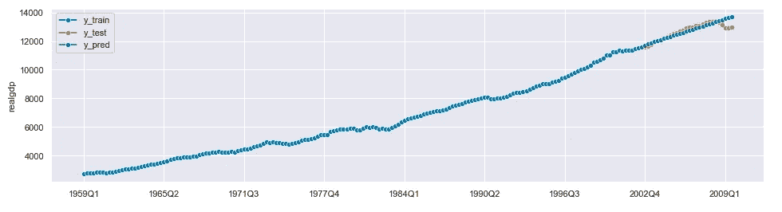

# 为什么开始使用 sktime 进行预测？

> 原文：<https://towardsdatascience.com/why-start-using-sktime-for-forecasting-8d6881c0a518?source=collection_archive---------2----------------------->

## [实践教程](https://towardsdatascience.com/tagged/hands-on-tutorials)

## sktime 区别于其他预测框架的特性概述


照片由 [Aron 视觉效果](https://unsplash.com/@aronvisuals?utm_source=medium&utm_medium=referral)在 [Unsplash](https://unsplash.com?utm_source=medium&utm_medium=referral) 上拍摄

# 预测的作用

企业主面临的挑战之一是预测未来的市场状况。预测有助于做出明智的决策，并形成对结果的现实预期。这种对预测的需求导致了预测工具的不断发展。它们能够通过从过去的观察中获取有用的信息来预测未来的事件。最近的一些预测框架包括脸书的 [Prophet](https://facebook.github.io/prophet) ，优步的 [Orbit](https://uber.github.io/orbit/) ，或者 Linkedin 的 [Greykite](https://linkedin.github.io/greykite/) 。然而，大多数 Python 预测包关注于特定的模型族，例如，广义加法模型或统计模型。Sktime 旨在填补这些预测工具之间的空白。

# 什么是 sktime？

Sktime 是一个用于时间序列建模的开源工具箱。它结合了分布在许多 Python 库中的功能。它还增加了自己独特的预测功能。它允许我们为时间序列训练、微调和评估模型。它与 scikit-learn 兼容。该框架还支持例如时间序列分类、特征提取和时间序列聚类。要获得完整的特性列表，请查看 sktime 的[文档](https://www.sktime.org/en/latest/)。本文主要关注预测以及 sktime 如何让整个过程变得更简单。**这是 sktime 预测功能的实际演练。但是首先，让我们快速浏览一下本文中使用的数据。**

# 数据概述

所有代码示例都基于 statsmodels 库中的公共数据集。它包含了 1959 年至 2009 年间美国季度宏观经济数据。数据集的完整描述可在[此处](https://www.statsmodels.org/devel/datasets/generated/macrodata.html)获得。我们将重点预测实际国内生产总值。


*数据概述*


*一段时间内的宏观经济指标。作者图片*

Sktime 对用于存储时间序列的数据结构施加了某些限制。您可以在下面找到宏观经济数据导入和转换。

但是重点是…

# 为什么要用 sktime 做预测？

## 1)它在一个统一的 API 下结合了许多预测工具

Sktime 汇集了许多预测库的功能。在此基础上，**它提供了一个统一的 API，与 scikit-learn** 兼容。

在这种情况下，统一 API 的优势是什么？以下是一些主要原因:

*   它允许用户轻松实现、分析和比较新模型。
*   由于预测者的明确分类，它有助于避免在选择适当的算法时出现混乱。
*   它使工作流程可读性和可理解性，因为所有预测者共享一个公共界面。它们在单独的类中实现，就像在其他工具箱中一样，包括 scikit-learn。
*   它可以改变工作流程中的预测者。这使我们不必在每次改变模型时调整代码的结构。

Sktime 的预测者分享了至关重要的 scikit-learn 的方法，比如 *fit()* 和 *predict()* 。下面的代码显示了一个基本的预测工作流。

```
**Output:**
2002Q2    11477.868
```

上面的代码生成一步预测。这就是我们将其中一个分配给预测范围的原因。现在让我们关注指定地平线的不同可能性。

**预测范围**可以是一组相对值或绝对值。**绝对值**是我们想要生成预测的特定数据点。**相对值**包括将进行预测的步骤列表。如果我们使用 *update_predict()* 方法进行滚动预测，相对预测范围尤其有用。这使我们不必在每次生成预测时更新绝对范围。当我们添加新数据时，相对范围保持不变。

我们也可以将相对地平线转换成绝对地平线，反之亦然。从绝对值到相对值的转换尤其值得一提。它不仅仅产生一个步骤编号列表。这些值与培训系列的最后日期相关。这意味着如果值为负，则它们是样本内预测。这一功能非常重要，因为预测者可以为每一步设定不同的参数。下面的代码显示了预测范围之间的差异。

```
**Output:**
Absolute FH: ForecastingHorizon(['2002Q2', '2002Q3', '2002Q4', '2003Q1', '2003Q2', '2003Q3','2003Q4', '2004Q1', '2004Q2', '2004Q3', '2004Q4', '2005Q1', '2005Q2', '2005Q3', '2005Q4', '2006Q1', '2006Q2', '2006Q3', '2006Q4', '2007Q1', '2007Q2', '2007Q3', '2007Q4', '2008Q1', '2008Q2', '2008Q3', '2008Q4', '2009Q1', '2009Q2', '2009Q3'], dtype='period[Q-DEC]', name='date', is_relative=False)

Relative FH ahead: [1, 2, 3, 4, 5, 6, 7, 8, 9, 10, 11, 12, 13, 14, 15, 16, 17, 18, 19, 20, 21, 22, 23, 24, 25, 26, 27, 28, 29, 30]

Relative FH in-sample: [-29, -28, -27, -26, -25, -24, -23, -22, -21, -20, -19, -18, -17, -16, -15, -14, -13, -12, -11, -10, -9, -8, -7, -6, -5, -4, -3, -2, -1, 0]
```


*预测层位对比。作者图片*

现在让我们深入了解一下 sktime 提供的一些常见接口功能。首先，指定和训练模型的过程被拆分为单独的步骤。在拟合模型之前，我们指定预测者的参数。在**单变量时间序列**的情况下， *fit()* 方法接受训练序列。对于一些预测者，例如*directtabularregressionpredictor*或*directtimeseriesregressionpredictor*，它还包括预测范围。对于其他人，预测范围可以在 *predict()* 方法中互换。下面是一个使用 AutoARIMA 预测单变量时间序列的示例。



*用单变量序列进行预测。作者图片*

Sktime 还允许使用外生变量进行预测。有了**多元外生时间序列**，拟合参数范围更广。它包括一个训练序列和一个带有外生变量的数据帧。与单变量时间序列一样，一些预测者需要参数中的预测范围。在下面的代码中，我们使用外生变量 *realinv* 的滞后值来预测 *realgdp* 的值。


用外生变量进行预测。图片作者。

除了拟合，sktime 还使**能够用新数据更新预测者**。这允许我们自动更新预测的截止时间，因此我们不需要在每次添加新数据时自己改变范围。截止值设置为新训练系列中的最后一个数据点。这种方法允许我们更新预测器的拟合参数。

通用接口适用于所有型号系列。Sktime 包括一系列易于使用、集成良好的预测工具。以下是目前在 sktime 中实现的预测器列表:

*   Holt-Winter 的指数平滑，Theta 预测器，和 ETS(来自 statsmodels)，
*   ARIMA 和 AutoARIMA(来自 pmdarima)，
*   蝙蝠和 tbats(来自 TBATS)，
*   先知预报员(来自 fbprophet)，
*   多项式趋势预测器，
*   克罗斯顿的方法。

Sktime 还允许使用 scikit-learn 的机器学习模型来建模时间序列。这就引出了 sktime 的下一大优势。

## 2)它提供了针对时间序列问题调整的机器学习模型

我前面提到过，sktime 的 API 兼容 scikit-learn。这意味着有可能采用许多 scikit-learn 的功能。Sktime 允许我们使用 scikit-learn 的机器学习模型来解决预测问题。

但是为什么我们不能使用 scikit-learn 中可用的标准回归模型呢？事实上，我们可以，但是这个过程需要大量的手写代码，并且容易出错。主要原因是这两种学习任务之间的概念差异。

在**表格** **回归**中，我们有两种类型的变量——目标和特征*变量*。我们基于特征变量预测目标变量。换句话说，模型从一组列中学习，以预测不同列的值。这些行是可以互换的，因为它们是相互独立的。

在**预测**中，我们只需要有一个单变量。我们根据它的过去值来预测它的未来值。也就是说，模型预测同一列的新行。这些行不可互换，因为未来值取决于过去值。因此，即使我们用一个外生变量进行预测，这仍然不是一个回归问题。


*表格回归与预测。作者图片*

这两个问题之间的区别非常明显。但是在预测问题时使用回归模型有什么风险呢？以下是一些原因:

*   **它产生了评估预测模型的问题**。使用 scikit-learn 的训练测试分割会导致数据泄漏。在预测问题中，行是相互依赖的，所以我们不能随意打乱它们。
*   **转换数据进行预测的过程容易出错。**在预测任务中，我们经常从多个数据点汇总数据或创建滞后变量。这种转换需要大量的手写代码。
*   **时序参数难以调整**。像滞后大小或窗口长度这样的值不作为 scikit-learn 估计器的参数公开。这意味着我们需要编写额外的代码来调整它们以适应我们的问题。
*   **生成多步预测很棘手**。让我们考虑生成未来 14 天的预测。scikit-learn 的回归变量根据最后一次观察值进行 14 次预测。这不是我们想要做的。我们希望我们的预测者在每次生成预测时更新最近的已知值。也就是说，每个预测应该基于不同的数据点。

Sktime 允许使用回归模型作为预测器的组成部分。由于 T21 的缩减，这是可能的。

> *归约是用一个算法来解决一个学习任务的概念，这个学习任务不是为它设计的。它是从复杂的学习任务到简单的学习任务的过程。*

我们可以使用归约将预测任务转化为表格回归问题。这意味着我们可以使用 scikit-learn 的估计器来解决预测任务，例如随机森林。

还原过程中的关键步骤是:

*   使用滑动窗口方法将训练集分成固定长度的窗口。

举个例子，如果窗口长度等于 11，则过程如下:第一个窗口包含第 0-10 天的数据(其中第 0-9 天成为特征变量，第 10 天成为目标变量)。第二个窗口包含第 1-11 天的数据(其中第 1-10 天成为特征变量，第 11 天成为目标变量)，等等。

*   把那些窗户一个接一个的排列起来。这为我们提供了表格形式的数据，特征变量和目标变量之间有明显的区别。
*   使用以下策略之一-递归、直接或多输出，来生成预测。


*使用回归模型进行预测。图片来自* [*sktime 的文档*](https://www.sktime.org/en/latest/examples/01_forecasting.html) *。*

现在让我们看一些代码，用回归器组件执行预测。

在我们的例子中，sktime 的方法 *make_reduction()* 使用 scikit-learn 的模型创建了一个基于 reduction 的预测器。它接受一个回归变量，预测策略的名称和窗口长度。它输出一个可以像任何其他预测器一样拟合的预测器。您也可以使用*directtabularregressionpredictor*对象将预测问题简化为表格回归任务。然而，这位预测者使用直接策略进行缩减。

值得一提的是，**缩减的参数可以像任何其他超参数一样进行调整。**这就把我们带到了 sktime 的下一个优势，就是评估模型。

## 3)它能够快速、无痛苦地评估预测模型

评估预测模型不是一项简单的任务。它需要跟踪与标准回归问题不同的指标。它们并不总是容易实现，例如平均绝对标度误差(MASE)。这些模型的验证也很棘手，因为我们无法将数据分成随机的子集。最后，调整预测器的参数，例如窗口长度，需要大量的手写代码，并且容易出错。Sktime 解决了与评估预测模型相关的三个主要问题。

**Sktime 允许通过** **回测**对预测者进行评估。这个过程包括将我们的数据分成时间训练集和测试集。重要的是，测试集包含训练集之前的数据点。剩下的过程就是我们从 scikit-learn 了解到的。我们在测试集上生成预测，并计算度量。然后我们将预测值与实际值进行比较。

Sktime 提供了几个特定于预测模型的性能指标。例如，它们包括平均绝对标度误差(MASE)或平均绝对百分比误差(MAPE)。您可以通过两种方式调用这些指标——或者通过调用一个函数，或者调用一个类。使用类接口提供了更多的灵活性。例如，它允许您更改指标的参数。更棒的是， **sktime 还提供了使用*make _ forecasting _ scorer()*函数轻松实现自定义计分器**。定义自定义指标和评估模型的示例如下所示。

```
**Output:**
custom MAPE: 0.05751249071487726
custom MAPE per row:
date
2002Q2    0.001020
2002Q3    0.003918
2002Q4    0.002054
2003Q1    0.004020
2003Q2    0.009772
Freq: Q-DEC, dtype: float64
```

在测试集上评估我们的模型并不总是最优的解决方案。有没有办法让交叉验证适应预测问题？答案是肯定的，而且 sktime 做得相当不错。**提供基于时间的交叉验证**。

它支持使用两种方法分割数据进行交叉验证。它们包括扩展窗口和滑动窗口。在**扩展窗口**中，我们在每次运行中将训练集扩展固定数量的数据点。这样，我们就创建了多个训练测试子集。这个过程一直进行到训练集达到指定的最大大小。在**滑动窗口**中，我们保持训练集的固定大小，并在数据中移动它。

我们可以在 *evaluate()* 方法中指定时态交叉验证拆分器。除了选择窗口类型，我们还可以指定添加新数据的策略。我们可以通过改装或更新我们的模型来做到这一点。下面是一个使用扩展窗口执行交叉验证的示例。


*扩展窗口交叉验证。作者图片*

最后，sktime 提供了几种调优模型超参数的方法。它还支持调整特定于时间序列的参数。目前，sktime 提供了两个调优元预测器: **ForecastingGridSearch** 和**ForecastingRandomizedSearch**。像在 scikit-learn 中一样，它们通过用一组不同的参数训练和评估指定的模型来工作。ForecastingGridSearch 评估超参数的所有组合。预测随机搜索只测试其中固定大小的随机子样本。Sktime 为各类预报员提供参数调谐。这也包括带有回归成分的预测。

什么是伟大的，**我们还可以** **调整嵌套组件的参数**。它的工作方式与 scikit-learn 的管道完全一样。我们通过访问由 *get_params()* 方法生成的字典中的键来做到这一点。它包含与预测者的超参数相关的特定键值对。键名由两个元素组成，由双下划线连接，例如` *estimator__max_depth* `。第一部分是组件的名称。第二部分是参数的名称。

在下面的示例中，我们使用 ForecastingRandomizedSearchCV 调整随机森林回归器的参数。

```
**Output:**
{'window_length': 2, 'estimator__max_depth': 14}
0.014131551041160335
```

优化嵌套参数是 sktime 提供的复杂用例之一。现在让我们深入到 sktime 解决的其他复杂问题。

## 4)它为复杂的预测问题提供了新的功能

复杂的预测问题也有 sktime 支持。它提供了各种各样的转换器，可以在拟合模型之前改变我们的时间序列。它还允许我们建立管道，连接变压器和预报员。此外，它还提供了自动化的模型选择。它比较了整个模型族和转换类型。最后，它使集合预报成为可能。

我们现在将分别关注每个功能。先说变形金刚。为什么我们甚至需要预测中的转换？首先，主要目标是去除过去时间序列中观察到的复杂性。此外，一些预测器，尤其是统计模型，在拟合之前需要特定的转换。一个例子是 ARIMA 模型，它要求时间序列是平稳的。 **Sktime 提供种类繁多的变形金刚。**其中一些是:

*   *Detrender* —从时间序列中去除趋势，
*   *去季节化器* —从时间序列中去除季节模式，
*   *BoxCoxTransformer* —将时间序列转换为类似正态分布，
*   *HampelFilter* —检测时间序列中的异常值，
*   *tabulartoseriesadapter*—将表格转换适配到序列(例如，适配 scikit-learn 的预处理功能)。

请务必检查所有这些，因为可用的变压器列表仍在增长。Sktime 提供了与 scikit-learn 中类似的方法。它们包括 *fit()、transform()* 和 *fit_transform()* 。一些转换器也共享 *inverse_transform()* 方法。它能够访问与初始时间序列相同规模的预测。

下面的代码显示了一个转换时间序列和反转操作的示例。


反向转换后的预测。图片作者。

Sktime 允许将变压器与预测器链接起来，以获得单个预测器对象。这可以使用**管道**来完成。Sktime 提供了一个*转型的 TargetForecaster* 类。它是一个管道对象，旨在结合任意数量的转换器和预测器。它可以将多步操作减少到一步。您可以在管道中使用任何类型的预测器。

Sktime 还允许为带有外生变量的时间序列构建**管道。它提供了另一个管道对象，*预测管道*。这种管道能够实现外生变量和目标时间序列的转换。**

下面你可以找到一个用外源数据构建管道的例子。

既然您有几个要测试的转换和预测器，您可能想知道它们中的哪一个最适合您的问题。Sktime 提供了一个简单的方法来回答这个问题。启用 **autoML** ，即**自动选择型号**。这可以通过使用*多重预测器*类来完成。这个类的对象接受一个预测列表作为参数。你可以用它来找到一个表现最好的预测者。它可以与 ForecastingGridSearch 和 ForecastingRandomizedSearch 一起使用。你可以在下面找到一个例子。

```
**Output:**
{'selected_forecaster': 'ets'}
```

**Sktime 还支持自动选择管道中使用的转换**。它提供了一个*可选直通*变压器。它接受另一个 transformer 对象作为参数。这使我们能够验证所选择的转换是否提高了模型的性能。然后，OptionalPassthrough 对象作为管道中的一个步骤进行传递。我们现在可以将这些传递超参数添加到网格中，并应用交叉验证技术。我们还可以评估变压器的参数。

最后， **sktime 支持** **集合预报**。您可以将一个预测者列表传递给*ensemble predictor*，然后使用它们来生成预测。如果您选择不同系列的型号，此功能尤其有用。预测者是平行的。他们每个人都有自己的预测。之后，默认情况下对它们进行平均。您可以通过指定 *aggfunc* 参数来更改聚合技术。

下面你可以找到一个集合预报的例子。

```
**Output:**
[TBATS(), AutoARIMA()]
```

复杂功能的列表仍在增长。这就引出了我想提到的最后一个优势。

## 5)它是由一个活跃的社区开发的

对于成熟的图书馆来说重要的是，一个多元化的社区已经积极地致力于这个项目。最新版本(v. 0.7.0)于 2021 年 7 月发布。它引入了一些特性，如带有外生变量的管道或克罗斯顿方法。预测目前被标记为一个稳定的功能。但是仍然有一个未来步骤的列表。它们包括预测区间和概率预测。此外，未来还将增加多变量预测。也有计划包括测试模型性能之间的显著差异。

**Sktime 很容易扩展。**它提供扩展模板来简化添加新功能的过程。还有一个预测者的扩展模板。它使得本地实施新的预测和对 sktime 的贡献变得容易。如果你有兴趣参加这个项目，我们非常欢迎你参加。你可以在这里找到关于[贡献的所有信息。](https://www.sktime.org/en/latest/contributing.html)


奥利弗·帕斯克在 [Unsplash](https://unsplash.com?utm_source=medium&utm_medium=referral) 上拍摄的照片

# 最终注释

在我看来， **sktime 是一个全面的工具包，在很大程度上改善了 Python** 中的预测体验。它简化了训练模型、生成预测和评估预测者的过程。它还能够解决复杂的预测问题。此外，它采用 scikit-learn 接口模式来预测问题。该软件包仍在开发中，但即使是现在，它也是一个很好的预测选择。

# 资源

*   [示例笔记本](https://github.com/joanlenczuk/sktime_article)
*   [l ning，m .，Király，F. (2020)使用 sktime 进行预测:设计 sktime 的新预测 API，并将其用于复制和扩展 M4 研究](https://arxiv.org/abs/2005.08067)
*   [sktime 的文档](https://www.sktime.org/en/latest/index.html)
*   [sktime 的 github](https://github.com/alan-turing-institute/sktime/tree/main/sktime)
*   sktime 的教程——预测
*   [sktime 的教程—使用 sklearn 进行预测及其缺点](https://github.com/alan-turing-institute/sktime/blob/573789b8d92a2035f82500ffb93a89115a944fc1/examples/01a_forecasting_sklearn.ipynb)
*   [Hyndman，R.J .，Athanasopoulos，G. (2021)预测:原理与实践，第三版，OTexts:墨尔本，澳大利亚。OTexts.com/fpp3.于 2021 年 7 月 20 日登陆。](https://otexts.com/fpp3/)

感谢您的阅读！我非常感谢你对这篇文章的反馈——你可以通过 [Linkedin](https://www.linkedin.com/in/joanna-lenczuk/) 联系我。此外，请使用参考资料中链接的我的示例笔记本随意体验一下 sktime 的特性。