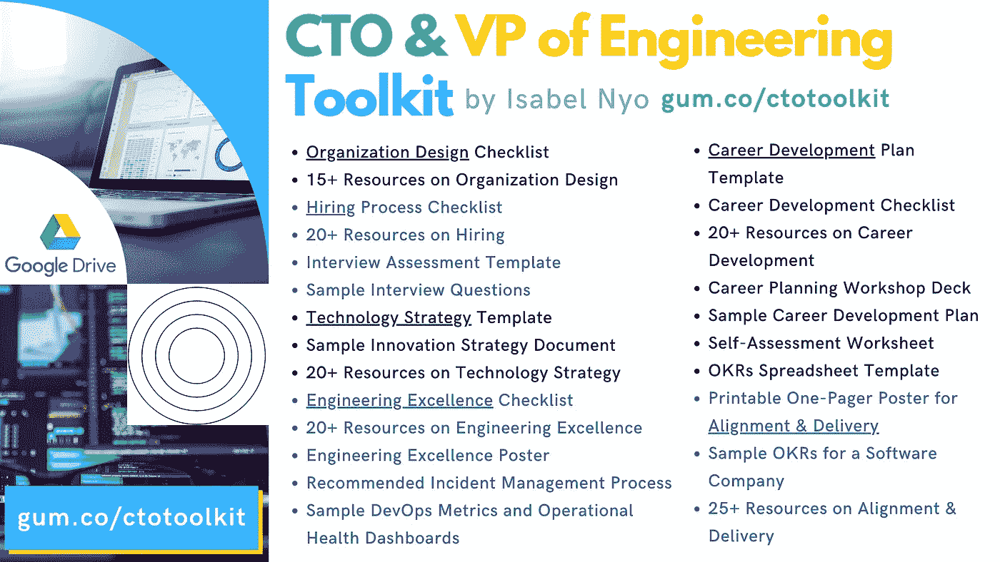

# 为什么故事点对于软件工程师来说是一个可怕的度量

> 原文：<https://towardsdatascience.com/why-story-points-are-a-horrible-metric-for-software-engineers-421bc8971f11?source=collection_archive---------29----------------------->

## 以及用什么来衡量绩效

照片由 [Cookie 在](https://unsplash.com/@cookiethepom?utm_source=medium&utm_medium=referral) [Unsplash](https://unsplash.com?utm_source=medium&utm_medium=referral) 上的 Pom 拍摄

让我们面对现实吧，我们的行业痴迷于“越多越好”的理念——一心多用，长时间工作，忙碌，完成很多事情。

然而，随着我们拥抱一种新的工作方式，远程工作，分布式环境，我们，[工程经理](https://eisabainyo.net/weblog/category/articles/software-development-manager/)，需要放下过去不再有用的东西。这包括使用虚荣指标和老式的方法来衡量生产率。

因为越多并不总是越好，尤其是在衡量一个软件工程师的表现时。

# **不要:用完成的故事点来衡量软件工程师的表现**

Josh Appel 在 [Unsplash](https://unsplash.com?utm_source=medium&utm_medium=referral) 上拍摄的照片

故事点的使用一直是一个巨大的争论话题。有人说它对敏捷软件开发团队有用，也有人说它对商业毫无用处。他们两个都是正确的。但是在我职业生涯的最后二十年里，作为一名软件开发人员和工程经理，我在许多软件开发团队中工作过，所以我有一个强烈的观点。故事点对于软件开发者的表现来说是一个糟糕的衡量标准。

## 为什么故事点不是一个好的绩效指标？

## 并非所有的故事点都是相同的

故事点是相对于给出评估的人或团队的知识的复杂性的度量。因此，一个团队的故事点 3 可能不等于另一个团队的故事点 3。因此，当你比较来自不同团队的多名工程师的交付时，故事点不是正确的衡量标准。

## 更大的故事点并不意味着更大的影响

在软件开发中，简单就是美。通常，大故事点是复杂代码路径的结果，奖励大故事点间接鼓励软件开发人员考虑复杂和过度设计他们的解决方案。对于一个工程师来说，了解他们工作效率的最好方法是看他们交付了什么样的成果，以及他们对客户产生了什么样的影响。而不是他们写了多少代码或者他们的代码有多复杂。

## 故事点给出了太多的灵活性，并鼓励更少的责任

故事点并没有告诉我们一个软件工程师有多负责和可靠。当然，他们可能从事最复杂(相对)的故事，但这并不意味着他们尽了最大努力，按时交付，并体现了正确的行为。关于故事点最糟糕的事情是，它使软件工程师避免承诺任何日期。我知道许多软件工程师通常不希望承诺一个截止日期，以防他们发现任何未知，但是不对什么时候完成某件事情设定预期，或者没有任何里程碑是完全不负责任的。

## 高级工程师可能编码时间更少

随着工程师职业生涯的进展，他们可能会发现实际的编码/开发工作越来越少，因为他们将做其他需要更多资历的事情，如计划、故事分解、指导、入职、代码审查等。如果他们为大型科技公司工作，这一点尤其正确，因为需要更多的协调和知识共享。从百分比来说，会接近或者超过 50%，这取决于公司的规模，项目的复杂程度，以及资历。

# **Do:根据他们所在级别的预期能力来衡量绩效**

由[杰斯·贝利](https://unsplash.com/@jessbaileydesigns?utm_source=medium&utm_medium=referral)在 [Unsplash](https://unsplash.com?utm_source=medium&utm_medium=referral) 上拍摄

首先，让我澄清一下:一个工程师的表现永远不应该用工作的小时数或编写的代码行数来衡量。应该用产生的结果来衡量它们。

然而，这听起来有点抽象，所以让我进一步解释。

科技公司倾向于根据对工程师和软件开发人员的级别和角色的预期能力来衡量他们的表现。像 FAANG(脸书、亚马逊、苹果、网飞和谷歌)这样的大型科技公司已经记录了关于这种预期的信息，所以在某种程度上，这是非常客观的。

常见的能力(按初级->高级的期望顺序排列)有:

*   专门技能
*   规划工作技能(将一个大问题分解成可管理的任务)
*   评估技能
*   沟通技巧
*   利益相关者管理技能
*   影响技能
*   指导技能

初级开发人员不一定需要具备利益相关者管理技能和影响力技能，但随着他们在职业阶梯上的攀升，他们将需要展示更多来自底层的技能。

# **Do:获得软件工程师的定性反馈，例如:360 度反馈**

[Raymond T.](https://unsplash.com/@jajangmyeon?utm_source=medium&utm_medium=referral) 在 [Unsplash](https://unsplash.com?utm_source=medium&utm_medium=referral) 上的照片

作为一名软件工程师，在当今这个软件开发日益复杂的时代，仅仅埋头编码是不够的。能够与他人合作交付成果是软件开发人员角色的重要组成部分。因此，从与他们合作的人那里获得对软件工程师的 360 度反馈是很重要的，以了解他们作为团队的一部分在交付成果方面有多有效。在今天的工作环境中，聪明的混蛋没有立足之地。

# 衡量什么是重要的

查尔斯·德鲁维奥在 [Unsplash](https://unsplash.com?utm_source=medium&utm_medium=referral) 上拍摄的照片

简而言之，在考虑软件开发人员的表现时，有定性和定量的衡量标准。像 360 度反馈这样的定性指标和像发布功能的影响这样的定量指标经常被关注，但是看看其他虚荣的指标，比如代码行，完成的故事点应该被避开。

*   不要:用完成的故事点来衡量软件工程师的表现
*   Do:根据他们所在级别的预期能力来衡量绩效
*   Do:获得软件工程师的定性反馈，例如:360 度反馈

📩[注册](https://eisabainyo.net/weblog/subscribe/)订阅作者的时事通讯，定期获得关于你科技职业的建议和资源。您还将立即收到一个链接和密码，为您的职业发展下载免费赠品。

首席技术官工具包——面向技术领导者的工具和资源