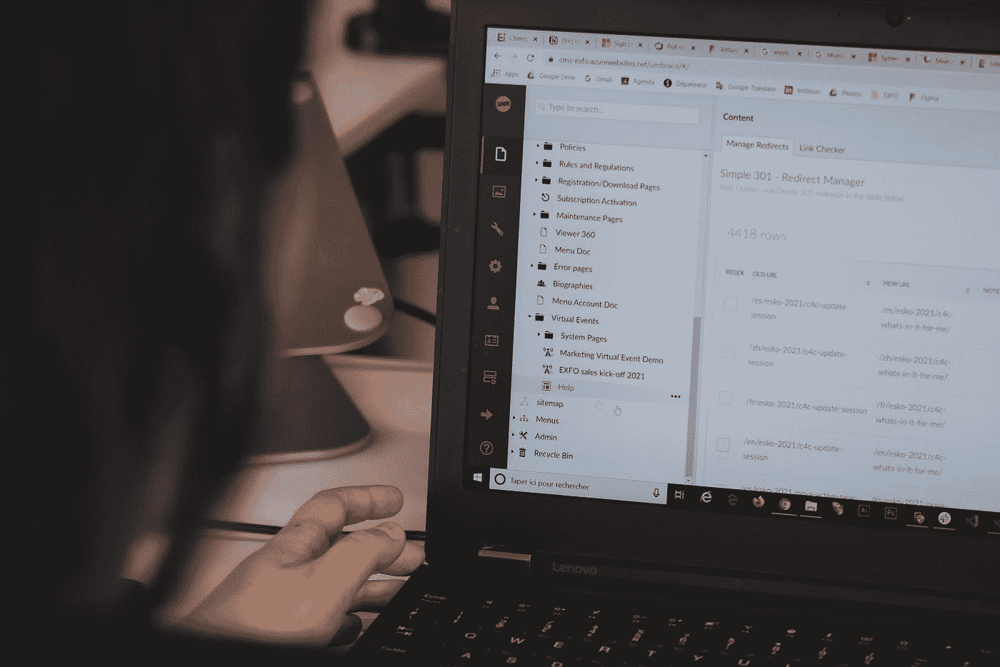

# 为什么数据测试不能防止数据管道损坏

> 原文：<https://towardsdatascience.com/why-testing-your-data-is-insufficient-6914275a9762?source=collection_archive---------35----------------------->

## 数据是一个动态的、通常是非结构化的实体，当涉及到确保数据质量时，仅仅测试并不能拯救您的管道。

图片由 [Unsplash](http://www.unsplash.com) 上的[迈克尔·谢弗](https://unsplash.com/photos/13UugSL9q7A)提供。

*2021 年，仅靠数据测试不足以确保数据准确可靠。正如软件工程团队利用 New Relic、DataDog 和 AppDynamics 等解决方案来监控其应用程序的健康状况一样，现代数据团队也需要类似的监控和可观察性方法。以下是如何利用测试和监控来* [*防止数据管道*](https://www.montecarlodata.com/data-observability-how-to-prevent-your-data-pipelines-from-breaking/) *损坏，并实现高数据可靠性。*

对大多数公司来说，数据是新的软件。

像软件一样，数据是企业成功的基础。它需要“永不停机”，数据停机时间**要像应用程序停机时间[五个九](https://en.wikipedia.org/wiki/Five_nines)一样认真对待，有人吗？).就像您的软件一样，遵守您团队的数据 SLA 对于保持您公司的竞争优势至关重要。**

**虽然许多团队会使用他们应用于测试软件的准确性和可靠性的相同的可靠方法来测试他们的数据是有道理的，但是我们的行业正处于一个转折点:**仅仅进行数据测试是不够的。****

**在运行分析之前，依靠数据测试来发现数据管道中的问题，相当于在部署新软件之前，相信单元和集成测试能够识别有问题的代码，但这在现代数据环境中是不够的。同样，如果没有跨整个代码库的[应用程序监控和可观察性](https://thenewstack.io/monitoring-and-observability-whats-the-difference-and-why-does-it-matter/)，就不可能有真正可靠的软件，如果没有跨整个数据基础设施的数据监控和可观察性，就不可能实现完全的数据可靠性。**

> **最好的数据团队不是完全依赖测试，而是利用双重方法，将数据测试与整个管道的持续 [**监控和可观察性**](/data-observability-the-next-frontier-of-data-engineering-f780feb874b) 相结合。**

**让我们仔细看看这意味着什么，以及如何开始对您自己的堆栈应用数据监控。**

# **什么是数据测试？**

****

**图片由[西格蒙德](https://unsplash.com/photos/59yRYIHWtz)在 [Unsplash](http://www.unsplash.com) 上提供。**

**数据测试是在管道的不同阶段验证您对数据的假设的过程。基本的[数据测试方法](https://www.guru99.com/data-testing.html#3)包括使用固定数据的模式测试或定制数据测试，这有助于确保 ETL 顺利运行，确认您的代码在一小组众所周知的场景中正常工作，并防止代码更改时出现倒退。**

**数据测试通过对空值、唯一性、引用完整性和其他常见的数据问题指示器进行静态测试来提供帮助。这些工具允许您设置手动阈值，并对您关于数据的基本假设的知识进行编码，这些知识应该在管道的每次运行中保持不变。**

**事实上，数据测试对于特定的、众所周知的问题是一个很好的解决方案，当新数据或新代码打破了您最初的假设时，它会向您发出警告。您甚至可以使用测试来确定您的数据是否满足有效性标准，例如保持在预期范围内或具有唯一值。这在精神上非常类似于软件工程师使用测试来警告他们预期可能发生的众所周知的问题的方式。**

**但是，就像单元测试本身不足以保证软件的可靠性一样，数据测试本身也不能防止数据管道的损坏。**

**以下是 **3 个理由**为什么需要结合测试和监控的混合方法来为现代数据堆栈铺平道路。**

# **数据变化很大**

**在软件工程中，我们大量使用测试来发现代码中的预期问题。然而，每个软件工程师都知道，如果她希望交付一个高度可靠的应用程序，这是不够的。生产环境的可变性比任何工程师在开发过程中预期的都要多。**

**无论是业务逻辑中的边缘情况，软件组件之间难以预测的交互，还是系统的意外输入，软件问题都不可避免地会发生。因此，一个稳健的可靠性策略将把测试作为健全性检查与监控和可观察性结合起来，以验证实际生产环境中的正确性和性能。**

**数据也不例外。虽然测试可以检测和预防许多问题，但是数据工程师不可能预测开发过程中的所有可能性，即使她能够预测，也需要大量的时间和精力。**

**在某些方面，数据甚至比传统软件更难测试。即使是中等规模的数据集，其可变性和复杂性也是巨大的。让事情变得更复杂的是，数据还经常来自“外部”来源，这些来源注定会在没有通知的情况下发生变化。考虑到规模和合规性限制，一些数据团队甚至很难找到一个可以轻松用于开发和测试目的的代表性数据集。**

**监控和可观察性填补了这些空白，为这些不可避免的(也可能是有问题的)管道变更提供了额外的可见性。**

# **端到端覆盖至关重要**

**对于许多数据团队来说，创建一个健壮的、高覆盖率的测试套件是极其费力的，并且在许多情况下可能是不可能的或者不可取的——尤其是如果已经存在几个未覆盖的管道的话。虽然数据测试可以用于较小的管道，但它不能很好地扩展到现代数据堆栈。**

**大多数现代数据环境都极其复杂，数据从几十个来源流入数据仓库或数据湖，然后传播到 BI/ML 供最终用户使用，或者传播到其他运营数据库以供使用。在从源到消费的过程中，数据将经历大量的转换，有时要转换数百次。**

**现实情况是，数据在其生命周期的任何阶段都可能中断，无论是由于源位置的更改或问题、对管道中某个步骤的调整，还是多个管道之间的复杂交互。为了保证高数据可靠性，我们必须能够端到端地了解管道中的破损情况。至少，当数据在系统中传播时，我们必须有足够的可观察性，以便能够对问题进行故障诊断和调试。**

**考虑到以下几个原因，数据测试变得非常有限，包括:**

*   **您的管道可能会利用几个 ETL 引擎和代码框架，这使得在您的组织中保持一致的测试策略非常具有挑战性。**
*   **转换和测试之间的强耦合给系统带来了不可靠性——任何对 ETL 的有意变更(或者，在某些情况下，意外的失败)都将导致测试无法运行和遗漏问题。**
*   **流水线阶段的复杂性和绝对数量使得达到良好的测试覆盖率变得非常困难。**

**这仅仅触及了数据测试在确保完全数据可靠性方面的局限性。**

# **数据测试债务**

**虽然我们都渴望有很大的测试覆盖率，但是数据团队会发现他们的部分管道没有被覆盖。对于许多数据团队来说，根本不存在覆盖率，因为在管道开发的早期，可靠性常常让位于速度。**

**在这一点上，回过头来为现有管道添加测试覆盖可能是一项巨大的投资。如果关于现有管道的关键知识掌握在您的数据团队中的几个精选的(通常是非常早期的)成员手中，追溯性地解决您的测试债务将会，在最好的情况下，转移资源和精力，否则这些资源和精力可能会花费在为您的团队移动针头的项目上。在最糟糕的情况下，如果你团队中的许多早期成员已经不在公司了，并且文档不是最新的，那么解决测试债务几乎是不可能的。**

**可靠的监控和可观察性方法可以帮助减轻数据测试债务带来的一些挑战。通过使用基于 ML 的方法，从过去的数据中学习并监控新的输入数据，团队能够在很少或没有投资和民俗知识的情况下创建对现有管道的可见性，并减少数据工程师和分析师的负担，以减轻测试债务的增加。**

# **下一步:数据监控和可观察性**

**2021 年，数据工程师正处于一个关键时刻，要么跟上我们不断增长、不断发展的数据需求，要么满足于不可靠的数据。对大多数人来说，没有选择。**

**就像软件一样，数据需要测试和监控，以确保一致的可靠性。现代数据团队必须将数据视为一个动态的、不断变化的实体，并采用不同的方法，不仅关注严格的测试，还关注持续的 [**监控和可观察性**](https://www.montecarlodata.com/data-observability-how-to-prevent-your-data-pipelines-from-breaking/) 。**

**通过像对待软件可靠性一样对待数据可靠性，数据团队可以确保他们的数据在任何时候都处于健康状态，并跨越数据健康的几个[关键支柱](/introducing-the-five-pillars-of-data-observability-e73734b263d5)，包括卷、模式、新鲜度、沿袭和分发，以免影响您的业务。**

*****有兴趣了解更多关于数据监控和可观察性的知识吗？伸出手去*** [***巴尔摩西***](https://www.linkedin.com/in/barrmoses/)*[***利奥加维什***](https://www.linkedin.com/in/lgavish) ***，还有*** [***蒙特卡洛团队***](http://www.montecarlodata.com) ***。******

****本文由 Lior Gavish 合著。****