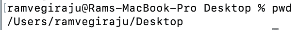
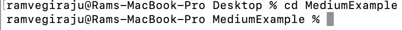
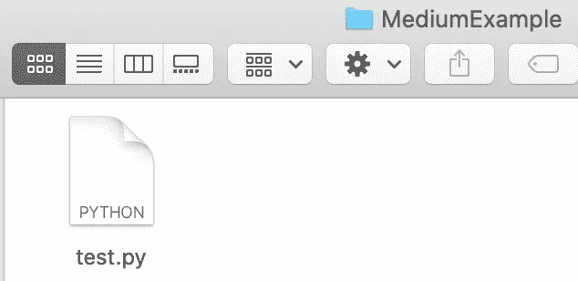
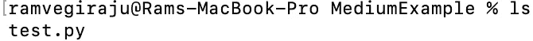
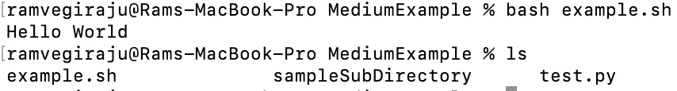
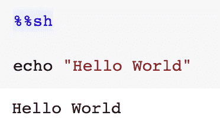
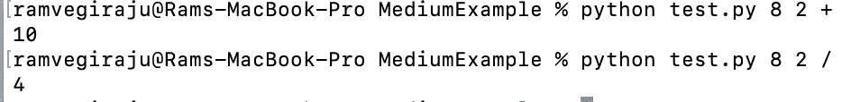

# 为什么 CLI 对数据科学家至关重要

> 原文：<https://towardsdatascience.com/why-the-cli-is-essential-for-data-scientists-cd7016f86d49?source=collection_archive---------21----------------------->

## 创建更高效的机器学习工作流的 CLI 示例和使用案例

图片来自 [Unsplash](https://unsplash.com/photos/EaB4Ml7C7fE)

当我第一次学习数据科学时，我并没有特别强调理解诸如 Unix/Linux 和 Bash 之类的术语。对于一个没有计算机科学背景的人来说，这似乎很陌生，很难理解，但我很快意识到**命令行界面(CLI)** 在管理您的数据科学工作负载中是多么重要。要成为一名强大的数据科学家/MLE 或仅仅使用一般的软件，您需要能够在您的机器上轻松地导航和使用 CLI。除了舒适的 Jupyter 笔记本设置之外，数据科学中还有很多使用 CLI 的用例。例如，当运行计算机视觉工作负载时，人们经常使用名为 [argparse](https://docs.python.org/3/library/argparse.html) 的 Python CLI 接口库向 ML 脚本传递参数。如果您正在迁移到 AWS、Azure 或其他 ML 云提供商，则需要 CLI 来适当地供应和移动您的资源。甚至在我们熟悉的 Jupyter 笔记本的数据科学狩猎场中，也有可能编写包含 Bash 脚本的单元格，我们将深入研究这些脚本。在这篇文章中，我将从整体上介绍如何开始使用 CLI、Bash 的常见用例/技巧以及数据科学和编程。

**注意:**我用的是 Mac，所以我所有的命令都是基于 Unix/Linux 的，对于 Windows 机器上的命令，我还附上了一些额外的资源，你可以跟着看。

# 目录

1.  基本 Bash 命令
2.  编写您的第一个 Bash 脚本
3.  Jupyter 笔记本中的 Shell 脚本
4.  Argparse
5.  结论

# 1.基本 Bash 命令

在我们开始创建实际的 Bash/shell 脚本之前，我们将介绍一些日常使用的更基本的命令。

## 印刷工作目录

你几乎要把你的机器当成一个目的地。CLI 是您导航目的地的地图，您向它发出命令/指示，告诉它您想去哪里。 [**pwd** **命令**](https://www.geeksforgeeks.org/pwd-command-in-linux-with-examples/) 有助于告诉您当前在地图上的位置，或者您是否想知道您在机器中的位置。

作者截图

如你所见，我们得到了当前的位置。

## 创建目录

作为一名开发人员，文件夹和目录这个词在你的字典中应该是同义词。设置项目时，您可能需要创建各种目录来管理数据或将文件移动到适当的位置。要通过 CLI 创建目录，我们使用 [**mkdir 命令**](https://www.geeksforgeeks.org/mkdir-command-in-linux-with-examples/) 。

创建名为 MediumExample 的目录

执行这个命令后，我现在可以在桌面上看到一个目录。

作者截图

## 光盘(更改目录)

现在您已经创建了一个目录，您可能希望在该目录中工作，以便能够完成项目所需的工作。要更改目录，我们使用 [**cd 命令**](https://www.geeksforgeeks.org/cd-cmd-command/) ，它现在会将你的机器指向你想要的目录。

作者截图

如您所知，我现在位于我们创建的 MediumExample 目录中。

## 触控

现在假设我们在我们的工作目录中，我们想要创建一个 python 文件，我们可以开始工作了。 [**触摸命令**](https://www.geeksforgeeks.org/touch-command-in-linux-with-examples/) 允许我们创建所需类型的新文件。如果我们运行 **touch test.py** ，那么我们会在我们的目录中看到一个 python 文件。

作者截图

## **ls(列表文件)**

如果我们想要一个我们正在处理的所有文件或目录的列表，使用 [**ls 命令**](https://www.geeksforgeeks.org/practical-applications-ls-command-linux/) 可以让你看到目录的内容。如果我们在我们创建的目录中运行 ls，我们将看到我们刚刚创建的 python 文件。

作者截图

这些只是帮助您开始使用 CLI 的一些基本命令。如需更多导航 CLI 的基本命令，请点击此[链接](https://www.hostinger.com/tutorials/linux-commands)。

# 2.编写您的第一个 Bash 脚本

既然我们已经介绍了一些基本的 shell 命令，那么通常可以将其中的几个命令结合在一起，在 CLI 中编排更复杂的操作来管理您的工作流。一个 **Bash 脚本**允许我们创建一个文件，该文件将执行您试图构建的命令和逻辑。Bash 有自己的语法，我们不会深入研究，但是如果你想快速入门，点击下面的[链接](https://devhints.io/bash)。Bash 脚本由。我们将使用触摸命令创建一个 **example.sh** 文件，在我们到目前为止一直使用的目录中创建这个文件。每个 bash 文件都以下面一行开始。

在所有 bash 脚本中

现在，我们可以添加我们想要的任何命令，并根据工作流的需要操作我们的文件。我们可以首先添加一个命令来创建一个新的子目录，并向我们的终端返回一条消息“Hello World”。

创建目录并返回“Hello World”

**Echo** 是一个命令，本质上相当于 Python 中的 print 语句。现在要运行 bash 脚本，运行 **bash example.sh** ，example 是您为文件命名的任何内容。如果您在之后运行 **ls** 命令，您应该会看到一条“Hello World”消息和一个创建的子目录。

作者截图

这个例子很简单，但是在将来，bash 脚本经常被用来与各种服务/工具(如 Docker 或云提供商，如 AWS)协调工作流，以便能够与您的本地机器和资源进行交互/对话。

# 3.Jupyter 笔记本中的 Shell 脚本

对于所有的 Jupyter Notebook stans 来说，也有一个很好的特性，可以创建 Bash 单元来执行。

在朱庇特笔记本里狂欢

通过在单元顶部添加 **%%sh** ，您已经将该单元变成了一个可以执行传统 bash 脚本的代码块。如果您不在 Jupyter 实验室类型的环境中，无法启动终端来处理您的资源，那么使用这个特性非常方便。

作者截图

# 4.Argparse

在 ML、Cloud 和一般编程中，你会看到一个常见的 Python 库是 Argparse。Argparse 允许你在**命令行** **中**传递**参数**给你的脚本。当你为云中的服务提供 ML 脚本时，你会看到它在[计算机视觉](https://www.pyimagesearch.com/2018/03/12/python-argparse-command-line-arguments/)项目以及 [AWS](https://sagemaker.readthedocs.io/en/v1.24.0/using_tf.html) 中被频繁使用。为了理解 argparse，我们可以制作一个简单的计算器应用程序**,我们可以从 CLI 使用它。**

导入解析器

首先，我们导入 argparse 并创建一个解析器。下一步是添加我们可以从 CLI 传入的参数。

计算器的参数:Num1，Num2，Operation

现在我们已经添加了数字参数和一个操作符，我们需要能够处理这些操作符并应用必要的逻辑来创建一个基本的计算器应用程序。

传递的解析参数

现在参数已经被解析并传递到我们创建的基本计算器逻辑中。要查看 argparse 提供的计算器的运行情况，我们可以进入 CLI。

作者截图

我们将该结构中的 **python filename.py args** 以及我们创建的任何参数传递给我们的 CLI，并看到我们的应用程序正在工作。Argparse 非常容易使用，并且有很棒的[文档](https://docs.python.org/3/library/argparse.html)，可以帮助你创建非常强大的应用程序，并通过 CLI 将项目中的各种服务缝合在一起。

# 结论

我希望这篇文章能够很好地介绍如何使用 CLI。在学习数据科学的过程中，非 CS 或技术背景的人常常会跳过掌握 CLI 等步骤。我不能强调 CLI 在管理您的资源以及与其他服务和提供商进行交互时是多么重要，因为您只需从 Jupyter 笔记本电脑升级您的应用程序。

请随时在 LinkedIn 上与我联系，或者在 Medium 上关注我。分享任何想法或反馈，谢谢阅读！