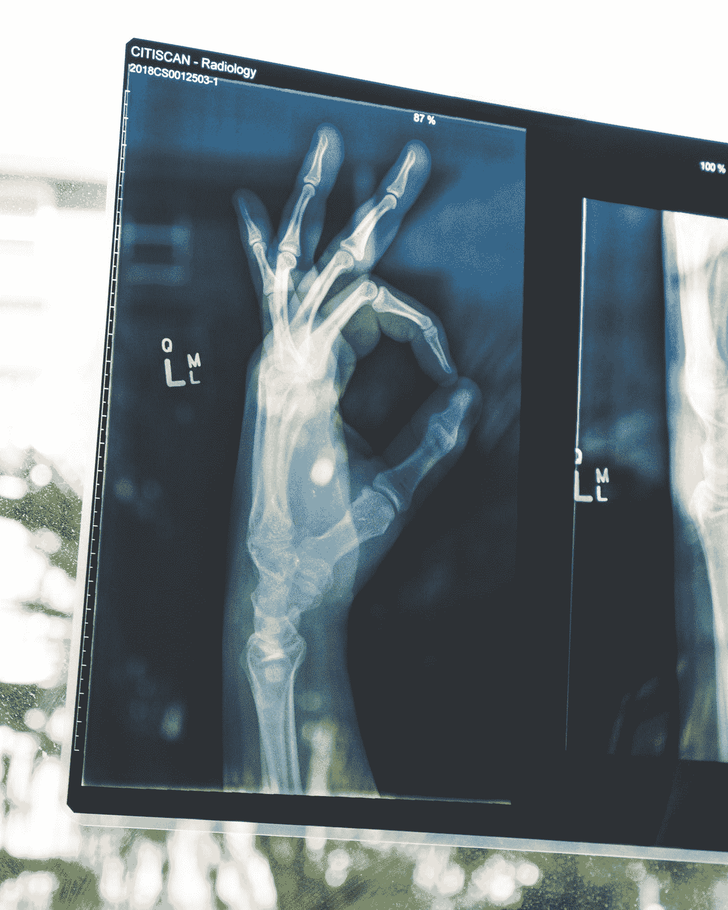

# 为什么美国食品和药物管理局监管医疗人工智能产品对每个人都有好处

> 原文：<https://towardsdatascience.com/why-the-fda-regulating-medical-ai-products-would-be-good-for-everyone-47a269a754ae?source=collection_archive---------49----------------------->

## 医疗人工智能技术可能会随着明确的审批流程而飙升

尽管 FDA 没有维护已批准人工智能产品的公共数据库，但两项研究已经确定了在 [160](https://www.statnews.com/2021/02/03/fda-artificial-intelligence-clearance-products/) 和 [225](https://www.thelancet.com/journals/landig/article/PIIS2589-7500(20)30292-2/fulltext#sec1) 之间已批准的产品。

在 STAT 发现 FDA 批准的 161 种产品中，**只有** [**73 种在公开文件中披露了用于验证的患者数据**的数量](https://www.statnews.com/2021/02/03/fda-clearances-artificial-intelligence-data/) **，其中:**

*   观察到的患者从 0 到 15，000 不等
*   只有 7 种产品提供其数据集的种族构成
*   只有 13 个产品提供其数据集的性别构成

数据标准的不一致破坏了对医疗人工智能产品的信任，并危及其未来的增长。一些公司声称与 FDA 有关于使用多样化数据集的**通信，例如人工智能乳腺成像检测提供商 iCAD。但是这些很少被写进他们的 FDA 文件。**

这种方法不同于 FDA 对新药的长期严格审查。为什么这很重要？将新的救命人工智能产品推向市场至关重要。统一这么做**保护了患者**，**获得了**对这些新工具的信任，**为更安全、更广泛地使用人工智能打开了市场**。

FDA 为产品提供一致、清晰的审批流程有哪些主要好处？

# **新产品**

在我从事医学人工智能的工作中，我看到了研究人员竭尽全力创建一流的模型。然而，不明确的监管框架限制了应用深度学习解决医疗问题的数量，更少的人将这些技术商业化。

我们看到深度学习的使用正在爆炸。模型可以拯救生命，提高可及性，降低成本，改善病人护理。一条清晰的市场路径鼓励医疗人工智能的创新。

照片由[拉蒙·萨利内罗](https://unsplash.com/@donramxn?utm_source=medium&utm_medium=referral)在 [Unsplash](https://unsplash.com?utm_source=medium&utm_medium=referral) 上拍摄

# **更好的型号**

医学文献中充满了不同的数据集如何产生更好的模型的例子。机器学习之前的经典医疗方法就是如此，AI 有潜力改善或减少医疗偏差。

我已经写了关于[多样化的数据集如何能够提高跨种族、收入和教育水平的预测](/preventing-black-pain-deep-learning-illuminates-decades-long-knee-pain-mystery-d512499d43bc)。在其他人口统计中也是如此——例如，[最近的一项斯坦福研究](https://jamanetwork.com/journals/jama/fullarticle/2770833?guestAccessKey=ad8f72ad-8b98-42fa-87c3-58c7112d923f&utm_source=For_The_Media&utm_medium=referral&utm_campaign=ftm_links&utm_content=tfl&utm_term=092220)显示，基于图像的人工智能模型的数据主要来自加利福尼亚州、马萨诸塞州和纽约州。这些州的患者并不能代表美国的所有人。确保工程师在各地培训模型将创造出适用于每一位患者的模型。

基于顶级研究人员输入的一组最佳实践**也会改进模型。例如，如果工程师在测试前的模型创建的任何步骤中使用测试数据，模型就不太可能超出其初始数据集。**

一套清晰的指导方针将确保所有进入市场的人工智能产品产生的模型不仅仅是纸上谈兵——它们实际上是可行的。

# **广泛使用**

如果没有监管提供一个框架来建立对有效性和安全性的信任，医疗人工智能产品的使用就会受到限制。

欧文·比尔德在 [Unsplash](https://unsplash.com?utm_source=medium&utm_medium=referral) 上的照片

上次生病为什么要吃抗生素？或者你的医生开的最后一张处方？

监管机构的目标是确保产品安全有效。这样做意味着更多的人会对人工智能感到舒适，无论是癌症检测算法还是医生的手术助理。

# **性能监控**

目前，没有标准来监控人工智能产品的批准后。对于非人工智能[医疗器械](https://www.fda.gov/patients/device-development-process/step-5-fda-post-market-device-safety-monitoring)，存在上市后安全性监测。FDA 不能对人工智能产品使用同样的标准，人工智能产品适应得更快。但是，需要有一个标准。

这将有助于回答以下问题:

*   如果你的人工智能产品在现实世界的设置中无效怎么办？
*   当你继续更新和训练它时，你的模型仍然有效吗？
*   在什么情况下需要重新申请批准(例如，如果您的产品从为放射科医生突出显示 X 射线切换到识别条件会怎样)？

明确地说，深度学习模型比许多药物和传统技术适应和发展得更快。但是我们需要了解批准后的变更过程是什么样的。我们需要创建一个流程来监控性能和安全性。

# **患者隐私**

许多医疗提供商在不通知患者的情况下，使用人工智能系统来辅助决策。一个常见的理由是，他们使用这些工具进行操作，而不是进行研究。然而，在传统环境中，未经证实的药物需要患者同意才能参与经批准的受监控的研究。

现在，运营和研究的定义是主观的。对收集患者数据的担忧似乎也在增加，像[阿森松岛涉嫌向谷歌](https://www.fiercehealthcare.com/tech/senators-pressing-ascension-google-data-deal-as-tech-giant-defends-its-use-patient-records)出售可识别的患者数据。围绕什么定义研究以及如何收集患者数据来定义协议将降低患者和公司的风险。

# **降低成本**

现在，公司没有多少动力去收集和多样化他们的数据，保护模型，并采取其他措施来改进他们的产品。为什么？没有框架。如果 FDA 发布一个所有公司都必须遵守的框架，它们将承担这样做的费用——并在长期内降低成本。

审批的不确定性增加了成本。如果公司通过正式程序申请，可能比与 FDA 的团队进行非正式沟通更便宜。要求和时间表会更清楚。这降低了公司和 FDA 的成本。最终是病人。

# **稳定性**

在特朗普政府的最后几天，它提交了一项提案，要求将许多医学人工智能类别永久豁免于 FDA 审查。几周后，拜登政府搁置了这项提议。医学 AI 的命运不应该随着国家政治的变化而改变。

虽然适应性是这个新领域的关键，但我们应该为人工智能医疗产品建立一个稳定的标准——就像我们对非人工智能医疗产品一样。

照片由[亚历山大·奈特](https://unsplash.com/@agk42?utm_source=medium&utm_medium=referral)在 [Unsplash](https://unsplash.com?utm_source=medium&utm_medium=referral) 上拍摄

# **结论**

虽然我们不想让医疗人工智能这样一个快速变化的新领域陷入困境，但为审批和上市后表现提供一个基本的监管框架将:

*   增加公众对人工智能的信任
*   改进市场上的医疗人工智能
*   扩大人工智能的使用
*   保护病人

这些好处将**加速人工智能在应用** **中的使用，改善患者护理**、医疗结果和可及性**。**他们还将确保上市产品的正常运行。因此，我们可以有一个**未来，医学人工智能使医学更好**和**造福我们所有人**。

*注:截至 2021 年 1 月，FDA 在此提出了基于 AI 的软件行动计划* [*。*](https://www.fda.gov/media/145022/download)