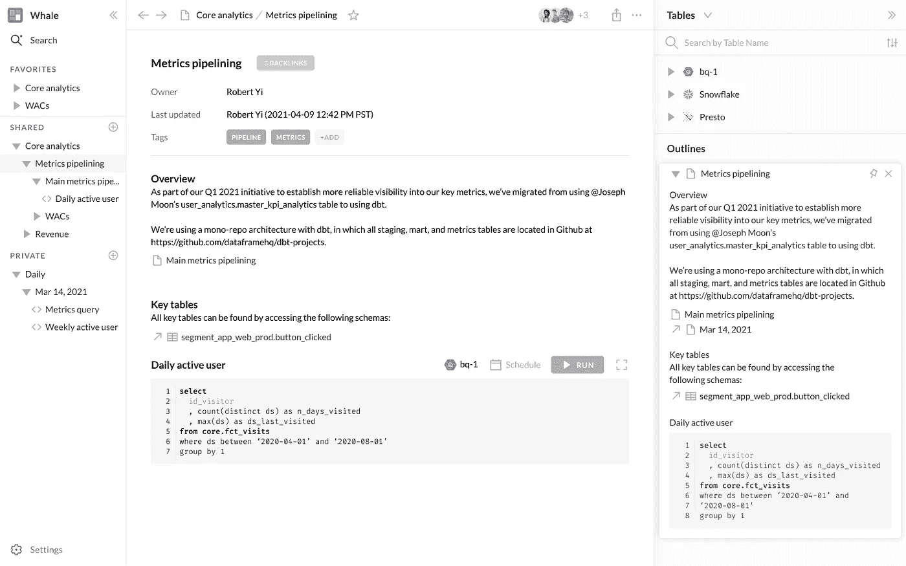

# 为什么 IDE 不是基于 SQL 的分析的未来

> 原文：<https://towardsdatascience.com/why-the-ide-is-not-the-future-of-sql-based-analytics-291d34955d8a?source=collection_archive---------9----------------------->

## 查询*需要 ide 中没有的*上下文。【在 [hyperquery](https://www.hyperquery.ai/?utm_source=medium&utm_medium=organic-content&utm_campaign=2021-05-18-ide-dead) 中你会有更好的写作时间。]


这看起来像一个 IDE，是吗？所以，不是这个。[图片来自 Freepik]

我只想说:**传统的 IDE 格式不太适合为分析工作编写查询。我会先解释原因，然后告诉你能做些什么。**

首先，我的解释——当您编写或阅读查询时，有两件事您真的需要知道，而 ide 在这方面确实做得不够:

*   **🗃数据上下文:** *这些表和列是什么？*查询对表和列进行操作。不了解这些基本成分代表什么，你将在黑暗中飞行。
*   **📈业务上下文:** *这个查询的目的是什么？SQL 的产品通常不是代码本身——而是你从中获得的洞察力，它通常存在于你的`.sql`文件之外。*

让我们更深入地考虑这些，然后考虑一些解决方案。

# IDE 是为代码上下文而构建的，而不是数据上下文 **🗃**

开始编写查询时，您做的第一件事是什么？

```
select ... from ...
```

您写下`select`和`from`，然后寻找表格和列(以及关于这些表格和列的信息)来填充空白。

然而，传统的 ide 被构造成提供代码上下文，而不是这种类型的数据上下文。如果您曾经使用过现代的 IDE，您知道您可以立即跳转到对象定义。太棒了。这使得获取编程所需的上下文变得更加容易——这种上下文是在代码库中的一个单独文件中定义的。除了文件结构视图为您指明方向之外，IDE 还使您能够管理包含数百个相互交织的文件的代码库。

但这并不是 SQL 所需要的。

> 你不需要跳转来理解你的查询——你需要深入的文档。


需要铲子的时候不要用锤子。♠️[图片来自 Freepik]

与代码库不同，SQL 文件[通常]是独立的文件，只依赖于*表，*意味着 ide 中引用跳转所带来的好处大大减少了。您的依赖关系只有一层。另一方面，你*做*需要的那种表格和列信息通常需要深度。例如，我会花时间寻找关于表的附加文档，还有谁使用过它们，在 Github 中引用它们的管道以理解它们的出处，等等。简单地说，现在的任何 SQL IDEs 都缺乏对这种深度信息的访问。

# IDE 没有业务上下文的位置📈

假设您已经知道如何获得足够的数据上下文来编写查询。接下来你会做什么？通常情况下，你会想要写下你的工作(至少如果你想有任何希望理解你所做的决定或在未来获得的洞察力)。


代码不是产品。你的洞察力是。💡[图片来自 Freepik]

> "但是罗伯特，那么*的自文档代码*和*注释*呢？"你可能会说。

根据我的经验，单独的松散的 SQL 文件，无论组织得多么好或者注释得多么好，都不足以跟踪您的工作。我总是发现自己要么让他们跟着降价走，要么把他们放在一个单独的笔记工具里。为什么？

> 因为 SQL 是你和你的数据之间的一个**接口**，而不是传统的编程语言。

换句话说，SQL 几乎总是达到目的的手段，而不是目的本身。因此，这意味着代码本身并不是故事的全部。代码、动机、结果——这些都是理解查询目的所必需的，而 IDE 中几乎没有空间来放置这种形式的上下文。

# 解决方法

好吧。所以我已经告诉你，ide 没有数据上下文或业务上下文的空间，但我没有提供任何解决方案。事实上，没有太多的选择。

*   **汇总数据发现+查询 IDE/SQL 笔记本+ doc app** 数据发现工具修复数据上下文问题，单独的 doc app 将解决业务上下文问题。这是我们向早期客户推荐的，但这有一个严重的问题:一切都是脱节的，很难管理和保持同步。此外，想到在一个应该只需要一个应用程序的工作流程中使用 3 个应用程序，我就头疼。
*   **Whale**
    如果您正在寻找一个准系统解决方案，请查看 [whale](https://github.com/dataframehq/whale) ，它使您能够使用命令行数据发现和 markdown 文件中的可执行 SQL 将数据上下文和业务上下文结合起来。也存在一些基于开源笔记本的解决方案，但我们通常发现它们笨重或不发达(plain Jupyter notebooks+[Knowledge-repo](https://github.com/airbnb/knowledge-repo)、[专营权](https://franchise.cloud/)、 [Querybook](https://github.com/pinterest/querybook) )。

如果您正在寻找一个更优雅的解决方案，我们可以为您的数据环境、业务环境和查询提供一个和谐共处的地方。



概念，满足 SQL 笔记本，具有深度集成的数据发现。

## 我们称之为:[Hyperquery](https://www.hyperquery.ai/?utm_source=medium&utm_medium=organic-content&utm_campaign=2021-05-18-ide-dead)——数据分析师的协作工作空间

我们正在构建一个 SQL 优先的工作区，它优雅地将查询编辑器转变为一个令人愉快的文档工具(想想概念)，具有易于访问和深度集成的数据发现功能。我们一直在与一些早期客户合作，考虑到他们的反应，我们相信这是编写 SQL 的最佳方式。我们保证你从未用过这样的东西。在 [hyperquery.ai](https://www.hyperquery.ai/?utm_source=medium&utm_medium=organic-content&utm_campaign=2021-05-18-ide-dead) 注册加入等候名单——我们将在接下来的几周内推出我们的邀请专用平台。

# 结束语

我们在编写查询时搜索的上下文信息不仅仅是为了方便。 **SQL 查询及其组成组件需要上下文才有意义。没有上下文，你不仅是在浪费时间，而且是在鲁莽行事！😉**

下次编写查询时请记住这一点——获取上下文，编写文档，您将拥有一个更加可持续的工作流。如果你想要一个工具让这变得更容易管理，在这里注册 Hyperquery。

*Tweet*[*@ imrobertyi*](https://twitter.com/imrobertyi)*/*[*@ h*y perquery](http://twitter.com/hyperquery)*打招呼。👋
关注我们*[*LinkedIn*](https://www.linkedin.com/company/hyperquery/)*。🙂*