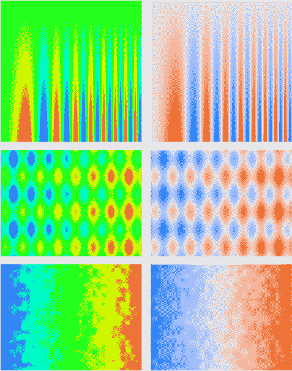

# 为什么彩虹色地图有问题

> 原文：<https://towardsdatascience.com/why-the-rainbow-color-map-is-problematic-23293d0937d5?source=collection_archive---------22----------------------->

彩色地图效果的比较。彩色地图，从左到右，彩虹，冷-暖。修改自 Moreland (2009)。

在科学可视化中，将标量值映射到颜色是一个基本过程。尽管无效，彩虹彩色地图仍然被大多数科学可视化工具使用。这种彩色地图因模糊数据、引入假象和迷惑用户而臭名昭著(Moreland，2009)。

甚至华尔街日报在“[天气预报应该越过彩虹](https://www.wsj.com/articles/weather-forecasts-should-get-over-the-rainbow-1538054430)”中警告我们，Matlab 在“[彩虹的烦恼](https://blogs.mathworks.com/steve/2014/10/20/a-new-colormap-for-matlab-part-2-troubles-with-rainbows/)”中写了博客。

Moreland (2009 年)探索了发散彩色地图在科学可视化中的应用，并提供了在科学可视化应用中通常表现良好的发散彩色地图，如图 1 所示。与发散彩色地图相比，图 2 显示彩虹彩色地图无法捕捉数据变化。

彩虹彩色地图的主要问题是它在感知上不一致。这意味着数据值中的等阶并不映射到感知颜色中的等阶。结果，数据中的细微细节被掩盖了，用户会发现很难比较数值。

彩虹颜色图也有问题，因为它不是单调的。这意味着随着数据值的增加，颜色并不总是变得更亮或更暗。这可能会在可视化中引入假象，从而难以看到趋势。

最后，彩虹色图经常被用来显示具有大动态范围的数据。这意味着最小和最大数据值之间有很大的差异。彩虹色图不太适合显示动态范围较大的数据，因为它会压缩数据，很难看到微小的变化。

科学家们已经提出了许多彩虹彩色地图的替代品，如喷射彩色地图。然而，jet 彩色地图由于许多相同的原因也有问题。一个更好的选择是冷暖色图，这在许多科学可视化工具中都有。冷色调的颜色图在感觉上是一致和单调的，并且在可视化具有大动态范围的数据时表现良好。

图一。冷暖色图，一种连续发散的色图，非常适合在科学可视化应用中使用。

图二。彩色地图效果的比较。彩色地图从左到右依次是彩虹色、冷暖色。修改自 Moreland (2009)。

# 参考

K. Moreland，“用于科学可视化的发散彩色地图”，《视觉计算进展》，第 5876 卷，柏林，海德堡:施普林格柏林海德堡，2009 年，第 92–103 页。doi:10.1007/978–3–642–10520–3 _ 9。