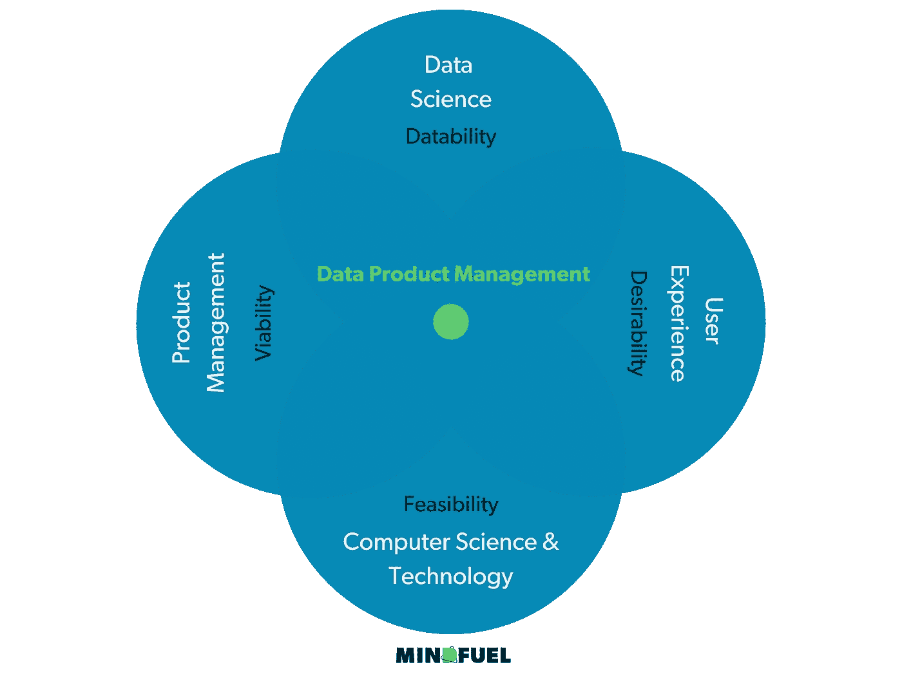
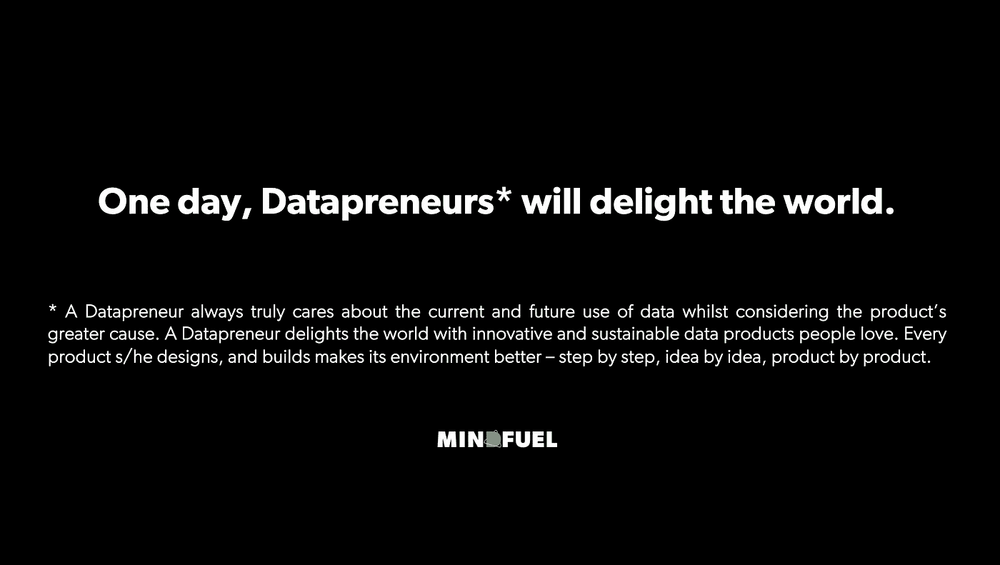

# 为什么世界需要数据企业家

> 原文：<https://towardsdatascience.com/why-the-world-needs-datapreneurs-b2864d2d50b5?source=collection_archive---------24----------------------->

## 从一个个人故事中了解为什么数据计划在过去十年中失败了，但在今天仍然充满挑战。从数据产品管理到数据创业，作为整体应对未来数字化的方法。

在数据科学领域工作了近十年后，在商业分析、商业智能、高级分析、机器学习以及人工智能等各个领域，我最终不得不接受从数据中创造*价值是一个挑战，而且可能永远是一个挑战。虽然我在职业生涯的最初几年提供实践数据科学解决方案，但在后来的阶段，我与人共同创立了一家名为 [Mindfuel](https://mindfuel.ai/) 的公司，并开始从更具战略性的角度研究和分析组织生态系统和环境，所谓的*数据计划*就诞生于其中。这是我目前发现的情况。*

# 2010 年代的数据科学浪潮

十年前，欧洲市场掌握在商业智能解决方案及其提供商手中。在大多数情况下，数据在关系数据库中被历史化，SQL 是处理它们的首选编程语言。在一天结束时，会生成一个业务报告，或者在业务用户可以访问的服务器上部署一个仪表板。多亏了一些大玩家，一门新的学科即将从美国飘洋过海来到欧洲，它的名字叫“数据科学”。

这是一场炒作的开始。人们希望使用先进的方法从数据中获得更多——更多信息、更多见解、更好的行动——简单地说:*更多价值*。新的需求出现了。我们分析师学会了开发模型、创建展示、构建原型，甚至部署首批飞行员。我们非常自豪地向高管们展示了公司的下一个大型灯塔项目，他们同时感到兴奋和高兴。此外，他们为我们提供了进一步的财政资助和预算，使我们能够继续下去。

他们的期望非常明确:*请从这些计划中传递价值*。其中一些利益相关者投入了大量资金。他们资助了能力中心、数据实验室、人工智能中心、数据单元，当然，还有所有必要的技术来构建最先进的“数据宇宙”。CDO 被雇来挖金子。市场一直在无限增长，直到有一天，第一个利益相关者问了一个神奇的问题:*“我大概什么时候能获得投资回报？”*从这一刻起情绪倾斜了。

在意识到只有有限数量的数据计划真正回报了所有的努力或有一天达到收支平衡后，知名研究机构跳了出来，并解释说 [~90%的数据计划不会进入生产](https://venturebeat.com/2019/07/19/why-do-87-of-data-science-projects-never-make-it-into-production/)。我们都不得不承认，开发技术解决方案在某种程度上起了作用，但不足以*交付‘价值’*。

最后，这种炒作在十年结束时慢慢变平，今天的决策者开始在批准预算和投资之前首先要求 ROI 概念。

# 我对我们为何失败的观察

是的，我们失败了。我们共同失败了:专家、供应商、用户和客户，以及他们的员工和利益相关者。

以下是预览:技术不是唯一的责任。在过去的十年里，我们在设计和开发更好的模型、更好的基础设施以及更好的平台方面取得了进步，或者总结为:更好的解决方案。由于现有的和新的提供商和开源社区的努力，在数据集上执行回归模型或扩展模型变得前所未有的简单，这需要通过简单的点击获得更多的计算能力。

然而，不知何故，一个适当的组织环境的相应转变被错过了。我的主要观察总结如下:

*   人们假装敏捷，但仍然以瀑布模式思考，或者至少努力将敏捷方法付诸实践
*   组织仍然缺乏适当的数据操作模型来开发数据产品，以及如何将这些数据产品集成到目标生态系统中的相应过程
*   总的来说，数据世界很少考虑用户的需求。直到今天——主要的焦点是可行性
*   文化和思维方式的挑战:我们如何在业务部门之间进行合作——尤其是在数据方面
*   关注产出，而不是结果:产出和结果的区别是什么？我们一直在执行项目，而不是开发产品，不是吗？
*   没有人对商业案例负责，也没有人确保投资会有适当的回报

所有这些观察都与数据科学中众所周知的挑战无关，例如*有多少数据是可访问的、可用的或准备好进行分析的*，但远远超出了数据空间。

# 从数字产品管理中学到的东西

出于对现状的某种沮丧，2019 年，我将我的发现提交给了我的一个最好的朋友，也是今天 Mindfuel Max 的联合创始人，他当时是一名数字产品经理。他立刻遇到了一些站不住脚的假设:

*   你开发的不是产品，而是项目。
*   在制定解决方案时，你没有考虑可取性。
*   您没有考虑适销性，因为您的解决方案将在市场上与其他解决方案竞争。
*   谁拥有您的解决方案的可行性？然而，它不能是数据产品的所有者。

我的情绪从沮丧到愤怒再到动力。他说得有道理！当他更详细地向我解释产品管理的核心以及产品经理的具体角色和职责时，这敲响了警钟，并提出了一些合理的问题:这对数据科学项目来说意味着什么？数据科学*项目*的产品负责人或项目负责人可以负责 ROI 吗？或者由典型的业务所有者来承担责任，他向*项目*提供需求和领域知识？但是，她/他是否有资格拥有整个解决方案？难道她/他不是最终以用户的角色成为解决方案的接受者吗？如果是，谁最终拥有*数据产品*？为什么在数据空间中没有合适的产品经理角色？

Mindfuel 的数据产品管理方法

牢记对利益相关者的价值创造承诺，Max 和我很快就进入了这个旅程的下一步 [**数据产品管理**](https://mindfuel.ai/) 。适应(数字)产品管理的方法和框架为未来如何实现和交付数据计划打开了一个全新的视角。我们将敏捷框架、执行引擎和产品管理工具的方法和概念与 CRISP-DM、ML- & DataOps 的产品相结合，并在所有这些基础上融入了数据战略领域的原则。这导致了一种整体的方法，这种方法大于其各部分的总和。

# 为什么世界需要数据企业家

然而，我们所有的努力导致了这样一个事实:除了数据产品管理之外，这个故事还可以添加更多内容。我们意识到数据产品管理是*规程*的一部分，称为****。****

****[**data reneur**](https://mindfuel.ai/)就是这种“下蛋的长毛奶羊”十年前曾经是数据科学家。当船以全速航行时，每个项目中的船长保持航向。一个*人*接受风险并渴望交付承诺的*投资回报*。她/他是拥有比 ML 模型更大的产品愿景的人。他/她时刻牢记用户的愿望，并相应地创造业务关键型成功，同时在实践中理解和应对数据世界的挑战。****

********

****数据企业家的定义****

****但从更全面的角度来看，还不止于此:****

****这是一个*人物*有勇气失败，迅速从中吸取教训，并在这个旅程中创造了一个不断增长的生命周期。创新和价值创造齐头并进的循环。这种人尊重这样一个事实:投资者的钱不是免费的午餐，而是需要以合理的倍数回报，不仅要考虑商业利益，还要考虑道德和伦理，尤其是在涉及数据及其被滥用的潜在危险时。一个数据创业者总是真正关心数据在今天的产品中是如何使用的——以及将来会如何使用——同时考虑产品的更大目标。数据企业家用人们喜爱的创新和可持续的数据产品取悦世界。他/她设计和制造的每一件产品都让环境变得更好——一步一步，一个想法一个想法，一个产品一个产品。****

****总有一天，*data reneur*将成为每个数据计划的一部分，确保*价值*和数字化的成功。****

****你对此有什么想法？就我们而言，我们将继续我们的旅程，最终降低数据计划失败的百分比，我们期待着一路上的任何同伴。****