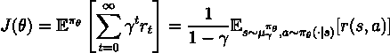
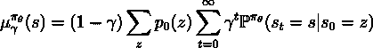
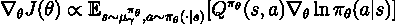

# 为什么深度强化学习中的策略梯度定理有问题

> 原文：<https://towardsdatascience.com/why-there-is-a-problem-with-the-policy-gradient-theorem-in-deep-reinforcement-learning-958d845218f1?source=collection_archive---------25----------------------->

## 或者，我喜欢称之为“折扣因子的魔法”

伊卡洛斯号的飞行，b y 雅各布·彼得·戈威——【https://commons.wikimedia.org/w/index.php?curid=27493281】T2

多亏了我的导师 Proutiere 教授，我第一次发现这个问题，是在检查我去年 2020 年秋季在 KTH 举办的[强化学习(EL2805)课程第二次实验室会议的提案时。](https://www.kth.se/student/kurser/kurs/EL2805?l=en)

**这个问题严重到足以影响大多数深度强化学习算法，包括 A3C [7]、SAC [8]、ACKTR 算法[9]等。**

大致上，这是我的主管发给我的电子邮件:

> 嘿，阿莱西奥，我有一个关于政策梯度定理的问题。平均值是关于μ的，μ是一个贴现态分布。但是，一般来说，人们如何证明我们使用由政策π诱导的静态政策分布产生的经验，而不是贴现分布μ？

为了充分理解他的意思，我和我的主管之间来回发送了几封电子邮件是必要的(*在我的辩护中，他的第一封电子邮件含糊不清，前面引用的句子是那封电子邮件的“澄清”版本:)*)。

如果你还不知道我在说什么，让我简单地提醒你一下政策梯度定理[1]是如何工作的。

# 政策梯度定理

尽管 PG 定理很简单，但它已经实现了我们目前看到的深度强化学习的许多成就。

基本想法如下:

> 我们是否可以通过使用某个目标函数 J(θ)相对于θ的梯度来改善由θ参数化的策略π的性能？然后，通过简单地使用随机梯度上升方法，我们可以根据该梯度改善策略的性能。

为了定义目标函数 J(θ),通常使用期望总折扣报酬标准

由θ参数化的政策π的期望报酬标准。

简要描述:

1.  **第一个期望就是保单的贴现值π，** **，而第二个期望是第一个期望的对偶形式**(第一个考虑时间，第二个考虑状态-行为空间*；*查看[遍历定理](https://en.wikipedia.org/wiki/Ergodic_theory)更好的理解这种对偶性)。
2.  **在第二个期望中，我们对策略π诱导的贴现状态分布μ取一个期望。**

π诱导的贴现态分布；p0 指初始状态分布；P(s_t=s|s_0=z)是使用策略π时，在时间 t 达到状态 s 的概率(假设初始状态为 z)。

PG 定理是如何发挥作用的？对于贴现准则，PG 定理规定 J(θ)的梯度简单地为

政策梯度定理(另见[1])；为简洁起见，我省略了归一化因子 1/1-γ(在论文中经常被省略，因为它与贴现态分布中的 1-γ因子相抵消)

注意期望是如何类似于 J(θ)的对偶形式的。该公式可能看起来微不足道，但事实并非如此，原因如下:

> 在 PG 定理中，J(θ)的梯度不依赖于贴现态分布μ的梯度，即使μ依赖于策略π。

这个结果在强化学习博客中经常被忽略，但它特别重要，因为它说明了 J(θ)的梯度是相对于贴现状态分布μ取的平均值，当θ变化时，我们不需要考虑这个分布如何相对于θ变化。

然而，贴现态分布是所有问题的根源。

# 那么，现代深度强化学习算法有什么问题呢？

由[沙哈达特拉赫曼](https://unsplash.com/@hishahadat?utm_source=medium&utm_medium=referral)在 [Unsplash](https://unsplash.com?utm_source=medium&utm_medium=referral) 上拍摄的照片

现在，几乎所有的强化学习算法都使用一个折扣因子。因此，如前所述，**总期望贴现回报的梯度取决于贴现状态分布μ。**

因此，**用于更新策略的样本应按照贴现态分布μ进行分布。**

> 然而，在几乎所有的论文中，如果不是全部的话，策略是使用在执行策略π时收集的状态样本来更新的。换句话说，为了更新策略，我们使用根据π诱导的策略上分布分布的样本，而不是折扣分布μ。

有什么区别？简而言之，这类似于从状态分布中去掉贴现因子。

*   **策略梯度计算不正确，因为我们使用的样本不是按照μ分布的。**
*   **因此，我们没有优化原始目标函数 J(θ)。**
*   **很明显，这个问题对深度强化学习领域中获得的所有经验结果的有效性提出了质疑，并且可能会损害现代深度强化学习算法在现实世界应用中的适用性。**

# 以前没有人讨论过这个问题吗？

当我第一次和我的主管讨论这个问题时，它看起来像是一个没有人考虑过的新事物。但快速搜索发现，作者在[2]，“*政策梯度是梯度吗？*(Nota 和 Thomas)，最近对同一问题提出了担忧(它于去年，2020 年发表)。

*   **在【2】中 Nota 和 Thomas 声称这样计算的梯度不是任何函数**的梯度。**使用这种梯度的算法不能保证收敛到一个“好的”参数θ。**
*   此外，总是在[2]中，他们表明**有可能构造"*一个反例，其中不动点相对于贴现和未贴现目标*"**[2]都是全局相似的。
*   再深入一点，我们会注意到，类似的问题以前也在[3]和[4]中提出过(这两篇论文中托马斯都是作者之一)。

> 非常令人惊讶的是，没有多少研究人员意识到这个问题。*这可能是由于缺乏对强化学习和马尔可夫决策过程的理论理解。*

# 怎么才能解决呢？

**有修复。**

很脏，但很简单。

**在马尔可夫决策过程中，使用折扣因子和达到最终状态是等价的**(另见 puter man【10】，第 5.3 节，他讨论了使用折扣因子和拥有最终状态之间的相似性)。

**贴现相当于在马尔可夫决策过程中引入一个终态。**这也相当于拥有一个几何分布的视界长度。

因此，我们只需要人工引入以某个概率 1-γ终止轨迹的可能性。

这显然是一个疯狂的想法。强化学习算法已经受到高样本复杂性的困扰，因此这一变化可能会使它变得更糟。此外，**这种变化并不真正适用于现实世界的情况。**

# …也许我们应该降低折扣系数？

或者，另一个想法是简单地贬低贴现因子。萨顿和巴尔托已经在[6]中讨论过，贴现因子在持续的环境中毫无意义。

**对于连续设置，没有剧集的概念，优化平均奖励更有意义**。此外，**这是最接近真实应用程序的持续设置。**

不幸的是，这方面的研究很少，因为大部分努力都放在创建新的基于折扣的算法上。

**同样，在[5]中，作者讨论了当使用函数逼近时，折扣强化学习如何不是优化问题，以及我们应该求助于平均奖励强化学习。然而，请注意，作者在[5]中讨论的问题与我在本文中强调的问题不同**

# 结论

*伊卡洛斯的飞行，b* y 雅各布·彼得·戈威——[https://commons.wikimedia.org/w/index.php?curid=27493281](https://commons.wikimedia.org/w/index.php?curid=27493281)

这篇文章的目的是提高正确使用贴现版本的政策梯度定理的意识。绝大多数论文不正确地使用了这一梯度，并给出了几乎没有理论依据的结果。

深度强化学习的经验进展与我们对该领域的理论理解不匹配。

“深入研究政策梯度”[11]的作者研究了这个问题，发现梯度估计值与“真实”梯度相关性很差。此外，他们注意到优化景观往往不能反映潜在 MDP 的回报景观。

简而言之，他们声称

> 总的来说，我们的结果表明，深层强化学习算法的理论框架通常无法预测实践中出现的现象。这表明，构建可靠的深度 RL 算法需要超越以基准为中心的评估，转而从多方面理解它们通常不直观的行为[11]。

**相反，我们正在见证一场战斗，以创建尖端的深度强化学习算法来提高 Atari 游戏或 MuJoCo 环境中的分数，尽管这是以减少理论理解为代价的。**

我们应该更多地思考这些问题，避免重蹈伊卡洛斯的覆辙。

感谢您的阅读！

## 参考

1.  用函数逼近强化学习的政策梯度方法。*辊隙*。第 99 卷。1999.
2.  克里斯·诺塔和菲利普·托马斯。2020.政策梯度是梯度吗？。AAMAS (2020)。
3.  托马斯菲利普。“自然演员-评论家算法中的偏见。”*机器学习国际会议*。PMLR，2014 年。
4.  经典政策梯度:保持贝尔曼的最优原则。 *arXiv 预印本 arXiv:1906.03063* (2019)。
5.  纳伊克，阿布舍克等人。“折扣强化学习不是一个优化问题。” *arXiv 预印本 arXiv:1910.02140* (2019)。
6.  萨顿，理查德 s 和安德鲁 g 巴尔托。强化学习:介绍。麻省理工学院出版社，2018。
7.  深度强化学习的异步方法。*机器学习国际会议*。PMLR，2016。
8.  软演员-评论家算法和应用。 *arXiv 预印本 arXiv:1812.05905* (2018)。
9.  吴，，等，“基于 kronecker 分解近似的深度强化学习的可扩展信赖域方法” *arXiv 预印本 arXiv:1708.05144* (2017)。
10.  马尔可夫决策过程:离散随机动态规划。约翰威利&之子，2014。
11.  安德鲁·易勒雅斯等人，《深入研究政策梯度》*学习代表国际会议(ICLR)* 。2020.