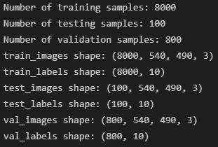
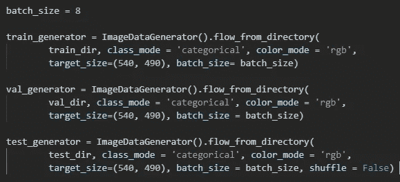
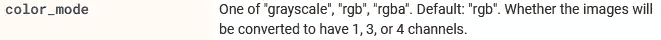
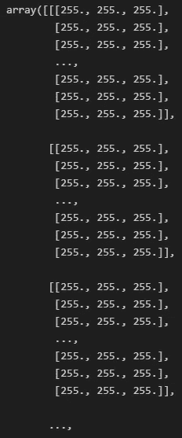
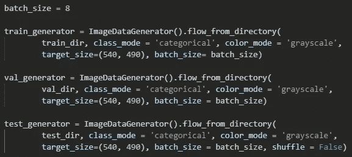
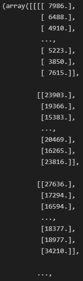

# 为什么用 16 位图像训练 CNN 不起作用

> 原文：<https://towardsdatascience.com/why-training-your-cnn-with-16-bit-images-isnt-working-e91da350c49d?source=collection_archive---------17----------------------->

## 在 Keras 和 Tensorflow 中使用 Uint16 图像实现 CNN 时的注意事项

[的照片](https://unsplash.com/@halacious?utm_source=unsplash&utm_medium=referral&utm_content=creditCopyText)在[的 Unsplash](https://unsplash.com/s/photos/brain?utm_source=unsplash&utm_medium=referral&utm_content=creditCopyText)

最近我在做一个项目，训练 CNN 识别卫星图像中的开阔海洋现象，我很难得到结果。这些图像是 GeoTIFF 格式，这是科学界基于 TIFF 格式的一种流行文件类型，尤其适用于使用 GIS 的应用程序。根据[来源](https://rmets.onlinelibrary.wiley.com/doi/full/10.1002/gdj3.73)，“高精度值(16 位)以及地理信息被保留，用于基于机器学习的方法的开发……”以及图像的检查

暗示它们是三个通道的图像，尽管图像在视觉上是灰度的。嗯，训练还是不顺利，我也不知道为什么。经过几个小时的谷歌搜索，阅读 github 问题线程，浏览 StackOverflow，我终于找到了一个解决方案，我希望它可以节省你的时间。

如果你已经在大量数据上训练了神经网络，特别是图像，你会知道你必须成批地将图像传递给你的网络进行训练，因为总数据量大于你的计算机一次可以加载到它的工作存储器中的数据量。这种技术在 TensorFlow 中的实现是从他们的`Image Data Generator`类中调用的`flow_from_directory()`。我的项目中的代码，创建策略学习中使用的测试、训练和验证图像集，最初看起来像

其中`color_mode`被设置为`‘rgb’`，因为根据 TensorFlow 的文档

我知道我的图像有三个通道。然而，我最终能够在一些 github 问题线程中追踪到 TensorFlow 当前未设置为处理 16 位 RBG 图像，它会尝试将我的图像的第一个通道中包含的像素值压缩到 0 到 255 之间，这是 8 位图像的允许值，而不是保留 0 到 65535 之间的准备好的高分辨率 16 位像素值。通过快速检查生成器加载的一个图像像素数组，我验证了这是真的:

我所有的图像都是单调的白色图像！难怪它学不到任何东西..总之，经过进一步的检查，我发现我的图像中的像素值都包含在第一个通道中，是灰度合成孔径雷达图像，而其他通道包含其他信息。这些信息可能在其他机器学习应用中有用，但对于 CNN 的训练，我只对像素数据感到满意，更重要的是 Tensorflow *可以*处理 16 位灰度图像。因此，只需将上面生成器代码中的参数`color_mode`改为`‘grayscale’`，就像这样

让我开始得到结果！为了验证这一点，我们可以再次查看一个图像数组:

现在我们有了一些 CNN 可以适当借鉴的数据。虽然我希望这对你们中的一些人有所帮助，并在我和其他人遇到的特定问题上为你们节省一些时间，但我们也可以从解决问题的步骤中学习。当谈到 CNN 和一般的神经网络时，它们可能是一种黑箱，这意味着无论它们是否工作，都很难确定原因。就像这个问题一样，它们不工作的原因通常与提供给网络的数据质量有关。因此，开始故障排除的一个好地方是仔细检查您的数据源，并确保传递的信息是您的神经网络类型能够消化的形式。如果还是不行，就多加几层(开玩笑…大部分)。感谢阅读！